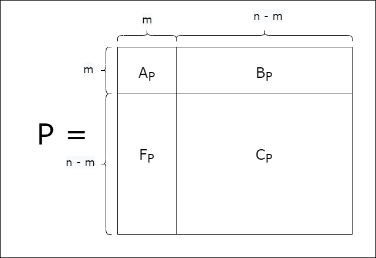
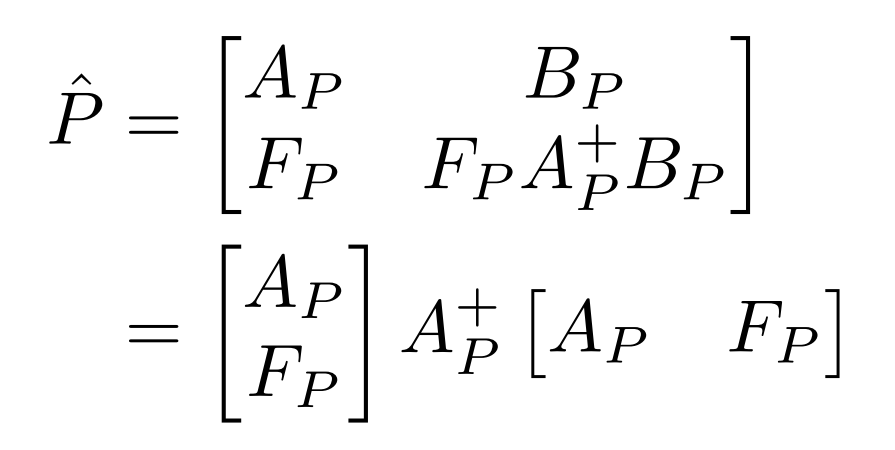
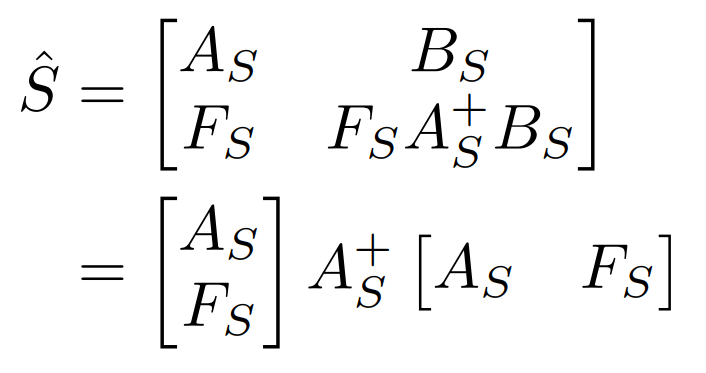
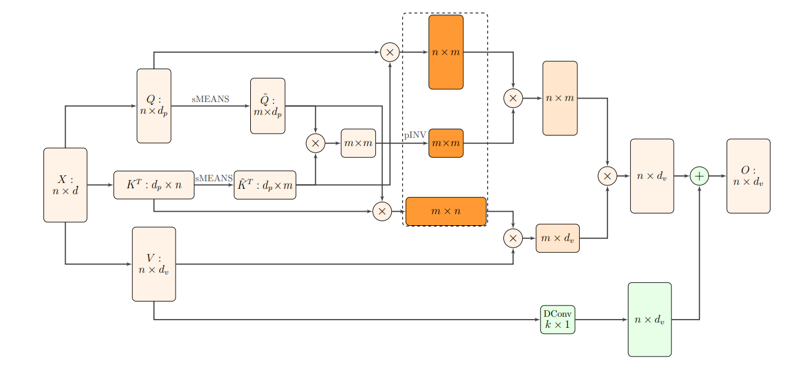

<h1>Nyströmformer: Approximating self-attention in linear time and memory via the Nyström method</h1>

### Introduction

Transformers have exhibited remarkable performance on various Natural Language Processing and Computer Vision tasks. Their success can be attributed to the self-attention mechanism, which captures the pairwise interactions between all the tokens in an input. However, the standard self-attention mechanism has a time and memory complexity of \\(O(n^2)\\) (where \\(n\\) is the length of the input sequence), making it expensive to train on long input sequences. 

The [Nyströmformer](https://arxiv.org/abs/2102.03902) is one of many efficient transformer models that approximates standard self-attention with \\(O(n)\\) complexity. Nyströmformer exhibits competitive performance on various downstream NLP tasks while improving upon the efficiency of standard self-attention. The aim of this blog post is to give readers an overview of the Nyström method and how it can be adapted to approximate self-attention.


### Nyström method for matrix approximation

At the heart of Nyströmformer is the Nyström method for matrix approximation. It allows us to approximate a matrix by sampling some of its rows and columns. Let's consider a matrix \\(P^{n \times n}\\), which is expensive to compute in its entirety. So, instead, we approximate it using the Nyström method. We start by sampling \\(m\\) rows and columns from \\(P\\). We can then arrange the sampled rows and columns as follows:

<p align="center"> 
  
</p>

We now have four submatrices: \\(A_P, B_P, F_P,\\) and \\(C_P\\), with sizes \\(m \times m, m \times (n - m), (n - m) \times m\\) and 
\\((n - m) \times (n - m)\\) respectively. The \\(m\\) sampled columns are contained in \\(A_P\\) and \\(F_P\\), whereas the \\(m\\) sampled rows are contained in \\(A_P\\) and \\(B_P\\). So, the entries of \\(A_P, B_P,\\) and \\(F_P\\) are known to us, and we will estimate \\(C_P\\). According to the Nyström method, \\(C_P\\) is given by:

$$C_P = F_P A_P^+ B_P$$

Here, \\(+\\) denotes the Moore-Penrose inverse (or pseudoinverse). 
Thus, the Nyström approximation of \\(P, \hat{P}\\) can be written as:

<p align="center"> 
  
</p>

As shown in the second line, \\(\hat{P}\\) can be expressed as a product of three matrices. The reason for doing so will become clear later.


### Can we approximate self-attention with the Nyström method?

Our goal is to ultimately approximate the softmax matrix in standard self attention: $$S = softmax(\frac{QK^T}{\sqrt{d}})$$
Here, \\(Q\\) and \\(K\\) denote the queries and keys respectively. Following the procedure discussed above, we would sample \\(m\\) rows and columns from \\(S\\), form four submatrices, and obtain \\(\hat{S}\\):

<p align="center"> 
  
</p>

But, what does it mean to sample a column from \\(S\\)? It means we select one element from each row. Recall how S is calculated: the final operation is a row-wise softmax. To find a single entry in a row, we must access all other entries (for the denominator in softmax). So, sampling one column requires us to know all other columns in the matrix. Therefore, we cannot directly apply the Nyström method to approximate the softmax matrix.


### How can we adapt the Nyström method to approximate self-attention?

Instead of sampling from \\(S\\), the authors propose to sample landmarks (or Nyström points) from queries and keys. We denote the query landmarks and key landmarks as \\(\tilde{Q}\\) and \\(\tilde{K}\\) respectively. \\(\tilde{Q}\\) and \\(\tilde{K}\\) can be used to construct three matrices corresponding to those in the Nyström approximation of \\(S\\). We define the following matrices:

$$\tilde{F} = softmax(\frac{Q\tilde{K}^T}{\sqrt{d}}) \hspace{40pt} \tilde{A} = softmax(\frac{\tilde{Q}\tilde{K}^T}{\sqrt{d}})^+ \hspace{40pt} \tilde{B} = softmax(\frac{\tilde{Q}K^T}{\sqrt{d}})$$

The sizes of \\(\tilde{F}\\), \\(\tilde{A}\\), and \\(\tilde{B}) are \\(n \times m, m \times m,\\) and \\(m \times n\\) respectively. 
We replace the three matrices in the Nyström approximation of \\(S\\) with the new matrices we have defined to obtain an alternative Nyström approximation:

$$\begin{align}\hat{S} &= \tilde{F} \tilde{A} \tilde{B} \\
&= softmax(\frac{Q\tilde{K}^T}{\sqrt{d}}) softmax(\frac{\tilde{Q}\tilde{K}^T}{\sqrt{d}})^+  softmax(\frac{\tilde{Q}K^T}{\sqrt{d}}) \end{align}$$

This is the Nyström approximation of the softmax matrix in the self-attention mechanism. We multiply this matrix with the values (\\(V\\)) to obtain a linear approximation of self-attention. Note that we never calculated the product \\(QK^T\\), avoiding the \\(O(n^2)\\) complexity. 


### How do we select landmarks?

Instead of sampling \\(m\\) rows from \\(Q\\) and \\(K\\), the authors propose to construct \\(\tilde{Q}\\) and \\(\tilde{K}\\)
using segment means. In this procedure, \\(n\\) tokens are grouped into \\(m\\) segments, and the mean of each segment is computed. Ideally, \\(m\\) is much smaller than \\(n\\). According to experiments from the paper, selecting just \\(32\\) or \\(64\\) landmarks produces competetive performance compared to standard self-attention and other efficient attention mechanisms, even for long sequences lengths (\\(n = 4096\\) or \\(8192\\)). 

The overall algorithm is summarised by the following figure from the paper:

<p align="center"> 
  
</p>

The three orange matrices above correspond to the three matrices we constructed using the key and query landmarks. Also, notice that there is a DConv box. This corresponds to a skip connection added to the values using a 1D depthwise convolution.


### How is Nyströmformer implemented?

The original implementation of Nyströmformer can be found [here](https://github.com/mlpen/Nystromformer) and the Huggingface implementation can be found [here](https://github.com/huggingface/transformers/tree/main/src/transformers/models/nystromformer). Let's take a look at a few lines of code (with some comments added) from the Huggingface implementation. Note that some details such as normalization, attention masking, and depthwise convolution are avoided for simplicity.

```python
key_layer = self.transpose_for_scores(self.key(hidden_states)) # K
value_layer = self.transpose_for_scores(self.value(hidden_states)) # V
query_layer = self.transpose_for_scores(mixed_query_layer) # Q

.
.
.

q_landmarks = query_layer.reshape(
    -1,
    self.num_attention_heads,
    self.num_landmarks,
    self.seq_len // self.num_landmarks,
    self.attention_head_size,
).mean(dim=-2) # \tilde{Q}

k_landmarks = key_layer.reshape(
    -1,
    self.num_attention_heads,
    self.num_landmarks,
    self.seq_len // self.num_landmarks,
    self.attention_head_size,
).mean(dim=-2) # \tilde{K}

kernel_1 = torch.nn.functional.softmax(torch.matmul(query_layer, k_landmarks.transpose(-1, -2)), dim=-1) # \tilde{F}
kernel_2 = torch.nn.functional.softmax(torch.matmul(q_landmarks, k_landmarks.transpose(-1, -2)), dim=-1) # \tilde{A} before pseudo-inverse

attention_scores = torch.matmul(q_landmarks, key_layer.transpose(-1, -2)) # \tilde{B} before softmax

kernel_3 = nn.functional.softmax(attention_scores, dim=-1) # \tilde{B}
attention_probs = torch.matmul(kernel_1, self.iterative_inv(kernel_2)) # \tilde{F} * \tilde{A}
new_value_layer = torch.matmul(kernel_3, value_layer) # \tilde{B} * V
context_layer = torch.matmul(attention_probs, new_value_layer) # \tilde{F} * \tilde{A} * \tilde{B} * V
```


### Using Nyströmformer with Huggingface

Nyströmformer for Masked Language Modeling (MLM) is available on Huggingface. Currently, there are 4 checkpoints, corresponding to various sequence lengths: [`nystromformer-512`](https://huggingface.co/uw-madison/nystromformer-512), [`nystromformer-1024`](https://huggingface.co/uw-madison/nystromformer-1024), [`nystromformer-2048`](https://huggingface.co/uw-madison/nystromformer-2048), and [`nystromformer-4096`](https://huggingface.co/uw-madison/nystromformer-4096). The number of landmarks, \\(m\\), can be controlled using the `num_landmarks` parameter in the [`NystromformerConfig`](https://huggingface.co/docs/transformers/v4.18.0/en/model_doc/nystromformer#transformers.NystromformerConfig). Let's take a look at a minimal example of Nyströmformer for MLM:

```python
from transformers import AutoTokenizer, NystromformerForMaskedLM
import torch

tokenizer = AutoTokenizer.from_pretrained("uw-madison/nystromformer-512")
model = NystromformerForMaskedLM.from_pretrained("uw-madison/nystromformer-512")

inputs = tokenizer("Paris is the [MASK] of France.", return_tensors="pt")

with torch.no_grad():
    logits = model(**inputs).logits

# retrieve index of [MASK]
mask_token_index = (inputs.input_ids == tokenizer.mask_token_id)[0].nonzero(as_tuple=True)[0]

predicted_token_id = logits[0, mask_token_index].argmax(axis=-1)
tokenizer.decode(predicted_token_id)
```
Alternatively, we can use pipeline:
```python
from transformers import pipeline
unmasker = pipeline('fill-mask', model='uw-madison/nystromformer-512')
unmasker("Paris is the [MASK] of France.")
```

### Conclusion

Nyströmformer offers an efficient approximation to the standard self-attention mechanism, while outperforming other linear self-attention schemes. In this blog post, we went over a high-level overview of the Nyström method and how it can leveraged for self-attention. Readers interested in deploying or fine-tuning Nyströmformer for downstream tasks can find the Huggingface documentation [here](https://huggingface.co/docs/transformers/v4.18.0/en/model_doc/nystromformer). 
