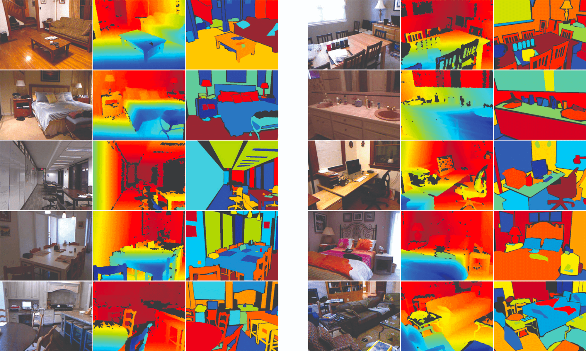
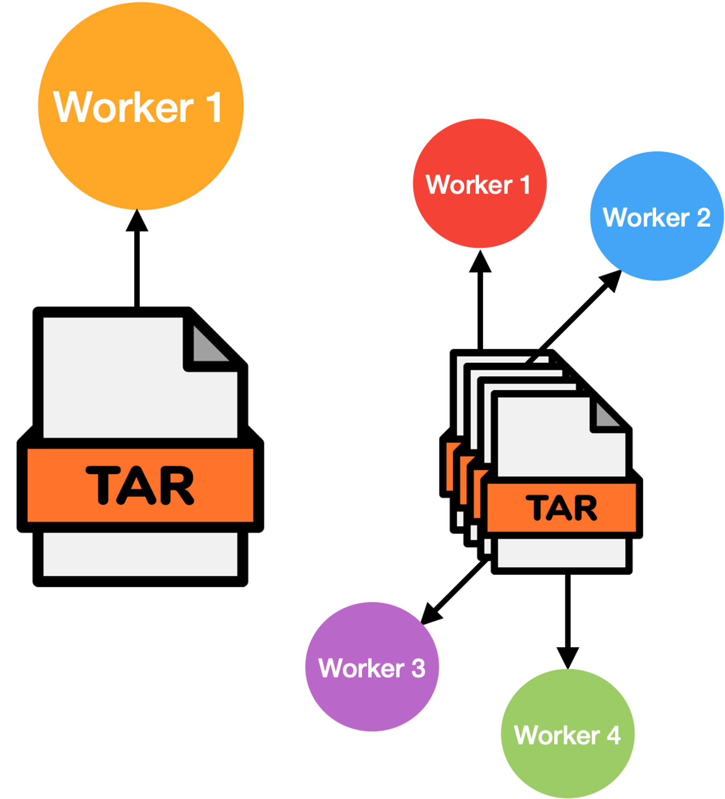

<h1>
  Welcoming NYU Depth V2 to 🤗 Datasets
</h1>

<div class="blog-metadata">
    <small>Published December 20, 2022.</small>
    <a target="_blank" class="btn no-underline text-sm mb-5 font-sans" href="https://github.com/huggingface/blog/blob/main/nyu-depth-v2.md">
        Update on GitHub
    </a>
</div>

<div class="author-card">
    <a href="https://hf.co/sayakpaul">
        
        <div class="bfc">
            <code>sayakpaul</code>
            <span class="fullname">Sayak Paul</span>
        </div>
    </a>
</div>


[Hugging Face Hub](https://huggingface.co/datasets) is home to 16130 datasets, and this number continues to grow actively. These datasets come in all shapes and sizes. [Some](https://huggingface.co/datasets?size_categories=size_categories:n%3C1K&sort=downloads) have just about 1000 samples, while [this one](https://huggingface.co/datasets/poloclub/diffusiondb) has more than a trillion samples; all served with a common API provided by [🤗 Datasets library](https://huggingface.co/docs/datasets).

Like other things at Hugging Face, the Datasets’ Hub is a collaborative community-driven space. Contributing a new dataset is fairly straightforward, and the [official guide](https://huggingface.co/docs/datasets/share) will get you started in no time. When it comes to contributing larger datasets, things might need additional work.

So, in this post, we’ll share some best practices for working with large datasets by discussing a case study of the [NYU Depth V2 dataset](https://cs.nyu.edu/~silberman/datasets/nyu_depth_v2.html) that we recently added to 🤗 Datasets. The approaches shared in this post are modality agnostic, meaning you can apply the same principles to datasets of other modalities (such as video, text, and audio) too.

## About the dataset

NYU Depth V2 dataset is commonly used for training and evaluating models for depth estimation. It was introduced in [Indoor Segmentation and Support Inference from RGBD Images](http://cs.nyu.edu/~silberman/papers/indoor_seg_support.pdf) by Silberman et al. Here are some samples of the dataset from the [official dataset website](https://cs.nyu.edu/~silberman/datasets/nyu_depth_v2.html#raw_parts) where the first column represents input images, the second column represents the raw depth map images, and the third column represents class labels:



A preprocessed version of the dataset is also distributed as a part of [FastDepth: Fast Monocular Depth Estimation on Embedded Systems](https://arxiv.org/abs/1903.03273) by Wofk et al. Notably, this is the version we ship in 🤗 Datasets. The total size of this version is about 32 GBs and contains two splits: `train` and `validation`. Refer [here](https://github.com/dwofk/fast-depth#requirements) for more details.

While 32 GB for a dataset is not overly large, we believe it’s a good candidate to share our practices. Most machines should be able to accommodate.

## Archives: shard’em

When contributing datasets that are not CSV, JSON, JSON lines, TXT, or Parquet, we need to write a data-loading script following the guidelines laid out [here](https://huggingface.co/docs/datasets/dataset_script). The data-loading script defines:

- where the data files should be downloaded from, and how they should be decoded
- how should the data splits be generated
- how a single example from the dataset should be generated

It also contains information about dataset citation and dataset schema.

For NYU Depth V2, our source file comes from [here](http://datasets.lids.mit.edu/fastdepth/data/nyudepthv2.tar.gz) (direct download link), which is a single TAR archive file containing both splits. While we can use this URL directly in our data-loading script, won’t it be nice to have multiple workers doing the downloads parallelly and thus resulting in a faster load time?

<div align="center">
    
</div>

The idea would be to shard the single big archive into multiple archives and have multiple workers operate on them individually. Fortunately, 🤗 Datasets does the heavy lifting for us - we only need to take care of the first part – sharding the big archive file into multiple archives. The parallelization part is already taken care of by 🤗 Datasets.

This is what we did for the NYU Depth V2 dataset and achieved a great speedup in the dataset loading time. But how did we shard the TAR archive into multiple ones? Read on to know more.

## Sharding the TAR archive

The dataset, when untarred, contains two directories denoting the splits: `train` and `validation`. These directories contain HDF5 files, where each HDF5 file contains an input image and its corresponding depth map.

First, we prepared two TAR archives from the split directories `train` and `validation`:

```py
import tarfile

with tarfile.open("train.tar.gz", "w:gz") as t:
    t.add("train")

with tarfile.open("val.tar.gz", "w:gz") as t:
    t.add("val")
```

With these two TAR archives, we leveraged the [`tarproc`](https://github.com/tmbdev-archive/tarproc) utility to create multiple smaller TAR archives:

```bash
tarsplit train.tar.gz --max-size 3e9 --maxshards 16 -o train
tarsplit val.tar.gz --maxshards 4 -o val
```

In the above commands, `--max-size` argument denotes the maximum size of a single shard and `--maxshards` denotes the maximum number of shards to be created. In general, having `max-size` as 3e9 (3 GBs) is not a strict requirement and you can keep it to 1e9 (1 GB). You might have to tune the `maxshards` then as well. When selecting the values for `max-size` or `maxshards` a general rule of thumb is to go for numbers that are big enough to stream efficiently and small enough to enable good parallelism.

You can also check out the Golang port called [`tarp`](https://github.com/webdataset/tarp), but its barrier to entry might seem a little higher.

After the shards were generated, we pushed them to the [dataset repository](https://huggingface.co/datasets/sayakpaul/nyu_depth_v2) on the Hugging Face Hub with the help of [Git-LFS](https://git-lfs.github.com/).

## Changelog for the data-loading script

In this section, let’s briefly review the changes required to facilitate the loading of multiple shards. With the single archive, we would have used something like:

```py
class NYUDepthV2(datasets.GeneratorBasedBuilder):
    ...
    
    def _split_generators(self, dl_manager):
        base_path = dl_manager.download_and_extract(ARCHIVE_URL)

        ...

        return [
            datasets.SplitGenerator(
                name=datasets.Split.TRAIN,
                gen_kwargs=...,
            ),
            datasets.SplitGenerator(
                name=datasets.Split.VALIDATION,
                gen_kwargs=...,
            ),
        ]
```

Notice how `dl_manager.download_and_extract()` is a blocking call which means it will download and extract the entire archive from `ARCHIVE_URL` blocking other operations. Depending on the size of the archive, this process can be quite time-consuming.

To speed up the process, we can delegate the download and extraction process to multiple workers. We first define a dictionary like so:

```py
ARCHIVE_URLS = {
    "train": [f"data/train-{i:06d}.tar" for i in range(12)],
    "val": [f"data/val-{i:06d}.tar" for i in range(2)],
}
```

Here, [`data`](https://huggingface.co/datasets/sayakpaul/nyu_depth_v2/tree/main/data) is a directory where the archive shards are stored. It is then used like so:

```py
class NYUDepthV2(datasets.GeneratorBasedBuilder):
    ...

    def _split_generators(self, dl_manager):
        archives = dl_manager.download(ARCHIVE_URLS)

        return [
            datasets.SplitGenerator(
                name=datasets.Split.TRAIN,
                gen_kwargs={
                    "archives": [
                        dl_manager.iter_archive(archive) for archive in archives["train"]
                    ]
                },
            ),
            datasets.SplitGenerator(
                name=datasets.Split.VALIDATION,
                gen_kwargs={
                    "archives": [
                        dl_manager.iter_archive(archive) for archive in archives["val"]
                    ]
                },
            ),
        ]
```

Notice `dl_manager.iter_archive(archive) for archive in archives["train"]`. This is where the parallelization magic can come into the picture where each worker can focus on a single `archive` simultaneously. The `archives` then get passed to [`_generate_examples()`](https://huggingface.co/datasets/sayakpaul/nyu_depth_v2/blob/main/nyu_depth_v2.py#L106).

The complete data-loading script is available [here](https://huggingface.co/datasets/sayakpaul/nyu_depth_v2/blob/main/nyu_depth_v2.py) and we recommend you refer to it when contributing large datasets. The same principle was also followed for the seminal ImageNet-1k dataset and its data-loading script is available [here](https://huggingface.co/datasets/imagenet-1k/blob/main/imagenet-1k.py). Note that you can load a dataset with a local loading script like so: `load_dataset(“my_dataloading_script.py”)`.

With NYU Depth V2 now on 🤗 Datasets, users can load it with just two lines of code:

```py
from datasets import load_dataset
dataset = load_dataset("sayakpaul/nyu_depth_v2")
```

We're also actively working with the original dataset authors to transfer the dataset to an approrpriate organization on the Hub.

## Effects on caching

Having multiple shards of a single big archive has another crucial advantage: caching. You cannot partially cache one big archive. But, if you have it sharded, at least some shards will likely be cached for you should there be an event of failure to download the entire dataset.

## Conclusion

In this post, we shared some practices to handle the contribution of large datasets to 🤗 Datasets. We hope these will come in handy for your future datasets. We cannot wait to see them 🤗