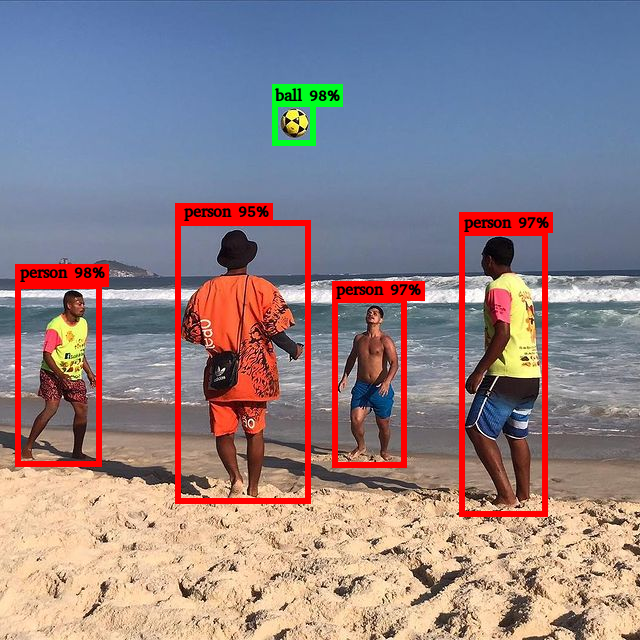

<!-- {blog_metadata} -->
<!-- {authors} -->


# Object Detection Leaderboard: Decoding Metrics and Their Potential Pitfalls

Welcome to our latest dive into the world of leaderboard and models evaluation. In a [previous post](https://huggingface.co/blog/evaluating-mmlu-leaderboard), we navigated the waters of evaluating Large Language Models. Today, we set sail to a different, yet equally challenging domain - Object Detection. 

Recently, we have released our [Object Detection Leaderboard](https://huggingface.co/spaces/rafaelpadilla/object_detection_leaderboard), ranking object detection models available in the Hub according to some metrics. In this blog, we will demonstrate how the models were evaluated and demystify the popular metrics used in Object Detection, from Intersection over Union (IoU) to Average Precision (AP) and Average Recall (AR). More importantly, we will spotlight the inherent divergences and pitfalls that can occur during evaluation, ensuring that you're equipped with the knowledge not just to understand but to assess model performance critically.

Every developer and researcher aims for a model that can accurately detect and delineate objects. Our [Object Detection Leaderboard](https://huggingface.co/spaces/rafaelpadilla/object_detection_leaderboard) is the right place to find an open-source model that best fits their application needs. But what does "accurate" truly mean in this context? Which metrics should one trust? How are they computed? And, perhaps more crucially why some models may present divergent results in different reports? All these questions will be answered in this blog.

So, let's embark on this exploration together and unlock the secrets of the Object Detection Leaderboard leaderboard! If you prefer to skip the introduction and learn how object detection metrics are computed, go to the [Metrics section](#metrics). If you wish to find how to pick the best models based on the [Object Detection Leaderboard](https://huggingface.co/spaces/rafaelpadilla/object_detection_leaderboard), you may check [Object Detection Leaderboard](#object-detection-leaderboard) section. 


## Table of Contents

- [Introduction](#object-detection-leaderboard-decoding-metrics-and-their-potential-pitfalls)  
- [What's Object Detection](#whats-object-detection)  
- [Metrics](#metrics)  
    - [What's Average Precision and how to compute it?](#whats-average-precision-and-how-to-compute-it)  
    - [What's Average Recall and how to compute it?](#whats-average-recall-and-how-to-compute-it)  
    - [What are the variants of Average Precision and Average Recall?](#what-are-the-variants-of-average-precision-and-average-recall)  
- [Object Detection Leaderboard](#object-detection-leaderboard)  
    - [How to pick the best model based on the metrics?](#how-to-pick-the-best-model-based-on-the-metrics)  
    - [Which parameters can impact the Average Precision results?](#which-parameters-can-impact-the-average-precision-results)  
- [Conclusions](#conclusions)  
- [Additional Resources](#additional-resources)  


## What's Object Detection?

In the field of Computer Vision, Object Detection refers to the technique of identifying and localizing individual objects within an image or a video frame. Unlike image classification, where the task is to determine the predominant object or scene in the image, object detection not only categorizes the object classes present but also provides spatial information, drawing bounding boxes around each detected object. An object detector can also output a "score", also referred to as "confidence", for each box, representing the probability that the detected object truly belongs to the predicted class.

The following image, for instance, shows five detections: one "ball" with a confidence of 98% and four "person" with a confidence of 98%, 95%, 97%, and 97%.

<!-- 
Figure 1: Example of outputs performed by an object detector. -->

<div display="block" margin-left="auto" margin-right="auto" width="50%">
<center>
    
    <figcaption> Figure 1: Example of outputs performed by an object detector.</figcaption>
</center>
</div>

Object detection models are versatile and have a wide range of applications across various domains. Some use cases where they are applied are autonomous vehicles, face detection, surveillance and security, medical imaging, augmented reality, sport analysis, smart cities, gesture recognition, etc.

The Hub has [hundreds of object detection models](https://huggingface.co/models?pipeline_tag=object-detection) (*a total of 700 models in September 2023*) pre-trained in different datasets, able to identify and localize various object classes. 

Some object detection models can receive additional text queries to search for target objects described in the text. This way, these detectors (called zero-shot) are not limited to detecting objects seen during training.  

However, the detectors' diversity goes beyond the range of output classes they can recognize. They vary in terms of underlying architectures, model sizes, processing speeds, and prediction accuracy.

A popular metric used to evaluate the accuracy of predictions made by an object detection model is the **Average Precision (AP)** and its variants, which will be explained further.

The process to evaluate an object detection model encompassing several components like dataset with ground-truth annotations, detections (output prediction)  and metrics. This process is depicted in the schematic provided in Figure 2:

<div display="block" margin-left="auto" margin-right="auto" width="50%">
<center>
    
    <figcaption> Figure 2: Schematic illustrating the evaluation process for a traditional object detection model.</figcaption>
</center>
</div>

It is not depicted in Figure 2, but as previously mentioned, certain models require text prompt inputs, to provide guidance on the specific classes the model is intended to detect.

First, a benchmarking dataset containing images with ground-truth bounding box annotations is chosen and fed into the object detection model. For each image, the model predicts bounding boxes, assigning associated class labels and confidence scores to each box. During the evaluation phase, these predicted bounding boxes are compared with the ground-truth boxes present in the dataset. The evaluation yields a set of metrics, each ranging between [0, 1], reflecting a specific evaluation criteria. In the next section, you the computation of the metrics will be explained in details.


## Metrics

In this section, we will delve into the definition of Average Precision, Average Recall, its variations and the computation methodologies associated with them.

### What's Average Precision and how to compute it?

Average Precision is a single-number metric that summarizes the precision-recall curve. It captures the ability of a model to classify and localize objects correctly, while taking into account both false positive and false negative detections.

Every box predicted by the model is considered a “positive” detection. Based on a criteria known as Intersection over Union (IoU) between the predicted box and a ground-truth annotation, a detection is categorized either as a true positive (TP) or a false positive (FP). 

The IoU measures the overlap between the predicted bounding box and the actual (ground truth) bounding box. It's computed by dividing the area where the two boxes overlap by the area covered by both boxes combined. Figure 3 visually demonstrates the IoU using an example of a predicted box and its corresponding ground-truth box.

<div display="block" margin-left="auto" margin-right="auto" width="50%">
<center>
    
    <figcaption> Figure 3: Intersection over Union (IoU) between a detection (in green) and ground-truth (in blue).</figcaption>
</center>
</div>

Clearly, if both the ground-truth and detected boxes share identical coordinates, representing the same region in the image, their IoU value is 1. Conversely, if the boxes do not overlap at any pixel, the IoU is considered to be 0.

In scenarios where high precision in detections is expected (e.g. an autonomous vehicle), the predicted bounding boxes should closely align with the ground-truth boxes. For that, a IoU threshold ( \\( \text{T}_{\text{IOU}} \\) ) approaching 1 is preferred. On the other hand, for applications where the exact position of the detected bounding boxes relative to the target object isn’t critical, the threshold can be relaxed, setting \\( \text{T}_{\text{IOU}} \\) closer to 0.

Based on predefined \\( \text{T}_{\text{IOU}} \\), we can define True Positives and True Negatives:
* **True Positive (TP)**: A correct detection where IoU ≥ \\( \text{T}_{\text{IOU}} \\).
* **False Positive (FP)**: An incorrect detection (missed object), where the IoU < \\( \text{T}_{\text{IOU}} \\).

Conversely, Negatives are evaluated  based on a ground-truth bounding and can be defined as False Negative (FN) or True Negative (TN):
* **False Negative (FN)**: Refers to a ground-truth object that the model failed to detect.
* **True Negative (TN)**: Denotes a correct non-detection. Within the domain of object detection, countless bounding boxes within an image should NOT be identified, as they don't represent the target object. Consider all possible boxes in an image that don’t represent the target object - quite a vast number, isn’t it? :) That's why we do not consider TN to compute object detection metrics.

Now that we can identify our TPs, FPs and FNs, we can define Precision and Recall:

* **Precision** is the ability of a model to identify only the relevant objects. It is the percentage of correct positive predictions and is given by:

<p style="text-align: center;">
\\( \text{Precision} = \frac{TP}{(TP + FP)} = \frac{TP}{\text{all detections}} \\)
</p>

which translates to the ratio of true positives over all detected boxes.

* **Recall** gauges a model’s competence in finding all the relevant cases (all ground truth bounding boxes). It indicates the proportion of TP detected among all ground truths and is given by:

<p style="text-align: center;">
\\( \text{Recall} = \frac{TP}{(TP + FN)} = \frac{TP}{\text{all ground truths}} \\)
</p>

Note that TP, FP and FN depend on a predefined IoU threshold, and so do Precision and Recall.

Now, we'll illustrate the relationship between Precision and Recall by plotting their respective curves for a specific target class, say "dog".  We’ll adopt a moderate IoU threshold = 75% to delineate our TP, FP and FN. Subsequently we can compute the Precision and Recall values. For that, we need to vary the confidence scores of our detections. 

Figure 4 shows an example of the Precision and Recall curve. For a deeper exploration into the computation of this curve, the papers “[A Comparative Analysis of Object Detection Metrics with a Companion Open-Source Toolkit](https://www.mdpi.com/2079-9292/10/3/2790)” (Padilla, et al) and “[A Survey on Performance Metrics for Object-Detection Algorithms](https://ieeexplore.ieee.org/document/9145130)” (Padilla, et al) offer more detailed toy examples demonstrating how to compute this curve.

<div display="block" margin-left="auto" margin-right="auto" width="50%">
<center>
    
    <figcaption> Figure 4: Precision x Recall curve for a target object “dog” considering TP detections using IoU_thresh = 0.75.</figcaption>
</center>
</div>

The precision-recall curve illustrates the balance between precision and recall based on different confidence levels of a detector's bounding boxes. Each point of the plot is computed using a different confidence value. 

Let's borrow the practical example presented in the paper [A Survey on performance metrics for object-detection algorithms](https://ieeexplore.ieee.org/document/9145130) to illustrate how to compute the Average Precision plot. Consider a dataset of 7 images with 15 ground-truth objects of the same class, as shown in Figure 5. Let's consider that all boxes belong to the same class, "dog" for simplification purposes.

<div display="block" margin-left="auto" margin-right="auto" width="50%">
<center>
    
    <figcaption> Figure 5: Example of 24 detections (red boxes) performed by an object detector trained to detect 15 ground-truth objects (green boxes) belonging to the same class.</figcaption>
</center>
</div>

Our hypothetical object detector retrieved 24 objects in our dataset, illustrated by the red boxes. We need to compute the precision and recall using the Precision and Recall equations for all confidence levels to evaluate how well the detector performed for this specific class in our benchmarking dataset. For that, we need to establish some rules:
* **Rule 1**: For a matter of simplicity, let's consider our detections a True Positive (TP) if the IoU >= 30%; otherwise, it is a False Positive (FP). 
* **Rule 2**: For cases where a detection overlaps more than one ground-truth (as in Images 2 to 7), the predicted box with the highest IoU is considered TP, and the other is FP.

Based on these rules, we can classify each detection as TP or FP, as shown in Table 1:

<div display="block" margin-left="auto" margin-right="auto" width="50%">
<center>
    <figcaption> Table 1: Detections from Figure 5 classified as TP or FP considering \\( \text{T}_{\text{IOU}} = 30% \\).</figcaption>
    
</center>
</div>

Note that by rule 2, in image 1, “E” is TP while “D” is FP because IoU between “E” and the ground-truth is greater than IoU between “D” and the ground-truth.

Now, we need to compute Precision and Recall for all confidence levels. A good way to do it is to sort the detections by their confidences and, for each confidence level, count how many TP would be left in the dataset. Then, we compute the precision and recall values for that particular confidence level, as shown in Table 2. The computation of each value of Table 2 can be viewed in [this Spread Sheet](https://docs.google.com/spreadsheets/d/1mc-KPDsNHW61ehRpI5BXoyAHmP-NxA52WxoMjBqk7pw/edit?usp=sharing).

<div display="block" margin-left="auto" margin-right="auto" width="50%">
<center>
    <figcaption> Table 2: Computation of Precision and Recall values of detections from Table 1.</figcaption>
    
</center>
</div>


From top down, the accumulative TP (acc TP) column of Table 2 is increased in 1 every time a TP is noted, and the accumulative FP (acc FP) column is increased in 1 always when an FP is noted. Columns "acc TP" and "acc FP" basically tell us the TP and FP values given a particular confidence level. 

For example, consider the 12th row (detection “P”) of Table 2. The value "acc TP = 4" means that if we benchmark our model in this particular dataset with a confidence of 0.62, we would correctly detect 4 target objects and incorrectly detect 8 target objects. This would result in \\( \text{Precision} =  \frac{\text{acc TP}}{(\text{acc TP} + \text{acc FP})} = \frac{4}{(4+8)} = 0.3333  \\) and \\( \text{Recall} =  \frac{\text{acc TP}}{\text{all ground truths}} = \frac{4}{15} = 0.2667 \\) .

Now, we can plot the Precision x Recall curve with the values, as shown in Figure 6:

<div display="block" margin-left="auto" margin-right="auto" width="50%">
<center>
    
    <figcaption> Figure 6: Precision x Recall curve for the detections computed in Table 2.</figcaption>
</center>
</div>

By examining the curve, one may infer the potential trade-offs between precision and recall and expect to have a model’s optimal operating point based on a selected confidence threshold, even if this threshold is not explicitly depicted on the curve.

If a detector's confidence results in few false positives (FP), it is likely to have high precision. However, this might lead to missing many true positives (TP), causing a high false negative (FN) rate and subsequently, low recall. On the other hand, accepting more positive detections can boost recall but might also raise the FP count, thereby reducing precision.

**The area under the Precision and Recall curve (AUC) computed for a target class represents the Average Precision value for that particular class.** COCO evaluation approach refers to “AP” as the mean AUC value among all target classes in the image dataset, which is also referred to as Mean Average Precision (mAP) by other approaches.

For a very large dataset, the detector is likely to output boxes with a wide range of confidence levels, resulting in a jagged Precision x Recall line, making it challenging to precisely compute its AUC (Average Precision). Different methods approximate the area of the curve with different approaches A popular approach is the called N-interpolation approach, where N represents how many points are sampled from the Precision x Recall blue line.

COCO’s approach, for instance, uses 101-interpolation, which computes 101 points for equally spaced  recall values (0.  , 0.01, 0.02, … 1.00), while other approaches use 11 points, referred to as 11-interpolation. Figure 7 illustrates a Precision Recall curve (in blue) with 11 recall points equally spaced.

<div display="block" margin-left="auto" margin-right="auto" width="50%">
<center>
    
    <figcaption> Figure 7: Example of a Precision x Recall curve using the  11-interpolation approach. The 11 red dots are computed with Precision and Recall equations.</figcaption>
</center>
</div>


The red points are placed according to the following:

\\( \rho_{\text{interp}} (R) = \max_{\tilde{r}:\tilde{r} \geq r} \rho \left( \tilde{r} \right) \\)

where \\( \rho \left( \tilde{r} \right) \\) is the measured precision at recall \\( \tilde{r} \\).

In this definition, instead of using the precision value \\( \rho(R) \\) observed in each recall level \\( R \\), the precision \\( \rho_{\text{interp}} (R) \\) is obtained by considering the maximum precision whose recall value is greater than \\( R \\).

For this type of approach, the AUC, which represents the Average Precision, is approximated by the average of all points, and given by:

\\( \text{AP}_{11} = \frac{1}{11} = \sum\limits_{R\in \left \{ 0, 0.1, ...,1 \right \}} \rho_{\text{interp}} (R) \\)


### What's Average Recall and how to compute it?

Average Recall (AR) is a metric that's often used alongside AP to evaluate object detection models. While AP evaluates both precision and recall across different confidence thresholds to provide a single-number summary of model performance, AR focuses solely on the recall aspect, not taking the confidences into account, considering all detections into positives.

COCO’s approach computes AR as the mean of the maximum obtained recall over IOUs > 0.5 and classes. 

When using IOUs in the range of [0.5, 1] for AR, by averaging recall values within this interval, the model is assessed based on the premise that the object's location is significantly accurate. Hence, if your goal is to evaluate your model for both high recall and precise object localization, AR could be a valuable evaluation metric to consider.

### What are the variants of Average Precision and Average Recall?

Based on predefined IoU thresholds and the areas associated with ground-truth objects, different versions of AP and AR can be obtained:

* **AP@.5**: It sets IoU threshold = 0.5 and computes the Precision-Recall AUC for each target class in the image dataset. Then, the computed results for each class are summed up and divided by the number of classes.
* **AP@.75**: It uses the same methodology as AP@.50, but it considers IoU threshold = 0.75. With this higher IoU requirement, AP@.75 is considered stricter than AP@.5 and should be considered to evaluate models that need to achieve a high level of localization accuracy in their detections.
* **AP@[.5:.05:.95]**: also referred to AP by cocoeval tools: This is an expanded version of AP@.5 and AP@.75, as it computes AP@ with different IoU thresholds (0.5, 0.55, 0.6,...,0.95) and averages the computed results as shown in the following Equation. In comparison to AP@.5 and AP@.75, this metric provides a holistic evaluation, capturing a model’s performance across a broader range of localization accuracies.


\\( \text{AP@[.5:.05:0.95} = \frac{\text{AP}_{0.5} + \text{AP}_{0.55} + ... + \text{AP}_{0.95}}{10} \\)

* **AP-S**: It applies AP@[.5:.05:.95] considering (small) ground-truth objects with \\( \text{area} < 32^2 \\) pixels.
* **AP-M**: It applies AP@[.5:.05:.95] considering (medium-sized) ground-truth objects with \\( 32^2 < \text{area} < 96^2 \\) pixels.
* **AP-L**: It applies AP@[.5:.05:.95] considering (large) ground-truth objects with \\( 32^2 < \text{area} < 96^2\\) pixels.

For Average Recall (AR), 10 IoU thresholds (0.5, 0.55, 0.6,...,0.95) are used to compute the recall values. AR is computed by either limiting the number of detections per image or by limiting the detections based on the object's area.

* **AR-1**: considers up to 1 detection per image.
* **AR-10**: considers up to 10 detection per image.
* **AR-100**: considers up to 100 detection per image.
* **AR-S**: considers (small) objects with \\( \text{area} < 32^2 \\) pixels.
* **AR-M**: considers (medium-sized) objects with \\(  32^2 < \text{area} < 96^2 \\) pixels.
* **AR-L**: considers (large) objects with \\( \text{area} > 96^2 \\) pixels.

  
## Object Detection Leaderboard

Recently, we have released the [Object Detection Leaderboard](https://huggingface.co/spaces/rafaelpadilla/object_detection_leaderboard) to compare the accuracy and efficiency of open-source models from our Hub.  

<div display="block" margin-left="auto" margin-right="auto" width="50%">
<center>
    
    <figcaption> Figure 8: Object Detection Leaderboard.</figcaption>
</center>
</div>

To measure accuracy, we used 12 metrics involving Average Precision and Average Recall using [COCO style](https://cocodataset.org/#detection-eval), benchmarking over COCO val 2017 dataset.  

As discussed previously, different tools may adopt different particularities during the evaluation, to prevent results mismatching, we prefered not to implement our own version of the metrics. Instead, we opted to use COCO's official evaluation code, also refered to as PyCOCOtools, code available [here](https://github.com/cocodataset/cocoapi/tree/master/PythonAPI).  

In terms of efficiency, we calculate the frames per second (FPS) for each model by using the average evaluation time across the entire dataset, considering pre and post processing steps. Given the variability in GPU memory requirements for each model, we chose to evaluate with a batch size of 1 (this choice is also influenced by our pre-processing step, which we'll delve into later). However, it's worth noting that this approach may not align perfectly real-world performance, as larger batch sizes, often containing several images, are commonly used for better efficiency. 

Next, we will provide tips on how to chose the bese model based on the metrics, and point out which parameters may interfer on the results. It's crucial to understand these nuances, as this might spark doubts and discussions within the community.


### How to pick the best model based on the metrics?

Selecting an appropriate metric to evaluate and compare object detectors takes into account several factors. The primary considerations include the purpose of the application and the characteristics of the dataset used to train and evaluate the models.

For general performance, **AP (AP@[.5:.05:.95])** is a good choice if you want an all-rounded model across different IoU thresholds, without a hard requirement on the localization of the detected objects.

If you want a model with good object recognition and objects generally in the right place, you can look at the **AP@.5**. But if you prefer a more accurate model in placing the bounding boxes, **AP@.75** is more appropriate.

If you have restrictions on object sizes, **AP-S**, **AP-M** and **AP-L** come into play. For example, if your dataset or application predominantly features small objects, AP-S provides insights into the detector's efficacy in recognizing such small targets. This becomes crucial in scenarios such as detecting distant vehicles or small artifacts in medical imaging.

### Which parameters can impact the Average Precision results?

By picking an object detection models in 🤗 Hugging Face’s hub, we can vary the output boxes by trying different parameters in the model’s pre processing and post processing functions. There are some approaches that may influce the assessment metrics. We separated the mostly common factors that may lead to variations in the results:  

* Disconsider detections by thresholding detections by their scores.  
* Use ```batch_sizes > 1``` for inference.  
* Ported models do not output the same logits as the original models.  
* Some ground-truth objects may be ignored by the evaluator.  
* Computing the IoU may be complicated.
* Text-conditioned models requires precise prompts.

Let’s take the DEtection TRansformer (DETR) ([facebook/detr-resnet-50](https://huggingface.co/facebook/detr-resnet-50)) model as our example case. We will show how these factors may affect the output results.

#### Thresholding detections before evaluation

Our sample model uses `DetrImageProcessor` [class](https://huggingface.co/docs/transformers/main/en/model_doc/detr#transformers.DetrImageProcessor) to process the bounding boxes and logits, as shown in the snippet below:

```python 
from transformers import DetrImageProcessor, DetrForObjectDetection
import torch
from PIL import Image
import requests

url = "http://images.cocodataset.org/val2017/000000039769.jpg"
image = Image.open(requests.get(url, stream=True).raw)

processor=DetrImageProcessor.from_pretrained("facebook/detr-resnet-50")
model=DetrForObjectDetection.from_pretrained("facebook/detr-resnet-50")

inputs = processor(images=image, return_tensors="pt")
outputs = model(**inputs)

# PIL images have their size in (w, h) format
target_sizes = torch.tensor([image.size[::-1]])
results=processor.post_process_object_detection(outputs, target_sizes=target_sizes, threshold=0.5)

```

The parameter ```threshold``` in function ```post_prcess_object_detection``` is used to filter the detected bounding boxes based on their confidence scores.

As previously discusssed, the Precision x Recall curve is built by measuring the Precision and Recall across the full range of confidence values [0,1]. Thus, limiting the detections before evaluation will produce biased results, as we will be leaving some detections apart.  


#### Varying the batch size

The batch size not only affects the processing time, but may also result in different detected boxes. The image preprocessing step may change the resolution of the input images based on their sizes.

In Detr documentation we see that: By default, `DetrImageProcessor` resizes the input images such that the shortest side is at least a certain amount of pixels while the longest is at most 1333 pixels. At inference time, the shortest side is set to 800. Due to this resizing, images in a batch can have different sizes. DETR solves this by padding images up to the largest size in a batch, and by creating a pixel mask that indicates which pixels are real/which are padding.

To illustrate this process, let's consider the examples in Figure 9 and Figure 10. In Figure 9, we consider batch size = 1, so both images are processed independelty with `DetrImageProcessor`. The first image is resized to `(800, 1201)`, making the detector predict 28 boxes with class `vase`, 22 boxes with class `chair`, 10 boxes with class `bottle`, etc.

Figure 10 shows the process with batch size = 2, where the same two images are processed with `DetrImageProcessor` in the same batch. Both images are resized to have the same shape `(873, 1201)` and padding is applied, so the part of the images with the content is keept with their original aspect ratios. However, the first image, for instance, outputs different number of objects: 31 boxes with class `vase`, 20 boxes with class `chair`, 8 boxes with class `bottle`, etc. Note that for the second image, with batch size = 2, a new class is detected `dog`. This occurs due the capacity of the model to detect objects with different sizes depending on the image's resolution.

<div display="block" margin-left="auto" margin-right="auto" width="50%">
<center>
    
    <figcaption> Figure 9: Two images proccessed with `DetrImageProcessor` using batch size = 1.</figcaption>
</center>
</div>


<div display="block" margin-left="auto" margin-right="auto" width="50%">
<center>
    
    <figcaption> Figure 10: Two images proccessed with `DetrImageProcessor` using batch size = 2.</figcaption>
</center>
</div>

#### Ported models should output the same logits as the original models

At HuggingFace, we are very criterious while porting models to our code base. Not only with respect to the architecture, clear documentation and coding structure, but we also need to guarantee that the ported models are able to produce the same logits as the original models given the same inputs.

For the object detection task, when the model's outputs are post processed to produce the confidence scores, label ids and bounding box coordinates, small variations may result different metric results. You may recall [the example above](#what-is-average-precision-and-how-to-compute-it) where we discussed the process of computing Average Precision. We showed that the detections are sorted by confidence levels and small variations may lead to a different order and, thus, different results.

It's important to recognize that models can produce boxes in various formats, and that also may be taken into consideration, making proper conversions required by the evaluator.

* `(x, y, width, height)`: this represents the upper-left corner coordinates followed by the absolute dimensions (width and height).
* `(x, y, x2, y2)`: this format indicates the coordinates of the upper-left corner and the lower-right corner.
* `(rel_x_center, rel_y_center, rel_width, rel_height)`: the values represent the relative coordinates of the center and the relative dimensions of the box.

#### Some ground-truths are ignored in some benchmarking datasets

Some datasets use special labels for some objects, which are used to ignore such objects during the evaluation process.

COCO, for instance, uses the tag `iscrowd` to label large groups of objects (e.g. many apples in a basket). During the evaluation, objects tagged as `iscrowd=1` are ignored. If this is not taken into consideration by evaluators, your may have different results for the metrics.

#### Calculating the IoU requires careful consideration

IoU, or Intersection over Union, might seem straightforward to calculate based on its definition. However, there's a crucial detail to be aware of: if the ground-truth and the detection don't overlap at all, not even by one pixel, the IoU should be `0`.  To ensure this, especially to avoid dividing by zero when calculating the union, you can add a small value (called _epsilon_ ), to the denominator. However, it's essential to choose the epsilon carefully. An epsilon value greater than 1e-4 might not be neutral enough to give an accurate result.

#### Text-conditioned models demands the right prompts  

There might be cases that we want to evaluate text-conditioned models such as [OWL-ViT](https://huggingface.co/google/owlvit-base-patch32), which are able to receive a text prompt and provide the location of the desired object.

For such models, different prompts (e.g. "Find the dog" and "Where's the bulldog?") may result in the same results. However, we decide to follow the same the procedure described in each paper. For the OWL-ViT, for instance, we predict the objects by using the prompts "an image of a {}" where {} is replaced with the benchmarking dataset's classes. 


## Conclusions

In this post, we introduced the problem of Object Detection and depicted the main metrics used to evaluate them.

As noted, evaluating object detection models may not be straightforward as it looks. The particularities of each model must be carefully taken into consideration to prevent biased results. Also, each metric represents a different point of view of the same model and picking "the best" metric depends on the model's application and the caracteristics of the chosen benchmarking dataset.  

The results shown in our 🤗 [Object Detection Leaderboard](https://huggingface.co/spaces/rafaelpadilla/object_detection_leaderboard) are computed using an independent tool [PyCOCOtools](https://github.com/cocodataset/cocoapi/tree/master/PythonAPI) broadly used by the community for model benchmarking. As we progress, we are aiming for datasets of different domains (e.g. medical images, sports, autonomous vehicles, etc). Eager to see your model or dataset feature on our leaderboard? Don't hold back! Introduce us to your model and dataset, fine-tune, and let's get it ranked! 🥇


## Additional Resources

* [Object Detection Guide](https://huggingface.co/docs/transformers/tasks/object_detection)
* [Task of Object Detection](https://huggingface.co/tasks/object-detection)
* Paper [What Makes for Effective Detection Proposals](https://arxiv.org/abs/1502.05082)
* Paper [A Comparative Analysis of Object Detection Metrics with a Companion Open-Source Toolkit](https://www.mdpi.com/2079-9292/10/3/2790) 
* Paper [A Survey on Performance Metrics for Object-Detection Algorithms](https://ieeexplore.ieee.org/document/9145130) 