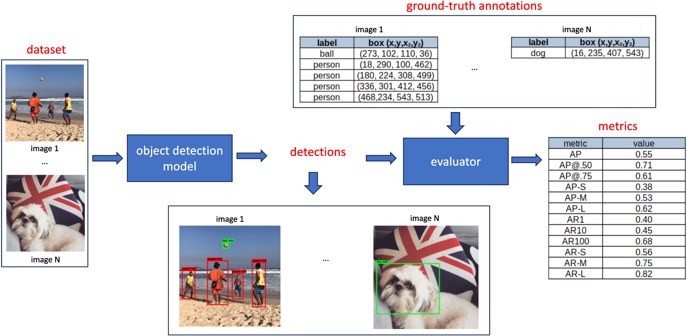
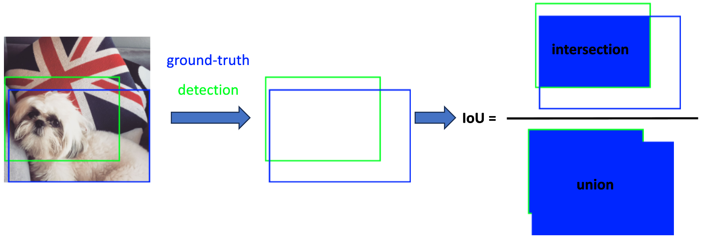
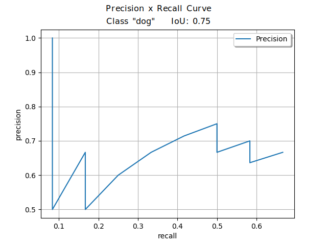

# Object Detection Leaderboard

<!-- {blog_metadata} -->
<!-- {authors} -->

In the field of Computer Vision, Object Detection refers to the technique of identifying and localizing individual objects within an image or a video frame. Unlike image classification, where the task is to determine the predominant object or scene in the image, object detection not only categorizes the object classes present but also provides spatial information drawing bounding boxes around each detected object. An object detector can also output a “score”, also referred to as “confidence”, for each box, representing the probability that the detected object truly belongs to the predicted class.

The following image, for instance, shows 5 detections, being 1 “ball” with confidence of 98% and 4 “person” with confidences 98%, 95%, 97% and 97%.

<!-- 
Figure 1: Example of outputs performed by an object detector. -->

 Figure 1: Example of outputs performed by an object detector. 

Object detection models are versatile and have a wide range of applications across various domains. Some use cases where they are applied are **autonomous vehicles**, **face detection**, **surveillance and security**, **medical imaging**, **augmented reality**, **sport analysis**, **smart cities**, **gesture recognition**, etc.

[Hugging Face’s hub](https://huggingface.co/models?pipeline_tag=object-detection) has hundreds of object detection models (*a total of 671 models by August 29th, 2023*) pre trained in different datasets, able to identify and localize various object classes. 

Some object detection models can receive additional text queries to search for target objects described in the text. This way, these detectors (called zero-shot) are not limited to detecting objects seen during training.  

However, the diversity of detectors go beyond the range of output classes they can recognize. They vary in terms of underlying architectures, model sizes, processing speeds and prediction accuracy.

A popular metric used to evaluate the accuracy of predictions made by an object detection model is a metric known as **Average Precision (AP)** and its variants, which will be explained further.

The process to evaluate an object detection model encompassing several components like dataset with ground-truth annotations, detections (output prediction)  and metrics. This process is depicted in the schematic provided in Figure 2:

<!-- 
Figure 2: Schematic illustrating the evaluation process for a traditional object detection model -->

 Figure 2: Schematic illustrating the evaluation process for a traditional object detection model. 

It is not depicted in Figure 2, but as previously mentioned, certain models require text prompt inputs, to provide guidance on the specific classes the model is intended to detect.

First, a benchmarking dataset containing images with ground-truth bounding box annotations is chosen and fed into the object detection model. For each image, the model predicts bounding boxes, assigning associated class labels and confidence scores to each box. During the evaluation phase, these predicted bounding boxes are compared with the ground-truth boxes present in the dataset. The evaluation yields a set of metrics, each ranging between [0, 1], reflecting a specific evaluation criteria. We will cover each of them in a separate section.

In the following sections, we will delve into the definition of Average Precision, its variations and the computation methodologies associated with them. Next, we will explore the influence of pre-processing and post-processing parameters on a model’s outcomes. Following this, we will present metrics pertaining to object detectors available in the Hugging Face hub and published in our [Object Detection Leaderboard](https://huggingface.co/spaces/rafaelpadilla/object_detection_leaderboard). Concluding the discussion, we will shed light on the reasons why certain models might exhibit divergent results across different repositories. 

## What is Average Precision and how to compute it?

Average Precision is a single-number metric that summarizes the precision-recall curve. It captures the ability of a model to classify and localize objects correctly, while taking into account both false positive and false negative detections.

Every box predicted by the model is considered a “positive” detection. Based on a criteria known as Intersection over Union (IoU) between the predicted box and a ground-truth annotation, a detection is categorized either as a true positive (TP) or a false positive (FP). 

The IoU measures the overlap between the predicted bounding box and the actual (ground truth) bounding box. It's computed by dividing the area where the two boxes overlap by the area covered by both boxes combined. Figure 3 visually demonstrates the IoU using an example of a predicted box and its corresponding ground-truth box.

<!-- 
Figure 3: Intersection over Union (IoU) between a detection (in green) and ground-truth (in blue). -->

 Figure 3: Intersection over Union (IoU) between a detection (in green) and ground-truth (in blue). 

Clearly, if both the ground-truth and detected boxes share identical coordinates, representing the same region in the image, their IoU value is 1. Conversely, if the boxes do not overlap at any pixel, the IoU is considered to be 0.

In scenarios where high precision in detections is expected (e.g. an autonomous vehicle), the predicted bounding boxes should closely align with the ground-truth boxes. For that, a IoU threshold (T_IoU) approaching 1 is preferred. On the other hand, for applications where the exact position of the detected bounding boxes relative to the target object isn’t critical, the threshold can be relaxed, setting T_IoU closer to 0.

Based on predefined T_IoU, we can define True Positives and True Negatives:
* **True Positive (TP)**: A correct detection where IoU ≥ T_IoU.
* **False Positive (FP)**: An incorrect detection (missed object), where the IoU < T_IoU.

Conversely, Negatives are evaluated  based on a ground-truth bounding and can be defined as False Negative (FN) or True Negative (TN):
* **False Negative (FN)**: Refers to a ground-truth object that the model failed to detect.
* **True Negative (TN)**: Denotes a correct non-detection. Within the domain of object detection, countless bounding boxes within an image should NOT be identified, as they don't represent the target object. Consider all possible boxes in an image that don’t represent the target object - quite a vast number, isn’t it? :) That's why we do not consider TN to compute object detection metrics.

Now that we can identify our TPs, FPs and FNs, we can define Precision and Recall:

* **Precision** is the ability of a model to identify only the relevant objects. It is the percentage of correct positive predictions and is given by:

\\( \text{Precision} = \frac{TP}{(TP + FP)} = \frac{TP}{\text{all detections}} \\)

which translates to the ratio of true positives over all detected boxes.

* **Recall** gauges a model’s competence in finding all the relevant cases (all ground truth bounding boxes). It indicates the proportion of TP detected among all ground truths and is given by:

\\( \text{Recall} = \frac{TP}{(TP + FN)} = \frac{TP}{\text{all ground truths}} \\)

Note that TP, FP and FN depend on a predefined IoU threshold, and so do Precision and Recall.

Now, we'll illustrate the relationship between Precision and Recall by plotting their respective curves for a specific target class, say "dog".  We’ll adopt a moderate IoU threshold = 75% to delineate our TP, FP and FN. Subsequently we can compute the Precision and Recall values. For that, we need to vary the confidence scores of our detections. 

Figure 4 shows an example of the Precision and Recall curve. For a deeper exploration into the computation of this curve, the papers “[A Comparative Analysis of Object Detection Metrics with a Companion Open-Source Toolkit](https://www.mdpi.com/2079-9292/10/3/2790)” (Padilla, et al) and “[A Survey on Performance Metrics for Object-Detection Algorithms](https://ieeexplore.ieee.org/document/9145130)” (Padilla, et al) offer more detailed toy examples demonstrating how to compute this curve.

<!-- 
Figure 4: Precision x Recall curve for a target object “dog” considering TP detections using IoU_thresh = 0.75  -->

 
 Figure 4: Precision x Recall curve for a target object “dog” considering TP detections using IoU_thresh = 0.75. 

The precision-recall curve illustrates the balance between precision and recall based on different confidence levels of a detector's bounding boxes. Each point of the plot is computed using a different confidence value. 

