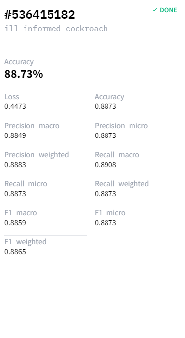

<h1>
    Opinion Classification with Kili and HuggingFace AutoTrain
</h1>

<div class="blog-metadata">
    <small>Published April 28, 2022.</small>
    <a target="_blank" class="btn no-underline text-sm mb-5 font-sans" href="https://github.com/huggingface/blog/blob/main/opinion-classification-with-kili-technology-and-huggingface-autotrain.md">
        Update on GitHub
    </a>
</div>

<div class="author-card">
    <a href="/alperiox">
        
        <div class="bfc">
            <code>alperiox</code>
            <span class="fullname">Alper Balbay</span>
            <span class="bg-gray-100 rounded px-1 text-gray-600 text-sm font-mono">guest</span>
        </div>
    </a>
</div>

## Introduction

Understanding your users’ needs is crucial in any user-related business. But it also requires a lot of hard work and analysis, which is quite expensive. Why not leverage Machine Learning then? With much less coding by using Auto ML.

In this article, we will leverage [HuggingFace AutoTrain](https://huggingface.co/autotrain) and [Kili](https://kili-technology.com/) to build an active learning pipeline for text classification. [Kili](https://kili-technology.com/) is a platform that empowers a data-centric approach to Machine Learning through quality training data creation. It provides collaborative data annotation tools and APIs that enable quick iterations between reliable dataset building and model training. Active learning is a process in which you add labeled data to the data set and then retrain a model iteratively. Therefore, it is endless and requires humans to label the data. 

As a concrete example use case for this article, we will build our pipeline by using user reviews of Medium from the Google Play Store. After that, we are going to categorize the reviews with the pipeline we built. Finally, we will apply sentiment analysis to the classified reviews. Then we will analyze the results, understanding the users’ needs and satisfaction will be much easier.

## AutoTrain with HuggingFace

Automated Machine Learning is a term for automating a Machine Learning pipeline. It also includes data cleaning, model selection, and hyper-parameter optimization too. We can use 🤗 transformers for automated hyper-parameter searching. Hyper-parameter optimization is a difficult and time-consuming process.
    
While we can build our pipeline ourselves by using transformers and other powerful APIs, it is also possible to fully automate this with [AutoTrain](https://huggingface.co/autotrain). AutoTrain is built on many powerful APIs like transformers, [datasets](https://github.com/huggingface/datasets) and [inference-api](https://huggingface.co/docs/transformers/main_classes/trainer).

Cleaning the data, model selection, and hyper-parameter optimization steps are all fully automated in AutoTrain. One can fully utilize this framework to build production-ready SOTA transformer models for a specific task. Currently, AutoTrain supports binary and multi-label text classification, token classification, extractive question answering, text summarization, and text scoring. It also supports many languages like English, German, French, Spanish, Finnish, Swedish, Hindi, Dutch, and [more](https://huggingface.co/docs/autonlp/supported_languages.html). If your language is not supported by AutoTrain, it is also possible to use custom models with custom tokenizers.

## Kili

[Kili](https://kili-technology.com/) is an end-to-end AI training platform for data-centric businesses. Kili provides optimized labeling features and quality management tools to manage your data. You can quickly annotate the image, video, text, pdf, and voice data while controlling the quality of the dataset. It also has powerful APIs for GraphQL and Python which eases data management a lot. 

It is available either online or on-premise and it enables modern Machine Learning technics either on computer vision or on NLP and OCR. It supports text classification, named entity recognition (NER), relation extraction, and more NLP/OCR tasks. It also supports computer vision tasks like object detection, image transcription, video classification, semantic segmentation, and many more! 

Kili is a commercial tool but you can also create a free developer account to try Kili’s tools. You can learn more from the [pricing](https://kili-technology.com/pricing/) page.

## Project

We will work on an example of review classification, along with sentiment analysis, to get insights about a mobile application.

We have extracted around 40 thousand reviews of Medium from the Google Play Store. We will [annotate the review texts](https://kili-technology.com/blog/text-annotation-in-machine-learning-an-overview/) in this dataset step by step. And then we’re going to build a pipeline for review classification. In the modeling, the first model will be prepared with AutoTrain. Then we will also build a model without using AutoTrain. 

All the code and the dataset can be found on the [GitHub repository](https://github.com/alperiox/review-classification-kili-hf-automl) of the project.

## Dataset

Let’s start by taking a look at the raw dataset,


There are 10 columns and 40130 samples in this dataset. The only column we need is `content` which is the review of the user. Before starting, we need to define some categories.

We have defined 4 categories, 

- Subscription: Since medium has a subscription option, anything related to users' opinions about subscription features should belong here.
- Content: Medium is a sharing platform, there are lots of writings from poetry to advanced artificial intelligence research. Users’ opinions about a variety of topics, the quality of the content should belong here.
- Interface: Thoughts about UI, searching articles, recommendation engine, and anything related to the interface should belong here. This also includes payment-related issues.
- User Experience: The user’s general thoughts and opinions about the application. Which should be generally abstract without indicating another category.

For the labeling part, we need to create a project in Kili’s platform at first. We can use either the web interface of the platform or APIs. Let's see both.

**From the web interface:**

From the project list page, we create a multi-class text classification project.


After that, on the project’s page, you can add your data by clicking the Add assets button. Currently, you can add at most 25000 samples, but you can extend this limit if you contact the Kili sales team.

After we create our project, we need to add jobs. We can prepare a labeling interface from the Settings page

Although we have defined 4 categories, it is inevitable to come across reviews that should have multiple categories or completely weird ones. I will add two more labels (which are not to use in modeling) to catch these cases too.

In our example, we added two more labels (Other, Multi-label). We also added a named entity recognition (NER) job just to specify how we decided on a label while labeling. The final interface is shown below


As you can see from the menu at the left, it is also possible to drop a link that describes your labels on the `Instructions` page. We can also add other members to our project from `Members` or add quality measures from the `Quality management` pages. More information can be found in the [documentation](https://cloud.kili-technology.com/docs/overview/introduction-to-kili-technology.html).

**Now, let’s create our project with Python API:**

At first, we need to import needed libraries

([notebooks/kili_project_management.ipynb](https://github.com/alperiox/review-classification-kili-hf-automl/blob/master/notebooks/kili_project_management.ipynb))

```python
import os
#we will process the data (which is a csv file)
import pandas as pd

#API client
from kili.client import Kili
#Why not use pretty progress bars?
from tqdm import tqdm

from dotenv import load_dotenv
load_dotenv()
```

In order to access the platform, we need to authenticate our client

```python
API_KEY = os.getenv('KILI_API_KEY')
# initialize and authenticate the Kili client
kili = Kili(api_key = API_KEY)
```

Now we can start to prepare our interface, the interface is just a dictionary in Python. We will define our jobs, then fill the labels up. Since all labels also could have children labels, we will pass labels as dictionaries too.

```python
labels = ['User experience', 'Subscription', 'Content', 'Other', 'Multi label']
entity_dict = {
    'User experience': '#cc4125',
    'Subscription': '#4543e6',
    'Content': '#3edeb6',
}
project_name = 'User review dataset for topic classification'
project_description = "Medium's app reviews fetched from google play store for topic classification"

interface = {
    'jobs': {
        'JOB_0': {
            'mlTask': 'CLASSIFICATION',
            'instruction': 'Labels',
            'required': 1,
            'content': {
                "categories": {},
                "input": "radio",
            },
        },
        'JOB_1': {
            'mlTask': "NAMED_ENTITIES_RECOGNITION",
            'instruction': 'Entities',
            'required': 1,
            'content': {
                'categories': {},
                "input": "radio"
            },
        },
    }
}

# fill the interface json with jobs
for label in labels:
    # converts labels to uppercase and replaces whitespaces with underscores (_)
    # ex. User experience -> USER_EXPERIENCE
    # this is the preferred way to fill the interface
    label_upper = label.strip().upper().replace(' ', '_')
    # 
    content_dict_0 = interface['jobs']['JOB_0']['content']
    categories_0 = content_dict_0['categories']
    category = {'name': label, 'children': []}
    categories_0[label_upper] = category

for label, color in entity_dict.items():
    label_upper = label.strip().upper().replace(' ', '_')
    content_dict_1 = interface['jobs']['JOB_1']['content']
    categories_1 = content_dict_1['categories']
    category = {'name': label, 'children': [], 'color': color}
    categories_1[label_upper] = category

# now we can create our project
# this method returns the created project’s id
project_id = kili.create_project(json_interface=interface,
                            input_type='TEXT',
                            title=project_name,
                            description=project_description)['id']
```

We are ready to upload our data to the project. The `append_many_to_dataset` method can be used to import the data into the platform. By using the Python API, we can import the data by batch of 100 maximum. Here is a simple function to upload the data:

```python
def import_dataframe(project_id:str, dataset:pd.DataFrame, text_data_column:str, external_id_column:str, subset_size:int=100) -> bool:
    """
    Arguments:
    Inputs
        - project_id (str): specifies the project to load the data, this is also returned when we create our project
        - dataset (pandas DataFrame): Dataset that has proper columns for id and text inputs
        - text_data_column (str): specifies which column has the text input data
        - external_id_column (str): specifies which column has the ids
        - subset_size (int): specifies the number of samples to import at a time. Cannot be higher than 100
    
    Outputs:
        None
    
    Returns: 
        True or False regards to process succession

    """

    assert subset_size <= 100, "Kili only allows to upload 100 assets at most at a time onto the app"


    L = len(dataset)

    # set 25000 as an upload limit, can be changed
    if L>25000:
        print('Kili Projects currently supports maximum 25000 samples as default. Importing first 25000 samples...')
        L=25000

    i = 0

    while i+subset_size < L:
        
        subset = dataset.iloc[i:i+subset_size]

        externalIds = subset[external_id_column].astype(str).to_list()
        contents = subset[text_data_column].astype(str).to_list()
        
        kili.append_many_to_dataset(project_id=project_id,
                                    content_array=contents,
                                    external_id_array=externalIds)

        i += subset_size

    return True
```

It simply imports the given `dataset` DataFrame to a project specified by project_id.

We can see the arguments from docstring, we just need to pass our dataset along with the corresponding column names. We’ll just use the sample indices we get when we load the data. And then voila, uploading the data is done!

```python
dataset_path = '../data/processed/lowercase_cleaned_dataset.csv'
df = pd.read_csv(dataset_path).reset_index() # reset index to get the indices

import_dataframe(project_id, df, 'content', 'index')
```

It wasn’t difficult to use the Python API, the helper methods we used covered many difficulties. We also used another script to check the new samples when we updated the dataset. Sometimes the model performance drop down after the dataset update. This is due to simple mistakes like mislabeling and introducing bias to the dataset. The script simply authenticates and then moves distinct samples of two given dataset versions to `To Review`. We can change the property of a sample through `update_properties_in_assets` method:

([scripts/move_diff_to_review.py](https://github.com/alperiox/review-classification-kili-hf-automl/blob/master/scripts/move_diff_to_review.py))

```python
# Set up the Kili client and arguments
from kili.client import Kili
from dotenv import load_dotenv
import os
import argparse

import pandas as pd

load_dotenv()

parser = argparse.ArgumentParser()
parser.add_argument('--first',
                    required=True,
                    type=str,
                    help='Path to first dataframe')
parser.add_argument('--second',
                    required=True,
                    type=str,
                    help='Path to second dataframe')

args = vars(parser.parse_args())

# set the kili connection up
API_KEY = os.getenv('KILI_API_KEY')
kili = Kili(API_KEY)

# read dataframes
df1 = pd.read_csv(args['first'])
df2 = pd.read_csv(args['second'])

# concating two of them should let us have duplicates of common elements
# then we can drop the duplicated elements without keeping any duplicates to get the different elements across the two dataframes
diff_df = pd.concat((df1, df2)).drop_duplicates(keep=False)
diff_ids = diff_df['id'].to_list()

# The changes should be given as an array that 
# contains the change for every single sample. 
# That’s why [‘TO_REVIEW’] * len(diff_df) is passed to status_array argument
kili.update_properties_in_assets(diff_ids,
                                 status_array=['TO_REVIEW'] * len(diff_ids))

print('SET %d ENTRIES TO BE REVIEWED!' % len(diff_df))
```

## Labeling

Now that we have the source data uploaded, the platform has a built-in labeling interface which is pretty easy to use. Available keyboard shortcuts helped while annotating the data. We used the interface without breaking a sweat, there are automatically defined shortcuts and it simplifies the labeling. We can see the shortcuts by clicking the keyboard icon at the right-upper part of the interface, they are also shown by underlined characters in the labeling interface at the right. 


Some samples were very weird, so we decided to skip them while labeling. In general, the process was way easier thanks to Kili’s built-in platform.


## Exporting the Labeled Data

The labeled data is exported with ease by using Python API. The script below exports the labeled and reviewed samples into a dataframe, then saves it with a given name as a CSV file.

([scripts/prepare_dataset.py](https://github.com/alperiox/review-classification-kili-hf-automl/blob/master/scripts/prepare_dataset.py))

```python
import argparse
import os

import pandas as pd
from dotenv import load_dotenv
from kili.client import Kili

load_dotenv()

parser = argparse.ArgumentParser()
parser.add_argument('--output_name',
                    required=True,
                    type=str,
                    default='dataset.csv')
parser.add_argument('--remove', required=False, type=str)
args = vars(parser.parse_args())

API_KEY = os.getenv('KILI_API_KEY')
dataset_path = '../data/processed/lowercase_cleaned_dataset.csv'
output_path = os.path.join('../data/processed', args['output_name'])


def extract_labels(labels_dict):
    response = labels_dict[-1]  # pick the latest version of the sample
    label_job_dict = response['jsonResponse']['JOB_0']
    categories = label_job_dict['categories']
    # all samples have a label, we can just pick it by its index
    label = categories[0]['name']
    return label


kili = Kili(API_KEY)
print('Authenticated!')
# query will return a list that contains matched elements (projects in this case)
# since we have only one project with this name, we can just pick the first index
project = kili.projects(
    search_query='User review dataset for topic classification')[0]
project_id = project['id']

# we can customize the returned fields
# the fields below are pretty much enough, 
# labels.jsonResponse carries the labeling data
returned_fields = [
    'id', 'externalId', 'labels.jsonResponse', 'skipped', 'status'
]
# I read the raw dataset too in order to match the samples with externalId
dataset = pd.read_csv(dataset_path)

# we can fetch the data as a dataframe
df = kili.assets(project_id=project_id,
                 status_in=['LABELED', 'REVIEWED'],
                 fields=returned_fields,
                 format='pandas')

print('Got the samples!')

# we will pass the skipped samples
df_ns = df[~df['skipped']].copy()

# extract the labeled samples
df_ns.loc[:, 'label'] = df_ns['labels'].apply(extract_labels)
# The externalId column is returned as string, let’s convert it to integer
# to use as indices
df_ns.loc[:, 'content'] = dataset.loc[df_ns.externalId.astype(int), 'content']

# we can drop the `labels` column now
df_ns = df_ns.drop(columns=['labels'])

# we'll remove the multi-labeled samples
df_ns = df_ns[df_ns['label'] != 'MULTI_LABEL'].copy()

# also remove the samples with label specified in remove argument if it's given
if args['remove']:
    df_ns = df_ns.drop(index=df_ns[df_ns['label'] == args['remove']].index)

print(‘DATA FETCHING DONE')
print('DATASET HAS %d SAMPLES' % (len(df_ns)))
print('SAVING THE PROCESSED DATASET TO: %s' % os.path.abspath(output_path))

df_ns.to_csv(output_path, index=False)

print('DONE!')
```

Nice! We now have the labeled data as a csv file. Let's create a dataset repository in HuggingFace and upload the data there!

It's really simple, just click your profile picture and select `New Dataset` option. 


Then enter the repository name, pick a license if you want and it's done!


Now we can upload the dataset from `Add file` in the `Files and versions` tab.  


Dataset viewer is automatically available after you upload the data, we can easily check the samples!


It is also possible to [upload the dataset to Hugging Face's dataset hub](https://huggingface.co/docs/datasets/upload_dataset#upload-from-python) by using `datasets` package. 

## Modeling

Let's use active learning. We iteratively label and fine-tune the model. In each iteration, we label 50 samples in the dataset. The number of samples is shown below:


Let’s try out AutoTrain first:

First, open the [AutoTrain](https://ui.autonlp.huggingface.co/)

1. Create a project


2. We can select the dataset repository we created before or upload the dataset again. Then we need to choose the split type, I’ll leave it as Auto. 


3. Train the models


AutoTrain will try different models and select the best models. Then performs hyper-parameter optimization automatically. The dataset is also processed automatically.

The price totally depends on your use case. It can be as low as $10 or it can be more expensive than the current value.

The training is done after around 20 minutes, the results are pretty good!


The best model’s accuracy is almost %89.



Now we can use this [model](https://huggingface.co/alperiox/autonlp-user-review-classification-536415182) to perform the analysis, it only took about 30 minutes to set up the whole thing.

## Modeling without AutoTrain

We will use [Ray Tune](https://docs.ray.io/en/latest/tune/index.html) and Hugging Face’s Trainer API to search hyper-parameters and fine-tune a pre-trained deep learning model. We have selected [roBERTa base sentiment classification model](https://huggingface.co/cardiffnlp/twitter-roberta-base-sentiment) which is trained on tweets for fine-tuning. We've fine-tuned the model on google collaboratory and it can be found on the `notebooks` folder in the [GitHub repository](https://github.com/alperiox/user-review-classification-hf-kili).

Ray tune is a popular library for hyper-parameter optimization which comes with many SOTA algorithms out of the box. It is also possible to use [Optuna](https://optuna.readthedocs.io/en/stable/index.html) and [SigOpt](https://sigopt.com/).
We also used [Async Successive Halving Algorithm [(ASHA)](https://docs.ray.io/en/latest/tune/api_docs/schedulers.html#asha-tune-schedulers-ashascheduler) as the scheduler and [HyperOpt](https://hyperopt.github.io/hyperopt/) as the search algorithm. Which is pretty much a starting point. You can use different [schedulers](https://docs.ray.io/en/latest/tune/api_docs/schedulers.html) and [search algorithms](https://docs.ray.io/en/latest/tune/api_docs/suggestion.html).

What will we do?

- Import the necessary libraries (a dozen of them) and prepare a dataset class
- Define needed functions and methods to process the data
- Load the pre-trained model and tokenizer
- Run hyper-parameter search
- Use the best results for evaluation

Let’s start with importing necessary libraries!
(all the code is in [notebooks/modeling.ipynb](https://github.com/alperiox/review-classification-kili-hf-automl/blob/master/notebooks/modeling.ipynb) and [google collaboratory notebook](https://colab.research.google.com/drive/1YL-q3_JTEnOtoQdiDUnwSxLVn9Aqpzs8?usp=sharing))

```python
# general data science/utilization/visualization imports
import json
import os
import random

# progress bar
from tqdm import tqdm

# data manipulation / reading
import numpy as np
import pandas as pd

# visualization
import plotly.express as px
import matplotlib.pyplot as plt

# pre-defined evaluation metrics
from sklearn.metrics import (accuracy_score, f1_score,
                             precision_score, recall_score)

from sklearn.model_selection import train_test_split
# torch imports
import torch
import torch.nn as nn
from torch.utils.data import DataLoader, Dataset, random_split
# huggingface imports
import transformers
from datasets import load_metric
from transformers import (AutoModelForSequenceClassification, AutoTokenizer, 
                          Trainer, TrainingArguments)

# ray tune imports for hyperparameter optimization
from ray.tune.schedulers import ASHAScheduler, PopulationBasedTraining
from ray.tune.suggest.hyperopt import HyperOptSearch
```

We will set a seed for the libraries we use for reproducibility

```python
def seed_all(seed):
    torch.manual_seed(seed)
    random.seed(seed)
    np.random.seed(seed)

SEED=42
seed_all(SEED)
```

Now let’s define our dataset class!

```python
class TextClassificationDataset(Dataset):
    def __init__(self, dataframe):
        self.labels = dataframe.label.to_list()
        self.inputs = dataframe.content.to_list()
        self.labels_to_idx = {k:v for k,v in labels_dict.items()} # copy the labels_dict dictionary

    def __len__(self):
        return len(self.inputs)

    def __getitem__(self, idx):
        if type(idx)==torch.Tensor:
            idx = list(idx)

        input_data = self.inputs[idx]
        target = self.labels[idx]
        target = self.labels_to_idx[target]

        return {'text': input_data, 'label':target}
```

We can download the model easily by specifying HuggingFace hub repository. It is also needed to import the tokenizer for the specified model. We have to provide a function to initialize the model during hyper-parameter optimization. The model will be defined there.

The metric to optimize is accuracy, we want this value to be as high as possible. Because of that, we need to load the metric, then define a function to get the predictions and calculate the preferred metric.

```python
model_name = 'cardiffnlp/twitter-roberta-base-sentiment'
# we will perform the search to optimize the model accuracy,
# we need to specify and load the accuracy metric as a first step
metric = load_metric("accuracy")


# since we already entered a model name, we can load the tokenizer
# we can also load the model but i'll describe it in the model_init function.
tokenizer = AutoTokenizer.from_pretrained(model_name)


def model_init():
    """
    Hyperparameter optimization is performed by newly initialized models,
    therefore we will need to initialize the model again for every single search run. 
    This function initializes and returns the pre-trained model selected with `model_name`
    """
    return AutoModelForSequenceClassification.from_pretrained(model_name, num_labels=4, return_dict=True, ignore_mismatched_sizes=True)

# the function to calculate accuracy
def compute_metrics(eval_pred):
    logits, labels = eval_pred
    predictions = np.argmax(logits, axis=-1) # just pick the indices that has the maximum values
    return metric.compute(predictions=predictions, references=labels)
```

After defining metric calculation and model initialization function, we can load the data:

```python
file_name = "dataset-11.csv"

dataset_path = os.path.join('data/processed', file_name)
dataset = pd.read_csv(dataset_path)
```

I also defined two dictionaries for mapping labels to indices and indices to labels.

```python
idx_to_label = dict(enumerate(dataset.label.unique()))
labels_dict = {v:k for k,v in idx_to_label.items()}
```

Now we can define the search algorithm and the scheduler for the hyper-parameter-search. 

```python
scheduler =  ASHAScheduler(metric='objective', mode='max')
search_algorithm = HyperOptSearch(metric='objective', mode='max', random_state_seed=SEED)
# number of runs for parameter searching
n_trials =  40
```

We also need to tokenize the text data before passing it to the model, we can easily do this by using the loaded tokenizer. Ray Tune works in a black-box setting so I used tokenizer as a default argument for a work-around. Otherwise, an error about tokenizer definition would arise.

```python
def tokenize(sample, tokenizer=tokenizer):
    tokenized_sample = tokenizer(sample['text'], padding=True, truncation=True)
    tokenized_sample['label'] = sample['label']
    return tokenized_sample
```

Another utility function that returns stratified and tokenized Torch dataset splits:

```python
def prepare_datasets(dataset_df, test_size=.2, val_size=.2):
    train_set, test_set = train_test_split(dataset_df, test_size=test_size,
                                        stratify=dataset_df.label, random_state=SEED)

    train_set, val_set = train_test_split(train_set, test_size=val_size,
                                        stratify=train_set.label, random_state=SEED)

    # shuffle the dataframes beforehand 
    train_set = train_set.sample(frac=1, random_state=SEED)
    val_set = val_set.sample(frac=1, random_state=SEED)
    test_set = test_set.sample(frac=1, random_state=SEED)

    # convert dataframes to torch datasets
    train_dataset = TextClassificationDataset(train_set)
    val_dataset = TextClassificationDataset(val_set)
    test_dataset = TextClassificationDataset(test_set)

    # tokenize the datasets
    tokenized_train_set = train_dataset.map(tokenize)
    tokenized_val_set = val_dataset.map(tokenize)
    tokenized_test_set = test_dataset.map(tokenize)

    # finally return the processed sets
    return tokenized_train_set, tokenized_val_set, tokenized_test_set
```

Now we can perform the search! Let’s start by processing the data:

```python
tokenized_train_set, tokenized_val_set, tokenized_test_set = prepare_datasets(dataset)

training_args = TrainingArguments(
    'trial_results',
    evaluation_strategy="steps",
    disable_tqdm=True,
    skip_memory_metrics=True,
)

trainer = Trainer(
    args=training_args,
    tokenizer=tokenizer,
    train_dataset=tokenized_train_set,
    eval_dataset=tokenized_val_set,
    model_init=model_init,
    compute_metrics=compute_metrics
    )

best_run = trainer.hyperparameter_search(
    direction="maximize", 
    n_trials=n_trials,
    backend="ray",
    search_alg=search_algorithm,
    scheduler=scheduler
    )
```

We performed the search with 20 and 40 trials respectively, the results are shown below. The weighted average of F1, Recall, and Precision scores for 20 runs.


The weighted average of F1, Recall, and Precision scores for 40 runs.


The performance spiked up at the third dataset version. At some point in data labeling, I’ve introduced too much bias to the dataset mistakingly. As we can see its performance becomes more reasonable since the sample variance increased later on. The final model is saved at Google Drive and can be downloaded from [here](https://drive.google.com/drive/folders/1X_ci2Pwu0-1XbXsaCksQHZF0254TIHiD?usp=sharing), it is also possible to download via the [download_models.py](https://github.com/alperiox/review-classification-kili-hf-automl/tree/master/scripts) script. 

## Final Analysis

We can use the fine-tuned model to conduct the final analysis now. All we have to do is load the data, process it, and get the prediction results from the model. Then we can use a pre-trained model for sentiment analysis and hopefully get insights.

We use Google Colab for the inference ([here](https://colab.research.google.com/drive/1kGYl_YcMmA2gj6HnYFzkcxSDNPlHjYaZ?usp=sharing)) and then exported the results to [result.csv](https://github.com/alperiox/review-classification-kili-hf-automl/tree/master/results). It can be found in `results` in the GitHub repository. We then analyzed the results in another [google collaboratory notebook](https://colab.research.google.com/drive/1TOX7tqJ7SGbUDWwA_6D1y-U0aNNXY04Q?usp=sharing) for an interactive experience. So you can also use it easily and interactively. 

Let’s check the results now!

We can see that the given scores are highly positive. In general, the application is liked by the users.


This also matches with the sentiment analysis, most of the reviews are positive and the least amount of reviews are classified as negative.


As we can see from above, the model's performance is kind of understandable. Positive scores are dominantly higher than the others, just like the sentimental analysis graph shows. 

As it comes to the categories defined before, it seems that the model predicts most of the reviews are about users' experiences (excluding experiences related to other categories):


We can also see the sentiment predictions over defined categories below:


We won't do a detailed analysis of the reviews, a basic understanding of potential problems would suffice. Therefore, it is enough to conclude simple results from the final data:

- It is understandable that most of the reviews about the subscription are negative. Paid content generally is not welcomed in mobile applications. 
- There are many negative reviews about the interface. This may be a clue for further analysis. Maybe there is a misconception about features, or a feature doesn't work as users thought. 
- People have generally liked the articles and most of them had good experiences. 

Important note about the plot: we haven't filtered the reviews by application version. When we look at the results of the latest current version (4.5), it seems that the interface of the application confuses the users or has annoying bugs.


## Conclusion

Now we can use the pre-trained model to try to understand the potential shortcomings of the mobile application. Then it would be easier to analyze a specific feature. 

We used HuggingFace’s powerful APIs and AutoTrain along with Kili’s easy-to-use interface in this example. The modeling with AutoTrain just took 30 minutes, it chose the models and trained them for our use. AutoTrain is definitely much more efficient since I spent more time as I develop the model by myself.

All the code, datasets, and scripts can be found in [github](https://github.com/alperiox/review-classification-kili-hf-automl). You can also try the [AutoTrain model](https://huggingface.co/alperiox/autonlp-user-review-classification-536415182).

While we can consider this as a valid starting point, we should collect more data and try to build better pipelines. Better pipelines would result in more efficient improvements.
