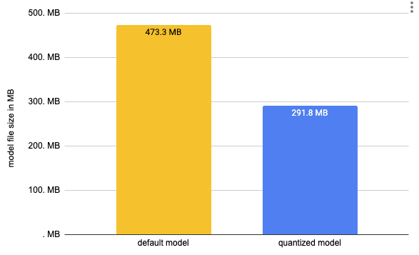

<h1>
   Accelerated Inference with Optimum and Transformers Pipelines
</h1>

<div class="blog-metadata">
    <small>Published April 8, 2021.</small>
    <a target="_blank" class="btn no-underline text-sm mb-5 font-sans" href="https://github.com/huggingface/blog/blob/main/optimum-inference.md">
        Update on GitHub
    </a>
</div>

<div class="author-card">
    <a href="/philschmid">
        
        <div class="bfc">
            <code>philschmid</code>
            <span class="fullname">Philipp Schmid</span>
        </div>
    </a>
</div>

> ***Inference has landed in Optimum with support for Hugging Face Transformers pipelines, including text-generation using Onnx Runtime.***

The adoption of BERT and Transformers continues to grow. Transformer-based models are now not only achieving state-of-the-art performance in Natural Language Processing but also for Computer Vision, Speech, and Time-Series. 💬 🖼 🎤 ⏳

Companies are now slowly moving from the experimentation and research phase to the production phase in order to use Transformer models for large-scale workloads. But by default BERT and its friends are relatively slow, big, and complex models compared to traditional Machine Learning algorithms. 

To solve this challenge, we created [Optimum](https://huggingface.co/blog/hardware-partners-program) –  an extension of [Hugging Face Transformers](https://github.com/huggingface/transformers)
 to accelerate the training and inference of Transformer models like BERT.

In this blog post, you'll learn:

1. What is Optimum? An ELI5
2. New Optimum inference and pipeline features.
3. End-to-End tutorial on accelerating RoBERTa for question-answering including quantization and optimization
4. Current Limitations
5. Optimum Inference FAQ
6. What’s next?

Let's get started! 🚀

## 1. What is Optimum? An ELI5

[Hugging Face Optimum](https://github.com/huggingface/optimum) is an open-source library and an extension of [Hugging Face Transformers](https://github.com/huggingface/transformers), that provides a unified API of performance optimization tools to achieve maximum efficiency to train and run models on accelerated hardware, including toolkits for optimized performance on [Graphcore IPU](https://github.com/huggingface/optimum-graphcore) and [Habana Gaudi](https://github.com/huggingface/optimum-habana). Optimum can be used for accelerated training, quantization, graph optimization, and now inference as well with support for [transformers pipelines](https://huggingface.co/docs/transformers/main/en/main_classes/pipelines#pipelines).

## 2. New Optimum inference and pipeline features

With [release](link to release) of Optimum 1.2, we are adding support for [inference](https://huggingface.co/docs/optimum/main/en/onnxruntime/modeling_ort) and [transformers pipelines](https://huggingface.co/docs/transformers/main/en/main_classes/pipelines#pipelines). This allows Optimum users to leverage the same API they are used to from transformers with the power of accelerated runtimes, like [Onnx Runtime](https://onnxruntime.ai/).

**Switching from Transformers to Optimum Inference**
The [Optimum Inference models](https://huggingface.co/docs/optimum/main/en/onnxruntime/modeling_ort) are API compatible with Hugging Face Transformers models. This means you can just replace your `AutoModelForXxx` class with the corresponding `ORTModelForXxx` class in Optimum. For example, this is how you can use a question answering model in Optimum:

```diff
from transformers import AutoTokenizer, pipeline
-from transformers import AutoModelForQuestionAnswering
+from optimum.onnxruntime import ORTModelForQuestionAnswering

-model = AutoModelForQuestionAnswering.from_pretrained("deepset/roberta-base-squad2") # pytorch checkpoint
+model = ORTModelForQuestionAnswering.from_pretrained("optimum/roberta-base-squad2") # onnx checkpoint
tokenizer = AutoTokenizer.from_pretrained("deepset/roberta-base-squad2")

onnx_qa = pipeline("question-answering", model=model, tokenizer=tokenizer)

question = "What's my name?"
context = "My name is Philipp and I live in Nuremberg."
pred = onnx_qa(question, context)

```

In the first release, we added [support for Onnx Runtime](https://huggingface.co/docs/optimum/main/en/onnxruntime/modeling_ort) but there is more to come!
These new `ORTModelForXX` can now be used with the [transformers pipelines](https://huggingface.co/docs/transformers/main/en/main_classes/pipelines#pipelines). They are also fully integrated into the [Hugging Face Hub](https://huggingface.co/models) to push and pull optimized checkpoints from the community. In addition to this, you can use the [ORTQuantizer](https://huggingface.co/docs/optimum/main/en/onnxruntime/quantization) and [ORTOptimizer](https://huggingface.co/docs/optimum/main/en/onnxruntime/optimization) to first quantize and optimize your model and then run inference on it.
Check out [End-to-End Tutorial on accelerating RoBERTa for question-answering including quantization and optimization](https://www.notion.so/Accelerated-Inference-with-Optimum-https-github-com-huggingface-optimum-and-Transformers-Pipeli-1c8fc6770aca417aa04f02ae64fad132) for more details.

## 3. End-to-End tutorial on accelerating RoBERTa for Question-Answering including quantization and optimization

In this End-to-End tutorial on accelerating RoBERTa for question-answering, you will learn how to:

1. Install `Optimum` for Onnx Runtime
2. Convert a Hugging Face `Transformers` model to ONNX for inference
3. Use the `ORTOptimizer` to optimize the model
4. Use the `ORTQuantizer` to apply dynamic quantization
5. Run accelerated inference using Transformers pipelines
6. Evaluate the performance and speed

Let’s get started 🚀

*This tutorial was created and run on an `m5.xlarge` AWS EC2 Instance.* 

### 3.1 Install `Optimum` for Onnxruntime

Our first step is to install  `Optimum` with the `onnxruntime` utilities.

```bash
pip install "optimum[onnxruntime]==1.2.0"
```

This will install all required packages for us including `transformers`, `torch`, and `onnxruntime`. If you are going to use a GPU you can install optimum with `pip install optimum[onnxruntime-gpu]`.

### ****3.2 Convert a Hugging Face `Transformers` model to ONNX for inference**

Before we can start optimizing we need to convert our vanilla `transformers` model to the `onnx` format. To do this we will use the new [ORTModelForQuestionAnswering](https://huggingface.co/docs/optimum/main/en/onnxruntime/modeling_ort#optimum.onnxruntime.ORTModelForQuestionAnswering) class calling the `from_pretrained()` method with the `from_transformers` attribute. The model we are using is the [deepset/roberta-base-squad2](https://huggingface.co/deepset/roberta-base-squad2) a fine-tuned RoBERTa model on the SQUAD2 dataset achieving an F1 score of `82.91` and as the feature (task) `question-answering`.

```python
from pathlib import Path
from transformers import AutoTokenizer, pipeline
from optimum.onnxruntime import ORTModelForQuestionAnswering

model_id = "deepset/roberta-base-squad2"
onnx_path = Path("onnx")
task = "question-answering"

# load vanilla transformers and convert to onnx
model = ORTModelForQuestionAnswering.from_pretrained(model_id, from_transformers=True)
tokenizer = AutoTokenizer.from_pretrained(model_id)

# save onnx checkpoint and tokenizer
model.save_pretrained(onnx_path)
tokenizer.save_pretrained(onnx_path)

# test the model with using transformers pipeline, with handle_impossible_answer for squad_v2 
optimum_qa = pipeline(task, model=model, tokenizer=tokenizer, handle_impossible_answer=True)
prediction = optimum_qa(question="What's my name?", context="My name is Philipp and I live in Nuremberg.")

print(prediction)
# {'score': 0.9041663408279419, 'start': 11, 'end': 18, 'answer': 'Philipp'}
```

We successfully converted our vanilla transformers to `onnx` and used the model with the `transformers.pipelines` to run the first prediction. Now let's optimize it. 🏎

If you want to learn more about exporting transformers model check-out the documentation: [Export 🤗 Transformers Models](https://huggingface.co/docs/transformers/main/en/serialization)

### 3.3 Use the `ORTOptimizer` to optimize the model

After we saved our onnx checkpoint to `onnx/` we can now use the `ORTOptimizer` to apply graph optimization such as operator fusion and constant folding to accelerate latency and inference. 

```python
from optimum.onnxruntime import ORTOptimizer
from optimum.onnxruntime.configuration import OptimizationConfig

# create ORTOptimizer and define optimization configuration
optimizer = ORTOptimizer.from_pretrained(model_id, feature=task)
optimization_config = OptimizationConfig(optimization_level=99) # enable all optimizations

# apply the optimization configuration to the model
optimizer.export(
    onnx_model_path=onnx_path / "model.onnx",
    onnx_optimized_model_output_path=onnx_path / "model-optimized.onnx",
    optimization_config=optimization_config,
)
```

To test performance we can use the `ORTModelForQuestionAnswering` class again and provide an additional `file_name` parameter to load our optimized model. **(This also works for models available on the hub).**

```python
from optimum.onnxruntime import ORTModelForQuestionAnswering

# load quantized model
opt_model = ORTModelForQuestionAnswering.from_pretrained(onnx_path, file_name="model-optimized.onnx")

# test the quantized model with using transformers pipeline
opt_optimum_qa = pipeline(task, model=opt_model, tokenizer=tokenizer, handle_impossible_answer=True)
prediction = opt_optimum_qa(question="What's my name?", context="My name is Philipp and I live in Nuremberg.")
print(prediction)
# {'score': 0.9041663408279419, 'start': 11, 'end': 18, 'answer': 'Philipp'}
```

We will evaluate the performance changes in step [3.6 Evaluate the performance and speed](https://www.notion.so/Accelerated-Inference-with-Optimum-https-github-com-huggingface-optimum-and-Transformers-Pipeli-1c8fc6770aca417aa04f02ae64fad132) in detail.

### 3.4 Use the `ORTQuantizer` to apply dynamic quantization

After we have optimized our model we can accelerate it even more by quantizing it using the `ORTQuantizer`. The `ORTOptimizer` can be used to apply dynamic quantization to decrease the size of the model size and accelerate latency and inference. 

*We use the `avx512_vnni` since the instance is powered by an intel cascade-lake CPU supporting avx512.*

```python
from optimum.onnxruntime import ORTQuantizer
from optimum.onnxruntime.configuration import AutoQuantizationConfig

# create ORTQuantizer and define quantization configuration
quantizer = ORTQuantizer.from_pretrained(model_id, feature=task)
qconfig = AutoQuantizationConfig.avx512_vnni(is_static=False, per_channel=True)

# apply the quantization configuration to the model
quantizer.export(
    onnx_model_path=onnx_path / "model-optimized.onnx",
    onnx_quantized_model_output_path=onnx_path / "model-quantized.onnx",
    quantization_config=qconfig,
)
```

We can now compare this model size as well as some latency performance

```python
import os
# get model file size
size = os.path.getsize(onnx_path / "model.onnx")/(1024*1024)
print(f"Vanilla Onnx Model file size: {size:.2f} MB")
size = os.path.getsize(onnx_path / "model-quantized.onnx")/(1024*1024)
print(f"Quantized Onnx Model file size: {size:.2f} MB")

# Vanilla Onnx Model file size: 473.31 MB
# Quantized Onnx Model file size: 291.77 MB
```

<figure class="image table text-center m-0 w-full">
  
</figure>


We decreased the size of our model by almost 50% from 473MB to 291MB. To run inference we can use the `ORTModelForQuestionAnswering` class again and provide an additional `file_name` parameter to load our quantized model. **(This also works for models available on the hub).**

```python
# load quantized model
quantized_model = ORTModelForQuestionAnswering.from_pretrained(onnx_path, file_name="model-quantized.onnx")

# test the quantized model with using transformers pipeline
quantized_optimum_qa = pipeline(task, model=quantized_model, tokenizer=tokenizer, handle_impossible_answer=True)
prediction = quantized_optimum_qa(question="What's my name?", context="My name is Philipp and I live in Nuremberg.")
print(prediction)
# {'score': 0.9246969819068909, 'start': 11, 'end': 18, 'answer': 'Philipp'}
```

Nice! The model predicted the same answer. 

### 3.5 Run accelerated inference using Transformers pipelines

[Optimum](https://huggingface.co/docs/optimum/main/en/pipelines#optimizing-with-ortoptimizer) has built-in support for [transformers pipelines](https://huggingface.co/docs/transformers/main/en/main_classes/pipelines#pipelines). This allows us to leverage the same API that we know from using PyTorch and TensorFlow models. We have already used this feature in steps 3.2,3.3 & 3.4 to test our converted and optimized models. At the time of writing this, we are supporting [Onnx Runtime](https://onnxruntime.ai/) with more to come in the future. An example of how to use the [transformers pipelines](https://huggingface.co/docs/transformers/main/en/main_classes/pipelines#pipelines) can be found below.

```python
from transformers import AutoTokenizer, pipeline
from optimum.onnxruntime import ORTModelForQuestionAnswering

tokenizer = AutoTokenizer.from_pretrained(onnx_path)
model = ORTModelForQuestionAnswering.from_pretrained(onnx_path)

onnx_qa = pipeline("question-answering", model=model, tokenizer=tokenizer)
prediction = optimum_qa(question="What's my name?", context="My name is Philipp and I live in Nuremberg.")

print(prediction)
# {'score': 0.9041663408279419, 'start': 11, 'end': 18, 'answer': 'Philipp'}
```

In addition to this we added a `pipelines` API to Optimum to guarantee more safety for your accelerated models. Meaning if you are trying to use `optimum.pipelines` with an unsupported model or task you will see an error. You can use `optimum.pipelines` as a replacement for `transformers.pipelines`.

```python
from transformers import AutoTokenizer
from optimum.onnxruntime import ORTModelForQuestionAnswering
from optimum.pipelines import pipeline

tokenizer = AutoTokenizer.from_pretrained(onnx_path)
model = ORTModelForQuestionAnswering.from_pretrained(onnx_path)

onnx_qa = pipeline("question-answering", model=model, tokenizer=tokenizer, handle_impossible_answer=True)
prediction = optimum_qa(question="What's my name?", context="My name is Philipp and I live in Nuremberg.")

print(prediction)
# {'score': 0.9041663408279419, 'start': 11, 'end': 18, 'answer': 'Philipp'}
```

### 3.6 Evaluate the performance and speed

During this [End-to-End tutorial on accelerating RoBERTa for Question-Answering including quantization and optimization](https://www.notion.so/Accelerated-Inference-with-Optimum-https-github-com-huggingface-optimum-and-Transformers-Pipeli-1c8fc6770aca417aa04f02ae64fad132), we created 3 different models. A vanilla converted model, an optimized model, and a quantized model. 

As the last step of the tutorial, we want to take a detailed look at the performance and accuracy of our model. Applying optimization techniques, like graph optimizations or quantization not only impact performance (latency) those also might have an impact on the accuracy of the model. So accelerating your model comes with a trade-off. 

Let's evaluate our models. Our transformers model [deepset/roberta-base-squad2](https://huggingface.co/deepset/roberta-base-squad2) was fine-tuned on the SQUAD2 dataset. This will be the dataset we use to evaluate our models. 

```python
from datasets import load_metric,load_dataset

metric = load_metric("squad_v2")
dataset = load_dataset("squad_v2")["validation"]

print(f"length of dataset {len(dataset)}")
#length of dataset 11873
```

We can now leverage the [map](https://huggingface.co/docs/datasets/v2.1.0/en/process#map) function of [datasets](https://huggingface.co/docs/datasets/index) to iterate over the validation set of squad 2 and run prediction for each data point. Therefore we write a `evaluate` helper method which uses our pipelines and applies some transformation to work with the [squad v2 metric.](https://huggingface.co/metrics/squad_v2)

*This can take quite a while (1.5h)*

```python
def evaluate(example):
  default = optimum_qa(question=example["question"], context=example["context"])
  optimized = opt_optimum_qa(question=example["question"], context=example["context"])
  quantized = quantized_optimum_qa(question=example["question"], context=example["context"])
  return {
      'reference': {'id': example['id'], 'answers': example['answers']},
      'default': {'id': example['id'],'prediction_text': default['answer'], 'no_answer_probability': 0.},
      'optimized': {'id': example['id'],'prediction_text': optimized['answer'], 'no_answer_probability': 0.},
      'quantized': {'id': example['id'],'prediction_text': quantized['answer'], 'no_answer_probability': 0.},
      }

result = dataset.map(evaluate)
# COMMENT IN to run evaluation on 2000 subset of the dataset
# result = dataset.shuffle().select(range(2000)).map(evaluate)
```

Now lets compare the results

```python
default_acc = metric.compute(predictions=result["default"], references=result["reference"])
optimized = metric.compute(predictions=result["optimized"], references=result["reference"])
quantized = metric.compute(predictions=result["quantized"], references=result["reference"])

print(f"vanilla model: exact={default_acc['exact']}% f1={default_acc['f1']}%")
print(f"optimized model: exact={optimized['exact']}% f1={optimized['f1']}%")
print(f"quantized model: exact={quantized['exact']}% f1={quantized['f1']}%")

# vanilla model: exact=79.07858165585783% f1=82.14970024570314%
# optimized model: exact=79.07858165585783% f1=82.14970024570314%
# quantized model: exact=78.75010528088941% f1=81.82526107204629%
```

Our optimized & quantized model achieved an exact match of `78.75%` and an f1 score of `81.83%` which is `99.61%` of the original accuracy. Achieving `99%` of the original model is very good especially since we used dynamic quantization.

Okay, let's test the performance (latency) of our optimized and quantized model. 

But first, let’s extend our context and question to a more meaningful sequence length of 128. 

```python
context="Hello, my name is Philipp and I live in Nuremberg, Germany. Currently I am working as a Technical Lead at Hugging Face to democratize artificial intelligence through open source and open science. In the past I designed and implemented cloud-native machine learning architectures for fin-tech and insurance companies. I found my passion for cloud concepts and machine learning 5 years ago. Since then I never stopped learning. Currently, I am focusing myself in the area NLP and how to leverage models like BERT, Roberta, T5, ViT, and GPT2 to generate business value." 
question="As what is Philipp working?" 
```

To keep it simple, we are going to use a python loop and calculate the avg/mean latency for our vanilla model and for the optimized and quantized model. 

```python
from time import perf_counter
import numpy as np 

def measure_latency(pipe):
    latencies = []
    # warm up
    for _ in range(10):
        _ = pipe(question=question, context=context)
    # Timed run
    for _ in range(100):
        start_time = perf_counter()
        _ =  pipe(question=question, context=context)
        latency = perf_counter() - start_time
        latencies.append(latency)
    # Compute run statistics
    time_avg_ms = 1000 * np.mean(latencies)
    time_std_ms = 1000 * np.std(latencies)
    return f"Average latency (ms) - {time_avg_ms:.2f} +\- {time_std_ms:.2f}"

print(f"Vanilla model {measure_latency(optimum_qa)}")
print(f"Optimized & Quantized model {measure_latency(quantized_optimum_qa)}")

# Vanilla model Average latency (ms) - 117.61 +\- 8.48
# Optimized & Quantized model Average latency (ms) - 64.94 +\- 3.65
```

We managed to accelerate our model latency from `117.61ms` to `64.94ms` or roughly 2x while keeping `99.61%` of the accuracy. Something we should keep in mind is that we used a mid-performant CPU instance with 2 physical cores. By switching to GPU or a more performant CPU instance, e.g. [ice-lake powered you can decrease the latency number down to a few milliseconds.](https://huggingface.co/blog/bert-cpu-scaling-part-2#more-efficient-ai-processing-on-latest-intel-ice-lake-cpus)

## 4. Current Limitations

We just started supporting inference in [https://github.com/huggingface/optimum](https://github.com/huggingface/optimum) so we would like to share current limitations as well. All of those limitations are on the roadmap and will be resolved in the near future.

- **Remote Models > 2GB:** Currently, only models smaller than 2GB can be loaded from the [Hugging Face Hub](https://hf.co/). We are working on adding support for models > 2GB / multi-file models.
- **Seq2Seq tasks/model:** We don’t have support for seq2seq tasks, like summarization and models like T5 mostly due to the limitation of the single model support. But we are actively working to solve it, to provide you with the same experience you are familiar with in transformers.
- **Past key values:** Generation models like GPT-2 use something called past key values which are precomputed key-value pairs of the attention blocks and can be used to speed up decoding. Currently the ORTModelForCausalLM is not using past key values.

**No cache:**

Currently when loading an optimized model (*.onnx), it will not be cached locally.

## 5. Optimum Inference FAQ

**Which tasks are supported?**

You can find a list of all supported tasks in the [documentation](https://huggingface.co/docs/optimum/main/en/pipelines). Currently support pipelines tasks are `feature-extraction`, `text-classification`, `token-classification`, `question-answering`, `zero-shot-classification`, `text-generation`

**Which models are supported?** 

Any model that can be exported with [transformers.onnx](https://huggingface.co/docs/transformers/serialization) and has a supported task can be used, this includes among others BERT, ALBERT, GPT2, RoBERTa, XLM-RoBERTa, DistilBERT ....

**Which runtimes are supported?**

Currently, Onnx Runtime is supported. We are working on adding more in the future. [Let us know](https://discuss.huggingface.co/c/optimum/59) if you are interested in a specific runtime.

**How can I use Optimum with Transformers?**

You can find an example and instructions in our [documentation](https://huggingface.co/docs/optimum/main/en/pipelines#transformers-pipeline-usage).

**How can I use GPUs?** 

To be able to use GPUs you simply need to install `optimum[onnxruntine-gpu]` which will install the required GPU providers and use them by default. 

**How can I use a quantized and optimized model with pipelines?**

You can load the optimized or quantized model using the new [ORTModelForXXX](https://huggingface.co/docs/optimum/main/en/onnxruntime/modeling_ort) classes using the [from_pretrained](https://huggingface.co/docs/optimum/main/en/onnxruntime/modeling_ort#optimum.onnxruntime.ORTModelForQuestionAnswering.forward.example) method. You can learn more about it in our [documentation](https://huggingface.co/docs/optimum/main/en/onnxruntime/modeling_ort#optimum-inference-with-onnx-runtime).

## 6. What’s next?

What’s next for Optimum you ask? A lot of things. We are focused on making Optimum the reference open-source toolkit to work with transformers for acceleration & optimization. To be able to achieve this we will solve the current limitations, improve the documentation, create more content and examples and push the limits for accelerating and optimizing transformers.

Some important features on the roadmap for Optimum amongst the [current limitations](https://www.notion.so/Accelerated-Inference-with-Optimum-https-github-com-huggingface-optimum-and-Transformers-Pipeli-1c8fc6770aca417aa04f02ae64fad132) are:

- Support for speech models (Wav2vec2) and speech tasks (automatic speech recognition)
- Support for vision models (ViT) and vision tasks (image classification)
- Improve performance by adding support for [OrtValue](https://onnxruntime.ai/docs/api/python/api_summary.html#ortvalue) and [IOBinding](https://onnxruntime.ai/docs/api/python/api_summary.html#iobinding)
- Easier ways to evaluate accelerated models
- Add support for other runtimes and providers like TensorRT and AWS-Neuron

---

Thanks for reading! If you are as excited as I am about accelerating Transformers, make them efficient and scale them to billions of requests. You should apply, [we are hiring](https://apply.workable.com/huggingface/#jobs).🚀

If you have any questions, feel free to contact me, through [Github](https://github.com/huggingface/optimum/issues), or on the [forum](https://discuss.huggingface.co/c/optimum/59). You can also connect with me on [Twitter](https://twitter.com/_philschmid) or [LinkedIn](https://www.linkedin.com/in/philipp-schmid-a6a2bb196/).