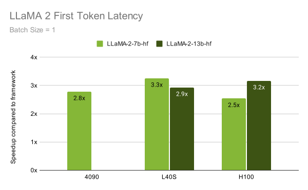

# Optimum-NVIDIA on Hugging Face enables blazingly fast LLM inference in just 1 line of code

Large Language Models (LLMs) have revolutionized natural language processing and are increasingly deployed to solve complex problems at scale. Achieving optimal performance with these models is notoriously challenging due to their unique and intense computational demands. Optimized performance of LLMs is incredibly valuable for end users looking for a snappy and responsive experience, as well as for scaled deployments where improved throughput translates to dollars saved.

That's where the [Optimum-NVIDIA](https://github.com/huggingface/optimum-nvidia) inference library comes in. Available on Hugging Face, Optimum-NVIDIA dramatically accelerates LLM inference on the NVIDIA platform through an extremely simple API. 
By changing **just a single line of code**, you can unlock up to **28x faster inference and 1,200 tokens/second** on the NVIDIA platform.

Optimum-NVIDIA is the first Hugging Face inference library to benefit from the new `float8` format supported on the NVIDIA Ada Lovelace and Hopper architectures.
FP8, in addition to the advanced compilation capabilities of [NVIDIA TensorRT-LLM software](https://developer.nvidia.com/blog/nvidia-tensorrt-llm-supercharges-large-language-model-inference-on-nvidia-h100-gpus/) software, dramatically accelerates LLM inference.

### How to Run
You can start running LLaMA with blazingly fast inference speeds in just 3 lines of code with a pipeline from Optimum-NVIDIA. 
If you already set up a pipeline from Hugging Face’s transformers library to run LLaMA, you just need to modify a single line of code to unlock peak performance!

```diff
- from transformers.pipelines import pipeline
+ from optimum.nvidia.pipelines import pipeline

# everything else is the same as in transformers!
pipe = pipeline('text-generation', 'meta-llama/Llama-2-7b-chat-hf', use_fp8=True)
pipe("Describe a real-world application of AI in sustainable energy.")
```
You can also enable FP8 quantization with a single flag, which allows you to run a bigger model on a single GPU at faster speeds and without sacrificing accuracy. 
The flag shown in this example uses a predefined calibration strategy by default, though you can provide your own calibration dataset and customized tokenization to tailor the quantization to your use case.

The pipeline interface is great for getting up and running quickly, but power users who want fine-grained control over setting sampling parameters can use the Model API. 

```diff
- from transformers import AutoModelForCausalLM
+ from optimum.nvidia import AutoModelForCausalLM
from transformers import AutoTokenizer

tokenizer = AutoTokenizer.from_pretrained("meta-llama/Llama-2-13b-chat-hf", padding_side="left")

model = AutoModelForCausalLM.from_pretrained(
  "meta-llama/Llama-2-13b-chat-hf",
+ use_fp8=True,  
)

model_inputs = tokenizer(
    ["How is autonomous vehicle technology transforming the future of transportation and urban planning?"], 
    return_tensors="pt"
).to("cuda")

generated_ids, generated_length = model.generate(
    **model_inputs, 
    top_k=40, 
    top_p=0.7, 
    repetition_penalty=10,
)

tokenizer.batch_decode(generated_ids[0], skip_special_tokens=True)
```

For more details, check out our [documentation](https://github.com/huggingface/optimum-nvidia)


### Performance Evaluation

When evaluating the performance of an LLM, we consider two metrics: First Token Latency and Throughput. 
First Token Latency (also known as Time to First Token or prefill latency) measures how long you wait from the time you enter your prompt to the time you begin receiving your output, so this metric can tell you how responsive the model will feel. 
Optimum-NVIDIA delivers up to 3.3x faster First Token Latency compared to stock transformers:

<br>
<figure class="image">
  
  <figcaption>Figure 1. Time it takes to generate the first token (ms)</figcaption>
</figure>
<br>

Throughput, on the other hand, measures how fast the model can generate tokens and is particularly relevant when you want to batch generations together.
While there are a few ways to calculate throughput, we adopted a standard method to divide the end-to-end latency by the total sequence length, including both input and output tokens summed over all batches. 
Optimum-NVIDIA delivers up to 28x better throughput compared to stock transformers:

<br>
<figure class="image">
  
  <figcaption>Figure 2. Throughput (token / second)</figcaption>
</figure>
<br>

Initial evaluations of the [recently announced NVIDIA H200 Tensor Core GPU](https://www.nvidia.com/en-us/data-center/h200/) show up to an additional 2x boost in throughput for LLaMA models compared to an NVIDIA H100 Tensor Core GPU. 
As H200 GPUs become more readily available, we will share performance data for Optimum-NVIDIA running on them.

### Next steps

Optimum-NVIDIA currently provides peak performance for the LLaMAForCausalLM architecture + task, so any [LLaMA-based model](https://huggingface.co/models?other=llama,llama2), including fine-tuned versions, should work with Optimum-NVIDIA out of the box today. 
We are actively expanding support to include other text generation model architectures and  tasks, all from within Hugging Face.


We continue to push the boundaries of performance and plan to incorporate cutting-edge optimization techniques like In-Flight Batching to improve throughput when streaming prompts and INT4 quantization to run even bigger models on a single GPU.

Give it a try: we are releasing the [Optimum-NVIDIA repository](https://github.com/huggingface/optimum-nvidia) with instructions on how to get started. Please share your feedback with us! 🤗
