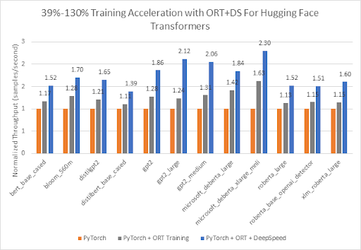

# Optimum + ONNX Runtime: Easier, Faster training for your Hugging Face models

<div class="blog-metadata">
    <small>Published January 24, 2023.</small>
    <a target="_blank" class="btn no-underline text-sm mb-5 font-sans" href="https://github.com/huggingface/blog/blob/main/optimum-onnxruntime-training.md">
        Update on GitHub
    </a>
</div>

<div class="author-card">
    <a href="/Jingya">
        
        <div class="bfc">
            <code>Jingya</code>
            <span class="fullname">Jingya Huang</span>
        </div>
    </a>
    <a href="https://techcommunity.microsoft.com/t5/user/viewprofilepage/user-id/1099824#profile">
        
        <div class="bfc">
            <code>Kshama</code>
            <span class="fullname">Kshama Pawar</span>
            <span class="bg-gray-100 dark:bg-gray-700 rounded px-1 text-gray-600 text-sm font-mono">guest</span>
        </div>
    </a>
    <a href="https://github.com/askhade">
        
        <div class="bfc">
            <code>Ashwini</code>
            <span class="fullname">Ashwini Khade</span>
            <span class="bg-gray-100 dark:bg-gray-700 rounded px-1 text-gray-600 text-sm font-mono">guest</span>
        </div>
    </a>
</div>

## Introduction

Transformer based models in language, vision and speech are getting larger to support complex multi-modal use cases for the end customer. Increasing model sizes directly impact the resources needed to train these models and scale them as the size increases. Hugging Face and Microsoft’s ONNX Runtime teams are working together to build advancements in finetuning large Language, Speech and Vision models. Hugging Face’s [Optimum library](https://github.com/huggingface/optimum), through its integration with ONNX Runtime for training, provides an open solution to __improve training times by 35% or more__ for many popular Hugging Face models. We present details of both Hugging Face Optimum and the ONNX Runtime Training ecosystem, with performance numbers highlighting the benefits of using the Optimum library.

## Performance results

The chart below shows impressive acceleration __from 39% to 130%__ for Hugging Face models with Optimum when __using ONNX Runtime and DeepSpeed ZeRO Stage 1__ for training. The performance measurements were done on selected Hugging Face models with PyTorch as the baseline run, only ONNX Runtime for training as the second run, and ONNX Runtime + DeepSpeed ZeRO Stage 1 as the final run, showing maximum gains. The Optimizer used for the baseline PyTorch runs is the AdamW optimizer and the ORT Training runs use the Fused Adam Optimizer. The runs were performed on a single Nvidia A100 node with 8 GPUs.

<figure class="image table text-center m-0 w-full">
  
</figure>

Additional details on configuration settings to turn on Optimum for training acceleration can be found [here](https://huggingface.co/docs/optimum/onnxruntime/usage_guides/trainer). The version information used for these runs is as follows:
```
PyTorch: 1.14.0.dev20221103+cu116; ORT: 1.14.0.dev20221103001+cu116; DeepSpeed: 0.6.6; HuggingFace: 4.24.0.dev0; Optimum: 1.4.1.dev0; Cuda: 11.6.2
```

## Optimum Library

Hugging Face is a fast-growing open community and platform aiming to democratize good machine learning. We extended modalities from NLP to audio and vision, and now cover use cases across Machine Learning to meet our community's needs following the success of the [Transformers library](https://huggingface.co/docs/transformers/index). Now on [Hugging Face Hub](https://huggingface.co/models), there are more than 120K free and accessible model checkpoints for various machine learning tasks, 18K datasets, and 20K ML demo apps. However, scaling transformer models into production is still a challenge for the industry. Despite high accuracy, training and inference of transformer-based models can be time-consuming and expensive.

To target these needs, Hugging Face built two open-sourced libraries: __Accelerate__ and __Optimum__. While [🤗 Accelerate](https://huggingface.co/docs/accelerate/index) focuses on out-of-the-box distributed training, [🤗 Optimum](https://huggingface.co/docs/optimum/index), as an extension of transformers, accelerates model training and inference by leveraging the maximum efficiency of users’ targeted hardware. Optimum integrated machine learning accelerators like ONNX Runtime and specialized hardware, so users can benefit from considerable speedup in both training and inference. Besides, Optimum seamlessly integrates other Hugging Face’s tools while inheriting the same ease of use as Transformers. Developers can easily adapt their work to achieve lower latency with less computing power.

## ONNX Runtime Training

[ONNX Runtime](https://onnxruntime.ai/) accelerates [large model training](https://onnxruntime.ai/docs/get-started/training-pytorch.html) to speed up throughput by upto 40% standalone and 130% when composed with [DeepSpeed](https://www.deepspeed.ai/tutorials/zero/) for popular HuggingFace transformer based models. ONNX Runtime is already integrated as part of Optimum and enables faster training through Hugging Face’s Optimum training framework.

ONNX Runtime Training achieves such throughput improvements via several memory and compute optimizations. The memory optimizations enable ONNX Runtime to maximize the batch size and utilize the available memory efficiently whereas the compute optimizations speed up the training time. These optimizations include, but are not limited to, efficient memory planning, kernel optimizations, multi tensor apply for Adam Optimizer (which batches the elementwise updates applied to all the model’s parameters into one or a few kernel launches), FP16 optimizer (which eliminates a lot of device to host memory copies), mixed precision training and graph optimizations like node fusions and node eliminations. ONNX Runtime Training supports both [NVIDIA](https://techcommunity.microsoft.com/t5/ai-machine-learning-blog/accelerate-pytorch-transformer-model-training-with-onnx-runtime/ba-p/2540471) and [AMD GPUs](https://cloudblogs.microsoft.com/opensource/2021/07/13/onnx-runtime-release-1-8-1-previews-support-for-accelerated-training-on-amd-gpus-with-the-amd-rocm-open-software-platform/), and offers extensibility with custom operators.

In short, it empowers AI developers to take full advantage of the ecosystem they are familiar with, like PyTorch and Hugging Face, and use acceleration from ONNX Runtime on the target device of their choice to save both time and resources.

## ONNX Runtime Training in Optimum

Optimum provides an `ORTTrainer` API which is similar to the `Trainer` in Transformers, but uses ONNX Runtime as the backend for acceleration. `ORTTrainer` is an easy-to-use API containing feature-complete training loop and evaluation loop. It supports features like hyperparameter search, mixed-precision training and distributed training with multiple GPUs. `ORTTrainer` enables AI developers to compose ONNX Runtime and other third-party acceleration techniques when training Transformers’ models, which helps accelerate the training further and gets the best out of the hardware. For example, developers can combine ONNX Runtime Training with distributed data parallel and mixed-precision training integrated in Transformers’ Trainer. Besides, `ORTTrainer` is also composable with DeepSpeed ZeRO-1, which saves memory by partitioning the optimizer states. After the pre-training or the fine-tuning is done, developers can either save the trained PyTorch model or convert it to the ONNX format with APIs that Optimum implemented for ONNX Runtime to ease the deployment for Inference. And just like `Trainer`, `ORTTrainer` has full integration with Hugging Face Hub: after the training, users can upload their model checkpoints to their Hugging Face Hub account.

So concretely, what should users do with Optimum to take advantage of the ONNX Runtime acceleration for training? If you are already using `Trainer`, you just need to adapt a few lines of code to benefit from all the improvements mentioned above. There are mainly two replacements that need to be applied. Firstly, replace `Trainer` with `ORTTrainer`, then replace `TrainingArguments` with `ORTTrainingArguments` which contains all the hyperparameters the trainer will use for training and evaluation. `ORTTrainingArguments` extends `TrainingArguments` to apply some extra arguments empowered by ONNX Runtime. For example, users can apply Fused Adam Optimizer for extra performance gain. Here is an example:

```diff
-from transformers import Trainer, TrainingArguments
+from optimum.onnxruntime import ORTTrainer, ORTTrainingArguments

# Step 1: Define training arguments
-training_args = TrainingArguments(
+training_args = ORTTrainingArguments(
    output_dir="path/to/save/folder/",
-   optim = "adamw_hf",
+   optim = "adamw_ort_fused",
    ...
)

# Step 2: Create your ONNX Runtime Trainer
-trainer = Trainer(
+trainer = ORTTrainer(
    model=model,
    args=training_args,
    train_dataset=train_dataset,
+   feature="sequence-classification",
    ...
)

# Step 3: Use ONNX Runtime for training!🤗
trainer.train()
```

## Looking Forward

The Hugging Face team is working on open sourcing more large models and lowering the barrier for users to benefit from them with acceleration tools on both training and inference. We are collaborating with the ONNX Runtime training team to bring more training optimizations to newer and larger model architectures, including Whisper and Stable Diffusion. Microsoft has also packaged its state-of-the-art training acceleration technologies in the [Azure Container for PyTorch](https://techcommunity.microsoft.com/t5/ai-machine-learning-blog/enabling-deep-learning-with-azure-container-for-pytorch-in-azure/ba-p/3650489). This is a light-weight curated environment including DeepSpeed and ONNX Runtime to improve productivity for AI developers training with PyTorch. In addition to large model training, the ONNX Runtime training team is also building new solutions for learning on the edge – training on devices that are constrained on memory and power.

## Getting Started

We invite you to check out the links below to learn more about, and get started with, Optimum ONNX Runtime Training for your Hugging Face models.

* [Optimum ONNX Runtime Training Documentation](https://huggingface.co/docs/optimum/onnxruntime/usage_guides/trainer)
* [Optimum ONNX Runtime Training Examples](https://github.com/huggingface/optimum/tree/main/examples/onnxruntime/training)
* [Optimum Github repo](https://github.com/huggingface/optimum/tree/main)
* [ONNX Runtime Training Examples](https://github.com/microsoft/onnxruntime-training-examples/)
* [ONNX Runtime Training Github repo](https://github.com/microsoft/onnxruntime/tree/main/orttraining)
* [ONNX Runtime](https://onnxruntime.ai/)
* [DeepSpeed](https://www.deepspeed.ai/) and [ZeRO](https://www.deepspeed.ai/tutorials/zero/) Tutorial
* [Azure Container for PyTorch](https://techcommunity.microsoft.com/t5/ai-machine-learning-blog/enabling-deep-learning-with-azure-container-for-pytorch-in-azure/ba-p/3650489)

---

Thanks for reading🏎! If you have any questions, feel free to reach us through [Github](https://github.com/huggingface/optimum/issues), or on the [forum](https://discuss.huggingface.co/c/optimum/). You can also connect with me on [Twitter](https://twitter.com/Jhuaplin) or [LinkedIn](https://www.linkedin.com/in/jingya-huang-96158b15b/).