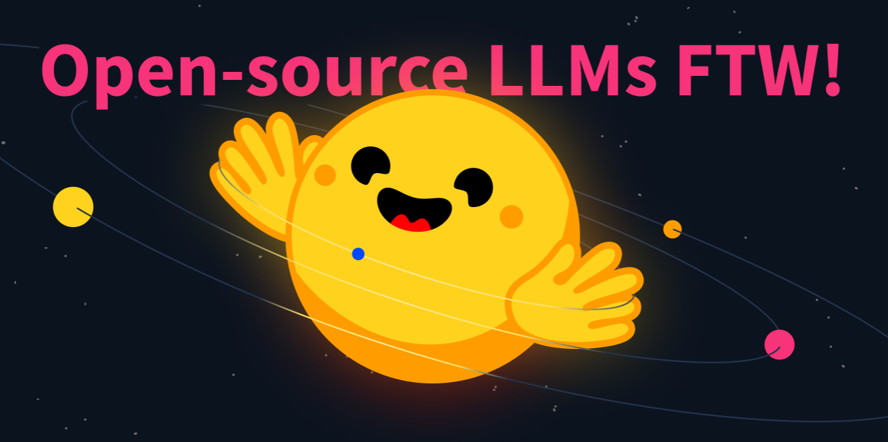

<h1>Open-Source Text Generation & LLM Ecosystem in Hugging Face</h1>

<!-- {blog_metadata} -->
<!-- {authors} -->

Text generation and conversational technologies have been around for ages. With the recent boom of text generation models like GPT-4 and open-source alternatives going mainstream, these technologies will be around, and integrated into everyday products. In this post, we will go through a brief background on how they work, the types of text generation models and the tools in Hugging Face ecosystem that enable building products using open-source LLMs, challenges, questions and how we respond to them.

## Small Background on Text Generation

Text generation models are essentially trained with the objective of completing text. Earlier challenges in working with these models were controlling both the coherence and diversity of the text through inference parameters and discriminative biases. More coherent outputs were less creative and closer to the original training data and sounded less human. Recent developments overcame these challenges, and user-friendly UIs enabled everyone to try these models out.

Having more variation of open-source text generation models enables companies to keep privacy with their data, ability to adapt models to their domains quicker, and cut costs for inference instead of relying on closed paid APIs.

Simply put, these models are firstly trained with the objective of text completion, and later optimized using a process called reinforcement learning from human feedback. This optimization is mainly made over how natural and coherent the text sounds rather than the validity of the answer. You can get more information about this process [here](https://huggingface.co/blog/rlhf). In this post, we will not go through the details of this.

One thing you need to know before we move on is fine-tuning. This is the process of taking a very large model and transferring the knowledge contained in this model to the use case, a downstream task. These tasks can come in the form of instructions. As the model size grows, the models can generalize better to the instructions that do not exist in the fine-tuning data.

As of now, there are two main types of text generation models. Models that complete the text are called Causal Language Models and can be seen below. Most known examples are GPT-3 and BLOOM. These models are trained with a bunch of texts where the latter part of the text is masked, so the model can learn to complete the given text.

All causal language models on Hugging Face Hub can be found [here](https://huggingface.co/models?pipeline_tag=text-generation).

The second type of text generation model is commonly referred to as the text-to-text generation model. These models are trained on text pairs, which can be questions and answers or instructions and responses. The most popular ones are T5 and BART (which as of now aren’t state-of-the art). Google has recently released the FLAN-T5 series of models. FLAN is a recent technique developed for instruction fine-tuning, and FLAN-T5 is essentially T5 fine-tuned using FLAN. As of now, the FLAN-T5 series of models are state-of-the-art and open-source, available on [Hugging Face Hub](https://huggingface.co/models?search=google/flan). Below you can see an illustration of how these models work.

The model GPT-3 itself is a causal language model, and the models in the backend of the ChatGPT (which is the UI for GPT-series models) are fine-tuned on prompts that can consist of conversations or instructions through RLHF. It’s an important distinction to make between these models. On Hugging Face Hub, you can find both causal language models, text-to-text models, and causal language models fine-tuned on instruction (which we’ll give links to later in this blog post).

By the time this blog post is written, three of the largest causal language models with open-source licenses are [MPT-30B by MosaicML](https://huggingface.co/mosaicml/mpt-30b), [XGen by Salesforce](https://huggingface.co/Salesforce/xgen-7b-8k-base) and [Falcon by TII UAE](https://huggingface.co/tiiuae/falcon-40b). All of them are available on Hugging Face Hub. 

Snippets to use these models are given in either the model repository, or the documentation page of that model type in Hugging Face.

## Licensing

Most of the available text generation models are either closed-source or the license limits commercial use. As of now, [MPT-30B](https://huggingface.co/mosaicml/mpt-30b) and [Falcon](https://huggingface.co/tiiuae/falcon-40b) models are fully open-source, and have open-source friendly licenses (Apache 2.0) that allow commercial use. These models are causal language models. There are versions fine-tuned on various instruction datasets on Hugging Face Hub that come in various sizes depending on your needs.

[MPT-30B-Chat](https://huggingface.co/mosaicml/mpt-30b-chat) has CC-BY-NC-SA license (for non-commercial use) and , [MPT-30B-Instruct](https://huggingface.co/mosaicml/mpt-30b-instruct) has CC-BY-SA 3.0 that can be used commercially respectively. Falcon-7B-Instruct has Apache 2.0 license that allows commercial use. Another popular model is OpenAssistant, built on LLaMa model of Meta. LLaMa has a restrictive license and due to this, OpenAssistant checkpoints built on LLaMa don’t have fully open-source licenses, but there are other OpenAssistant models built on open-source models like [Falcon](https://huggingface.co/models?search=openassistant/falcon) or [pythia](https://huggingface.co/models?search=openassistant/pythia) that can be used. [XGen fine-tuned on instruction](https://huggingface.co/Salesforce/xgen-7b-8k-inst) has a restrictive license that only allows research use.

Some of the existing instruction datasets are either crowd-sourced or use outputs of existing models (e.g., the models behind ChatGPT). ALPACA dataset created by Stanford is created through the outputs of models behind ChatGPT, which OpenAI prohibits using for training models. Moreover, there are various crowd-sourced instruction datasets with open-source licenses, like [oasst1](https://huggingface.co/datasets/OpenAssistant/oasst1) (created by thousands of people voluntarily!) or [databricks/databricks-dolly-15k](https://huggingface.co/datasets/databricks/databricks-dolly-15k). Models fine-tuned on these datasets can be distributed.

### How can you use these models?

Response time and latency for concurrent users are a big challenge for serving these large models. To tackle this problem, Hugging Face has released [text-generation-inference](https://github.com/huggingface/text-generation-inference) (TGI), an open-source serving solution for large language models, built on Rust, Python and gRPc.

TGI currently powers [HuggingChat](https://huggingface.co/chat/), Hugging FAce's chat UI for large language models. This service currently uses OpenAssistant as the backend model. You can chat as much as you want with HuggingChat, and enable the search feature for validated responses. You can also give feedback to each response for model authors to train better models. The UI of HuggingChat is also [open-sourced](https://github.com/huggingface/chat-ui), and we are working on more features for HuggingChat to allow more functions, like generating images inside the chat.

### How to find the best model?

Hugging Face hosts an LLM leaderboard [here](https://huggingface.co/spaces/HuggingFaceH4/open_llm_leaderboard). This leaderboard is created by people uploading models, and metrics that evaluate text generation task are calculated on Hugging Face’s clusters and later added to the leaderboard. If you can’t find the language or domain you’re looking for, you can filter them [here](https://huggingface.co/models?pipeline_tag=text-generation&sort=downloads).

### Models created with love by Hugging Face with BigScience and BigCode

Hugging Face has two main large language models, [BLOOM](https://huggingface.co/bigscience/bloom) 🌸 and [StarCoder](https://huggingface.co/bigcode/starcoder) 🌟. StarCoder is a causal language model trained on code from GitHub (with 80+ programming languages 🤯), it’s not fine-tuned on instructions and thus, it serves more as a coding assistant to complete a given code, e.g., translate Python to C++, explain concepts (what’s recursion) or act as a terminal. You can try all of the StarCoder checkpoints [in this application](https://huggingface.co/spaces/bigcode/bigcode-playground). It also comes with a [VSCode extension](https://marketplace.visualstudio.com/items?itemName=HuggingFace.huggingface-vscode).

BLOOM is a causal language model trained on 46 languages and 13 programming languages. It is the first open-source model to have more parameters than GPT-3. You can find available checkpoints in [BLOOM documentation](https://huggingface.co/docs/transformers/model_doc/bloom).

### Parameter Efficient Fine Tuning (PEFT)

If you’d like to fine-tune one of the existing large models on your own instruction dataset, it is nearly impossible to do so on consumer hardware and later deploy them (since the instruction models are same size as original checkpoints that are used for fine-tuning). [PEFT](https://github.com/huggingface/peft) is a library that allows you to fine-tune smaller part of the parameters for more efficiency. With PEFT, you can do low rank adaptation (LoRA), prefix tuning, prompt tuning and p-tuning.

You can check out further resources for more information on text generation.

**Further Resources**
- AWS has released TGI based LLM deployment deep learning containers called LLM Inference Containers, read about them [here](https://aws.amazon.com/tr/blogs/machine-learning/announcing-the-launch-of-new-hugging-face-llm-inference-containers-on-amazon-sagemaker/).
- [Text Generation task page](https://huggingface.co/tasks/text-generation) to find out more about the task itself.
- PEFT announcement [blog post](https://huggingface.co/blog/peft).