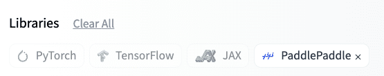
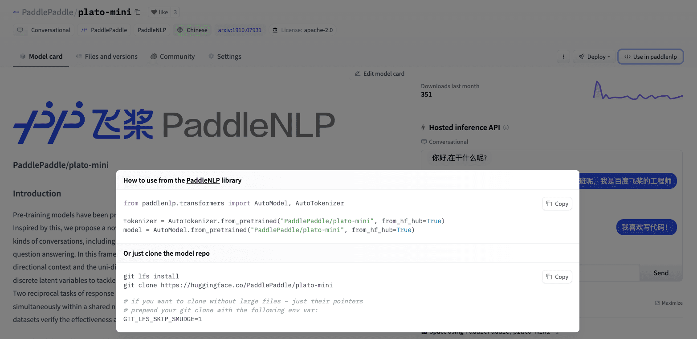

# Welcome PaddlePaddle to the Hugging Face Hub

<div class="blog-metadata">
    <small>Published January 02, 2023.</small>
    <a target="_blank" class="btn no-underline text-sm mb-5 font-sans" href="https://github.com/huggingface/blog/blob/main/paddlepaddle.md">
        Update on GitHub
    </a>
</div>


We are happy to share an open-source partnership between HuggingFace and [PaddlePaddle](https://www.paddlepaddle.org.cn/en) on a shared mission to advance and democratize AI through open source!

First open-sourced by Baidu in 2016, PaddlePaddle enables developers of all skill levels to adopt and implement Deep Learning at scale. As of Q2 2022, PaddlePaddle is being used by more than 4.77 million developers and 180,000 enterprises, ranking first in terms of market share among Deep Learning platforms in China. PaddlePaddle features popular open source repositories such as the [Paddle](https://github.com/PaddlePaddle/Paddle) Deep Learning Framework, model libraries across different modalities (e.g. [PaddleOCR](https://github.com/PaddlePaddle/PaddleOCR), [PaddleDetection](https://github.com/PaddlePaddle/PaddleDetection), [PaddleNLP](https://github.com/PaddlePaddle/PaddleNLP), [PaddleSpeech](https://github.com/PaddlePaddle/PaddleSpeech)), [PaddleSlim](https://github.com/PaddlePaddle/PaddleSlim) for model compression, [FastDeploy](https://github.com/PaddlePaddle/FastDeploy) for model deployment and many more.

<这个里加一个全景图，或者别的介绍Paddle的图片？要不然有点干>

**With [PaddleNLP](https://huggingface.co/docs/hub/paddlenlp) leading the way, PaddlePaddle libraries will gradually integrate with the HuggingFace Hub.** You will soon be able to play with the full suite of awesome pre-trained PaddlePaddle models across text, image, audio, video and multi-modalities on the Hub!

## Finding PaddlePaddle Models

You can find all PaddlePaddle models on the Model Hub by with the [PaddlePaddle library tag](https://huggingface.co/models?library=paddlepaddle). 

<p align="center">
  
</p>

There is already over 60 PaddlePaddle models on the Hub. As an example, you can find our multi-task Information Extraction model series [UIE](https://huggingface.co/PaddlePaddle/uie-base), State-of-the-Art Chinese Language Model [ERNIE 3.0 model series](https://huggingface.co/PaddlePaddle/ernie-3.0-nano-zh), Document Understanding Model [Ernie-Layout](PaddlePaddle/ernie-layoutx-base-uncased) and so on.

You are also welcome to check out the [PaddlePaddle](https://huggingface.co/PaddlePaddle) org on the HuggingFace Hub. In additional to the above-mentioned models, you can also explore our Spaces, including our text-to-image [ERNIE-ViLG](https://huggingface.co/spaces/PaddlePaddle/ERNIE-ViLG), cross-modal Information Extraction engine [UIE-X](https://huggingface.co/spaces/PaddlePaddle/UIE-X) and awesome multilingual OCR toolkit [PaddleOCR](https://huggingface.co/spaces/PaddlePaddle/PaddleOCR).


## Inference API and Widgets

PaddlePaddle models are available through the [Inference API](https://huggingface.co/docs/hub/models-inference), which you can access through HTTP with cURL, Python’s requests library, or your preferred method for making network requests.


Models that supports a [task](https://huggingface.co/tasks) are equipped with an interactive widget that allows you to play with the modle directly in the browser.


## Using Existing Models

If you want to see how to load a specific model, you can click `Use in paddlenlp` (or other PaddlePaddle libraries in the future) and you will be given a working snippet that you can load it!



## Sharing Models

Depending on the PaddlePaddle library, you may be able to share your models by pushing to the Hub. For example, you can share PaddleNLP models by using the `save_to_hf_hub` method.

```python
from paddlenlp.transformers import AutoTokenizer, AutoModelForMaskedLM

tokenizer = AutoTokenizer.from_pretrained("PaddlePaddle/ernie-1.0-base-zh", from_hf_hub=True)
model = AutoModelForMaskedLM.from_pretrained("PaddlePaddle/ernie-1.0-base-zh", from_hf_hub=True)

tokenizer.save_to_hf_hub(repo_id="<my_org_name>/<my_repo_name>")
model.save_to_hf_hub(repo_id="<my_org_name>/<my_repo_name>")
```
