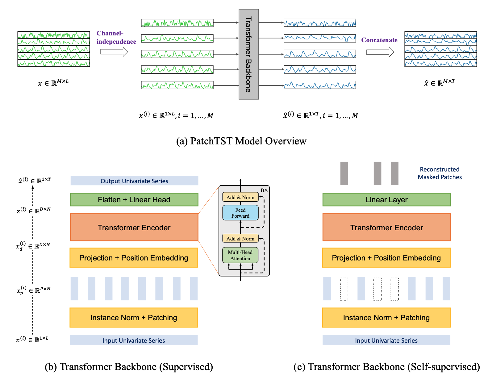

# Patch Time Series Transformer in HuggingFace - Getting Started

<script async defer src="https://unpkg.com/medium-zoom-element@0/dist/medium-zoom-element.min.js"></script>

<a target="_blank" href="https://colab.research.google.com/github/huggingface/notebooks/blob/main/examples/patch_tst.ipynb">
    
</a>

In this blog, we provide examples of how to get started with PatchTST. We first demonstrate the forecasting capability of `PatchTST` on the Electricity data. We will then demonstrate the transfer learning capability of `PatchTST` by using the previously trained model to do zero-shot forecasting on the electrical transformer (ETTh1) dataset. The zero-shot forecasting
 performance will denote the `test` performance of the model in the `target` domain, without any
 training on the target domain. Subsequently, we will do linear probing and (then) finetuning of
 the pretrained model on the `train` part of the target data, and will validate the forecasting
 performance on the `test` part of the target data.

The `PatchTST` model was proposed in A Time Series is Worth [64 Words: Long-term Forecasting with Transformers](https://huggingface.co/papers/2211.14730) by Yuqi Nie, Nam H. Nguyen, Phanwadee Sinthong, Jayant Kalagnanam and presented at ICLR 2023.


## Quick overview of PatchTST

At a high level, the model vectorizes individual time series in a batch into patches of a given size and encodes the resulting sequence of vectors via a Transformer that then outputs the prediction length forecast via an appropriate head.

The model is based on two key components: 
  1. segmentation of time series into subseries-level patches which serve as input tokens to the Transformer; 
  2.  channel-independence where each channel contains a single univariate time series that shares the same embedding and Transformer weights across all the series, i.e. a [global](https://doi.org/10.1016/j.ijforecast.2021.03.004) univariate model. 

The patching design naturally has three-fold benefit: 
 - local semantic information is retained in the embedding; 
 - computation and memory usage of the attention maps are quadratically reduced given the same look-back window via strides between patches; and 
 - the model can attend longer history via a trade-off between the patch length (input vector size) and the context length (number of sequences).
 

In addition, PatchTST has a modular design to seamlessly support masked time series pre-training as well as direct time series forecasting.

<!-- <div> </div> -->

|  |
|:--:|
|(a) PatchTST model overview where a batch of \\(M\\) time series each of length \\(L\\) are processed independently (by reshaping them into the batch dimension) via a Transformer backbone and then reshaping the resulting batch back into \\(M \\) series of prediction length \\(T\\). Each *univariate* series can be processed in a supervised fashion (b) where the patched set of vectors is used to output the full prediction length or in a self-supervised fashion (c) where masked patches are predicted. |


## Installation

This demo requires Hugging Face [`Transformers`](https://github.com/huggingface/transformers) for the model, and the IBM `tsfm` package for auxiliary data pre-processing.
We can install both by cloning the `tsfm` repository and following the below steps.

1. Clone the public IBM Time Series Foundation Model Repository [`tsfm`](https://github.com/ibm/tsfm).
    ```bash
    pip install git+https://github.com/IBM/tsfm.git
    ```
2. Install Hugging Face [`Transformers`](https://github.com/huggingface/transformers#installation)
    ```bash
    pip install transformers
    ```
3. Test it with the following commands in a `python` terminal.
    ```python
    from transformers import PatchTSTConfig
    from tsfm_public.toolkit.dataset import ForecastDFDataset
    ```

## Part 1: Forecasting on the Electricity dataset

Here we train a PatchTST model directly on the Electricity dataset (available from https://github.com/zhouhaoyi/Informer2020), and evaluate its performance.


```python
# Standard
import os

# Third Party
from transformers import (
    EarlyStoppingCallback,
    PatchTSTConfig,
    PatchTSTForPrediction,
    Trainer,
    TrainingArguments,
)
import numpy as np
import pandas as pd

# First Party
from tsfm_public.toolkit.dataset import ForecastDFDataset
from tsfm_public.toolkit.time_series_preprocessor import TimeSeriesPreprocessor
from tsfm_public.toolkit.util import select_by_index
```

### Set seed

```python
from transformers import set_seed

set_seed(2023)
```

### Load and prepare datasets

 In the next cell, please adjust the following parameters to suit your application:
 - `dataset_path`: path to local .csv file, or web address to a csv file for the data of interest. Data is loaded with pandas, so anything supported by
   `pd.read_csv` is supported: (https://pandas.pydata.org/pandas-docs/stable/reference/api/pandas.read_csv.html).
 - `timestamp_column`: column name containing timestamp information, use `None` if there is no such column.
 - `id_columns`: List of column names specifying the IDs of different time series. If no ID column exists, use `[]`.
 - `forecast_columns`: List of columns to be modeled
 - `context_length`: The amount of historical data used as input to the model. Windows of the input time series data with length equal to `context_length` will be extracted from the input dataframe. In the case of a multi-time series dataset, the context windows will be created so that they are contained within a single time series (i.e., a single ID).
 - `forecast_horizon`: Number of timestamps to forecast in the future.
 - `train_start_index`, `train_end_index`: the start and end indices in the loaded data which delineate the training data.
 - `valid_start_index`, `eval_end_index`: the start and end indices in the loaded data which delineate the validation data.
 - `test_start_index`, `eval_end_index`: the start and end indices in the loaded data which delineate the test data.
 - `patch_length`: The patch length for the `PatchTST` model. It is recommended to choose a value that evenly divides `context_length`.
 - `num_workers`: Number of CPU workers in the PyTorch dataloader.
 - `batch_size`: Batch size.

The data is first loaded into a Pandas dataframe and split into training, validation, and test parts. Then the Pandas dataframes are converted to the appropriate PyTorch dataset required for training.


```python
# The ECL data is available from https://github.com/zhouhaoyi/Informer2020?tab=readme-ov-file#data
dataset_path = "~/data/ECL.csv"
timestamp_column = "date"
id_columns = []

context_length = 512
forecast_horizon = 96
patch_length = 16
num_workers = 16  # Reduce this if you have low number of CPU cores
batch_size = 64  # Adjust according to GPU memory
```


```python
data = pd.read_csv(
    dataset_path,
    parse_dates=[timestamp_column],
)
forecast_columns = list(data.columns[1:])

# get split
num_train = int(len(data) * 0.7)
num_test = int(len(data) * 0.2)
num_valid = len(data) - num_train - num_test
border1s = [
    0,
    num_train - context_length,
    len(data) - num_test - context_length,
]
border2s = [num_train, num_train + num_valid, len(data)]

train_start_index = border1s[0]  # None indicates beginning of dataset
train_end_index = border2s[0]

# we shift the start of the evaluation period back by context length so that
# the first evaluation timestamp is immediately following the training data
valid_start_index = border1s[1]
valid_end_index = border2s[1]

test_start_index = border1s[2]
test_end_index = border2s[2]

train_data = select_by_index(
    data,
    id_columns=id_columns,
    start_index=train_start_index,
    end_index=train_end_index,
)
valid_data = select_by_index(
    data,
    id_columns=id_columns,
    start_index=valid_start_index,
    end_index=valid_end_index,
)
test_data = select_by_index(
    data,
    id_columns=id_columns,
    start_index=test_start_index,
    end_index=test_end_index,
)

time_series_preprocessor = TimeSeriesPreprocessor(
    timestamp_column=timestamp_column,
    id_columns=id_columns,
    input_columns=forecast_columns,
    output_columns=forecast_columns,
    scaling=True,
)
time_series_preprocessor = time_series_preprocessor.train(train_data)
```


```python
train_dataset = ForecastDFDataset(
    time_series_preprocessor.preprocess(train_data),
    id_columns=id_columns,
    timestamp_column="date",
    input_columns=forecast_columns,
    output_columns=forecast_columns,
    context_length=context_length,
    prediction_length=forecast_horizon,
)
valid_dataset = ForecastDFDataset(
    time_series_preprocessor.preprocess(valid_data),
    id_columns=id_columns,
    timestamp_column="date",
    input_columns=forecast_columns,
    output_columns=forecast_columns,
    context_length=context_length,
    prediction_length=forecast_horizon,
)
test_dataset = ForecastDFDataset(
    time_series_preprocessor.preprocess(test_data),
    id_columns=id_columns,
    timestamp_column="date",
    input_columns=forecast_columns,
    output_columns=forecast_columns,
    context_length=context_length,
    prediction_length=forecast_horizon,
)
```

### Configure the PatchTST model

Next, we instantiate a randomly initialized `PatchTST` model with a configuration. The settings below control the different hyperparameters related to the architecture.
  - `num_input_channels`: the number of input channels (or dimensions) in the time series data. This is
    automatically set to the number for forecast columns.
  - `context_length`: As described above, the amount of historical data used as input to the model.
  - `patch_length`: The length of the patches extracted from the context window (of length `context_length`).
  - `patch_stride`: The stride used when extracting patches from the context window.
  - `random_mask_ratio`: The fraction of input patches that are completely masked for pretraining the model.
  - `d_model`: Dimension of the transformer layers.
  - `num_attention_heads`: The number of attention heads for each attention layer in the Transformer encoder.
  - `num_hidden_layers`: The number of encoder layers.
  - `ffn_dim`: Dimension of the intermediate (often referred to as feed-forward) layer in the encoder.
  - `dropout`: Dropout probability for all fully connected layers in the encoder.
  - `head_dropout`: Dropout probability used in the head of the model.
  - `pooling_type`: Pooling of the embedding. `"mean"`, `"max"` and `None` are supported.
  - `channel_attention`: Activate the channel attention block in the Transformer to allow channels to attend to each other.
  - `scaling`: Whether to scale the input targets via "mean" scaler, "std" scaler, or no scaler if `None`. If `True`, the
    scaler is set to `"mean"`.
  - `loss`: The loss function for the model corresponding to the `distribution_output` head. For parametric
    distributions it is the negative log-likelihood (`"nll"`) and for point estimates it is the mean squared
    error `"mse"`.
  - `pre_norm`: Normalization is applied before self-attention if pre_norm is set to `True`. Otherwise, normalization is
    applied after residual block.
  - `norm_type`: Normalization at each Transformer layer. Can be `"BatchNorm"` or `"LayerNorm"`.

For full details on the parameters, we refer to the [documentation](https://huggingface.co/docs/transformers/main/en/model_doc/patchtst#transformers.PatchTSTConfig).


```python
config = PatchTSTConfig(
    num_input_channels=len(forecast_columns),
    context_length=context_length,
    patch_length=patch_length,
    patch_stride=patch_length,
    prediction_length=forecast_horizon,
    random_mask_ratio=0.4,
    d_model=128,
    num_attention_heads=16,
    num_hidden_layers=3,
    ffn_dim=256,
    dropout=0.2,
    head_dropout=0.2,
    pooling_type=None,
    channel_attention=False,
    scaling="std",
    loss="mse",
    pre_norm=True,
    norm_type="batchnorm",
)
model = PatchTSTForPrediction(config)
```

### Train model

Next, we can leverage the Hugging Face [Trainer](https://huggingface.co/docs/transformers/main_classes/trainer) class to train the model based on the direct forecasting strategy. We first define the [TrainingArguments](https://huggingface.co/docs/transformers/main_classes/trainer#transformers.TrainingArguments) which lists various hyperparameters for training such as the number of epochs, learning rate and so on.


```python
training_args = TrainingArguments(
    output_dir="./checkpoint/patchtst/electricity/pretrain/output/",
    overwrite_output_dir=True,
    # learning_rate=0.001,
    num_train_epochs=100,
    do_eval=True,
    evaluation_strategy="epoch",
    per_device_train_batch_size=batch_size,
    per_device_eval_batch_size=batch_size,
    dataloader_num_workers=num_workers,
    save_strategy="epoch",
    logging_strategy="epoch",
    save_total_limit=3,
    logging_dir="./checkpoint/patchtst/electricity/pretrain/logs/",  # Make sure to specify a logging directory
    load_best_model_at_end=True,  # Load the best model when training ends
    metric_for_best_model="eval_loss",  # Metric to monitor for early stopping
    greater_is_better=False,  # For loss
    label_names=["future_values"],
)

# Create the early stopping callback
early_stopping_callback = EarlyStoppingCallback(
    early_stopping_patience=10,  # Number of epochs with no improvement after which to stop
    early_stopping_threshold=0.0001,  # Minimum improvement required to consider as improvement
)

# define trainer
trainer = Trainer(
    model=model,
    args=training_args,
    train_dataset=train_dataset,
    eval_dataset=valid_dataset,
    callbacks=[early_stopping_callback],
    # compute_metrics=compute_metrics,
)

# pretrain
trainer.train()
```
<!--    
    <div>
      <progress value='5810' max='7000' style='width:300px; height:20px; vertical-align: middle;'></progress>
      [5810/7000 43:50 < 08:59, 2.21 it/s, Epoch 83/100]
    </div>
-->
<table border="1" class="dataframe">
<thead>
 <tr style="text-align: left;">
      <th>Epoch</th>
      <th>Training Loss</th>
      <th>Validation Loss</th>
    </tr>
  </thead>
  <tbody>
    <tr>
      <td>1</td>
      <td>0.455400</td>
      <td>0.215057</td>
    </tr>
    <tr>
      <td>2</td>
      <td>0.241000</td>
      <td>0.179336</td>
    </tr>
    <tr>
      <td>3</td>
      <td>0.209000</td>
      <td>0.158522</td>
    </tr>
<!--
    <tr>
      <td>4</td>
      <td>0.190800</td>
      <td>0.147135</td>
    </tr>
    <tr>
      <td>5</td>
      <td>0.179800</td>
      <td>0.140547</td>
    </tr>
    <tr>
      <td>6</td>
      <td>0.172800</td>
      <td>0.136634</td>
    </tr>
    <tr>
      <td>7</td>
      <td>0.167800</td>
      <td>0.133554</td>
    </tr>
    <tr>
      <td>8</td>
      <td>0.163900</td>
      <td>0.131195</td>
    </tr>
    <tr>
      <td>9</td>
      <td>0.160700</td>
      <td>0.129303</td>
    </tr>
    <tr>
      <td>10</td>
      <td>0.158000</td>
      <td>0.127299</td>
    </tr>
    <tr>
      <td>11</td>
      <td>0.155600</td>
      <td>0.126036</td>
    </tr>
    <tr>
      <td>12</td>
      <td>0.153700</td>
      <td>0.124635</td>
    </tr>
    <tr>
      <td>13</td>
      <td>0.151800</td>
      <td>0.123454</td>
    </tr>
    <tr>
      <td>14</td>
      <td>0.150200</td>
      <td>0.122605</td>
    </tr>
    <tr>
      <td>15</td>
      <td>0.148900</td>
      <td>0.121886</td>
    </tr>
    <tr>
      <td>16</td>
      <td>0.147300</td>
      <td>0.121087</td>
    </tr>
    <tr>
      <td>17</td>
      <td>0.146100</td>
      <td>0.120236</td>
    </tr>
    <tr>
      <td>18</td>
      <td>0.145000</td>
      <td>0.119824</td>
    </tr>
    <tr>
      <td>19</td>
      <td>0.143900</td>
      <td>0.119152</td>
    </tr>
    <tr>
      <td>20</td>
      <td>0.142900</td>
      <td>0.118846</td>
    </tr>
    <tr>
      <td>21</td>
      <td>0.142000</td>
      <td>0.118068</td>
    </tr>
    <tr>
      <td>22</td>
      <td>0.141100</td>
      <td>0.118113</td>
    </tr>
    <tr>
      <td>23</td>
      <td>0.140500</td>
      <td>0.117507</td>
    </tr>
    <tr>
      <td>24</td>
      <td>0.139600</td>
      <td>0.116810</td>
    </tr>
    <tr>
      <td>25</td>
      <td>0.139000</td>
      <td>0.116932</td>
    </tr>
    <tr>
      <td>26</td>
      <td>0.138500</td>
      <td>0.116615</td>
    </tr>
    <tr>
      <td>27</td>
      <td>0.137800</td>
      <td>0.116271</td>
    </tr>
    <tr>
      <td>28</td>
      <td>0.137300</td>
      <td>0.115869</td>
    </tr>
    <tr>
      <td>29</td>
      <td>0.136900</td>
      <td>0.115507</td>
    </tr>
    <tr>
      <td>30</td>
      <td>0.136500</td>
      <td>0.115528</td>
    </tr>
    <tr>
      <td>31</td>
      <td>0.136200</td>
      <td>0.115159</td>
    </tr>
    <tr>
      <td>32</td>
      <td>0.135800</td>
      <td>0.114793</td>
    </tr>
    <tr>
      <td>33</td>
      <td>0.135400</td>
      <td>0.114708</td>
    </tr>
    <tr>
      <td>34</td>
      <td>0.135000</td>
      <td>0.114543</td>
    </tr>
    <tr>
      <td>35</td>
      <td>0.134700</td>
      <td>0.114122</td>
    </tr>
    <tr>
      <td>36</td>
      <td>0.134400</td>
      <td>0.114027</td>
    </tr>
    <tr>
      <td>37</td>
      <td>0.134100</td>
      <td>0.114218</td>
    </tr>
    <tr>
      <td>38</td>
      <td>0.133900</td>
      <td>0.113932</td>
    </tr>
    <tr>
      <td>39</td>
      <td>0.133500</td>
      <td>0.113782</td>
    </tr>
    <tr>
      <td>40</td>
      <td>0.133300</td>
      <td>0.113526</td>
    </tr>
    <tr>
      <td>41</td>
      <td>0.133000</td>
      <td>0.113371</td>
    </tr>
    <tr>
      <td>42</td>
      <td>0.132800</td>
      <td>0.113198</td>
    </tr>
    <tr>
      <td>43</td>
      <td>0.132700</td>
      <td>0.113216</td>
    </tr>
    <tr>
      <td>44</td>
      <td>0.132400</td>
      <td>0.113184</td>
    </tr>
    <tr>
      <td>45</td>
      <td>0.132100</td>
      <td>0.113104</td>
    </tr>
    <tr>
      <td>46</td>
      <td>0.132100</td>
      <td>0.113357</td>
    </tr>
    <tr>
      <td>47</td>
      <td>0.131800</td>
      <td>0.112759</td>
    </tr>
    <tr>
      <td>48</td>
      <td>0.131600</td>
      <td>0.112729</td>
    </tr>
    <tr>
      <td>49</td>
      <td>0.131500</td>
      <td>0.112671</td>
    </tr>
    <tr>
      <td>50</td>
      <td>0.131300</td>
      <td>0.112952</td>
    </tr>
    <tr>
      <td>51</td>
      <td>0.131200</td>
      <td>0.112605</td>
    </tr>
    <tr>
      <td>52</td>
      <td>0.130900</td>
      <td>0.112396</td>
    </tr>
    <tr>
      <td>53</td>
      <td>0.130900</td>
      <td>0.112694</td>
    </tr>
    <tr>
      <td>54</td>
      <td>0.130700</td>
      <td>0.112293</td>
    </tr>
    <tr>
      <td>55</td>
      <td>0.130700</td>
      <td>0.112163</td>
    </tr>
    <tr>
      <td>56</td>
      <td>0.130400</td>
      <td>0.112269</td>
    </tr>
    <tr>
      <td>57</td>
      <td>0.130400</td>
      <td>0.112087</td>
    </tr>
    <tr>
      <td>58</td>
      <td>0.130100</td>
      <td>0.112125</td>
    </tr>
    <tr>
      <td>59</td>
      <td>0.130000</td>
      <td>0.111991</td>
    </tr>
    <tr>
      <td>60</td>
      <td>0.129900</td>
      <td>0.112255</td>
    </tr>
    <tr>
      <td>61</td>
      <td>0.129900</td>
      <td>0.111913</td>
    </tr>
    <tr>
      <td>62</td>
      <td>0.129600</td>
      <td>0.111966</td>
    </tr>
    <tr>
      <td>63</td>
      <td>0.129600</td>
      <td>0.112031</td>
    </tr>
    <tr>
      <td>64</td>
      <td>0.129500</td>
      <td>0.111876</td>
    </tr>
    <tr>
      <td>65</td>
      <td>0.129400</td>
      <td>0.111759</td>
    </tr>
    <tr>
      <td>66</td>
      <td>0.129300</td>
      <td>0.111742</td>
    </tr>
    <tr>
      <td>67</td>
      <td>0.129100</td>
      <td>0.111626</td>
    </tr>
    <tr>
      <td>68</td>
      <td>0.129000</td>
      <td>0.111595</td>
    </tr>
    <tr>
      <td>69</td>
      <td>0.129000</td>
      <td>0.111605</td>
    </tr>
    <tr>
      <td>70</td>
      <td>0.128900</td>
      <td>0.111627</td>
    </tr>
    <tr>
      <td>71</td>
      <td>0.128900</td>
      <td>0.111542</td>
    </tr>
    <tr>
      <td>72</td>
      <td>0.128700</td>
      <td>0.112140</td>
    </tr>
    <tr>
      <td>73</td>
      <td>0.128700</td>
      <td>0.111440</td>
    </tr>
    <tr>
      <td>74</td>
      <td>0.128700</td>
      <td>0.111474</td>
    </tr>
    <tr>
      <td>75</td>
      <td>0.128500</td>
      <td>0.111478</td>
    </tr>
    <tr>
      <td>76</td>
      <td>0.128500</td>
      <td>0.111569</td>
    </tr>
    <tr>
      <td>77</td>
      <td>0.128400</td>
      <td>0.111468</td>
    </tr>
    <tr>
      <td>78</td>
      <td>0.128200</td>
      <td>0.111457</td>
    </tr>
    <tr>
      <td>79</td>
      <td>0.128300</td>
      <td>0.111344</td>
    </tr>
    <tr>
      <td>80</td>
      <td>0.128200</td>
      <td>0.111425</td>
    </tr>
    <tr>
      <td>81</td>
      <td>0.128200</td>
      <td>0.111350</td>
    </tr>
    <tr>
      <td>82</td>
      <td>0.128000</td>
      <td>0.111294</td>
    </tr>
-->
  <tr><td>...</td><td>...</td><td>...</td></tr>
    <tr>
      <td>83</td>
      <td>0.128000</td>
      <td>0.111213</td>
    </tr>
  </tbody>
</table><p>


<!--
    TrainOutput(global_step=5810, training_loss=0.1434877689446927, metrics={'train_runtime': 2644.2883, 'train_samples_per_second': 673.338, 'train_steps_per_second': 2.647, 'total_flos': 1.1614959858946867e+18, 'train_loss': 0.1434877689446927, 'epoch': 83.0})
-->


### Evaluate the model on the test set of the source domain

Next, we can leverage `trainer.evaluate()` to calculate test metrics. While this is not the target metric to judge in this task, it provides a reasonable check that the pretrained model has trained properly.
Note that the training and evaluation loss for PatchTST is the Mean Squared Error (MSE) loss. Hence, we do not separately compute the MSE metric in any of the following evaluation experiments.


```python
results = trainer.evaluate(test_dataset)
print("Test result:")
print(results)

>>> Test result:
    {'eval_loss': 0.1316315233707428, 'eval_runtime': 5.8077, 'eval_samples_per_second': 889.332, 'eval_steps_per_second': 3.616, 'epoch': 83.0}
```

The MSE of `0.131` is very close to the value reported for the Electricity dataset in the original PatchTST paper.

### Save model


```python
save_dir = "patchtst/electricity/model/pretrain/"
os.makedirs(save_dir, exist_ok=True)
trainer.save_model(save_dir)
```

## Part 2: Transfer Learning from Electricity to ETTh1


In this section, we will demonstrate the transfer learning capability of the `PatchTST` model.
We use the model pre-trained on the Electricity dataset to do zero-shot forecasting on the ETTh1 dataset.


By Transfer Learning, we mean that we first pretrain the model for a forecasting task on a `source` dataset (which we did above on the `Electricity` dataset). Then, we will use the pretrained model for zero-shot forecasting on a `target` dataset. By zero-shot, we mean that we test the performance in the `target` domain without any additional training. We hope that the model gained enough knowledge from pretraining which can be transferred to a different dataset. 
Subsequently, we will do linear probing and (then) finetuning of the pretrained model on the `train` split of the target data and will validate the forecasting performance on the `test` split of the target data. In this example, the source dataset is the `Electricity` dataset and the target dataset is ETTh1.

### Transfer learning on ETTh1 data. 
All evaluations are on the `test` part of the `ETTh1` data.

Step 1: Directly evaluate the electricity-pretrained model. This is the zero-shot performance. 

Step 2: Evaluate after doing linear probing. 

Step 3: Evaluate after doing full finetuning. 

### Load ETTh dataset

Below, we load the `ETTh1` dataset as a Pandas dataframe. Next, we create 3 splits for training, validation, and testing. We then leverage the `TimeSeriesPreprocessor` class to prepare each split for the model.


```python
dataset = "ETTh1"
```


```python
print(f"Loading target dataset: {dataset}")
dataset_path = f"https://raw.githubusercontent.com/zhouhaoyi/ETDataset/main/ETT-small/{dataset}.csv"
timestamp_column = "date"
id_columns = []
forecast_columns = ["HUFL", "HULL", "MUFL", "MULL", "LUFL", "LULL", "OT"]
train_start_index = None  # None indicates beginning of dataset
train_end_index = 12 * 30 * 24

# we shift the start of the evaluation period back by context length so that
# the first evaluation timestamp is immediately following the training data
valid_start_index = 12 * 30 * 24 - context_length
valid_end_index = 12 * 30 * 24 + 4 * 30 * 24

test_start_index = 12 * 30 * 24 + 4 * 30 * 24 - context_length
test_end_index = 12 * 30 * 24 + 8 * 30 * 24

>>> Loading target dataset: ETTh1
```


```python
data = pd.read_csv(
    dataset_path,
    parse_dates=[timestamp_column],
)

train_data = select_by_index(
    data,
    id_columns=id_columns,
    start_index=train_start_index,
    end_index=train_end_index,
)
valid_data = select_by_index(
    data,
    id_columns=id_columns,
    start_index=valid_start_index,
    end_index=valid_end_index,
)
test_data = select_by_index(
    data,
    id_columns=id_columns,
    start_index=test_start_index,
    end_index=test_end_index,
)

time_series_preprocessor = TimeSeriesPreprocessor(
    timestamp_column=timestamp_column,
    id_columns=id_columns,
    input_columns=forecast_columns,
    output_columns=forecast_columns,
    scaling=True,
)
time_series_preprocessor = time_series_preprocessor.train(train_data)
```


```python
train_dataset = ForecastDFDataset(
    time_series_preprocessor.preprocess(train_data),
    id_columns=id_columns,
    input_columns=forecast_columns,
    output_columns=forecast_columns,
    context_length=context_length,
    prediction_length=forecast_horizon,
)
valid_dataset = ForecastDFDataset(
    time_series_preprocessor.preprocess(valid_data),
    id_columns=id_columns,
    input_columns=forecast_columns,
    output_columns=forecast_columns,
    context_length=context_length,
    prediction_length=forecast_horizon,
)
test_dataset = ForecastDFDataset(
    time_series_preprocessor.preprocess(test_data),
    id_columns=id_columns,
    input_columns=forecast_columns,
    output_columns=forecast_columns,
    context_length=context_length,
    prediction_length=forecast_horizon,
)
```

### Zero-shot forecasting on ETTH

As we are going to test forecasting performance out-of-the-box, we load the model which we pretrained above.


```python
finetune_forecast_model = PatchTSTForPrediction.from_pretrained(
    "patchtst/electricity/model/pretrain/",
    num_input_channels=len(forecast_columns),
    head_dropout=0.7,
)
```


```python
finetune_forecast_args = TrainingArguments(
    output_dir="./checkpoint/patchtst/transfer/finetune/output/",
    overwrite_output_dir=True,
    learning_rate=0.0001,
    num_train_epochs=100,
    do_eval=True,
    evaluation_strategy="epoch",
    per_device_train_batch_size=batch_size,
    per_device_eval_batch_size=batch_size,
    dataloader_num_workers=num_workers,
    report_to="tensorboard",
    save_strategy="epoch",
    logging_strategy="epoch",
    save_total_limit=3,
    logging_dir="./checkpoint/patchtst/transfer/finetune/logs/",  # Make sure to specify a logging directory
    load_best_model_at_end=True,  # Load the best model when training ends
    metric_for_best_model="eval_loss",  # Metric to monitor for early stopping
    greater_is_better=False,  # For loss
    label_names=["future_values"],
)

# Create a new early stopping callback with faster convergence properties
early_stopping_callback = EarlyStoppingCallback(
    early_stopping_patience=10,  # Number of epochs with no improvement after which to stop
    early_stopping_threshold=0.001,  # Minimum improvement required to consider as improvement
)

finetune_forecast_trainer = Trainer(
    model=finetune_forecast_model,
    args=finetune_forecast_args,
    train_dataset=train_dataset,
    eval_dataset=valid_dataset,
    callbacks=[early_stopping_callback],
)

print("\n\nDoing zero-shot forecasting on target data")
result = finetune_forecast_trainer.evaluate(test_dataset)
print("Target data zero-shot forecasting result:")
print(result)

>>> Doing zero-shot forecasting on target data

    Target data zero-shot forecasting result:
    {'eval_loss': 0.3728715181350708, 'eval_runtime': 0.95, 'eval_samples_per_second': 2931.527, 'eval_steps_per_second': 11.579}
```


As can be seen, with a zero-shot forecasting approach we obtain an MSE of 0.370 which is near to the state-of-the-art result in the original PatchTST paper.

Next, let's see how we can do by performing linear probing, which involves training a linear layer on top of a frozen pre-trained model. Linear probing is often done to test the performance of features of a pretrained model.

### Linear probing on ETTh1 

We can do a quick linear probing on the `train` part of the target data to see any possible `test` performance improvement.


```python
# Freeze the backbone of the model
for param in finetune_forecast_trainer.model.model.parameters():
    param.requires_grad = False

print("\n\nLinear probing on the target data")
finetune_forecast_trainer.train()
print("Evaluating")
result = finetune_forecast_trainer.evaluate(test_dataset)
print("Target data head/linear probing result:")
print(result)

>>> Linear probing on the target data
```
<!--
    <div>

      <progress value='576' max='3200' style='width:300px; height:20px; vertical-align: middle;'></progress>
      [ 576/3200 00:50 < 03:51, 11.33 it/s, Epoch 18/100]
    </div>
-->
 <table border="1" class="dataframe">
 <thead>
 <tr style="text-align: left;">
      <th>Epoch</th>
      <th>Training Loss</th>
      <th>Validation Loss</th>
    </tr>
  </thead>
  <tbody>
    <tr>
      <td>1</td>
      <td>0.384600</td>
      <td>0.688319</td>
    </tr>
    <tr>
      <td>2</td>
      <td>0.374200</td>
      <td>0.678159</td>
    </tr>
    <tr>
      <td>3</td>
      <td>0.368400</td>
      <td>0.667633</td>
    </tr>
    <tr><td>...</td><td>...</td><td>...</td></tr>
<!--
    <tr>
      <td>4</td>
      <td>0.363400</td>
      <td>0.662551</td>
    </tr>
    <tr>
      <td>5</td>
      <td>0.360100</td>
      <td>0.660060</td>
    </tr>
    <tr>
      <td>6</td>
      <td>0.356400</td>
      <td>0.658128</td>
    </tr>
    <tr>
      <td>7</td>
      <td>0.355100</td>
      <td>0.656811</td>
    </tr>
    <tr>
      <td>8</td>
      <td>0.352400</td>
      <td>0.655359</td>
    </tr>
    <tr>
      <td>9</td>
      <td>0.350900</td>
      <td>0.655416</td>
    </tr>
    <tr>
      <td>10</td>
      <td>0.349100</td>
      <td>0.654475</td>
    </tr>
    <tr>
      <td>11</td>
      <td>0.347200</td>
      <td>0.653585</td>
    </tr>
    <tr>
      <td>12</td>
      <td>0.346000</td>
      <td>0.654434</td>
    </tr>
    <tr>
      <td>13</td>
      <td>0.345600</td>
      <td>0.654141</td>
    </tr>
    <tr>
      <td>14</td>
      <td>0.344900</td>
      <td>0.656340</td>
    </tr>
    <tr>
      <td>15</td>
      <td>0.344000</td>
      <td>0.655699</td>
    </tr>
    <tr>
      <td>16</td>
      <td>0.342100</td>
      <td>0.655356</td>
    </tr>
    <tr>
      <td>17</td>
      <td>0.341500</td>
      <td>0.656582</td>
    </tr>
    <tr>
      <td>18</td>
      <td>0.342700</td>
      <td>0.655651</td>
    </tr>
-->
  </tbody>
</table><p>

```
>>> Evaluating

    Target data head/linear probing result:
    {'eval_loss': 0.35652095079421997, 'eval_runtime': 1.1537, 'eval_samples_per_second': 2413.986, 'eval_steps_per_second': 9.535, 'epoch': 18.0}
```


As can be seen, by only training a simple linear layer on top of the frozen backbone, the MSE decreased from 0.370 to 0.357, beating the originally reported results!


```python
save_dir = f"patchtst/electricity/model/transfer/{dataset}/model/linear_probe/"
os.makedirs(save_dir, exist_ok=True)
finetune_forecast_trainer.save_model(save_dir)

save_dir = f"patchtst/electricity/model/transfer/{dataset}/preprocessor/"
os.makedirs(save_dir, exist_ok=True)
time_series_preprocessor = time_series_preprocessor.save_pretrained(save_dir)
```

Finally, let's see if we can get additional improvements by doing a full fine-tune of the model.

### Full fine-tune on ETTh1

We can do a full model fine-tune (instead of probing the last linear layer as shown above) on the `train` part of the target data to see a possible `test` performance improvement. The code looks similar to the linear probing task above, except that we are not freezing any parameters.


```python
# Reload the model
finetune_forecast_model = PatchTSTForPrediction.from_pretrained(
    "patchtst/electricity/model/pretrain/",
    num_input_channels=len(forecast_columns),
    dropout=0.7,
    head_dropout=0.7,
)
finetune_forecast_trainer = Trainer(
    model=finetune_forecast_model,
    args=finetune_forecast_args,
    train_dataset=train_dataset,
    eval_dataset=valid_dataset,
    callbacks=[early_stopping_callback],
)
print("\n\nFinetuning on the target data")
finetune_forecast_trainer.train()
print("Evaluating")
result = finetune_forecast_trainer.evaluate(test_dataset)
print("Target data full finetune result:")
print(result)

>>> Finetuning on the target data
```

<!--
    <div>

      <progress value='384' max='3200' style='width:300px; height:20px; vertical-align: middle;'></progress>
      [ 384/3200 00:35 < 04:25, 10.62 it/s, Epoch 12/100]
    </div>
-->
 <table border="1" class="dataframe">
 <thead>
 <tr style="text-align: left;">
      <th>Epoch</th>
      <th>Training Loss</th>
      <th>Validation Loss</th>
    </tr>
  </thead>
  <tbody>
    <tr>
      <td>1</td>
      <td>0.348600</td>
      <td>0.709915</td>
    </tr>
    <tr>
      <td>2</td>
      <td>0.328800</td>
      <td>0.706537</td>
    </tr>
    <tr>
      <td>3</td>
      <td>0.319700</td>
      <td>0.741892</td>
    </tr>
    <tr>
      <td>...</td>
      <td>...</td>
      <td>...</td>
    </tr>
<!--
    <tr>
      <td>4</td>
      <td>0.312900</td>
      <td>0.727837</td>
    </tr>
    <tr>
      <td>5</td>
      <td>0.306700</td>
      <td>0.774511</td>
    </tr>
    <tr>
      <td>6</td>
      <td>0.300300</td>
      <td>0.786199</td>
    </tr>
    <tr>
      <td>7</td>
      <td>0.296600</td>
      <td>0.821851</td>
    </tr>
    <tr>
      <td>8</td>
      <td>0.292000</td>
      <td>0.838177</td>
    </tr>
    <tr>
      <td>9</td>
      <td>0.288800</td>
      <td>0.832112</td>
    </tr>
    <tr>
      <td>10</td>
      <td>0.285100</td>
      <td>0.800559</td>
    </tr>
    <tr>
      <td>11</td>
      <td>0.281200</td>
      <td>0.860003</td>
    </tr>
    <tr>
      <td>12</td>
      <td>0.277200</td>
      <td>0.855923</td>
    </tr>
-->
  </tbody>
</table><p>

```
>>> Evaluating

    Target data full finetune result:
    {'eval_loss': 0.354232519865036, 'eval_runtime': 1.0715, 'eval_samples_per_second': 2599.18, 'eval_steps_per_second': 10.266, 'epoch': 12.0}
```

In this case, there is only a small improvement on the ETTh1 dataset with full fine-tuning. For other datasets there may be more substantial improvements. Let's save the model anyway.


```python
save_dir = f"patchtst/electricity/model/transfer/{dataset}/model/fine_tuning/"
os.makedirs(save_dir, exist_ok=True)
finetune_forecast_trainer.save_model(save_dir)
```

## Summary

In this blog, we presented a step-by-step guide on training PatchTST for tasks related to forecasting and transfer learning, demonstrating various approaches for fine-tuning. We intend to facilitate easy integration of the PatchTST HF model for your forecasting use cases, and we hope that this content serves as a useful resource to expedite the adoption of PatchTST. Thank you for tuning in to our blog, and we hope you find this information beneficial for your projects.
