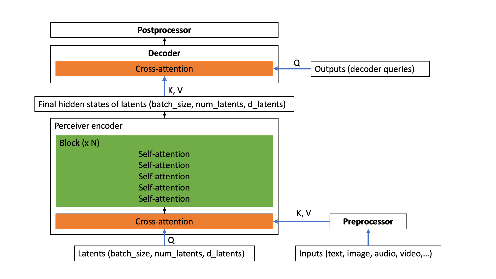
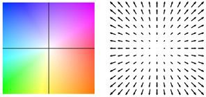
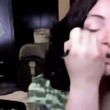
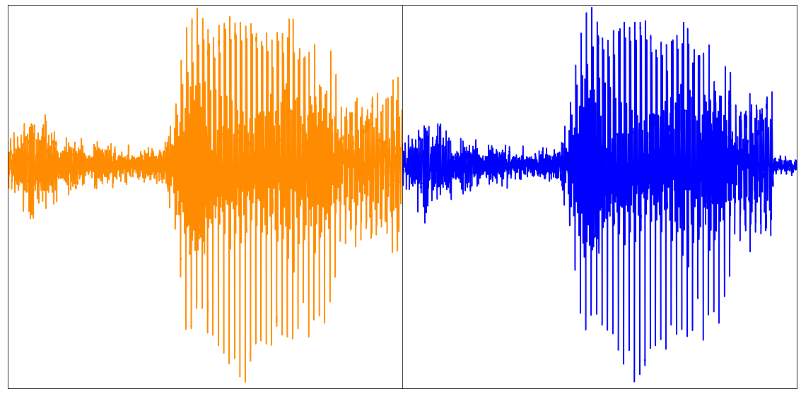
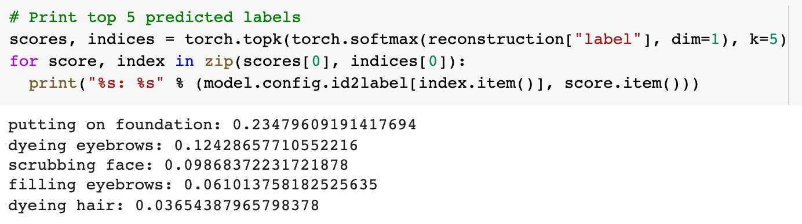

<h1>Perceiver IO: a scalable, fully-attentional model that works on any modality</h1>

<!-- {blog_metadata} -->
<!-- {authors} -->

### TLDR

We've added [Perceiver IO](https://huggingface.co/docs/transformers/model_doc/perceiver) to Transformers, the first Transformer-based neural network that works on all kinds of modalities (text, images, audio, video, point clouds,...) and combinations thereof. Take a look at the following Spaces to view some examples:
- predicting [optical flow](https://huggingface.co/spaces/nielsr/perceiver-optical-flow) between images
- [classifying images](https://huggingface.co/spaces/nielsr/perceiver-image-classification).

We also provide [several notebooks](https://github.com/NielsRogge/Transformers-Tutorials/tree/master/Perceiver).

Below, you can find a technical explanation  of the model.

### Introduction

The [Transformer](https://arxiv.org/abs/1706.03762), originally introduced by 
Vaswani et al. in 2017, caused a revolution in the AI community, initially improving
state-of-the-art (SOTA) results in machine translation. In 2018, [BERT](https://arxiv.org/abs/1810.04805)
was released, a Transformer encoder-only model that crushed the benchmarks of natural language
processing (NLP), most famously the [GLUE benchmark](https://gluebenchmark.com/). 

Not long after that, AI researchers started to apply the idea of BERT to other domains. To name a few examples:

* [Wav2Vec2](https://huggingface.co/docs/transformers/model_doc/wav2vec2) by Facebook AI illustrated that the architecture could be extended to audio
* the [Vision Transformer (ViT)](https://huggingface.co/docs/transformers/model_doc/vit) by Google AI showed that the architecture works really well for vision
* most recently the [Video Vision transformer (ViViT)](https://arxiv.org/abs/2103.15691), also by Google AI, applied the architecture to video. 

In all of these domains, state-of-the-art results were improved dramatically, thanks to the combination of this powerful architecture with large-scale pre-training.

However, there's an important limitation to the architecture of the Transformer: due to its [self-attention mechanism](https://jalammar.github.io/illustrated-transformer/), it scales [very poorly](https://arxiv.org/abs/2009.06732v2) in both compute and memory. In every layer, all inputs are used to produce queries and keys, for which a pairwise dot product is computed. Hence, it is not possible to apply self-attention on high-dimensional data without some form of preprocessing. Wav2Vec2, for example, solves this by employing a feature encoder to turn a raw waveform into a sequence of time-based features. The Vision Transformer (ViT) divides an image into a sequence of non-overlapping patches, which serve as "tokens". The Video Vision Transformer (ViViT) extracts non-overlapping, spatio-temporal
“tubes” from a video, which serve as "tokens". To make the Transformer work on a particular modality, one typically discretizes it to a sequence of tokens to make it work.

## The Perceiver

The [Perceiver](https://arxiv.org/abs/2103.03206) aims to solve this limitation by employing the self-attention mechanism on a set of latent variables, rather than on the inputs. The `inputs` (which could be text, image, audio, video) are only used for doing cross-attention with the latents. This has the advantage that the bulk of compute happens in a latent space, where compute is cheap (one typically uses 256 or 512 latents). The resulting architecture has no quadratic dependence on the input size: the Transformer encoder only depends linearly on the input size, while latent attention is independent of it. In a follow-up paper, called [Perceiver IO](https://arxiv.org/abs/2107.14795), the authors extend this idea to let the Perceiver also handle arbitrary outputs. The idea is similar: one only uses the outputs for doing cross-attention with the latents. Note that I'll use the terms "Perceiver" and "Perceiver IO" interchangeably to refer to the Perceiver IO model throughout this blog post.

In the following section, we look in a bit more detail at how Perceiver IO actually works by going over its implementation in [HuggingFace Transformers](https://github.com/huggingface/transformers), a popular library that initially implemented Transformer-based models for NLP, but is now starting to implement them for other domains as well. In the sections below, we explain in detail  - in terms of shapes of tensors - how the Perceiver actually pre and post processes modalities of any kind.

All Perceiver variants in HuggingFace Transformers are based on the `PerceiverModel` class. To initialize a `PerceiverModel`, one can provide 3 additional instances to the model:
- a preprocessor
- a decoder
- a postprocessor.

Note that each of these are optional. A `preprocessor` is only required in case one hasn't already embedded the `inputs` (such as text, image, audio, video) themselves. A `decoder` is only required in case one wants to decode the output of the Perceiver encoder (i.e. the last hidden states of the latents) into something more useful, such as classification logits or optical flow. A `postprocessor` is only required in case one wants to turn the output of the decoder into a specific feature (this is only required when doing auto-encoding, as we will see further). An overview of the architecture is depicted below. 



<small>The Perceiver architecture.</small>

In other words, the `inputs` (which could be any modality, or a combination thereof) are first optionally preprocessed using a `preprocessor`. Next, the preprocessed inputs perform a cross-attention operation with the latent variables of the Perceiver encoder. In this operation, the latent variables produce queries (Q), while the preprocessed inputs produce keys and values (KV). After this operation, the Perceiver encoder employs a (repeatable) block of self-attention layers to update the embeddings of the latents. The encoder will finally produce a tensor of shape (batch_size, num_latents, d_latents), containing the last hidden states of the latents. Next, there's an optional `decoder`, which can be used to decode the final hidden states of the latents into something more useful, such as classification logits. This is done by performing a cross-attention operation, in which trainable embeddings are used to produce queries (Q), while the latents are used to produce keys and values (KV). Finally, there's an optional `postprocessor`, which can be used to postprocess the decoder outputs to specific features.

Let's start off by showing how the Perceiver is implemented to work on text.

## Perceiver for text

Suppose that one wants to apply the Perceiver to perform text classification. As the memory and time requirements of the Perceiver's self-attention mechanism don't depend on the size of the inputs, one can directly provide raw UTF-8 bytes to the model. This is beneficial, as familar Transformer-based models (like [BERT](https://arxiv.org/abs/1810.04805) and [RoBERTa](https://arxiv.org/abs/1907.11692)) all employ some form of explicit tokenization, such as [WordPiece](https://research.google/pubs/pub37842/), [BPE](https://arxiv.org/abs/1508.07909) or [SentencePiece](https://arxiv.org/abs/1808.06226), which [may be harmful](https://arxiv.org/abs/2004.03720). For a fair comparison to BERT (which uses a sequence length of 512 subword tokens), the authors used input sequences of 2048 bytes. Let's say one also adds a batch dimension, then the `inputs` to the model are of shape (batch_size, 2048). The `inputs` contain the byte IDs (similar to the `input_ids` of BERT) for a single piece of text. One can use `PerceiverTokenizer` to turn a text into a sequence of byte IDs, padded up to a length of 2048:

``` python
from transformers import PerceiverTokenizer

tokenizer = PerceiverTokenizer.from_pretrained("deepmind/language-perceiver")

text = "hello world"

inputs = tokenizer(text, padding="max_length", return_tensors="pt").input_ids
```

In this case, one provides `PerceiverTextPreprocessor` as preprocessor to the model, which will take care of embedding the `inputs` (i.e. turn each byte ID into a corresponding vector), as well as adding absolute position embeddings. As decoder, one provides `PerceiverClassificationDecoder` to the model (which will turn the last hidden states of the latents into classification logits). No postprocessor is required. In other words, a Perceiver model for text classification (which is called `PerceiverForSequenceClassification` in HuggingFace Transformers) is implemented as follows:

``` python
from torch import nn
from transformers import PerceiverModel
from transformers.models.perceiver.modeling_perceiver import PerceiverTextPreprocessor, PerceiverClassificationDecoder

class PerceiverForSequenceClassification(nn.Module):
    def __init__(self, config):
        super().__init__(config)

        self.perceiver = PerceiverModel(
            config,
            input_preprocessor=PerceiverTextPreprocessor(config),
            decoder=PerceiverClassificationDecoder(
                config,
                num_channels=config.d_latents,
                trainable_position_encoding_kwargs=dict(num_channels=config.d_latents, index_dims=1),
                use_query_residual=True,
            ),
        )
```
One can already see here that the decoder is initialized with trainable position encoding arguments. Why is that? Well, let's take a look in detail at how Perceiver IO works. At initialization, `PerceiverModel` internally defines a set of latent variables, as follows:

``` python
from torch import nn

self.latents = nn.Parameter(torch.randn(config.num_latents, config.d_latents))
```

In the Perceiver IO paper, one uses 256 latents, and sets the dimensionality of the latents to 1280. If one also adds a batch dimension, the Perceiver has latents of shape (batch_size, 256, 1280). First, the preprocessor (which one provides at initialization) will take care of embedding the UTF-8 byte IDs to embedding vectors. Hence, `PerceiverTextPreprocessor` will turn the `inputs` of shape (batch_size, 2048) to a tensor of shape (batch_size, 2048, 768) - assuming that each byte ID is turned into a vector of size 768 (this is determined by the `d_model` attribute of `PerceiverConfig`).

After this, Perceiver IO applies cross-attention between the latents (which produce queries) of shape (batch_size, 256, 1280) and the preprocessed inputs (which produce keys and values) of shape (batch_size, 2048, 768). The output of this initial cross-attention operation is a tensor that has the same shape as the queries (which are the latents, in this case). In other words, the output of the cross-attention operation is of shape (batch_size, 256, 1280). 

Next, a (repeatable) block of self-attention layers is applied to update the representations of the latents. Note that these don't depend on the length of the inputs (i.e. the bytes) one provided, as these were only used during the cross-attention operation. In the Perceiver IO paper, a single block of 26 self-attention layers (each of which has 8 attention heads) were used to update the representations of the latents of the text model. Note that the output after these 26 self-attention layers still has the same shape as what one initially provided as input to the encoder: (batch_size, 256, 1280). These are also called the "last hidden states" of the latents. This is very similar to the "last hidden states" of the tokens one provides to BERT. 

Ok, so now one has final hidden states of shape (batch_size, 256, 1280). Great, but one actually wants to turn these into classification logits of shape (batch_size, num_labels). How can we make the Perceiver output these? 

This is handled by `PerceiverClassificationDecoder`. The idea is very similar to what was done when mapping the inputs to the latent space: one uses cross-attention. But now, the latent variables will produce keys and values, and one provides a tensor of whatever shape we'd like - in this case we'll provide a tensor of shape (batch_size, 1, num_labels) which will act as queries (the authors refer to these as "decoder queries", because they are used in the decoder). This tensor will be randomly initialized at the beginning of training, and trained end-to-end. As one can see, one just provides a dummy sequence length dimension of 1. Note that the output of a QKV attention layer always has the same shape as the shape of the queries - hence the decoder will output a tensor of shape (batch_size, 1, num_labels). The decoder then simply squeezes this tensor to have shape (batch_size, num_labels) and boom, one has classification logits<sup id="a1">[1](#f1)</sup>.

Great, isn't it? The Perceiver authors also show that it is straightforward to pre-train the Perceiver for masked language modeling, similar to BERT. This model is also available in HuggingFace Transformers, and called `PerceiverForMaskedLM`. The only difference with `PerceiverForSequenceClassification` is that it doesn't use `PerceiverClassificationDecoder` as decoder, but rather `PerceiverBasicDecoder`, to decode the latents to a tensor of shape (batch_size, 2048, 1280). After this, a language modeling head is added, which turns it into a tensor of shape (batch_size, 2048, vocab_size). The vocabulary size of the Perceiver is only 262, namely the 256 UTF-8 byte IDs, as well as 6 special tokens. By pre-training the Perceiver on English Wikipedia and [C4](https://arxiv.org/abs/1910.10683), the authors show that it is possible to achieve an overall score of 81.8 on GLUE after fine-tuning.

## Perceiver for images

Now that we've seen how to apply the Perceiver to perform text classification, it is straightforward to apply the Perceiver to do image classification. The only difference is that we'll provide a different `preprocessor` to the model, which will embed the image `inputs`. The Perceiver authors actually tried out 3 different ways of preprocessing: 
- flattening the pixel values, applying a convolutional layer with kernel size 1 and adding learned absolute 1D position embeddings.
- flattening the pixel values and adding fixed 2D Fourier position embeddings.
- applying a 2D convolutional + maxpool layer and adding fixed 2D Fourier position embeddings.

Each of these are implemented in the Transformers library, and called `PerceiverForImageClassificationLearned`, `PerceiverForImageClassificationFourier` and `PerceiverForImageClassificationConvProcessing` respectively. They only differ in their configuration of `PerceiverImagePreprocessor`. Let's take a closer look at `PerceiverForImageClassificationLearned`. It initializes a `PerceiverModel` as follows: 

``` python
from torch import nn
from transformers import PerceiverModel
from transformers.models.perceiver.modeling_perceiver import PerceiverImagePreprocessor, PerceiverClassificationDecoder

class PerceiverForImageClassificationLearned(nn.Module):
    def __init__(self, config):
        super().__init__(config)

        self.perceiver = PerceiverModel(
            config,
            input_preprocessor=PerceiverImagePreprocessor(
                config,
                prep_type="conv1x1",
                spatial_downsample=1,
                out_channels=256,
                position_encoding_type="trainable",
                concat_or_add_pos="concat",
                project_pos_dim=256,
                trainable_position_encoding_kwargs=dict(num_channels=256, index_dims=config.image_size ** 2),
            ),
            decoder=PerceiverClassificationDecoder(
                config,
                num_channels=config.d_latents,
                trainable_position_encoding_kwargs=dict(num_channels=config.d_latents, index_dims=1),
                use_query_residual=True,
            ),
        )
```

One can see that `PerceiverImagePreprocessor` is initialized with `prep_type = "conv1x1"` and that one adds arguments for the trainable position encodings. So how does this preprocessor work in detail? Suppose that one provides a batch of images to the model. Let's say one applies center cropping to a resolution of 224 and normalization of the color channels first, such that the `inputs` are of shape (batch_size, num_channels, height, width) = (batch_size, 3, 224, 224). One can use `PerceiverFeatureExtractor` for this, as follows:

``` python
from transformers import PerceiverFeatureExtractor
import requests
from PIL import Image

feature_extractor = PerceiverFeatureExtractor.from_pretrained("deepmind/vision-perceiver")

url = 'http://images.cocodataset.org/val2017/000000039769.jpg'
image = Image.open(requests.get(url, stream=True).raw)

inputs = feature_extractor(image, return_tensors="pt").pixel_values
```

`PerceiverImagePreprocessor` (with the settings defined above) will first apply a convolutional layer with kernel size (1, 1) to turn the `inputs` into a tensor of shape (batch_size, 256, 224, 224) - hence increasing the channel dimension. It will then place the channel dimension last - so now one has a tensor of shape (batch_size, 224, 224, 256). Next, it flattens the spatial (height + width) dimensions such that one has a tensor of shape (batch_size, 50176, 256). Next, it concatenates it with trainable 1D position embeddings. As the dimensionality of the position embeddings is defined to be 256 (see the `num_channels` argument above), one is left with a tensor of shape (batch_size, 50176, 512). This tensor will be used for the cross-attention operation with the latents.

The authors use 512 latents for all image models, and set the dimensionality of the latents to 1024. Hence, the latents are a tensor of shape (batch_size, 512, 1024) - assuming we add a batch dimension. The cross-attention layer takes the queries of shape (batch_size, 512, 1024) and keys + values of shape (batch_size, 50176, 512) as input, and produces a tensor that has the same shape as the queries, so outputs a new tensor of shape (batch_size, 512, 1024). Next, a block of 6 self-attention layers is applied repeatedly (8 times), to produce final hidden states of the latents of shape (batch_size, 512, 1024). To turn these into classification logits, `PerceiverClassificationDecoder` is used, which works similarly to the one for text classification: it uses the latents as keys + values, and uses trainable position embeddings of shape (batch_size, 1, num_labels) as queries. The output of the cross-attention operation is a tensor of shape (batch_size, 1, num_labels), which is squeezed to have classification logits of shape (batch_size, num_labels).

The Perceiver authors show that the model is capable of achieving strong results compared to models designed primarily for image classification (such as [ResNet](https://arxiv.org/abs/1512.03385) or [ViT](https://arxiv.org/abs/2010.11929)). After large-scale pre-training on [JFT](https://paperswithcode.com/dataset/jft-300m), the model that uses conv+maxpool preprocessing (`PerceiverForImageClassificationConvProcessing`) achieves 84.5 top-1 accuracy on ImageNet. Remarkably, `PerceiverForImageClassificationLearned`, the model that only employs a 1D fully learned position encoding, achieves a top-1 accuracy of 72.7 despite having no privileged information about the 2D structure of images. 

## Perceiver for optical flow

The authors show that it's straightforward to make the Perceiver also work on optical flow, which is a decades-old problem in computer vision, with many broader applications. For an introduction to optical flow, I refer to [this blog post](https://medium.com/swlh/what-is-optical-flow-and-why-does-it-matter-in-deep-learning-b3278bb205b5). Given two images of the same scene (e.g. two consecutive frames of a video), the task is to estimate the 2D displacement for each pixel in the first image. Existing algorithms are quite hand-engineered and complex, however with the Perceiver, this becomes relatively simple. The model is implemented in the Transformers library, and available as `PerceiverForOpticalFlow`. It is implemented as follows:

``` python
from torch import nn
from transformers import PerceiverModel
from transformers.models.perceiver.modeling_perceiver import PerceiverImagePreprocessor, PerceiverOpticalFlowDecoder

class PerceiverForOpticalFlow(nn.Module):
    def __init__(self, config):
        super().__init__(config)

        fourier_position_encoding_kwargs_preprocessor = dict(
            num_bands=64,
            max_resolution=config.train_size,
            sine_only=False,
            concat_pos=True,
        )
        fourier_position_encoding_kwargs_decoder = dict(
            concat_pos=True, max_resolution=config.train_size, num_bands=64, sine_only=False
        )
        
        image_preprocessor = PerceiverImagePreprocessor(
            config,
            prep_type="patches",
            spatial_downsample=1,
            conv_after_patching=True,
            conv_after_patching_in_channels=54,
            temporal_downsample=2,
            position_encoding_type="fourier",
            # position_encoding_kwargs
            fourier_position_encoding_kwargs=fourier_position_encoding_kwargs_preprocessor,
        )
        
        self.perceiver = PerceiverModel(
            config,
            input_preprocessor=image_preprocessor,
            decoder=PerceiverOpticalFlowDecoder(
                config,
                num_channels=image_preprocessor.num_channels,
                output_image_shape=config.train_size,
                rescale_factor=100.0,
                use_query_residual=False,
                output_num_channels=2,
                position_encoding_type="fourier",
                fourier_position_encoding_kwargs=fourier_position_encoding_kwargs_decoder,
            ),
        )
```
As one can see, `PerceiverImagePreprocessor` is used as preprocessor (i.e. to prepare the 2 images for the cross-attention operation with the latents) and `PerceiverOpticalFlowDecoder` is used as decoder (i.e. to decode the final hidden states of the latents to an actual predicted flow). For each of the 2 frames, the authors extract a 3 x 3 patch around each pixel, leading to 3 x 3 x 3 = 27 values for each pixel (as each pixel also has 3 color channels). The authors use a training resolution of (368, 496). If one stacks 2 frames of size (368, 496) of each training example on top of each other, the `inputs` to the model are of shape (batch_size, 2, 27, 368, 496). 

The preprocessor (with the settings defined above) will first concatenate the frames along the channel dimension, leading to a tensor of shape (batch_size, 368, 496, 54) - assuming one also moves the channel dimension to be last. The authors explain in their paper (page 8) why concatenation along the channel dimension makes sense. Next, the spatial dimensions are flattened, leading to a tensor of shape (batch_size, 368*496, 54) = (batch_size, 182528, 54). Then, position embeddings (each of which have dimensionality 258) are concatenated, leading to a final preprocessed input of shape (batch_size, 182528, 322). These will be used to perform cross-attention with the latents.

The authors use 2048 latents for the optical flow model (yes, 2048!), with a dimensionality of 512 for each latent. Hence, the latents have shape (batch_size, 2048, 512). After the cross-attention, one again has a tensor of the same shape (as the latents act as queries). Next, a single block of 24 self-attention layers (each of which has 16 attention heads) are applied to update the embeddings of the latents. 

To decode the final hidden states of the latents to an actual predicted flow, `PerceiverOpticalFlowDecoder` simply uses the preprocessed inputs of shape (batch_size, 182528, 322) as queries for the cross-attention operation. Next, these are projected to a tensor of shape (batch_size, 182528, 2). Finally, one rescales and reshapes this back to the original image size to get a predicted flow of shape (batch_size, 368, 496, 2). The authors claim state-of-the-art results on important benchmarks including [Sintel](https://link.springer.com/chapter/10.1007/978-3-642-33783-3_44) and [KITTI](http://www.cvlibs.net/publications/Menze2015CVPR.pdf) when training on [AutoFlow](https://arxiv.org/abs/2104.14544), a large synthetic dataset of 400,000 annotated image pairs.

The video below shows the predicted flow on 2 examples. 

<p float="left">
  
  
  
</p>

<small> Optical flow estimation by Perceiver IO. The colour of each pixel shows the direction and speed of motion estimated by the model, as indicated by the legend on the right.</small>

## Perceiver for multimodal autoencoding

The authors also use the Perceiver for multimodal autoencoding. The goal of multimodal autoencoding is to learn a model that can accurately reconstruct multimodal inputs in the presence of a bottleneck induced by an architecture. The authors train the model on the [Kinetics-700 dataset](https://deepmind.com/research/open-source/kinetics), in which each example consists of a sequence of images (i.e. frames), audio and a class label (one of 700 possible labels). This model is also implemented in HuggingFace Transformers, and available as `PerceiverForMultimodalAutoencoding`. For brevity, I will omit the code of defining this model, but important to note is that it uses `PerceiverMultimodalPreprocessor` to prepare the `inputs` for the model. This preprocessor will first use the respective preprocessor for each modality (image, audio, label) separately. Suppose one has a video of 16 frames of resolution 224x224 and 30,720 audio samples, then the modalities are preprocessed as follows: 

- The images - actually a sequence of frames - of shape (batch_size, 16, 3, 224, 224) are turned into a tensor of shape (batch_size, 50176, 243) using `PerceiverImagePreprocessor`. This is a “space to depth” transformation, after which fixed 2D Fourier position embeddings are concatenated.
- The audio has shape (batch_size, 30720, 1) and is turned into a tensor of shape (batch_size, 1920, 401) using `PerceiverAudioPreprocessor` (which concatenates fixed Fourier position embeddings to the raw audio).
- The class label of shape (batch_size, 700) is turned into a tensor of shape (batch_size, 1, 700) using `PerceiverOneHotPreprocessor`. In other words, this preprocessor just adds a dummy time (index) dimension. Note that one initializes the class label with a tensor of zeros during evaluation, so as to let the model act as a video classifier. 

Next, `PerceiverMultimodalPreprocessor` will pad the preprocessed modalities with modality-specific trainable embeddings to make concatenation along the time dimension possible. In this case, the modality with the highest channel dimension is the class label (it has 700 channels). The authors enforce a minimum padding size of 4, hence each modality will be padded to have 704 channels. They can then be concatenated, hence the final preprocessed input is a tensor of shape (batch_size, 50176 + 1920 + 1, 704) = (batch_size, 52097, 704). 

The authors use 784 latents, with a dimensionality of 512 for each latent. Hence, the latents have shape (batch_size, 784, 512). After the cross-attention, one again has a tensor of the same shape (as the latents act as queries). Next, a single block of 8 self-attention layers (each of which has 8 attention heads) is applied to update the embeddings of the latents. 

Next, there is `PerceiverMultimodalDecoder`, which will first create output queries for each modality separately. However, as it is not possible to decode an entire video in a single forward pass, the authors instead auto-encode in chunks. Each chunk will subsample certain index dimensions for every modality. Let's say we process the video in 128 chunks, then the decoder queries will be produced as follows:

- For the image modality, the total size of the decoder query is 16x3x224x224 = 802,816. However, when auto-encoding the first chunk, one subsamples the first 802,816/128 = 6272 values. The shape of the image output query is (batch_size, 6272, 195) - the 195 comes from the fact that fixed Fourier position embeddings are used.
- For the audio modality, the total input has 30,720 values. However, one only subsamples the first 30720/128/16 = 15 values. Hence, the shape of the audio query is (batch_size, 15, 385). Here, the 385 comes from the fact that fixed Fourier position embeddings are used.
- For the class label modality, there's no need to subsample. Hence, the subsampled index is set to 1. The shape of the label output query is (batch_size, 1, 1024). One uses trainable position embeddings (of size 1024) for the queries.

Similarly to the preprocessor, `PerceiverMultimodalDecoder` pads the different modalities to the same number of channels, to make concatenation of the modality-specific queries possible along the time dimension. Here, the class label has again the highest number of channels (1024), and the authors enforce a minimum padding size of 2, hence every modality will be padded to have 1026 channels. After concatenation, the final decoder query has shape (batch_size, 6272 + 15 + 1, 1026) = (batch_size, 6288, 1026). This tensor produces queries in the cross-attention operation, while the latents act as keys and values. Hence, the output of the cross-attention operation is a tensor of shape (batch_size, 6288, 1026). Next, `PerceiverMultimodalDecoder` employs a linear layer to reduce the output channels to get a tensor of shape (batch_size, 6288, 512). 

Finally, there is `PerceiverMultimodalPostprocessor`. This class postprocesses the output of the decoder to produce an actual reconstruction of each modality. It first splits up the time dimension of the decoder output according to the different modalities: (batch_size, 6272, 512) for image, (batch_size, 15, 512) for audio and (batch_size, 1, 512) for the class label. Next, the respective postprocessors for each modality are applied:

- The image post processor (which is called `PerceiverProjectionPostprocessor` in Transformers) simply turns the (batch_size, 6272, 512) tensor into a tensor of shape (batch_size, 6272, 3) - i.e. it projects the final dimension to RGB values.
- `PerceiverAudioPostprocessor` turns the (batch_size, 15, 512) tensor into a tensor of shape (batch_size, 240).
- `PerceiverClassificationPostprocessor` simply takes the first (and only index), to get a tensor of shape (batch_size, 700). 

So now one ends up with tensors containing the reconstruction of the image, audio and class label modalities respectively. As one auto-encodes an entire video in chunks, one needs to concatenate the reconstruction of each chunk to have a final reconstruction of an entire video. The figure below shows an example:

<p float="left">
  
  
  
</p>

<small>Above: original video (left), reconstruction of the first 16 frames (right). Video taken from the [UCF101 dataset](https://www.crcv.ucf.edu/data/UCF101.php). Below: reconstructed audio (taken from the paper). </small>



<small>Top 5 predicted labels for the video above. By masking the class label, the Perceiver becomes a video classifier. </small>

With this approach, the model learns a joint distribution across 3 modalities. The authors do note that because the latent variables are shared across modalities and not explicitly allocated between them, the quality of reconstructions for each modality is sensitive to the weight of its loss term and other training hyperparameters. By putting stronger emphasis on classification accuracy, they are able to reach 45% top-1 accuracy while maintaining 20.7 PSNR (peak signal-to-noise ratio) for video.

## Other applications of the Perceiver

Note that there are no limits on the applications of the Perceiver! In the original [Perceiver paper](https://arxiv.org/abs/2103.03206), the authors showed that the architecture can be used to process 3D point clouds – a common concern for self-driving cars equipped with Lidar sensors. They trained the model on [ModelNet40](https://modelnet.cs.princeton.edu/), a dataset of point clouds derived from 3D triangular meshes spanning 40 object categories. The model was shown to achieve a top-1 accuracy of 85.7 % on the test set, competing with [PointNet++](https://arxiv.org/abs/1706.02413), a highly specialized model that uses extra geometric features and performs more advanced augmentations.

The authors also used the Perceiver to replace the original Transformer in [AlphaStar](https://deepmind.com/blog/article/alphastar-mastering-real-time-strategy-game-starcraft-ii), the state-of-the-art reinforcement learning system for the complex game of [StarCraft II](https://starcraft2.com/en-us/). Without tuning any additional parameters, the authors observed that the resulting agent reached the same level of performance as the original AlphaStar agent, reaching an 87% win-rate versus the Elite bot after [behavioral cloning](https://proceedings.neurips.cc/paper/1988/file/812b4ba287f5ee0bc9d43bbf5bbe87fb-Paper.pdf) on human data.

It is important to note that the models currently implemented (such as `PerceiverForImageClassificationLearned`, `PerceiverForOpticalFlow`) are just examples of what you can do with the Perceiver. Each of these are different instances of `PerceiverModel`, just with a different preprocessor and/or decoder (and optionally, a postprocessor as is the case for multimodal autoencoding). People can come up with new preprocessors, decoders and postprocessors to make the model solve different problems. For instance, one could extend the Perceiver to perform named-entity recognition (NER) or question-answering similar to BERT, audio classification similar to Wav2Vec2 or object detection similar to DETR. 

## Conclusion

In this blog post, we went over the architecture of Perceiver IO, an extension of the Perceiver by Google Deepmind, and showed its generality of handling all kinds of modalities. The big advantage of the Perceiver is that the compute and memory requirements of the self-attention mechanism don't depend on the size of the inputs and outputs, as the bulk of compute happens in a latent space (a not-too large set of vectors). Despite its task-agnostic architecture, the model is capabable of achieving great results on modalities such as language, vision, multimodal data, and point clouds. In the future, it might be interesting to train a single (shared) Perceiver encoder on several modalities at the same time, and use modality-specific preprocessors and postprocessors. As [Karpathy puts it](https://twitter.com/karpathy/status/1424469507658031109), it may well be that this architecture can unify all modalities into a shared space, with a library of encoders/decoders. 

Speaking of a library, the model is available in [HuggingFace Transformers](https://github.com/huggingface/transformers) as of today. It will be exciting to see what people build with it, as its applications seem endless!

### Appendix

The implementation in HuggingFace Transformers is based on the original JAX/Haiku implementation which can be found [here](https://github.com/deepmind/deepmind-research/tree/master/perceiver).

The documentation of the Perceiver IO model in HuggingFace Transformers is available [here](https://huggingface.co/docs/transformers/model_doc/perceiver).

Tutorial notebooks regarding the Perceiver on several modalities can be found [here](https://github.com/NielsRogge/Transformers-Tutorials/tree/master/Perceiver).

## Footnotes

<b id="f1">1</b> Note that in the official paper, the authors used a two-layer MLP to generate the output logits, which was omitted here for brevity. [↩](#a1)
