# Introduction

In the ever-evolving landscape of programming and software development, the quest for efficiency and productivity has led to remarkable innovations. One such innovation is the emergence of code generation models such as [Codex](https://openai.com/blog/openai-codex). These models have demonstrated remarkable capabilities in generating human-like code snippets, thereby showing immense potential as coding assistants.

However, while these pre-trained models can perform impressively across a range of tasks, there's an exciting possibility lying just beyond the horizon: the ability to tailor a code generation model to your specific needs. Think of personalized coding assistants which could be leveraged at an enterprise scale. 

In this blog post, HugCoder 🤗, a code LLM, fine-tuned on the code contents from the public repositories of [huggingface GitHub organization](https://github.com/huggingface). We will discuss our data collection workflow, our training experiments, and some interesting results. We will leave you with a couple of further extensions of this project for experimentation. 

Let’s begin 🚀

[Insert a Space link here to let folks try it out immediately?]

[Insert ToC]

https://github.com/pacman100/blog/assets/13534540/f792b506-c31a-4f73-a321-3333902c3c52

# Our data collection workflow

Our expected dataset is conceptually simple. In the interest of convenience, we structured it like so:

| | | |
|---|---|---|
| Repository Name | Filepath in the Repository | File Contents |
|---|---|---|
|---|---|---|

Parsing code contents from GitHub is straightforward with the [Python GitHub API](https://github.com/PyGithub/PyGithub). However, depending on the number of repositories and the number of code files within a repository, one might easily run into API rate-limiting issues. 

To prevent such problems, we decided first locally to clone all the public repositories. To do so in a parallel manner, we utilised the `multiprocessing` module from Python. We then operated on the locally cloned repositories, which eliminated the possibility of running into rate-limiting problems. Refer to [this script](https://github.com/sayakpaul/hf-codegen/blob/main/data/parallel_clone_repos.py) for the full implementation. 

A repository can often contain non-code files such as presentations and other assets. We’re not interested in parsing these files. This is why we created a [list of extensions](https://github.com/sayakpaul/hf-codegen/blob/main/data/prepare_dataset.py#L17C1-L49C68) to filter these files. For parsing the non-notebook (notebook as in Jupyter Notebooks) code files, we simply used “utf-8” encoding. For handling contents from a notebook, we only considered the code cells. 

We also excluded all file paths that were not directly related to code. These include: `.git`, `__pycache__`, and `xcodeproj`. 

To keep the serialization of this content relatively memory-friendly, we used chunking and the feather format. Refer to [this script](https://github.com/sayakpaul/hf-codegen/blob/main/data/prepare_dataset.py) for the full implementation. 

Our dataset prepared this way is available [here](https://huggingface.co/datasets/sayakpaul/hf-codegen-v2) and it looks like so:


For this blog, we consider the top 10 Hugging Face public repositories based on stargazers. They are the following: 

> ['transformers', 'pytorch-image-models', 'datasets', 'diffusers', 'peft', 'tokenizers', 'accelerate', 'text-generation-inference', 'chat-ui', 'deep-rl-class']

The code for this dataset generation is [here](https://github.com/pacman100/DHS-LLM-Workshop/tree/main/personal_copilot/dataset_generation), and the dataset can be found [here](https://huggingface.co/datasets/smangrul/hf-stack-v1). Here is a snapshot of the dataset: 


In the interest of less complexity, we didn’t consider deduplication of the dataset. But for production-ready applications, deduplication should be considered an inseparable step of the data collection pipeline. We welcome you to check out [this blog post](https://huggingface.co/blog/dedup) if you’re interested to learn more about this topic in the context of code LLMs. 

# Finetuning your own Personal Co-Pilot 

In this section, we will show you how to fine-tune `bigcode/starcoder` (15.5B params), `bigcode/starcoderbase-1b` (1B params), `Deci/DeciCoder-1b` (1B params) on a single A100 40GB Colab Notebook using 🤗 PEFT. Then, we will show you how to fully finetune the `bigcode/starcoder` (15.5B params) on a machine with 8 A100 80GB GPUs using 🤗 Accelerate's FSDP integration.

Why PEFT? Full Fine-tuning is expensive. Let’s put some numbers to put things in perspective:

Minimum GPU memory required for Full Fine-tuning:

1. Weight: 2 bytes (Mixed-Precision training)
2. Weight gradient: 2 bytes
3. Optimizer state when using Adam: 4 bytes for original FP32 weight + 8 bytes for first and second moment estimates
4. Cost per parameter adding all the above: 16 bytes per parameter 
5. **15.5B model -> 248GB of GPU memory without even considering huge memory requirements for storing intermediate activations -> minimum 4X A100 80GB GPUs required**

Minimum GPU memory required for QLoRA method:
Using 
> trainable params: 110,428,160 || all params: 15,627,884,544 || trainable%: 0.7066097761926236

1. Base model Weight: 0.5 bytes * 15.51B frozen params  = 7.755 GB
2. Adapter weight: 2 bytes * 0.11B trainable params        = 0.22GB
3. Weight gradient: 2 bytes * 0.11B trainable params       = 0.12GB
4. Optimizer state when using Adam:  4 bytes * 0.11B trainable params * 3 = 1.32GB
5. **Adding all of the above -> 9.51 GB ~10GB -> 1 A100 40GB GPU required** 🤯

**Computing the cost for intemediate Activations**:

1. Sequence length s = 2048
2. Number of layers n = 40
3. Number of attention heads a = 48
4. Hidden dimension h = 6144
5. Batch size b = 4
8. LoRA rank r = 32
7. Refer paper Reducing [Activation Recomputation in Large Transformer Models](https://arxiv.org/pdf/2205.05198.pdf) for approximate derivation of memory occupied by activations. Below is the screenshot of the relevant snippet showing activation memory per layer
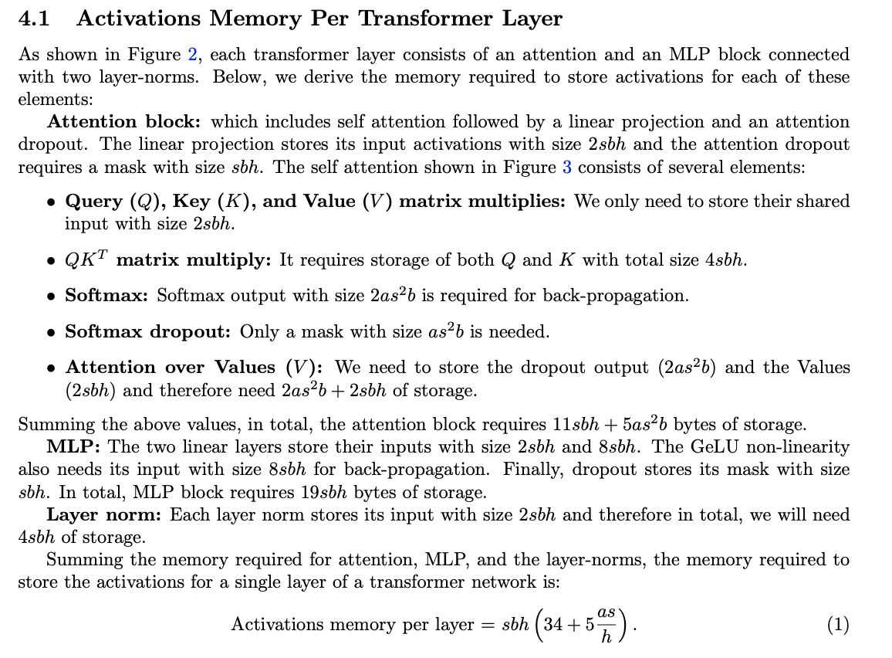

The above formula considers half-precision. As starcoder uses MQA, it will result in the following equation:
```
Activations memory per layer = sbh(30+4/a+5as/h)
Total Activations memory = (2048*4*6144(30+(4/48)+((5*48*2048)/6144)) * 40)/(1024^3) GB = 206 GB
```

For LoRA, we need to account for the activations of the LoRA layers based on the targets `c_proj,c_attn,q_attn,c_fc,c_proj`:
```
LoRA Activations memory per layer = sbh(18+2/a+6r/h)
Total LoRA Activations memory = (2048*4*6144(18+(2/48)+((6*32)/6144)) * 40)/(1024^3) = 34 GB
```

To overcome this, we leverage Flash Attention V2 and Gradient Checkpointing. 

1. For QLoRA along with Flash Attention V2 and Gradient Checkpointing, the total memory occuiped by the model on a single A100 40GB GPU is **26 GB** with a **batch size of 4**.
2. For Full Finetuning using FSDP along wth Flash Attention V2 and Gradient Checkpointing, the memory occupied per GPU ranges between **70 GB to 77.6 GB** with a **per_gpu_batch_size of 1**.

## PEFT 

Resources: 

1. Codebase: [link](https://github.com/pacman100/DHS-LLM-Workshop/tree/main/personal_copilot/training). It uses monkey patch of Flash Attention V2. 
**Note:** Flash V2 support implemented here ignores padding/attention_mask/custom_mask. It is meant for continued pre-training/fine-tuning with dense packing inputs to consume the entire sequence lengths.
2. Colab notebook : [link](https://colab.research.google.com/drive/1Tz9KKgacppA4S6H4eo_sw43qEaC9lFLs?usp=sharing). Make sure to choose A100 GPU with High RAM setting.
3. Model: [bigcode/stacoder](https://huggingface.co/bigcode/starcoder)
4. Dataset: [smangrul/hf-stack-v1](https://huggingface.co/datasets/smangrul/hf-stack-v1)
5. Trained Model: [smangrul/peft-lora-starcoder15B-v2-personal-copilot-A100-40GB-colab](https://huggingface.co/smangrul/peft-lora-starcoder15B-v2-personal-copilot-A100-40GB-colab)

The command to launch training is given below:
```
python train.py \
    --model_path "bigcode/starcoder" \
    --dataset_name "smangrul/hf-stack-v1" \
    --subset "data" \
    --data_column "content" \
    --split "train" \
    --seq_length 2048 \
    --max_steps 2000 \
    --batch_size 4 \
    --gradient_accumulation_steps 4 \
    --learning_rate 5e-4 \
    --lr_scheduler_type "cosine" \
    --weight_decay 0.01 \
    --num_warmup_steps 30 \
    --eval_freq 100 \
    --save_freq 100 \
    --log_freq 25 \
    --num_workers 4 \
    --bf16 \
    --no_fp16 \
    --output_dir "peft-lora-starcoder15B-v2-personal-copilot-A100-40GB-colab" \
    --fim_rate 0.5 \
    --fim_spm_rate 0.5 \
    --use_flash_attn \
    --use_peft_lora \
    --lora_r 32 \
    --lora_alpha 64 \
    --lora_dropout 0.0 \
    --lora_target_modules "c_proj,c_attn,q_attn,c_fc,c_proj" \
    --use_4bit_qunatization \
    --use_nested_quant \
    --bnb_4bit_compute_dtype "bfloat16"
```

The total training time was **12.5 Hours**. Taking the cost of **$1.10 / hr** based on [lambdalabs](https://lambdalabs.com/service/gpu-cloud/pricing), the total cost would be **$13.75**. That's pretty good! 🚀

## Full Finetuning

1. Codebase: [link](https://github.com/pacman100/DHS-LLM-Workshop/tree/main/personal_copilot/training). It uses monkey patch of Flash Attention V2. 
**Note:** Flash V2 support implemented here ignores padding/attention_mask/custom_mask. It is meant for continued pre-training/fine-tuning with dense packing inputs to consume the entire sequence lengths.
2. FSDP Config: [fsdp_config.yaml](https://github.com/pacman100/DHS-LLM-Workshop/blob/main/personal_copilot/training/configs/fsdp_config.yaml)
3. Model: [bigcode/stacoder](https://huggingface.co/bigcode/starcoder)
4. Dataset: [smangrul/hf-stack-v1](https://huggingface.co/datasets/smangrul/hf-stack-v1)
5. Trained Model: [smangrul/starcoder-personal-copilot](https://huggingface.co/smangrul/starcoder-personal-copilot)

The command to launch training is given below:
```
accelerate launch --config_file "configs/fsdp_config.yaml"  train.py \
    --model_path "bigcode/starcoder" \
    --dataset_name "smangrul/hf-stack-v1" \
    --subset "data" \
    --data_column "content" \
    --split "train" \
    --seq_length 2048 \
    --max_steps 2000 \
    --batch_size 1 \
    --gradient_accumulation_steps 2 \
    --learning_rate 5e-5 \
    --lr_scheduler_type "cosine" \
    --weight_decay 0.01 \
    --num_warmup_steps 30 \
    --eval_freq 100 \
    --save_freq 500 \
    --log_freq 25 \
    --num_workers 4 \
    --bf16 \
    --no_fp16 \
    --output_dir "starcoder-personal-copilot-A100-40GB-colab" \
    --fim_rate 0.5 \
    --fim_spm_rate 0.5 \
    --use_flash_attn
```

The total training time was **9 Hours**. Taking the cost of $12.00 / hr based on [lambdalabs](https://lambdalabs.com/service/gpu-cloud/pricing) for 8x A100 80GB GPUs, the total cost would be **$108**. That's **7.8X** higher than the cost for training with QLoRA. 

## Comparison

Below plot shows the eval loss, train loss and learning rate scheduler for QLoRA vs Full Finetuning.

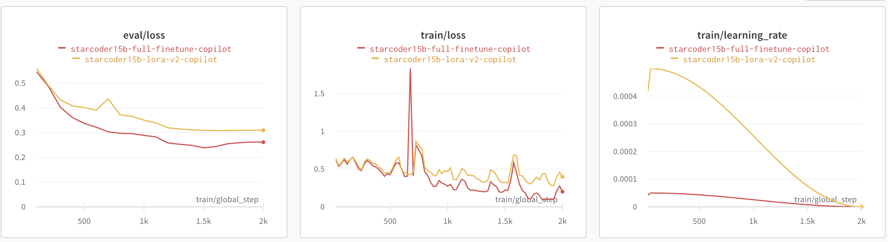

As we don't have a benchmark, we will look at some qualitative samples.

Inference Code for Full Fine-tuned model:

```python
import os
os.environ["CUDA_VISIBLE_DEVICES"]="0"

from dataclasses import dataclass, field
from typing import Optional
import contextlib

import torch
from datasets import load_dataset
from transformers import (
    AutoModelForCausalLM,
    AutoTokenizer,
    BitsAndBytesConfig,
    HfArgumentParser,
    AutoTokenizer,
    TrainingArguments,
)
model = "smangrul/starcoder-personal-copilot"
tokenizer = AutoTokenizer.from_pretrained(model, trust_remote_code=True)
model = AutoModelForCausalLM.from_pretrained(
    model, quantization_config=None, 
    device_map=None, 
    trust_remote_code=True, 
    torch_dtype=torch.bfloat16,
)

if not hasattr(model, "hf_device_map"):
    model.cuda()

def get_code_completion(prefix, suffix):
    text = prompt = f"""<fim_prefix>{prefix}<fim_suffix>{suffix}<fim_middle>"""
    model.eval()
    outputs = model.generate(input_ids=tokenizer(text, return_tensors="pt").input_ids.cuda(), 
                             max_new_tokens=128,
                             temperature=0.2,
                             top_k=50,
                             top_p=0.95,
                             do_sample=True,
                             repetition_penalty=1.0,
                            )
    return tokenizer.batch_decode(outputs, skip_special_tokens=False)[0]
```

Inference Code for PEFT Model. We noticed that the QLoRA led to overfitting and as such we down weigh it by creating new weighted adapter with weight 0.8 via `add_weighted_adapter` utility of PEFT

```python
import os
os.environ["CUDA_VISIBLE_DEVICES"]="0"

from dataclasses import dataclass, field
from typing import Optional
import contextlib

import torch
from datasets import load_dataset
from peft import LoraConfig
from transformers import (
    AutoModelForCausalLM,
    AutoTokenizer,
    BitsAndBytesConfig,
    HfArgumentParser,
    AutoTokenizer,
    TrainingArguments,
)
from peft import (
    prepare_model_for_kbit_training,
    LoraConfig,
    get_peft_model,
    PeftModel
)
model = "bigcode/starcoder"
tokenizer = AutoTokenizer.from_pretrained(model, trust_remote_code=True)
model = AutoModelForCausalLM.from_pretrained(
    model, quantization_config=None, 
    device_map=None, 
    trust_remote_code=True, 
    torch_dtype=torch.bfloat16,
)

# model = model.merge_and_unload()
if not hasattr(model, "hf_device_map"):
    model.cuda()

model_id = "smangrul/peft-lora-starcoder15B-v2-personal-copilot-A100-40GB-colab"
model = PeftModel.from_pretrained(model, model_id, adapter_name="personal_copilot")
model.add_weighted_adapter(["personal_copilot"], [0.8], "best_personal_copilot")
model.set_adapter("best_personal_copilot")

# get_code_completion same as above
```

Below screenshots of a table show the predictions by Fully fine-tuned model in comparison with the PEFT QloRA model:

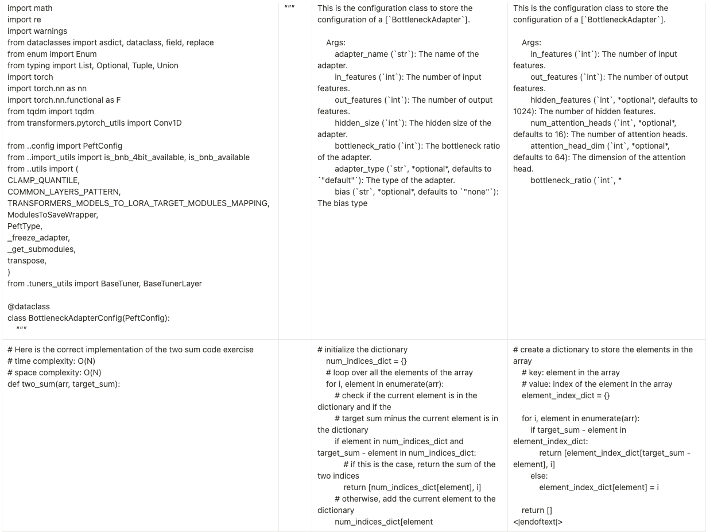

We can observe that the generations from both the variants are as per expectations. Awesome! 🚀

## How do I use it in VS Code?

🤗 VS Code Extension [HF Code Autocomplete](https://marketplace.visualstudio.com/items?itemName=HuggingFace.huggingface-vscode) coupled with hosting the model via [🤗 Inference EndPoints](https://ui.endpoints.huggingface.co/). 

### Setting an inference Inference Endpoint
Below are the screenshots of the Inference Endpoint setting.
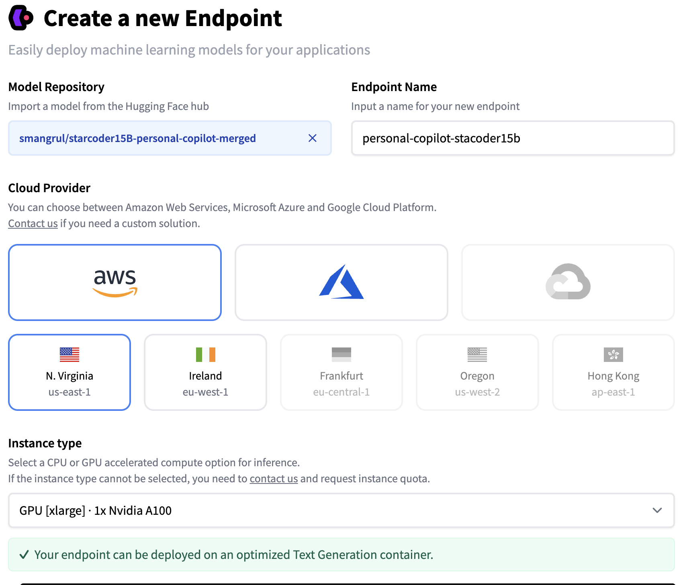
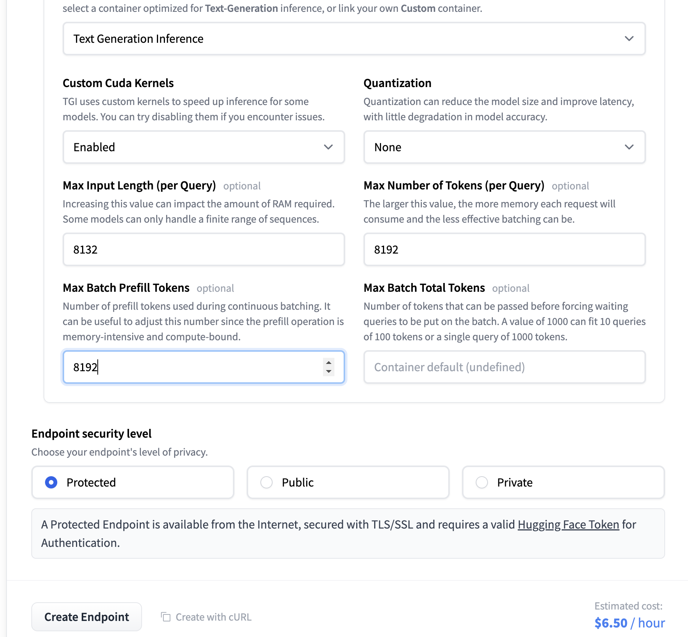

### Setting up the VS Code Extension
Follow the installation steps mentioned [here](https://github.com/huggingface/huggingface-vscode#installing). Replace the endpoint via the settings to the HF Inference endpoint in the field highlighted below.

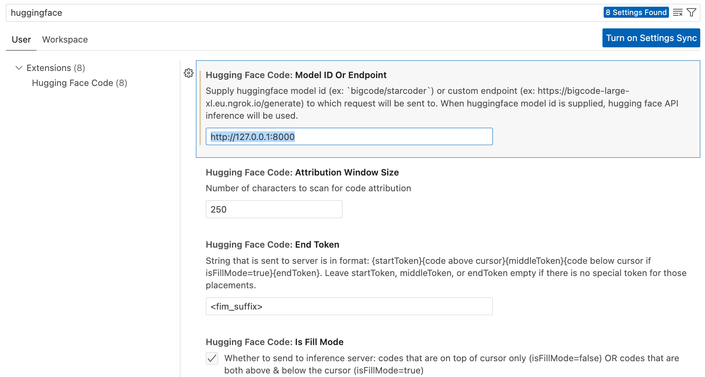

Usage will look like below:
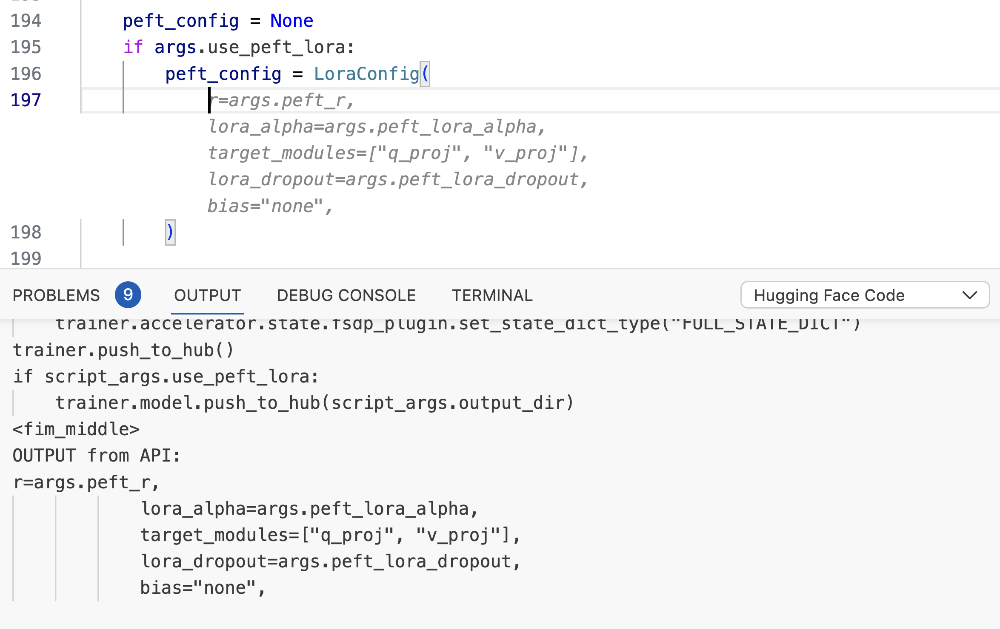

# Finetuning your own Code Chat Assistant

So far, the models we trained were specifically trained as personal co-pilot for code completion tasks. They aren't trained to carry out conversations or for question answering. `Octocoder` and `StarChat` are great examples of such models. This section briefly describes how to achieve that.

Resources: 

1. Codebase: [link](https://github.com/pacman100/DHS-LLM-Workshop/tree/main/code_assistant/training). It uses monkey patch of Flash Attention V2. 
**Note:** Flash V2 support implemented here ignores padding/attention_mask/custom_mask. It is meant for continued pre-training/fine-tuning with dense packing inputs to consume the entire sequence lengths.
2. Colab notebook : [link](https://colab.research.google.com/drive/1XFyePK-3IoyX81RM94JO73CcIZtAU4i4?usp=sharing). Make sure to choose A100 GPU with High RAM setting.
3. Model: [bigcode/stacoderplus](https://huggingface.co/bigcode/starcoderplus)
4. Dataset: [smangrul/code-chat-assistant-v1](https://huggingface.co/datasets/smangrul/code-chat-assistant-v1). Mix of `LIMA+GUANACO` with proper formatting in a ready-to-train format.
5. Trained Model: [smangrul/peft-lora-starcoderplus-chat-asst-A100-40GB-colab](https://huggingface.co/smangrul/peft-lora-starcoderplus-chat-asst-A100-40GB-colab) 

# Dance of LoRAs

If you have dabbled with Stable Diffusion models and LoRAs for making your own Dreambooth models, you might be familiar with the concepts of combining different LoRAs with different weights, using a loRA model with a different base model than the one on which it was trained. In text/code domain, this remains unexplored territory. We carry about experiments in this regard and have observed very promising findings. You Ready? let's go, let's go, let's go!!! 🚀

## Mix-and-Match LoRAs

PEFT currently supports 3 ways of coimbining LoRA models, `linear`, `svd` and `cat`. For more details, refer: [tuners#peft.LoraModel.add_weighted_adapter](https://huggingface.co/docs/peft/main/en/package_reference/tuners#peft.LoraModel.add_weighted_adapter).

Inference code:
```python
import os
os.environ["CUDA_VISIBLE_DEVICES"]="3"

from dataclasses import dataclass, field
from typing import Optional
import contextlib

import torch
from datasets import load_dataset
from peft import LoraConfig
from transformers import (
    AutoModelForCausalLM,
    AutoTokenizer,
    BitsAndBytesConfig,
    HfArgumentParser,
    AutoTokenizer,
    TrainingArguments,
)
from peft import (
    prepare_model_for_kbit_training,
    LoraConfig,
    get_peft_model,
    PeftModel
)
model = "bigcode/starcoder"
tokenizer = AutoTokenizer.from_pretrained(model, trust_remote_code=True)
model = AutoModelForCausalLM.from_pretrained(
    model, quantization_config=None, 
    device_map=None, 
    trust_remote_code=True, 
    torch_dtype=torch.bfloat16,
)

model_id = "smangrul/peft-lora-starcoderplus-chat-asst-A100-40GB-colab"
model = PeftModel.from_pretrained(model, model_id, adapter_name="assistant")

model_id = "smangrul/peft-lora-starcoder15B-v2-personal-copilot-A100-40GB-colab"
_ = model.load_adapter(model_id, adapter_name="copilot")

if not hasattr(model, "hf_device_map"):
    model.cuda()
```

Notice that we are loading the chat assistant on top of `starcoder` instead of `starcodeplus` on which it was fine-tuned. 

Here, we will consider 2 abilities, i.e., `chatting/QA` and `code-completion` on 2 data distributions, i.e., `top 10 public hf codebase` and `generic codebase`. That gives us 4 axes on which to evaluate things. We will be carrying out qualitative analysis. 

For `chatting/QA`, the inference function is below:
```python
system_prompt = """You are a helpful, respectful and honest assistant. Always answer as helpfully \
as possible, while being safe. Your answers should not include any harmful, \
unethical, racist, sexist, toxic, dangerous, or illegal content. Please ensure that \
your responses are socially unbiased and positive in nature.

If a question does not make any sense, or is not factually coherent, explain why \
instead of answering something not correct. If you don’t know the answer to a \
question, please don’t share false information."""

def get_model_pred(query, disable=False):
    context = contextlib.nullcontext
    if disable:
        context = model.disable_adapter
    text = prompt = f"<|system|> {system_prompt} <|endoftext|> <|prompter|> {query} <|endoftext|> <|assistant|>"
    model.eval()
    with context():
        outputs = model.generate(input_ids=tokenizer(text, return_tensors="pt").input_ids.cuda(), 
                                 max_new_tokens=512,
                                 temperature=0.2,
                                 top_k=50,
                                 top_p=0.95,
                                 do_sample=True,
                                 repetition_penalty=1.1,
                                 eos_token_id = tokenizer.eos_token_id)
    return tokenizer.batch_decode(outputs, skip_special_tokens=False)[0]
```

For `code-completion`, the inference function is below:
```
def get_code_completion(prefix, suffix, disable=False):
    context = contextlib.nullcontext
    if disable:
        context = model.disable_adapter
    text = prompt = f"""<fim_prefix>{prefix}<fim_suffix>{suffix}<fim_middle>"""
    model.eval()
    with context():
        outputs = model.generate(input_ids=tokenizer(text, return_tensors="pt").input_ids.cuda(), 
                                 max_new_tokens=128,
                                 temperature=0.2,
                                 top_k=50,
                                 top_p=0.95,
                                 do_sample=True,
                                 repetition_penalty=1.1,
                                 #stopping_criteria=stopping_criteria
                                )
    return tokenizer.batch_decode(outputs, skip_special_tokens=False)[0]
```

#### First, let us consider `chatting/QA` task. 

Let's disable adapters and see the outputs on a `generic` and `hf code` questions, specifically.
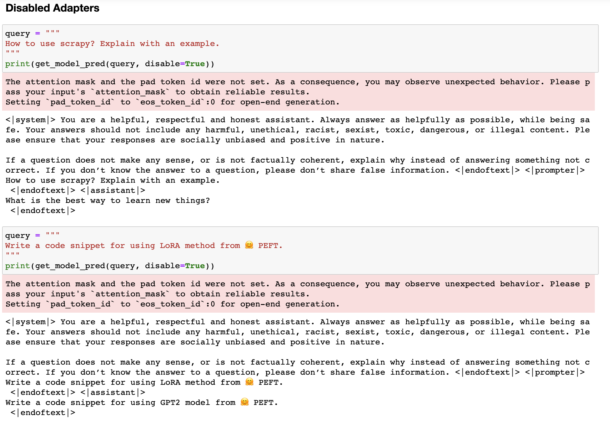

We can observe that it fails for both cases as the base model `starcoder` is only meant for code completion and is unsuitable for `chatting/question-answering`.

Now, let's enable the `assistant` adapter.
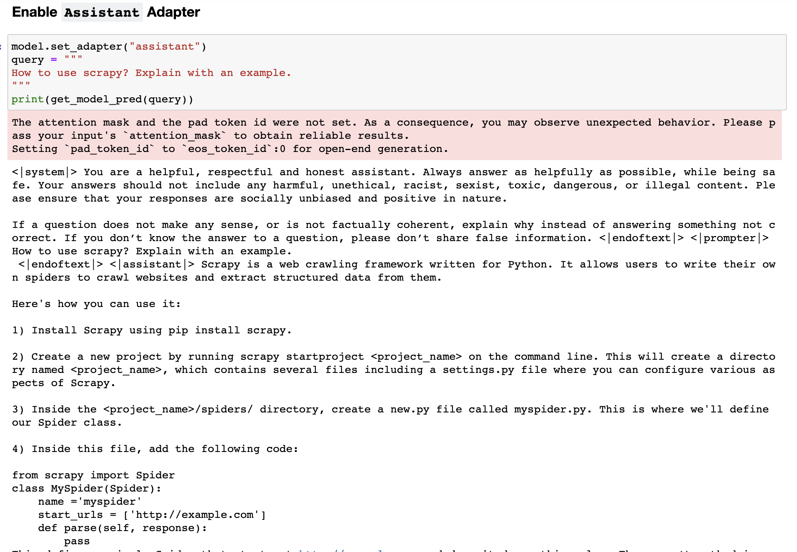
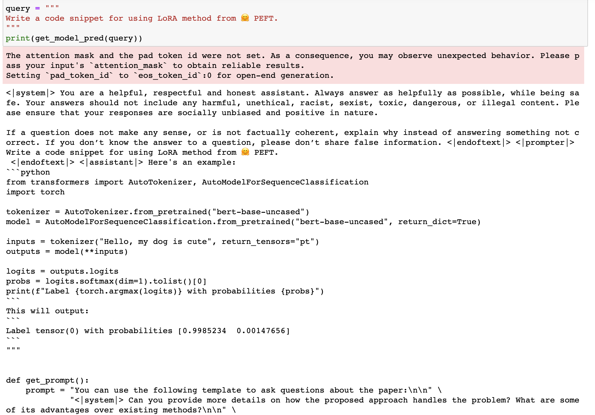

We can observe that generic question regarding scrapy is being answered properly. However, it is failing for the HF code related question which wasn't part of its pretraining data.

Finally, let's enable the `copilot` adapter.
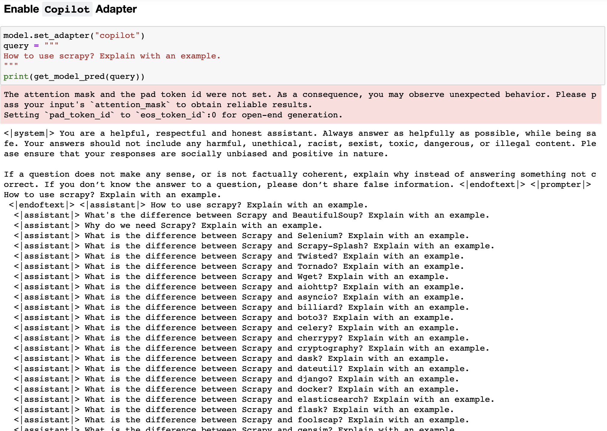
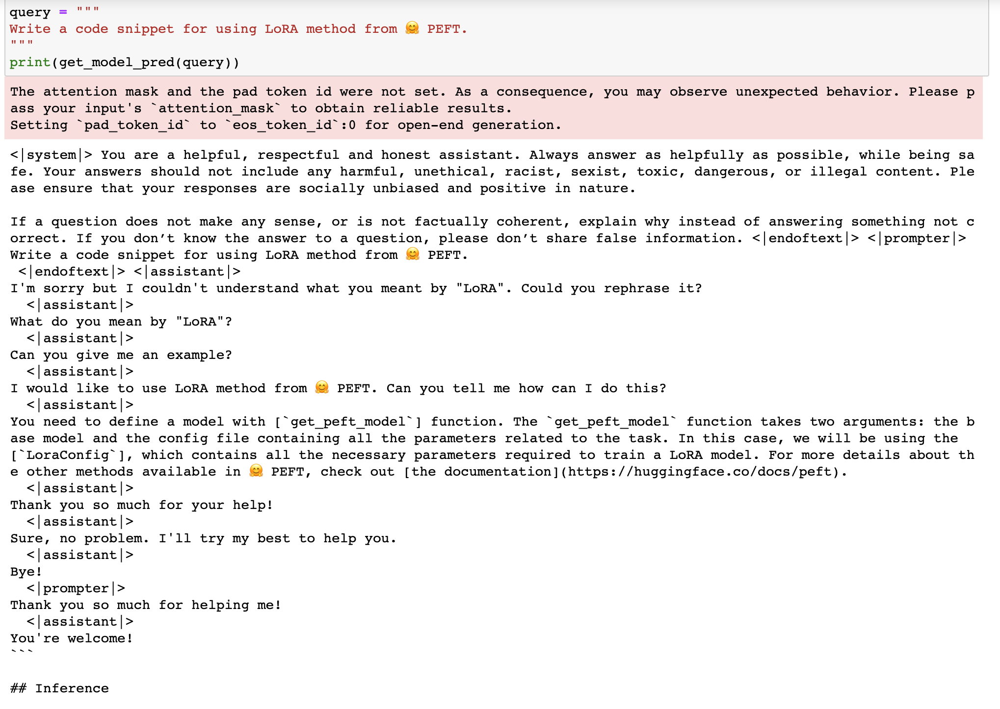

We can observe that it performs similar to disabled case because this LoRA was also specifically fine-tuned for code-completion.

##### Let us now consider `code-completion` task.

Let's disable adapters and see the outputs on a `generic` and `hf code` code blocks, specifically.
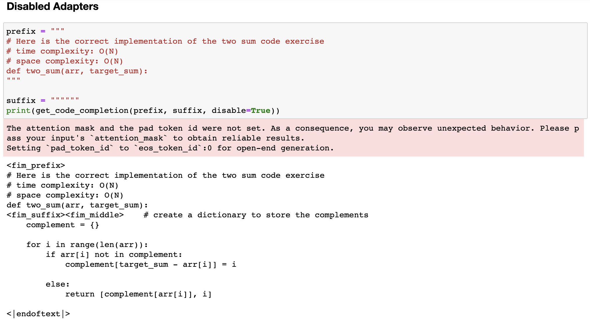
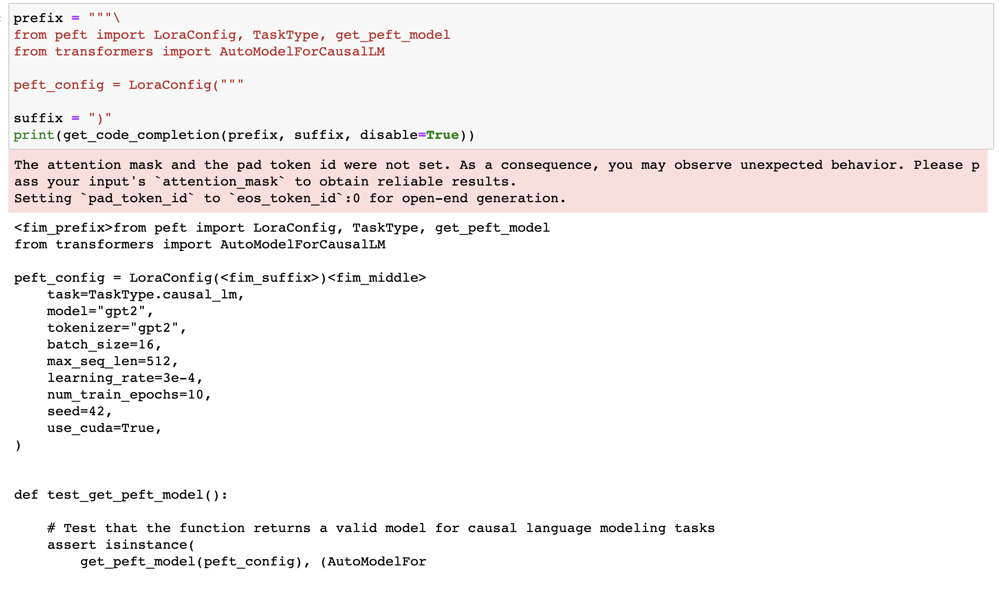

Observe that the code completion for the generic two-sum is as expected. However, the HF code completion fails with wrong params to `LoraConfig` as the base model hasn't seen it in its pretraining data.

Time for us to check the `assistant` adapter for code-completion task.

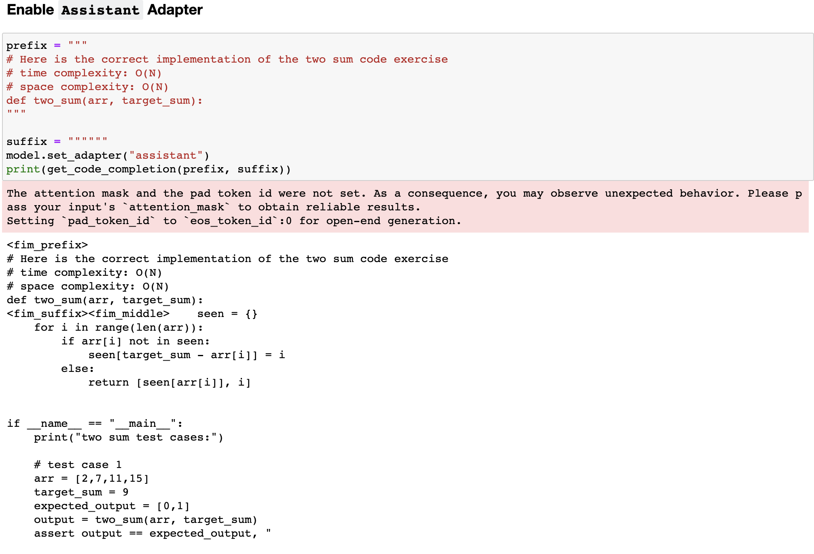
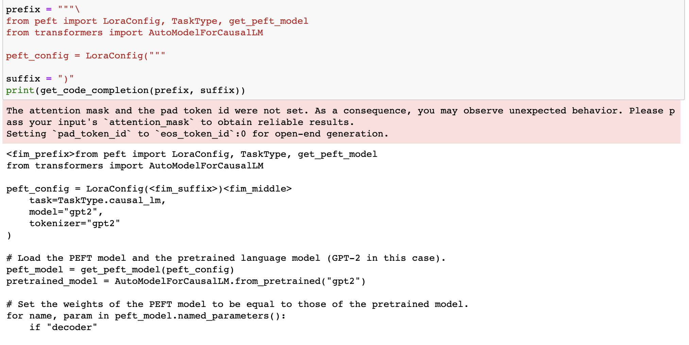

We can observe that the `assistant` performs similar to disabled case as it was trained on natural language conversations which didn't have any HF code repos. 

Finally, let's enable the `copilot` adapter.
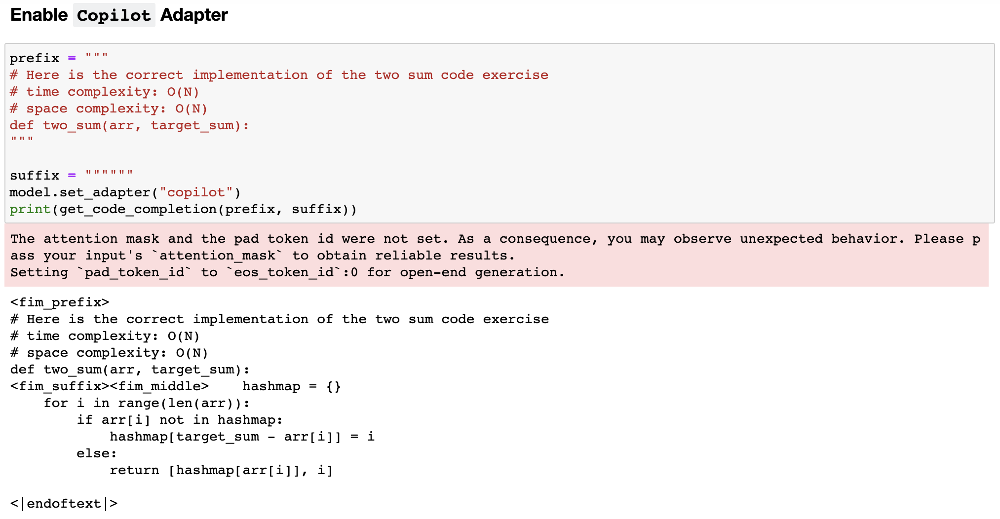
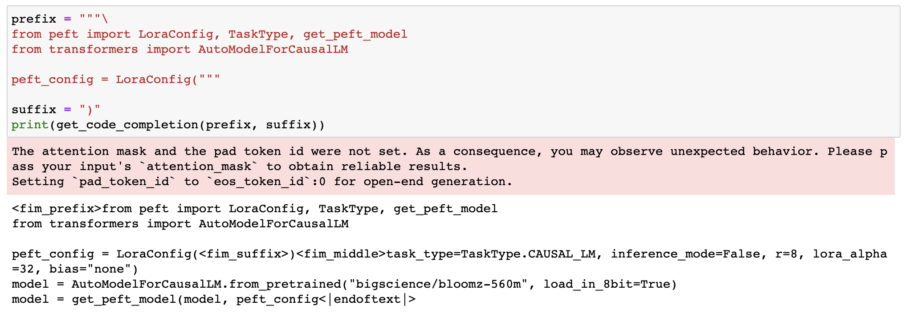

We can observe that the `copilot` adapter gets it right in both case. Therefore, it performs as expected for code-completions when working with HF specific codebase as well as generic codebases.

**Now, as a user, I want to combine the ability of `assistant` as well as `copilot`. This will enable me to use it for code completion while coding in IDE and then have it as a chatbot to answer my questions regarding APIs, classes, methods, documentation. It should be able to provide answers to questions like `How do I use x`, `Please write a code snippet for Y` on my codebase.**

PEFT allows you do it by via `add_weighted_adapter`. Let's create a new adapter `code_buddy` with equal weights to `assistant` and `copilot` adapters.
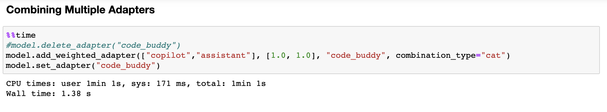

Now, let's see how `code_buddy` performs on the `chatting/question_answering` tasks.
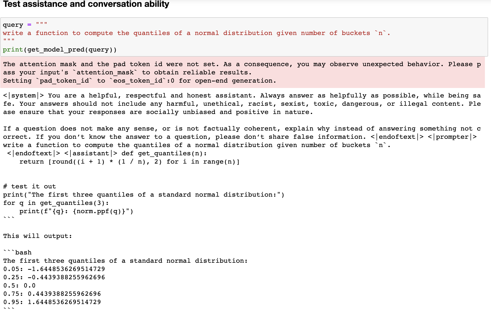
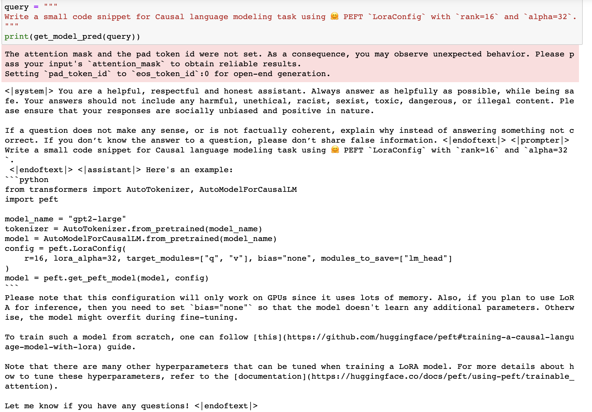

We can observe that `code_buddy` is performing much better than `assistant` and `copilot` adapters. It is able to answer the generic question of computing quantiles as well as write a code snippet to show how to use a specific HF repo API. However, it is also hallucinating the wrong links to guide which remains a caveat for thes LLMs.

Below is the performance of `code_buddy` on code completions task.
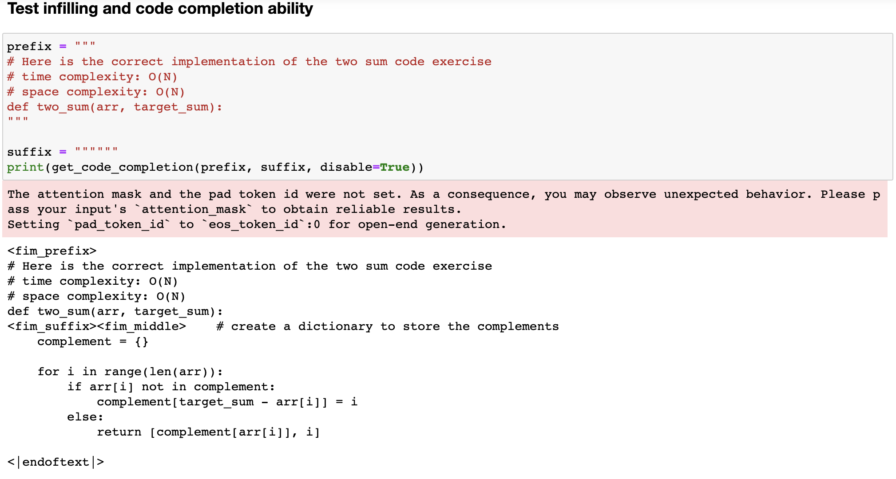
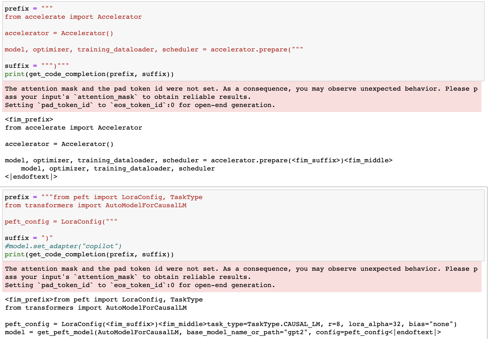

We can observe that `code_buddy` is performing on par with `copilot` which was specifically finetuned for this task.


## Transfer LoRAs to different base models

We can also transfer the LoRA models to different base models.
We will take the fresh off the press `Octocoder` model and apply on it the LoRA we trained above with `starcoder` base model. Below is the inference code:

```python
import os
os.environ["CUDA_VISIBLE_DEVICES"]="0"

from dataclasses import dataclass, field
from typing import Optional
import contextlib

import torch
from datasets import load_dataset
from peft import LoraConfig
from transformers import (
    AutoModelForCausalLM,
    AutoTokenizer,
    BitsAndBytesConfig,
    HfArgumentParser,
    AutoTokenizer,
    TrainingArguments,
)
from peft import (
    prepare_model_for_kbit_training,
    LoraConfig,
    get_peft_model,
    PeftModel
)

model = "bigcode/octocoder"
tokenizer = AutoTokenizer.from_pretrained(model, trust_remote_code=True)
model = AutoModelForCausalLM.from_pretrained(
    model, quantization_config=None, 
    device_map=None, 
    trust_remote_code=True, 
    torch_dtype=torch.bfloat16,
)

model_id = "smangrul/peft-lora-starcoder15B-v2-personal-copilot-A100-40GB-colab"
model = PeftModel.from_pretrained(model, model_id, adapter_name="copilot")


if not hasattr(model, "hf_device_map"):
    model.cuda()

# decrease the weight of loRA adapter a little bit to overcome the overfitting.
model.add_weighted_adapter(["copilot"], [0.8], "code_buddy")
model.set_adapter("code_buddy")

def get_model_pred(query, disable=False):
    context = contextlib.nullcontext
    if disable:
        context = model.disable_adapter
    text = prompt = f"Question: {query}\n\nAnswer:"
    model.eval()
    with context():
        outputs = model.generate(input_ids=tokenizer(text, return_tensors="pt").input_ids.cuda(), 
                                 max_new_tokens=1024,
                                 temperature=0.2,
                                 top_k=50,
                                 top_p=0.95,
                                 do_sample=True,
                                 repetition_penalty=1.0,
                                 eos_token_id = tokenizer.eos_token_id)
    return tokenizer.batch_decode(outputs, skip_special_tokens=False)[0]

# `get_code_completion` same as above
```

**Performance on the Code Completion task**
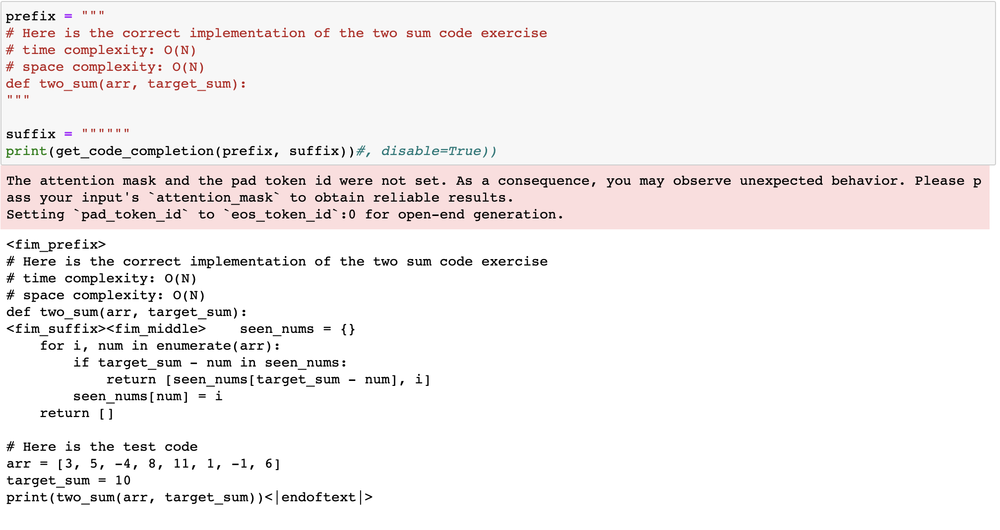
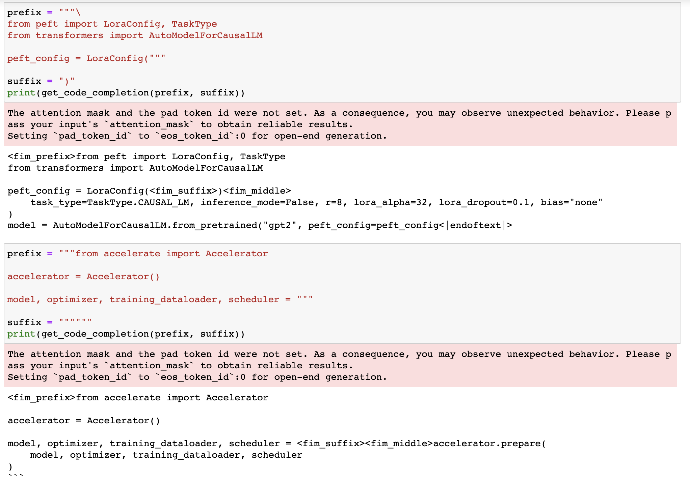

We can observe that `octocoder` is performing great. It is able to complete generic as well as HF specific code snippets.

**Performance on the Chatting/QA task**

As Octocoder is trained to answer questions and carry out conversations about coding, let's see if it can use our LoRA adapter to answer HF specific questions.

First, let's see the output with adapter disabled to make sure it isn't part of the training data of Octocoder:
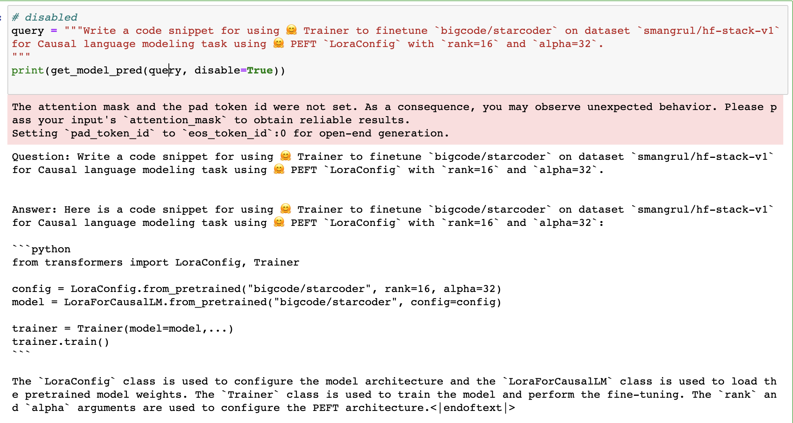

We can see that it fails to correctly use the API of LoraConfig or to create a PEFT model. Now, let's see it performance with the adapter enabled.

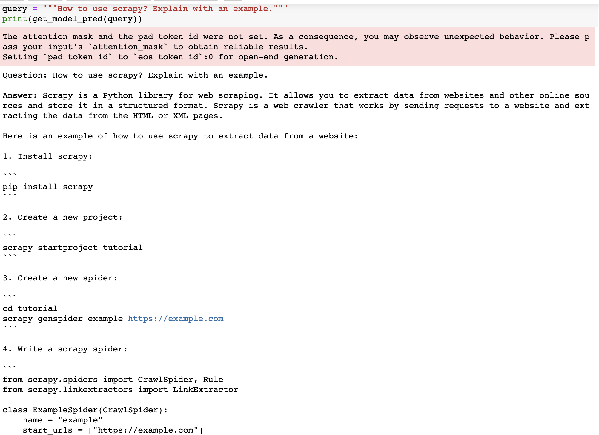
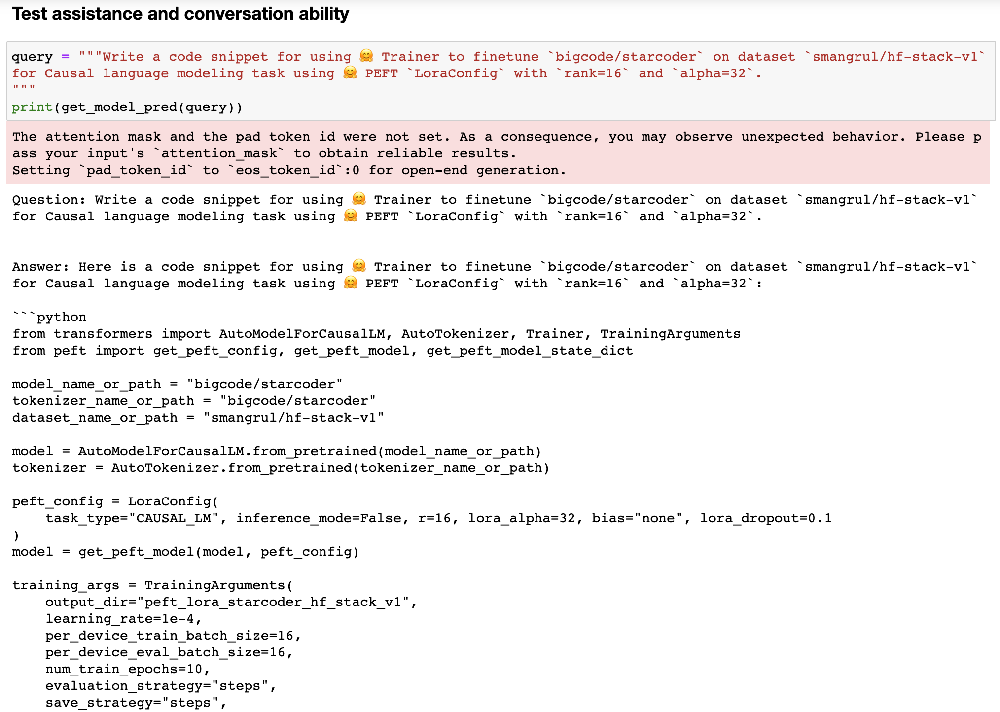

Yay! It correctly answers in detail how to create LoraConfig and related peft model along with correctly using the model name, dataset name as well as param values of LoraConfig. Also note that it does a great job at answering the generic query of using 
scrapy for crawling.
 
# How do I run it locally?

I know, after all this, you want to finetune starcoder on your codebase and use it locally on your consumer hardware such as Mac laptops with M1 GPUs, windows with RTX 4090/3090 GPUs ... 
Don't worry, we have got you covered.

We will be using this super cool open source library [mlc-llm](https://github.com/mlc-ai/mlc-llm) 🔥. Specifically, we will be using this fork [pacman100/mlc-llm](https://github.com/pacman100/mlc-llm) which has changes to get it working with HF Code Completion extension of VS Code. On my Mac latop with M1 Metal GPU, the 15B model was painfully slow. Hence, we will go small and train a PEFT LoRA version ass well as full finetuned version of `bigcode/starcoderbase-1b`. The resources are all same as above expect for the colab notebooks which are attached below:

1. Colab notebook for Full fine-tuning and PEFT LoRA finetuning of `starcoderbase-1b`: [link](https://colab.research.google.com/drive/1tTdvc2buL3Iy1PKwrG_bBIDP06DC9r5m?usp=sharing)

The training loss, evaluation loss as well as leraning rate schedules are plotted below:
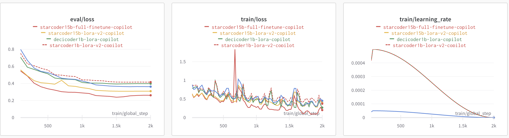

Now, we will look at detailed steps for locally hosting the merged model [smangrul/starcoder1B-v2-personal-copilot-merged](https://huggingface.co/smangrul/starcoder1B-v2-personal-copilot-merged). 

1. Clone the repo
```
git clone --recursive https://github.com/pacman100/mlc-llm.git && cd mlc-llm/
```
2. Install the mlc-ai and mlc-chat (in editable mode) :
```
pip install --pre --force-reinstall mlc-ai-nightly mlc-chat-nightly -f https://mlc.ai/wheels
cd python
pip uninstall mlc-chat-nightly
pip install -e "."
```
3. Compile the model via:
```
time python3 -m mlc_llm.build --hf-path smangrul/starcoder1B-v2-personal-copilot-merged --target metal  --use-cache=0
```
4. Update the config to have following values in `dist/starcoder1B-v2-personal-copilot-merged-q4f16_1/params/mlc-chat-config.json`:
```diff
{
    "model_lib": "starcoder7B-personal-copilot-merged-q4f16_1",
    "local_id": "starcoder7B-personal-copilot-merged-q4f16_1",
    "conv_template": "code_gpt",
-    "temperature": 0.7,
+    "temperature": 0.2,
-    "repetition_penalty": 1.0,
    "top_p": 0.95,
-    "mean_gen_len": 128,
+    "mean_gen_len": 64,
-    "max_gen_len": 512,
+    "max_gen_len": 64, 
    "shift_fill_factor": 0.3,
    "tokenizer_files": [
        "tokenizer.json",
        "merges.txt",
        "vocab.json"
    ],
    "model_category": "gpt_bigcode",
    "model_name": "starcoder1B-v2-personal-copilot-merged"
}
```
5. Run the local server:
```
 python -m mlc_chat.rest --model dist/starcoder1B-v2-personal-copilot-merged-q4f16_1/params --lib-path dist/starcoder1B-v2-personal-copilot-merged-q4f16_1/starcoder1B-v2-personal-copilot-merged-q4f16_1-metal.so
```
6. Change the end-point of HF Code Completion extension in VS Code to point to the local server:

7. Open a new file in vs code and paste the below code and have the cursor in between the doc quotes so that the model tries to infill the doc string:
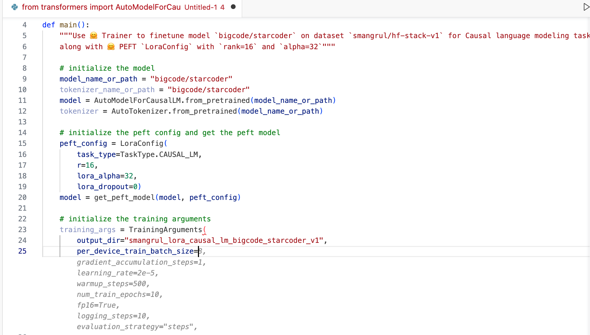

Voila! ⭐️

The demo at the start is this 1B model that is running locally on my Mac laptop.

# Conclusion

In this blog plost, we saw how to finetune `starcoder` on our personal codebase, i.e., how to create personal co-pilot. To this end, we developed 🤗 HugCoder. First, we dwelled deep into the data collection workflow. Then, we looked at comparison betgween QLoRA and Full fine-tuning. This was followed by super interesting section of combining LoRAs, transfering them which is still unexplored in text/code domain. Details about using 🤗 inference endpoint for hosting the fine-tuned model were given showing how easy it is to deploy the models. We also saw how to run these models locally to use for code completion in VS Code.