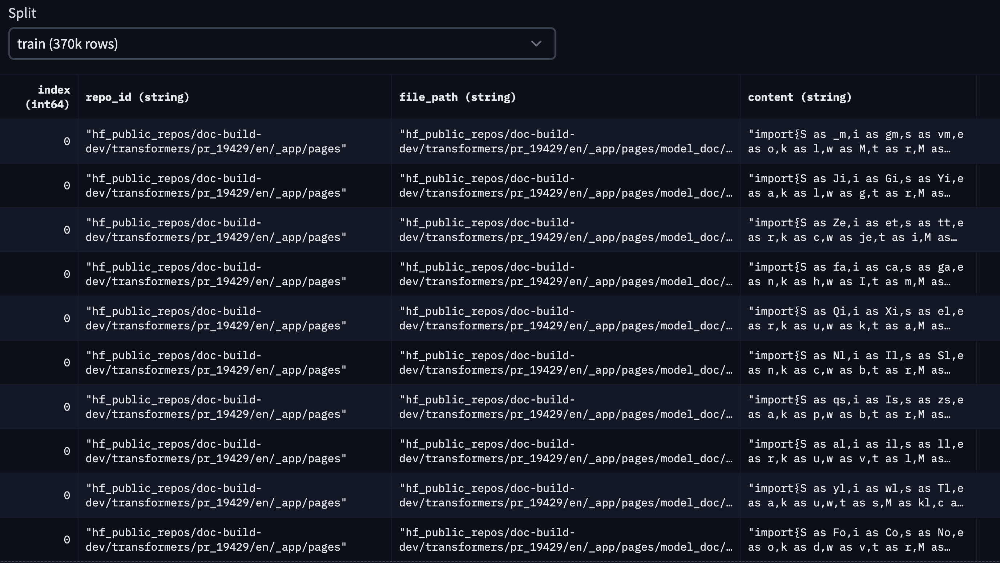

# Introduction

In the ever-evolving landscape of programming and software development, the quest for efficiency and productivity has led to remarkable innovations. One such innovation is the emergence of code generation models such as [Codex](https://openai.com/blog/openai-codex). These models have demonstrated remarkable capabilities in generating human-like code snippets, thereby showing immense potential as coding assistants.

However, while these pre-trained models can perform impressively across a range of tasks, there's an exciting possibility lying just beyond the horizon: the ability to tailor a code generation model to your specific needs. Think of personalized coding assistants which could be leveraged at an enterprise scale. 

In this blog post, HugCoder 🤗, a code LLM, fine-tuned on the code contents from the public repositories of [huggingface GitHub organization](https://github.com/huggingface). We will discuss our data collection workflow, our training experiments, and some interesting results. We will leave you with a couple of further extensions of this project for experimentation. 

Let’s begin 🚀

[Insert a Space link here to let folks try it out immediately?]

[Insert ToC]

https://github.com/pacman100/blog/assets/13534540/f792b506-c31a-4f73-a321-3333902c3c52

# Our data collection workflow

Our expected dataset is conceptually simple. In the interest of convenience, we structured it like so:

| | | |
|---|---|---|
| Repository Name | Filepath in the Repository | File Contents |
|---|---|---|
|---|---|---|

Parsing code contents from GitHub is straightforward with the [Python GitHub API](https://github.com/PyGithub/PyGithub). However, depending on the number of repositories and the number of code files within a repository, one might easily run into API rate-limiting issues. 

To prevent such problems, we decided first locally to clone all the public repositories. To do so in a parallel manner, we utilised the `multiprocessing` module from Python. We then operated on the locally cloned repositories, which eliminated the possibility of running into rate-limiting problems. Refer to [this script](https://github.com/sayakpaul/hf-codegen/blob/main/data/parallel_clone_repos.py) for the full implementation. 

A repository can often contain non-code files such as presentations and other assets. We’re not interested in parsing these files. This is why we created a [list of extensions](https://github.com/sayakpaul/hf-codegen/blob/main/data/prepare_dataset.py#L17C1-L49C68) to filter these files. For parsing the non-notebook (notebook as in Jupyter Notebooks) code files, we simply used “utf-8” encoding. For handling contents from a notebook, we only considered the code cells. 

We also excluded all file paths that were not directly related to code. These include: `.git`, `__pycache__`, and `xcodeproj`. 

To keep the serialization of this content relatively memory-friendly, we used chunking and the feather format. Refer to [this script](https://github.com/sayakpaul/hf-codegen/blob/main/data/prepare_dataset.py) for the full implementation. 

Our dataset prepared this way is available [here](https://huggingface.co/datasets/sayakpaul/hf-codegen-v2) and it looks like so:

For this blog, we consider the top 10 Hugging Face public repositories based on stargazers. They are the following: 

> ['transformers', 'pytorch-image-models', 'datasets', 'diffusers', 'peft', 'tokenizers', 'accelerate', 'text-generation-inference', 'chat-ui', 'deep-rl-class']

The code for this dataset generation is [here](https://github.com/pacman100/DHS-LLM-Workshop/tree/main/personal_copilot/dataset_generation), and the dataset can be found [here](https://huggingface.co/datasets/smangrul/hf-stack-v1). Here is a snapshot of the dataset: 

In the interest of less complexity, we didn’t consider deduplication of the dataset. But for production-ready applications, deduplication should be considered an inseparable step of the data collection pipeline. We welcome you to check out [this blog post](https://huggingface.co/blog/dedup) if you’re interested to learn more about this topic in the context of code LLMs. 

# Finetuning your own Personal Co-Pilot 

## PEFT 

## Full Finetuning

# Finetuning your own Code Chat Assistant

# Dance of LoRAs

## Mix-and-Match LoRAs

## Transfer LoRAs to different base models

# How do I run it locally?

# Conclusion

