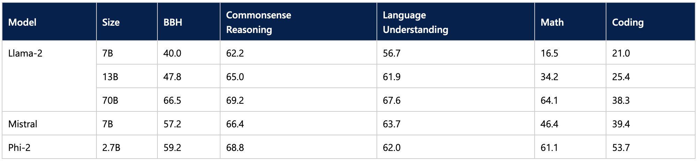

# A Chatbot on your Laptop: Phi-2 on Intel Meteor Lake

Because of their impressive abilities, large language models (LLMs) require significant computing power, which is seldom available on personal computers. Consequently, we have no choice but to deploy them on powerful bespoke AI servers hosted on-premises or in the cloud.

## Why local LLM inference is desirable


What if we could run state-of-the-art open-source LLMs on a typical personal computer? Wouldn't we enjoy benefits like:

* **Increased privacy**: our data would not be sent to an external API for inference.
* **Lower latency**: we would save network round trips.
* **Offline work**: we could work without network connectivity (a frequent flyer's dream!).
* **Lower cost**: we wouldn't spend any money on API calls or model hosting.
* **Customizability**: each user could find the models that best fit the tasks and data they work on daily, and they could even fine-tune them or use local Retrieval-Augmented Generation (RAG) to increase relevance.

This all sounds very exciting indeed. So why aren't we doing it already? Returning to our opening statement, your typical reasonably priced laptop doesn't pack enough compute punch to run LLMs with acceptable performance: there is no multi-thousand-core GPU and no lightning-fast High Memory Bandwidth in sight.

A lost cause, then? Of course not.

## Why local LLM inference is now possible 

There's nothing that the human mind can't make smaller, faster, and more cost-effective. In recent months, the AI community has worked hard to shrink models without compromising their predictive quality.  Three areas are particularly interesting:

* **Hardware acceleration**: modern CPU architectures now embed hardware dedicated to accelerating the most common deep learning operators, such as matrix multiplication or convolution. The Intel Xeon Sapphire Rapids architecture is an excellent example, and in a previous post, we showed you how it could drastically [accelerate Stable Diffusion inference](https://huggingface.co/blog/stable-diffusion-inference-intel).

* **Small Language Models (SLMs)**: thanks to innovative architectures and training techniques, these models are on par or even better than much larger models. Because they have fewer parameters, inference requires less computing and memory, making them very good candidates for resource-constrained environments.

* **Quantization**: Quantization is a process that lowers memory and computing requirements by reducing the bit width of model parameters, for example, from 16-bit floating point (FP16) to 8-bit integers (INT8). Reducing the number of bits means that the resulting model requires less memory at inference time and that operations like matrix multiplication can be performed faster thanks to integer arithmetic.

In this post, we'll leverage all of the above. Starting from the Microsoft Phi-2 model, we will quantize it to 4 bits thanks to the Intel OpenVINO integration in our Optimum Intel library. Then, we will run inference on a mid-range laptop powered by an Intel Meteor Lake CPU.

Let's get to work.

## Intel Meteor Lake

Launched in December 2023, Intel Meteor Lake, now renamed to [Core Ultra](https://www.intel.com/content/www/us/en/products/details/processors/core-ultra.html), is a new [architecture](https://www.intel.com/content/www/us/en/content-details/788851/meteor-lake-architecture-overview.html
) optimized for high-performance laptops. 

The first Intel client processor to use a chiplet architecture, the package includes:

* A **power-efficient CPU** with up to 16 cores,

* An **integrated GPU (iGPU)** with up to 8 Xe cores, each featuring 16 Xe Vector Engines (XVE). As the name implies, an XVE can perform vector operations on 256-bit vectors. It also implements the DP4a instruction, which computes a dot product between two vectors of 4-byte values, stores the result in a 32-bit integer, and adds it to a third 32-bit integer. This makes the iGPU a good candidate for 8-bit quantized models like ours.

* A **Neural Processing Unit (NPU)** with hardware support for common operators like multiply and accumulate, convolution, pooling, linear, and activations. Digital signal processors (DSPs) are also present to allow for custom operator acceleration.

To run the demo below, we selected a [mid-range laptop](https://www.amazon.com/MSI-Prestige-Evo-Laptop-A1MG-029US/dp/B0CP9Y8Q6T/) powered by a [Core Ultra 7 155H CPU](https://www.intel.com/content/www/us/en/products/sku/236847/intel-core-ultra-7-processor-155h-24m-cache-up-to-4-80-ghz/specifications.html). Now, let's pick a nice small language model to run on this laptop.

## The Microsoft Phi-2 model

[Released](https://www.microsoft.com/en-us/research/blog/phi-2-the-surprising-power-of-small-language-models/) in December 2023, [Phi-2](https://huggingface.co/microsoft/phi-2) is a 2.7-billion parameter model trained for text generation. 

On reported benchmarks, unfazed by its smaller size, Phi-2 outperforms some of the best 7-billion and 13-billion LLMs and even stays within striking distance of the much larger Llama-2 70B model.

<kbd>
  
</kbd>

This makes it an interesting candidate for laptop inference. Now, let's see how we can shrink the model to make it smaller and faster.

## Quantization with Intel OpenVINO and Optimum Intel

Intel OpenVINO is an open-source toolkit for optimizing AI inference on many Intel hardware platforms ([Github](https://github.com/openvinotoolkit/openvino), [documentation](https://docs.openvino.ai/2024/home.html)), notably through model quantization. 

Partnering with Intel, we have integrated OpenVINO in Optimum Intel, our open-source library dedicated to accelerating Hugging Face models on Intel platforms ([Github](https://github.com/huggingface/optimum-intel), [documentation](https://huggingface.co/docs/optimum/intel/index)).

This integration makes quantizing Phi-2 to 4 bits straightforward. We define a quantization configuration, set the optimization parameters, and load the model from the hub. Once it has been quantized and optimized, we store it locally.


```
from optimum.intel import OVModelForCausalLM, OVWeightQuantizationConfig

# Quantize 80% of the model to 4 bits
quantization_config = OVWeightQuantizationConfig(
    bits=4,
    group_size=128,
    ratio=0.8,
)

# Optimize for low latency on the iGPU
# and use full-precision for inference
load_kwargs = {
    "device": "gpu",
    "ov_config": {
        "PERFORMANCE_HINT": "LATENCY",
        "INFERENCE_PRECISION_HINT": "f32",
    },
    "compile": False,
    "quantization_config": quantization_config
}

model = OVModelForCausalLM.from_pretrained(
    "microsoft/phi-2",
    export=True,
    **load_kwargs,
)

model.save_pretrained("phi-2-openvino")
```

The full notebook with text generation examples is [available on Github](https://github.com/huggingface/optimum-intel/blob/main/notebooks/openvino/quantized_generation_demo.ipynb).

So, how fast is the quantized model on our laptop? Watch the following videos to see for yourself. Remember to select the 1080p resolution for maximum sharpness.

The first video asks our model a high-school physics question: "*Lily has a rubber ball that she drops from the top of a wall. The wall is 2 meters tall. How long will it take for the ball to reach the ground?*"

<iframe width="560" height="315" src="https://www.youtube.com/embed/nTNYRDORq14" frameborder="0" allow="accelerometer; autoplay; clipboard-write; encrypted-media; gyroscope; picture-in-picture" allowfullscreen></iframe>

The second video asks our model a coding question: "*Write a class which implements a fully connected layer with forward and backward functions using numpy. Use markdown markers for code.*"

<iframe width="560" height="315" src="https://www.youtube.com/embed/igWrp8gnJZg" frameborder="0" allow="accelerometer; autoplay; clipboard-write; encrypted-media; gyroscope; picture-in-picture" allowfullscreen></iframe>

As you can see in both examples, the generated answer is very high quality. The quantization process hasn't degraded the Phi-2 model's initial high quality, and the generation speed is adequate. I would be happy to work locally with this model daily.

## Conclusion

Thanks to Hugging Face and Intel, you can now run LLMs on your laptop, enjoying the many benefits of local inference, like privacy, low latency, and low cost. We hope to see more quality models optimized for the Meteo Lake platform, and its successor Lunar Lake. The Optimum Intel library makes it very easy to quantize models for Intel platforms, so why not give it a try and share your nice models on the Hugging Face hub? We can always use more!

Here are some resources to help you get started:

* Optimum Intel [documentation](https://huggingface.co/docs/optimum/main/en/intel/inference)
* [Developer resources](https://www.intel.com/content/www/us/en/developer/partner/hugging-face.html) from Intel and Hugging Face.
* A video deep dive on model quantization: [part 1](https://youtu.be/kw7S-3s50uk), [part 2](https://youtu.be/fXBBwCIA0Ds)


If you have questions or feedback, we'd love to answer them on the [Hugging Face forum](https://discuss.huggingface.co/).

Thanks for reading!


 
 
