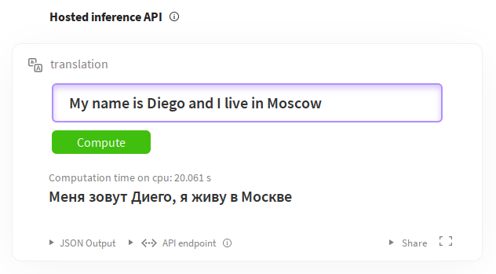

<h1 class="no-top-margin">Porting fairseq wmt19 translation system to transformers</h1>

<div class="blog-metadata">
    <small>Published October 15, 2020.</small>
    <a target="_blank" class="btn-readme" href="https://github.com/huggingface/blog/blob/master/porting-fsmt.md">
        
        Update on GitHub
    </a>
</div>

<div class="author-card">
    <a href="/stas">
        
        <div class="bfc">
            <code>stas</code>
            <span class="fullname">Stas Bekman</span>
            <span class="mono-label" style="color: var(--text-main);">guest</span>
        </div>
    </a>
</div>

##### A guest blog post by Stas Bekman


# **Porting fairseq wmt19 translation system to transformers**

This article is an attempt to document how [fairseq wmt19 translation system](https://github.com/pytorch/fairseq/tree/master/examples/wmt19) was ported to [`transformers`](https://github.com/huggingface/transformers/).

I was looking for some interesting project to work on and [Sam Shleifer](https://github.com/sshleifer) suggested I work on [porting a high quality translator](https://github.com/huggingface/transformers/issues/5419).

I read the short paper: [Facebook FAIR's WMT19 News Translation Task Submission](https://arxiv.org/abs/1907.06616) that describes the original system and decided to give it a try.

Initially, I had no idea how to approach this complex project and Sam helped me to [break it down to smaller tasks](https://github.com/huggingface/transformers/issues/5419), which was of a great help.

I chose to work with the pre-trained `en-ru`/`ru-en` models during porting as I speak both languages. It'd have been much more difficult to work with `de-en`/`en-de` pairs as I don't speak German, and being able to evaluate the translation quality by just reading and making sense of the outputs at the advanced stages of the porting process saved me a lot of time.

Also, as I did the initial porting with the `en-ru`/`ru-en` models, I was totally unaware that the `de-en`/`en-de` models used a merged vocabulary, whereas the former used 2 separate vocabularies of different sizes. So once I did the more complicated work of supporting 2 separate vocabularies, it was trivial to get the merged vocabulary to work.

## Let's cheat

The first step was to cheat, of course. Why make a big effort when one can make a little one. So I wrote a [short notebook](https://github.com/stas00/porting/tree/master/transformers/fairseq-wmt19/nbs/cheat.ipynb) that in a few lines of code provided a proxy to `fairseq` and emulated `transformers` API. 

If no other things, but basic translation, was required, this would have been enough. But, of course, we wanted to have the full porting, so after having this small victory, I moved onto much harder things.

## Preparations

For the sake of this article let's assume that we work under `~/porting`, and therefore let's create this directory:
```
mkdir ~/porting
cd ~/porting
```

We need to install a few things for this work:

```
# install fairseq
git clone https://github.com/pytorch/fairseq
cd fairseq
pip install -e .
# install mosesdecoder under fairseq
git clone https://github.com/moses-smt/mosesdecoder
# install fastBPE under fairseq
git clone git@github.com:glample/fastBPE.git
cd fastBPE; g++ -std=c++11 -pthread -O3 fastBPE/main.cc -IfastBPE -o fast; cd -
cd -

# install transformers
git clone https://github.com/huggingface/transformers/
pip install -e .[dev]

```

## Files

As a quick overview, the following files needed to be created and written:

* [`src/transformers/configuration_fsmt.py`](https://github.com/huggingface/transformers/blob/129fdae04033fe4adfe013b734deaec6ec34ae2e/src/transformers/configuration_fsmt.py) -  a short configuration class.
* [`src/transformers/convert_fsmt_original_pytorch_checkpoint_to_pytorch.py`](https://github.com/huggingface/transformers/blob/129fdae04033fe4adfe013b734deaec6ec34ae2e/src/transformers/convert_fsmt_original_pytorch_checkpoint_to_pytorch.py) - a complex conversion script. 
* [`src/transformers/modeling_fsmt.py`](https://github.com/huggingface/transformers/blob/129fdae04033fe4adfe013b734deaec6ec34ae2e/src/transformers/modeling_fsmt.py) - this is where the model architecture is implemented.
* [`src/transformers/tokenization_fsmt.py`](https://github.com/huggingface/transformers/blob/129fdae04033fe4adfe013b734deaec6ec34ae2e/src/transformers/tokenization_fsmt.py) - a tokenizer code.
* [`tests/test_modeling_fsmt.py`](https://github.com/huggingface/transformers/blob/129fdae04033fe4adfe013b734deaec6ec34ae2e/tests/test_modeling_fsmt.py) - model tests.
* [`tests/test_tokenization_fsmt.py`](https://github.com/huggingface/transformers/blob/129fdae04033fe4adfe013b734deaec6ec34ae2e/tests/test_tokenization_fsmt.py) - tokenizer tests.
* [`docs/source/model_doc/fsmt.rst`](https://github.com/huggingface/transformers/blob/129fdae04033fe4adfe013b734deaec6ec34ae2e/docs/source/model_doc/fsmt.rst) - a doc file.

There are other files that needed to be modified as well, we will talk about those towards the end.


## Conversion

One of the most important parts of the porting process is to create a script that will take all the available source data provided by the original developer of the model, which includes a checkpoint with pre-trained weights, model and training configuration, dictionaries and tokenizer support files, and convert them into a new set of model files supported by `transformers`. You will find the final conversion script here: [src/transformers/convert_fsmt_original_pytorch_checkpoint_to_pytorch.py](https://github.com/huggingface/transformers/blob/129fdae04033fe4adfe013b734deaec6ec34ae2e/src/transformers/convert_fsmt_original_pytorch_checkpoint_to_pytorch.py)

I started this process by copying one of the existing conversion scripts `src/transformers/convert_bart_original_pytorch_checkpoint_to_pytorch.py`, gutted most of it out and then gradually added parts to it as I was progressing in the porting process.

During the development I was testing all my code against a local copy of the converted model files, and only at the very end when everything was ready I uploaded the files to 🤗 s3 and then continued testing against the online version.

## fairseq model and its support files

Let's first look at what data we get with the `fairseq` pre-trained model. 

We are going to use the convenient `torch.hub` API, which makes it very easy to deploy models submitted to [that hub](https://pytorch.org/hub/):
```
import torch
torch.hub.load('pytorch/fairseq', 'transformer.wmt19.en-ru', checkpoint_file='model4.pt', 
               tokenizer='moses', bpe='fastbpe')
```
This code downloads the pre-trained model and its support files. I found this information at the page corresponding to [fairseq](https://pytorch.org/hub/pytorch_fairseq_translation/) on the pytorch hub.

To see what's inside the downloaded files, we have to first hunt down the right folder under `~/.cache`.

```
ls -1 ~/.cache/torch/hub/pytorch_fairseq/
```
shows:
```
15bca559d0277eb5c17149cc7e808459c6e307e5dfbb296d0cf1cfe89bb665d7.ded47c1b3054e7b2d78c0b86297f36a170b7d2e7980d8c29003634eb58d973d9
15bca559d0277eb5c17149cc7e808459c6e307e5dfbb296d0cf1cfe89bb665d7.ded47c1b3054e7b2d78c0b86297f36a170b7d2e7980d8c29003634eb58d973d9.json
```
You may have more than one entry there if you have been using the `hub` for other models.

Let's make a symlink so that we can easily refer to that obscure cache folder name down the road:

```
ln -s /code/data/cache/torch/hub/pytorch_fairseq/15bca559d0277eb5c17149cc7e808459c6e307e5dfbb296d0cf1cfe89bb665d7.ded47c1b3054e7b2d78c0b86297f36a170b7d2e7980d8c29003634eb58d973d9 \
~/porting/pytorch_fairseq_model
```

Note: the path could be different when you try it yourself, since the hash value of the model could change. You will find the right one in `~/.cache/torch/hub/pytorch_fairseq/`

If we look inside that folder:
```
ls -l ~/porting/pytorch_fairseq_model/
total 13646584
-rw-rw-r-- 1 stas stas     532048 Sep  8 21:29 bpecodes
-rw-rw-r-- 1 stas stas     351706 Sep  8 21:29 dict.en.txt
-rw-rw-r-- 1 stas stas     515506 Sep  8 21:29 dict.ru.txt
-rw-rw-r-- 1 stas stas 3493170533 Sep  8 21:28 model1.pt
-rw-rw-r-- 1 stas stas 3493170532 Sep  8 21:28 model2.pt
-rw-rw-r-- 1 stas stas 3493170374 Sep  8 21:28 model3.pt
-rw-rw-r-- 1 stas stas 3493170386 Sep  8 21:29 model4.pt
```
we have:
1. `model*.pt` - 4 checkpoints (pytorch `state_dict` with all the pre-trained weights, and various other things)
2. `dict.*.txt` - source and target dictionaries
3. `bpecodes` - special map file used by the tokenizer

We are going to investigate each of these files in the following sections.

## How translation systems work

Here is a very brief introduction to how computers translate text nowadays.

Computers can't read text, but can only handle numbers. So when working with text we have to map one or more letters into numbers, and hand those to a computer program. When the program completes it too returns  numbers, which we need to convert back into text. 

Let's start with two sentences in Russian and English and assign a unique number to each word:
```
я  люблю следовательно я  существую
10 11    12            10 13

I  love therefore I  am
20 21   22        20 23
```

The numbers starting with 10 map Russian words to unique numbers. The numbers starting with 20 do the same for English words. If you don't speak Russian, you can still see that the word `я` (means 'I') repeats twice in the sentence and it gets the same number 10 associated with it. Same goes for `I` (20), which also repeats twice.

A translation system works in the following stages:

```
1. [я люблю следовательно я существую] # tokenize sentence into words
2. [10 11 12 10 13]                    # look up words in the input dictionary and convert to ids
3. [black box]                         # machine learning system magic
4. [20 21 22 20 23]                    # look up numbers in the output dictionary and convert to text
5. [I love therefore I am]             # detokenize the tokens back into a sentence
```

If we combine the first two and the last two steps we get 3 stages:

1. **Encode input**: break input text into tokens, create a dictionary (vocab) of these tokens and remap each token into a unique id in that dictionary.
2. **Generate translation**: take input numbers, run them through a pre-trained machine learning model which predicts the best translation, and return output numbers.
3. **Decode output**: take output numbers, look them up in the target language dictionary, convert them back to text, and finally merge the converted tokens into the translated sentence.

The second stage may return one or several possible translations. In the case of the latter the caller then can choose the most suitable outcome. In this article I will refer to [the beam search algorithm](https://en.wikipedia.org/wiki/Beam_search), which is one of the ways multiple possible results are searched for. And the size of the beam refers to how many results are returned.

If there is only one result that's requested, the model will choose the one with the highest likelihood probability. If multiple results are requested it will return those results sorted by their probabilities.

Note that this same idea applies to the majority of NLP tasks, and not just translation.

## Tokenization

Early systems tokenized sentences into words and punctuation marks. But since many languages have hundreds of thousands of words, it is very taxing to work with huge vocabularies, as it dramatically increases the compute resource requirements and the length of time to complete the task.

As of 2020 there are quite a few different tokenizing methods, but most of the recent ones are based on sub-word tokenization - that is instead of breaking input text down into words, these modern tokenizers break the input text down into word segments and letters, using some kind of training to obtain the most optimal tokenization.

Let's see how this approach helps to reduce memory and computation requirements. If we have an input vocabulary of 6 common words: go, going, speak, speaking, sleep, sleeping - with word-level tokenization we end up with 6 tokens. However, if we break these down into: go, go-ing, speak, speak-ing, etc., then we have only 4 tokens in our vocabulary: go, speak, sleep, ing. This simple change made a 33% improvement! Except, the sub-word tokenizers don't use grammar rules, but they are trained on massive text inputs to find such splits. In this example I used a simple grammar rule as it's easy to understand.

Another important advantage of this approach is when dealing with input text words, that aren't in our vocabulary. For example, let's say our system encounters the word `grokking` (*), which can't be found in its vocabulary. If we split it into `grokk'-'ing', then the machine learning model might not know what to do with the first part of the word, but it gets a useful insight that 'ing' indicates a continuous tense, so it'll be able to produce a better translation. In such situation the tokenizer will split the unknown segments into segments it knows, in the worst case reducing them to individual letters.

* footnote: to grok was coined in 1961 by Robert A. Heinlein in "Stranger in a Strange Land": to understand (something) intuitively or by empathy.

There are many other nuances to why the modern tokenization approach is much more superior than simple word tokenization, which won't be covered in the scope of this article. Most of these systems are very complex to how they do the tokenization, as compared to the simple example of splitting `ing` endings that was just demonstrated, but the principle is similar.


## Tokenizer porting

The first step was to port the encoder part of the tokenizer, where text is converted to ids. The decoder part won't be needed until the very end.

### fairseq's tokenizer workings

Let's understand how `fairseq`'s tokenizer works.

`fairseq` (*) uses the [Byte Pair Encoding](https://en.wikipedia.org/wiki/Byte_pair_encoding) (BPE) algorithm for tokenization. 

* footnote: from here on when I refer to `fairseq`, I refer [to this specific model implementation](https://github.com/pytorch/fairseq/tree/master/examples/wmt19) - the `fairseq` project itself has dozens of different implementations of different models.

Let's see what BPE does:

```
import torch
sentence = "Machine Learning is great"
checkpoint_file='model4.pt'
model = torch.hub.load('pytorch/fairseq', 'transformer.wmt19.en-ru', checkpoint_file=checkpoint_file, tokenizer='moses', bpe='fastbpe')

# encode step by step
tokens = model.tokenize(sentence)
print("tokenize ", tokens)

bpe = model.apply_bpe(tokens)
print("apply_bpe: ", bpe)

bin = model.binarize(bpe)
print("binarize: ", len(bin), bin)

# compare to model.encode - should give us the same output
expected = model.encode(sentence)
print("encode:   ", len(expected), expected)
```

gives us:

```
('tokenize ', 'Machine Learning is great')
('apply_bpe: ', 'Mach@@ ine Lear@@ ning is great')
('binarize: ', 7, tensor([10217,  1419,     3,  2515,    21,  1054,     2]))
('encode:   ', 7, tensor([10217,  1419,     3,  2515,    21,  1054,     2]))
```

You can see that `model.encode` does `tokenize+apply_bpe+binarize` - as we get the same output. 

The steps were:
1. `tokenize`: normally it'd escape apostrophes and do other pre-processing, in this example it just returned the input sentence without any changes
2. `apply_bpe`: BPE splits the input into words and sub-words according to its `bpecodes` file supplied by the tokenizer - we get 6 BPE chunks
3. `binarize`: this simply remaps the BPE chunks from the previous step into their corresponding ids in the vocabulary (which is also downloaded with the model)

You can refer to [this notebook](https://github.com/stas00/porting/tree/master/transformers/fairseq-wmt19/nbs/tokenizer.ipynb) to see more details.

This is a good time to look inside the `bpecodes` file. Here is the top of the file:

```
$ head -15 ~/porting/pytorch_fairseq_model/bpecodes
e n</w> 1423551864
e r 1300703664
e r</w> 1142368899
i n 1130674201
c h 933581741
a n 845658658
t h 811639783
e n 780050874
u n 661783167
s t 592856434
e i 579569900
a r 494774817
a l 444331573
o r 439176406
th e</w> 432025210
[...]
```

The top entries of this file include very frequent short 1-letter sequences. As we will see in a moment the bottom includes the most common multi-letter sub-words and even full long words. 

A special token `</w>` indicates the end of the word. So in several lines quoted above we find:
```
e n</w> 1423551864
e r</w> 1142368899
th e</w> 432025210
```
If the second column doesn't include `</w>`, it means that this segment is found in the middle of the word and not at the end of it.

The last column declares the number of times this BPE code has been encountered while being trained. The `bpecodes` file is sorted by this column - so the most common BPE codes are on top.

By looking at the counts we now know that when this tokenizer was trained it encountered 1,423,551,864 words ending in `en`, 1,142,368,899 words ending in `er` and 432,025,210 words ending in `the`. For the latter it most likely means the actual word `the`, but it would also include words like `lathe`, `loathe`, `tithe`, etc.

These huge numbers also indicate to us that this tokenizer was trained on an enormous amount of text!

If we look at the bottom of the same file:

```
$ tail -10 ~/porting/pytorch_fairseq_model/bpecodes
4 x 109019
F ische</w> 109018
sal aries</w> 109012
e kt 108978
ver gewal 108978
Sten cils</w> 108977
Freiwilli ge</w> 108969
doub les</w> 108965
po ckets</w> 108953
Gö tz</w> 108943
```
we see complex combinations of sub-words which are still pretty frequent, e.g. `sal aries` for 109,012 times! So it got its own dedicated entry in the `bpecodes` map file.

How `apply_bpe` does its work? By looking up the various combinations of letters in the `bpecodes` map file and when finding the longest fitting entry it uses that. 

Going back to our example, we saw that it split `Machine` into: `Mach@@` + `ine` - let's check:

```
$ grep -i ^mach  ~/porting/pytorch_fairseq_model/bpecodes
mach ine</w> 463985
Mach t 376252
Mach ines</w> 374223
mach ines</w> 214050
Mach th 119438
```
You can see that it has `mach ine</w>`. We don't see `Mach ine` in there - so it must be handling lower cased look ups when normal case is not matching.

Now let's check: `Lear@@` + `ning`

```
$ grep -i ^lear  ~/porting/pytorch_fairseq_model/bpecodes
lear n</w> 675290
lear ned</w> 505087
lear ning</w> 417623
```
We find `lear ning</w>` is there (again the case is not the same).

Thinking more about it, the case probably doesn't matter for tokenization, as long as there is a unique entry for `Mach`/`Lear` and `mach`/`lear` in the dictionary where it's very critical to have each case covered.

Hopefully, you can now see how this works.

One confusing thing is that if you remember the `apply_bpe` output was:
```
('apply_bpe: ', 6, ['Mach@@', 'ine', 'Lear@@', 'ning', 'is', 'great'])
```
Instead of marking endings of the words with `</w>`, it leaves those as is, but, instead, marks words that were not the endings with `@@`. This is probably so, because `fastBPE` implementation is used by `fairseq` and that's how it does things. I had to change this to fit the `transformers` implementation, which doesn't use `fastBPE`.

One last thing to check is the remapping of the BPE codes to vocabulary ids. To repeat, we had:

```
('apply_bpe: ', 'Mach@@ ine Lear@@ ning is great')
('binarize: ', 7, tensor([10217,  1419,     3,  2515,    21,  1054,     2]))
```

`2` - the last token id is a `eos` (end of stream) token. It's used to indicate to the model the end of input.

And then `Mach@@` gets remapped to `10217`, and `ine` to `1419`. 

Let's check that the dictionary file is in agreement:

```
$ grep ^Mach@@ ~/porting/pytorch_fairseq_model/dict.en.txt
Mach@@ 6410
$ grep "^ine " ~/porting/pytorch_fairseq_model/dict.en.txt
ine 88376
```
Wait a second - those aren't the ids that we got after `binarize`, which should be `10217` and `1419` correspondingly. 

It took some investigating to find out that the vocab file ids aren't the ids used by the model and that internally it remaps them to new ids once the vocab file is loaded. Luckily, I didn't need to figure out how exactly it was done. Instead, I just used `fairseq.data.dictionary.Dictionary.load` to load the dictionary (*), which performed all the re-mappings, - and I then saved the final dictionary. I found out about that `Dictionary` class by stepping through `fairseq` code with debugger.

* footnote: the more I work on porting models and datasets, the more I realize that putting the original code to work for me, rather than trying to replicate it, is a huge time saver and most importantly that code has already been tested - it's too easy to miss something and down the road discover big problems! After all, at the end, none of this conversion code will matter, since only the data it generated will be used by `transformers` and its end users.

Here is the relevant part of the conversion script:

```
from fairseq.data.dictionary import Dictionary
def rewrite_dict_keys(d):
    # (1) remove word breaking symbol
    # (2) add word ending symbol where the word is not broken up,
    # e.g.: d = {'le@@': 5, 'tt@@': 6, 'er': 7} => {'le': 5, 'tt': 6, 'er</w>': 7}
    d2 = dict((re.sub(r"@@$", "", k), v) if k.endswith("@@") else (re.sub(r"$", "</w>", k), v) for k, v in d.items())
    keep_keys = "<s> <pad> </s> <unk>".split()
    # restore the special tokens
    for k in keep_keys:
        del d2[f"{k}</w>"]
        d2[k] = d[k]  # restore
    return d2

src_dict_file = os.path.join(fsmt_folder_path, f"dict.{src_lang}.txt")
src_dict = Dictionary.load(src_dict_file)
src_vocab = rewrite_dict_keys(src_dict.indices)
src_vocab_size = len(src_vocab)
src_vocab_file = os.path.join(pytorch_dump_folder_path, "vocab-src.json")
print(f"Generating {src_vocab_file}")
with open(src_vocab_file, "w", encoding="utf-8") as f:
    f.write(json.dumps(src_vocab, ensure_ascii=False, indent=json_indent))
# we did the same for the target dict - omitted quoting it here
# and we also had to save `bpecodes`, it's called `merges.txt` in the transformers land
```

After running the conversion script, let's check the converted dictionary:

```
$ grep '"Mach"' /code/huggingface/transformers-fair-wmt/data/wmt19-en-ru/vocab-src.json
  "Mach": 10217,
$ grep '"ine</w>":' /code/huggingface/transformers-fair-wmt/data/wmt19-en-ru/vocab-src.json
  "ine</w>": 1419,
```
We have the correct ids in the `transformers` version of the vocab file.

As you can see I also had to re-write the vocabularies to match the `transformers` BPE implementation. We have to change:
```
['Mach@@', 'ine', 'Lear@@', 'ning', 'is', 'great']
```
to:
```
['Mach', 'ine</w>', 'Lear', 'ning</w>', 'is</w>', 'great</w>']
```
Instead of marking chunks that are segments of a word, with the exception of the last segment, we mark segments or words that are the final segment. One can easily go from one style of encoding to another and back.

This successfully completed the porting of the first part of the model files. You can see the final version of the code [here](https://github.com/huggingface/transformers/blob/129fdae04033fe4adfe013b734deaec6ec34ae2e/src/transformers/convert_fsmt_original_pytorch_checkpoint_to_pytorch.py#L128).

If you're curious to look deeper there are more tinkering bits in [this notebook](https://github.com/stas00/porting/tree/master/transformers/fairseq-wmt19/nbs/tokenizer-dev.ipynb).

### Porting tokenizer's encoder to transformers

`transformers` can't rely on [`fastBPE`](https://github.com/glample/fastBPE) since the latter requires a C-compiler, but luckily someone already implemented a python version of the same in [`tokenization_xlm.py`](https://github.com/huggingface/transformers/blob/master/src/transformers/tokenization_xlm.py).

So I just copied it to `src/transformers/tokenization_fsmt.py` and renamed the class names:
```
cp tokenization_xlm.py tokenization_fsmt.py
perl -pi -e 's|XLM|FSMT|ig; s|xlm|fsmt|g;' tokenization_fsmt.py
```
and with very few changes I had a working encoder part of the tokenizer. There was a lot of code that didn't apply to the languages I needed to support, so I removed that code.

Since I needed 2 different vocabularies, instead of one here in tokenizer and everywhere else I had to change the code to support both. So for example I had to override the super-class' methods:

```
    def get_vocab(self) -> Dict[str, int]:
        return self.get_src_vocab()

    @property
    def vocab_size(self) -> int:
        return self.src_vocab_size
```

Since `fairseq` didn't use `bos` (beginning of stream) tokens, I also had to change the code to not include those (*):

```
-            return bos + token_ids_0 + sep
-        return bos + token_ids_0 + sep + token_ids_1 + sep
+            return token_ids_0 + sep
+        return token_ids_0 + sep + token_ids_1 + sep
```
* footnote: this is the output of `diff(1)` which shows the difference between two chunks of code - lines starting with `-` show what was removed, and with `+` what was added.

`fairseq` was also escaping characters and performing an aggressive dash splitting, so I had to also change:

```
-        [...].tokenize(text, return_str=False, escape=False)
+        [...].tokenize(text, return_str=False, escape=True, aggressive_dash_splits=True)
```

If you're following along, and would like to see all the changes I did to the original `tokenization_xlm.py`, you can do:
```
cp tokenization_xlm.py tokenization_orig.py
perl -pi -e 's|XLM|FSMT|g; s|xlm|fsmt|g;' tokenization_orig.py
diff -u tokenization_orig.py tokenization_fsmt.py  | less
```
Just make sure you're checking out the repository [around the time fsmt was released](https://github.com/huggingface/transformers/tree/129fdae04033fe4adfe013b734deaec6ec34ae2e), since the 2 files could have diverged since then.

The final stage was to run through a bunch of inputs and to ensure that the ported tokenizer produced the same ids as the original. You can see this is done in [this notebook](https://github.com/stas00/porting/tree/master/transformers/fairseq-wmt19/nbs/tokenizer.ipynb), which I was running repeatedly while trying to figure out how to make the outputs match.

This is how most of the porting process went, I'd take a small feature, run it the `fairseq`-way, get the outputs, do the same with the `transformers` code, try to make the outputs match - fiddle with the code until it did, then try a different kind of input make sure it produced the same outputs, and so on, until all inputs produced outputs that matched.

## Porting the core translation functionality

Having had a relatively quick success with porting the tokenizer (obviously, thanks to most of the code being there already), the next stage was much more complex. This is the `generate()` function which takes inputs ids, runs them through the model and returns output ids.

I had to break it down into multiple sub-tasks. I had to 
1. port the model weights.
2. make `generate()` work for a single beam (i.e. return just one result).
3. and then multiple beams (i.e. return multiple results).

I first researched which of the existing architectures were the closest to my needs. It was BART that fit the closest, so I went ahead and did:

```
cp modeling_bart.py modeling_fsmt.py
perl -pi -e 's|Bart|FSMT|ig; s|bart|fsmt|g;' modeling_fsmt.py
```

This was my starting point that I needed to tweak to work with the model weights provided by `fairseq`.

### Porting weights and configuration

The first thing I did is to look at what was inside the publicly shared checkpoint. [This notebook](https://github.com/stas00/porting/tree/master/transformers/fairseq-wmt19/nbs/config.ipynb) shows what I did there.

I discovered that there were 4 checkpoints in there. I had no idea what to do about it, so I started with a simpler job of using just the first checkpoint. Later I discovered that `fairseq` used all 4 checkpoints in an ensemble to get the best predictions, and that `transformers` currently doesn't support that feature. When the porting was completed and I was able to measure the performance scores, I found out that the `model4.pt` checkpoint provided the best score. But during the porting performance didn't matter much. Since I was using only one checkpoint it was crucial that when I was comparing outputs, I had `fairseq` also use just one and the same checkpoint.

To accomplish that I used a slightly different `fairseq` API:
```
from fairseq import hub_utils
#checkpoint_file = 'model1.pt:model2.pt:model3.pt:model4.pt'
checkpoint_file = 'model1.pt'
model_name_or_path = 'transformer.wmt19.ru-en'
data_name_or_path = '.'
cls = fairseq.model_parallel.models.transformer.ModelParallelTransformerModel
models = cls.hub_models()
kwargs = {'bpe': 'fastbpe', 'tokenizer': 'moses'}
ru2en = hub_utils.from_pretrained(
            model_name_or_path,
            checkpoint_file,
            data_name_or_path,
            archive_map=models,
            **kwargs
        )
```
First I looked at the model:
```
print(ru2en["models"][0])
```
```
TransformerModel(
  (encoder): TransformerEncoder(
    (dropout_module): FairseqDropout()
    (embed_tokens): Embedding(31232, 1024, padding_idx=1)
    (embed_positions): SinusoidalPositionalEmbedding()
    (layers): ModuleList(
      (0): TransformerEncoderLayer(
        (self_attn): MultiheadAttention(
          (dropout_module): FairseqDropout()
          (k_proj): Linear(in_features=1024, out_features=1024, bias=True)
          (v_proj): Linear(in_features=1024, out_features=1024, bias=True)
          (q_proj): Linear(in_features=1024, out_features=1024, bias=True)
          (out_proj): Linear(in_features=1024, out_features=1024, bias=True)
        )
      [...]
# the full output is in the notebook
```
which looked very similar to BART's architecture, with some slight differences in a few layers - some were added, others removed. So this was great news as I didn't have to re-invent the wheel, but to only tweak a well-working design.

Note that in the code sample above I'm not using `torch.load()` to load `state_dict`. This is what I initially did and the result was most puzzling - I was missing `self_attn.(k|q|v)_proj` weights and instead had a single `self_attn.in_proj`. When I tried loading the model using `fairseq` API, it fixed things up - apparently that model was old and was using an old architecture that had one set of weights for `k/q/v` and the newer architecture has them separate. When `fairseq` loads this old model, it rewrites the weights to match the modern architecture.

I also used [this notebook](https://github.com/stas00/porting/tree/master/transformers/fairseq-wmt19/nbs/visualize-models.ipynb) to compare the `state_dict`s visually. In that notebook you will also see that `fairseq` fetches a 2.2GB-worth of data in `last_optimizer_state`, which we can safely ignore, and have a 3 times leaner final model size.

In the conversion script I also had to remove some `state_dict` keys, which I wasn't going to use, e.g. `model.encoder.version`, `model.model` and a few others.

Next we look at the configuration args:
```
args = dict(vars(ru2en["args"]))
pprint(args)
```
```
 'activation_dropout': 0.0,
 'activation_fn': 'relu',
 'adam_betas': '(0.9, 0.98)',
 'adam_eps': 1e-08,
 'adaptive_input': False,
 'adaptive_softmax_cutoff': None,
 'adaptive_softmax_dropout': 0,
 'arch': 'transformer_wmt_en_de_big',
 'attention_dropout': 0.1,
 'bpe': 'fastbpe',
 [... full output is in the notebook ...] 
```
ok, we will copy those to configure the model. I had to rename some of the argument names, wherever `transformers` used different names for the corresponding configuration setting.  So the re-mapping of configuration looks as following:

```
    model_conf = {
        "architectures": ["FSMTForConditionalGeneration"],
        "model_type": "fsmt",
        "activation_dropout": args["activation_dropout"],
        "activation_function": "relu",
        "attention_dropout": args["attention_dropout"],
        "d_model": args["decoder_embed_dim"],
        "dropout": args["dropout"],
        "init_std": 0.02,
        "max_position_embeddings": args["max_source_positions"],
        "num_hidden_layers": args["encoder_layers"],
        "src_vocab_size": src_vocab_size,
        "tgt_vocab_size": tgt_vocab_size,
        "langs": [src_lang, tgt_lang],
        [...]
        "bos_token_id": 0,
        "pad_token_id": 1,
        "eos_token_id": 2,
        "is_encoder_decoder": True,
        "scale_embedding": not args["no_scale_embedding"],
        "tie_word_embeddings": args["share_all_embeddings"],
    }
```
All that remains is to save the configuration into `config.json` and create a new `state_dict` dump into `pytorch.dump`:

```
    print(f"Generating {fsmt_tokenizer_config_file}")
    with open(fsmt_tokenizer_config_file, "w", encoding="utf-8") as f:
        f.write(json.dumps(tokenizer_conf, ensure_ascii=False, indent=json_indent))
    [...]
    print(f"Generating {pytorch_weights_dump_path}")
    torch.save(model_state_dict, pytorch_weights_dump_path)
```

We have the configuration and the model's `state_dict` ported - yay!

You will find the final conversion code [here](https://github.com/huggingface/transformers/blob/129fdae04033fe4adfe013b734deaec6ec34ae2e/src/transformers/convert_fsmt_original_pytorch_checkpoint_to_pytorch.py#L162).

### Porting the architecture code

Now that we have the model weights and the model configuration ported, we *just* need to adjust the code copied from  `modeling_bart.py` to match `fairseq`'s functionality.

The first step was to take a sentence, encode it and then feed to the `generate` function - for `fairseq` and for `transformers`. 

After a few very failing attempts to get somewhere (*) - I quickly realized that with the current level of complexity using `print` as debugging method will get me nowhere, and neither will the basic `pdb` debugger. In order to be efficient and to be able to watch multiple variables and have watches that are code-evaluations I needed a serious visual debugger. I spent a day trying all kinds of python debuggers and only when I tried `pycharm` I realized that it was the tool that I needed. It was my first time using `pycharm`, but I quickly figured out how to use it, as it was quite intuitive.

* footnote: the model was generating 'nononono' in Russian - that was fair and hilarious! 

Over time I found a great feature in `pycharm` that allowed me to group breakpoints by functionality and I could turn whole groups on and off depending on what I was debugging. For example, here I have beam-search related break-points off and decoder ones on:


Now that I have used this debugger to port FSMT, I know that it would have taken me many times over to use pdb to do the same - I may have even given it up.

I started with 2 scripts:
* [fseq-translate](https://github.com/stas00/porting/tree/master/transformers/fairseq-wmt19/scripts/fseq-translate.py)
* [fsmt-translate](https://github.com/stas00/porting/tree/master/transformers/fairseq-wmt19/scripts/fsmt-translate.py)

(without the `decode` part first)

running both side by side, stepping through with debugger on each side and comparing values of relevant variables - until I found the first divergence. I then studied the code, made adjustments inside `modeling_fsmt.py`, restarted the debugger, quickly jumped to the point of divergence and re-checked the outputs. This cycle has been repeated multiple times until the outputs matched. 

The first things I had to change was to remove a few layers that weren't used by `fairseq` and then add some new layers it was using instead. And then the rest was primarily figuring out when to switch to `src_vocab_size` and when to `tgt_vocab_size` - since in the core modules it's just `vocab_size`, which weren't accounting for a possible model that has 2 dictionaries. Finally, I discovered that a few hyperparameter configurations weren't the same, and so those were changed too. 

I first did this process for the simpler no-beam search, and once the outputs were 100% matching I repeated it with the more complicated beam search. Here, for example, I discovered that `fairseq` was using the equivalent of `early_stopping=True`, whereas `transformers` has it as `False` by default. When early stopping is enabled it stops looking for new candidates as soon as there are as many candidates as the beam size, whereas when it's disabled, the algorithm stops searching only when it can't find higher probability candidates than what it already has. The `fairseq` paper mentions that a huge beam size of 50 was used, which compensates for using early stopping.


## Tokenizer decoder porting

Once I had the ported `generate` function produce pretty similar results to `fairseq`'s `generate` I next needed to complete the last stage of decoding the outputs into the human readable text. This allowed me to use my eyes for a quick comparison and the quality of translation - something I couldn't do with output ids. 

Similar to the encoding process, this one was done in reverse.

The steps were:
1. convert output ids into text strings
2. remove BPE encodings 
3. detokenize - handle escaped characters, etc.

After doing some more debugging here,  I had to change the way BPE was dealt with from the original approach in `tokenization_xlm.py` and also run the outputs through the `moses` detokenizer.

```
     def convert_tokens_to_string(self, tokens):
         """ Converts a sequence of tokens (string) in a single string. """
-        out_string = "".join(tokens).replace("</w>", " ").strip()
-        return out_string
+        # remove BPE
+        tokens = [t.replace(" ", "").replace("</w>", " ") for t in tokens]
+        tokens = "".join(tokens).split()
+        # detokenize
+        text = self.moses_detokenize(tokens, self.tgt_lang)
+        return text
```
And all was good.

## Uploading models to s3

Once the conversion script did a complete job of porting all the required files to `transformers`, I uploaded the models to my 🤗 s3 account:

```
cd data
transformers-cli upload -y wmt19-ru-en
transformers-cli upload -y wmt19-en-ru
transformers-cli upload -y wmt19-de-en
transformers-cli upload -y wmt19-en-de
cd -
```
For the duration of testing I was using my 🤗 s3 account and once my PR with the complete changes was ready to be merged I asked in the PR to move the models to the `facebook` organization account, since these models belong there.

Several times I had to update just the config files, and I didn't want to re-upload the large models, so I wrote this little script that produces the right upload commands, which otherwise were too long to type and as a result were error-prone:
```
perl -le 'for $f (@ARGV) { print qq[transformers-cli upload -y $_/$f --filename $_/$f] \
for map { "wmt19-$_" } ("en-ru", "ru-en", "de-en", "en-de")}' \
vocab-src.json vocab-tgt.json tokenizer_config.json config.json
# add/remove files as needed
```
So if, for example, I only needed to update all the `config.json` files, the script above gave me a convenient copy-n-paste:
```
transformers-cli upload -y wmt19-en-ru/config.json --filename wmt19-en-ru/config.json
transformers-cli upload -y wmt19-ru-en/config.json --filename wmt19-ru-en/config.json
transformers-cli upload -y wmt19-de-en/config.json --filename wmt19-de-en/config.json
transformers-cli upload -y wmt19-en-de/config.json --filename wmt19-en-de/config.json
```

Once the upload was completed, these models could be accessed as (*):
```
tokenizer = FSMTTokenizer.from_pretrained("stas/wmt19-en-ru")
```

* footnote:`stas` is my username at https://huggingface.co.

Before I made this upload I had to use the local path to the folder with the model files, e.g.:
```
tokenizer = FSMTTokenizer.from_pretrained("/code/huggingface/transformers-fair-wmt/data/wmt19-en-ru")
```

Important: If you update the model files, and re-upload them, you must be aware that due to CDN caching the uploaded model may be unavailable for up to 24 hours after the upload - i.e. the old cached model will be delivered. So the only way to start using the new model sooner is by either:
1. downloading it to a local path and using that path as an argument that gets passed to `from_pretrained()`.
2. or using: `from_pretrained(..., use_cdn=False)` everywhere for the next 24h - it's not enough to do it once.

## AutoConfig, AutoTokenizer, etc.

One other change I needed to do is to plug the newly ported model into the automated model `transformers` system. This is used primarily on the [models website](https://huggingface.co/models) to load the model configuration, tokenizer and the main class without providing any specific class names. For example, in the case of `FSMT` one can do:

```
from transformers import AutoTokenizer, AutoModelWithLMHead
mname = "facebook/wmt19-en-ru"
tokenizer = AutoTokenizer.from_pretrained(mname)
model = AutoModelWithLMHead.from_pretrained(mname)
```

There are 3 `*auto*` files that have mappings to enable that:
```
-rw-rw-r-- 1 stas stas 16K Sep 23 13:53 src/transformers/configuration_auto.py
-rw-rw-r-- 1 stas stas 65K Sep 23 13:53 src/transformers/modeling_auto.py
-rw-rw-r-- 1 stas stas 13K Sep 23 13:53 src/transformers/tokenization_auto.py
```

Then the are the pipelines, which completely hide all the NLP complexities from the end user and provide a very simple API to just pick a model and use it for a task at hand. For example, here is how one could perform a summarization task using `pipeline`:

```
summarizer = pipeline("summarization", model="t5-base", tokenizer="t5-base")
summary = summarizer("Some long document here", min_length=5, max_length=20)
print(summary)
```
The translation pipelines are a work in progress as of this writing, watch [this document](https://huggingface.co/transformers/main_classes/pipelines.html) for updates for when translation will be supported (currently only a few specific models/languages are supported).

Finally, there is `src/transforers/__init__.py` to edit so that one could do:
```
from transformers import FSMTTokenizer, FSMTForConditionalGeneration
```
instead of:
```
from transformers.tokenization_fsmt import FSMTTokenizer
from transformers.modeling_fsmt import FSMTForConditionalGeneration
```
but either way works.

To find all the places I needed to plug FSMT in, I mimicked `BartConfig`, `BartForConditionalGeneration` and `BartTokenizer`. I just `grep`ped which files had it and inserted corresponding entries for `FSMTConfig`, `FSMTForConditionalGeneration` and `FSMTTokenizer`.
```
$ egrep -l "(BartConfig|BartForConditionalGeneration|BartTokenizer)" src/transformers/*.py \
| egrep -v "(marian|bart|pegasus|rag|fsmt)"
src/transformers/configuration_auto.py
src/transformers/generation_utils.py
src/transformers/__init__.py
src/transformers/modeling_auto.py
src/transformers/pipelines.py
src/transformers/tokenization_auto.py
```
In the `grep` search I excluded the files that also include those classes.


## Manual testing

Until now I was primarily using my own scripts to do the testing.

Once I had the translator working, I converted the reversed `ru-en` model and then wrote two paraphrase scripts: 

* [fseq-paraphrase](https://github.com/stas00/porting/tree/master/transformers/fairseq-wmt19/scripts/fseq-paraphrase.py)
* [fsmt-paraphrase](https://github.com/stas00/porting/tree/master/transformers/fairseq-wmt19/scripts/fsmt-paraphrase.py)

which took a sentence in the source language, translated it to another language and then translated the result of that back to the original language. This process usually results in a paraphrased outcome, due to differences in how different languages express similar things.

With the help of these scripts I found some more problems with the detokenizer, stepped through with the debugger and made the fsmt script produce the same results as the `fairseq` version.

At this stage no-beam search was producing mostly identical results, but there was still some divergence in the beam search. In order to identify the special cases, I wrote a [fsmt-port-validate.py](https://github.com/stas00/porting/tree/master/transformers/fairseq-wmt19/scripts/fsmt-port-validate.py) script that used as inputs `sacrebleu` test data and it run that data through both `fairseq` and `transformers` translation and reported only mismatches. It quickly identified a few remaining problems and observing the patterns I was able to fix those issues as well.


## Porting other models

I next proceeded to port the `en-de` and `de-en` models. 

I was surprised to discover that these weren't built in the same way. Each of these had a merged dictionary, so for a moment I felt frustration, since I thought I'd now have to do another huge change to support that. But, I didn't need to make any changes, as the merged dictionary fit in without needing any changes. I just used 2 identical dictionaries - one as a source and a copy of it as a target.

I wrote another script to test all ported models' basic functionality: [fsmt-test-all.py](https://github.com/stas00/porting/tree/master/transformers/fairseq-wmt19/scripts/fsmt-test-all.py).

## Test Coverage

This next step was very important - I needed to prepare an extensive testing for the ported model.

In the `transformers` test suite most tests that deal with large models are marked as `@slow` and those don't get to run normally on CI (Continual Integration), as they are, well, slow. So I needed to also create a tiny model, that has the same structure as a normal pre-trained model, but it had to be very small and it could have random weights. This tiny model is then can be used to test the ported functionality. It just can't be used for quality testing, since it has just a few weights and thus can't really be trained to do anything practical. [fsmt-make-tiny-model.py](https://github.com/stas00/porting/tree/master/transformers/fairseq-wmt19/scripts/fsmt-make-tiny-model.py) creates such a tiny model.  The generated model with all of its dictionary and config files was just 3MB in size. I uploaded it to `s3` using `transformers-cli upload` and now I was able to use it in the test suite.

Just like with the code, I started by copying `tests/test_modeling_bart.py` and converting it to use `FSMT`, and then tweaking it to work with the new model.

I then converted a few of my scripts I used for manual testing into unit tests - that was easy. 
 
`transformers` has a huge set of common tests that each model runs through - I had to do some more tweaks to make these tests work for `FSMT` (primarily to adjust for the 2 dictionary setup) and I had to override a few tests, that weren't possible to run due to the uniqueness of this model, in order to skip them. You can see the results [here](https://github.com/huggingface/transformers/blob/129fdae04033fe4adfe013b734deaec6ec34ae2e/tests/test_tokenization_fsmt.py).

I added one more test that performs a light BLEU evaluation - I used just 8 text inputs for each of the 4 models and measured BLEU scores on those. Here is the [test](https://github.com/huggingface/transformers/blob/129fdae04033fe4adfe013b734deaec6ec34ae2e/examples/seq2seq/test_fsmt_bleu_score.py) and the [script that generated data](https://github.com/huggingface/transformers/blob/129fdae04033fe4adfe013b734deaec6ec34ae2e/examples/seq2seq/test_data/fsmt/build-eval-data.py).

## SinusoidalPositionalEmbedding

`fairseq` used a slightly different implementation of `SinusoidalPositionalEmbedding` than the one used by `transformers`. Initially I copied the `fairseq` implementation. But when trying to get the test suite to work I couldn't get the `torchscript` tests to pass. `SinusoidalPositionalEmbedding` was written so that it won't be part of `state_dict` and not get saved with the model weights - all the weights generated by this class are deterministic and are not trained. `fairseq` used a trick to make this work transparently by not making its weights a parameter or a buffer, and then during `forward` switching the weights to the correct device. `torchscript` wasn't taking this well, as it wanted all the weights to be on the correct device before the first `forward` call.

I had to rewrite the implementation to convert it to a normal `nn.Embedding` subclass and then add functionality to not save these weights during `save_pretrained()` and for `from_pretrained()` to not complain if it can't find those weights during the `state_dict` loading.

## Evaluation

I knew that the ported model was doing quite well based on my manual testing with a large body of text, but I didn't know how well the ported model performed comparatively to the original. So it was time to evaluate.

For the task of translation [BLEU score](https://en.wikipedia.org/wiki/BLEU) is used as an evaluation metric. `transformers`
has a script [run_eval.py](https://github.com/huggingface/transformers/blob/129fdae04033fe4adfe013b734deaec6ec34ae2e/examples/seq2seq/run_eval.py`) to perform the evaluation.

Here is an evaluation for the `ru-en` pair

```
export PAIR=ru-en
export MODEL=facebook/wmt19-$PAIR
export DATA_DIR=data/$PAIR
export SAVE_DIR=data/$PAIR
export BS=64
export NUM_BEAMS=5
export LENGTH_PENALTY=1.1
mkdir -p $DATA_DIR
sacrebleu -t wmt19 -l $PAIR --echo src > $DATA_DIR/val.source
sacrebleu -t wmt19 -l $PAIR --echo ref > $DATA_DIR/val.target
PYTHONPATH="src:examples/seq2seq" python examples/seq2seq/run_eval.py $MODEL \
$DATA_DIR/val.source $SAVE_DIR/test_translations.txt --reference_path $DATA_DIR/val.target \
--score_path $SAVE_DIR/test_bleu.json --bs $BS --task translation --num_beams $NUM_BEAMS \
--length_penalty $LENGTH_PENALTY --info $MODEL --dump-args
```
which took a few minutes to run and returned:
```
{'bleu': 39.0498, 'n_obs': 2000, 'runtime': 184, 'seconds_per_sample': 0.092, 
'num_beams': 5, 'length_penalty': 1.1, 'info': 'ru-en'}
```
You can see that the BLEU score was `39.0498` and that it evaluated using 2000 test inputs, provided by `sacrebleu` using the `wmt19` dataset.

Remember, I couldn't use the model ensemble, so I next needed to find the best performing checkpoint. For that purpose I wrote a script [fsmt-bleu-eval-each-chkpt.py](https://github.com/stas00/porting/tree/master/transformers/fairseq-wmt19/scripts/fsmt-bleu-eval-each-chkpt.sh) which converted each checkpoint, run the eval script and reported the best one. As a result I knew that `model4.pt` was delivering the best performance, out of the 4 available checkpoints.

I wasn't getting the same BLEU scores as the ones reported in the original paper, so I next needed to make sure that we were comparing the same data using the same tools. Through asking at the `fairseq` issue I was given the code that was used by `fairseq` developers to get their BLEU scores - you will find it [here](https://github.com/stas00/porting/tree/master/transformers/fairseq-wmt19/scripts/fseq-reproduce-bleu.sh). But, alas, their method was using a re-ranking approach which wasn't disclosed. Moreover, they evaled on outputs before detokenization and not the real output, which apparently scores better. Bottom line - we weren't scoring in the same way (*). 

* footnote: the paper [A Call for Clarity in Reporting BLEU Scores](https://arxiv.org/abs/1804.08771) invites developers to start using the same method for calculating the metrics (tldr: use `sacrebleu`).

Currently, this ported model is slightly behind the original on the BLEU scores, because model ensemble is not used, but it's impossible to tell the exact difference until the same measuring method is used.

## Porting new models

After uploading the 4 `fairseq` models [here](https://huggingface.co/models?filter=facebook&tag=fsmt) it was then suggested to port 3 `wmt16` and 2 `wmt19` AllenAI models ([Jungo Kasai, et al](https://github.com/jungokasai/deep-shallow/)). The porting was a breeze, as I only had to figure out how to put all the source files together, since they were spread out through several unrelated archives. Once this was done the conversion worked without a hitch. 

The only issue I discovered after porting is that I was getting a lower BLEU score than the original. Jungo Kasai, the creator of these models, was very helpful at suggesting that a custom hyper-parameter`length_penalty=0.6` was used, and once I plugged that in I was getting much better results.

This discovery lead me to write a new script: [run_eval_search.py](https://github.com/huggingface/transformers/blob/129fdae04033fe4adfe013b734deaec6ec34ae2e/examples/seq2seq/run_eval_search.py`), which can be used to search various hyper-parameters that would lead to the best BLEU scores. Here is an example of its usage:

```
# search space
export PAIR=ru-en
export DATA_DIR=data/$PAIR
export SAVE_DIR=data/$PAIR
export BS=32
mkdir -p $DATA_DIR
sacrebleu -t wmt19 -l $PAIR --echo src > $DATA_DIR/val.source
sacrebleu -t wmt19 -l $PAIR --echo ref > $DATA_DIR/val.target
PYTHONPATH="src:examples/seq2seq" python examples/seq2seq/run_eval_search.py stas/wmt19-$PAIR \
$DATA_DIR/val.source $SAVE_DIR/test_translations.txt --reference_path $DATA_DIR/val.target \
--score_path $SAVE_DIR/test_bleu.json --bs $BS --task translation \
--search="num_beams=5:8:11:15 length_penalty=0.6:0.7:0.8:0.9:1.0:1.1 early_stopping=true:false"
```

Here it searches though all the possible combinations of `num_beams`, `length_penalty` and `early_stopping`.

Once finished executing it reports:
```

bleu  | num_beams | length_penalty | early_stopping
----- | --------- | -------------- | --------------
39.20 |        15 |            1.1 |              0
39.13 |        11 |            1.1 |              0
39.05 |         5 |            1.1 |              0
39.05 |         8 |            1.1 |              0
39.03 |        15 |            1.0 |              0
39.00 |        11 |            1.0 |              0
38.93 |         8 |            1.0 |              0
38.92 |        15 |            1.1 |              1
[...]
```
You can see that in the case of `transformers` `early_stopping=False` performs better (`fairseq` uses the `early_stopping=True` equivalent).

So for the 5 new models I used this script to find the best default parameters and I used those when converting the models. User can still override these parameters, when invoking `generate()`, but why not provide the best defaults.

You will find the 5 ported AllenAI models [here](https://huggingface.co/models?filter=allenai&tag=fsmt).

## More scripts

As each ported group of models has its own nuances, I made dedicated scripts to each one of them, so that it will be easy to re-build things in the future or to create new scripts to convert new models. You will find all the conversion, evaluation, and other scripts [here](https://github.com/huggingface/transformers/blob/129fdae04033fe4adfe013b734deaec6ec34ae2e/scripts/fsmt/).


### Model cards

One other important thing is that it's not enough to port a model and make it available to others. One needs to provide information on how to use it, nuances about hyper-parameters, sources of datasets, evaluation metrics, etc. This is all done by creating model cards, which is just a `README.md` file, that starts with some metadata that is used by [the models website](https://huggingface.co/models), followed by all the useful information that can be shared. 

For example, let's take [the `facebook/wmt19-en-ru` model card](https://github.com/huggingface/transformers/tree/129fdae04033fe4adfe013b734deaec6ec34ae2e/model_cards/facebook/wmt19-en-ru/README.md). Here is its top:


```
---
language: 
- en
- ru
thumbnail:
tags:
- translation
- wmt19
- facebook
license: apache-2.0
datasets:
- wmt19
metrics:
- bleu
---

# FSMT

## Model description

This is a ported version of 
[...]
```

As you can see we define the languages, tags, license, datasets, and metrics. There is a full guide for writing these at [Model sharing and uploading](https://huggingface.co/transformers/model_sharing.html#add-a-model-card). The rest is the markdown document describing the model and its nuances.
You can also try out the models directly from the model pages thanks to the Inference widgets. For example for English-to-russian translation: https://huggingface.co/facebook/wmt19-en-ru?text=My+name+is+Diego+and+I+live+in+Moscow.




## Documentation

Finally, the documentation needed to be added.

Luckily, most of the documentation is autogenerated from the docstrings in the module files. 

As before, I copied `docs/source/model_doc/bart.rst` and adapted it to `FSMT`. When it was ready I linked to it by adding `fsmt` entry inside `docs/source/index.rst`

I used:
```
make docs
```
to test that the newly added document was building correctly. The file I needed to check after running that target was `docs/_build/html/model_doc/fsmt.html` - I just loaded in my browser and verified that it rendered correctly.

Here is the final source document [docs/source/model_doc/fsmt.rst](https://github.com/huggingface/transformers/blob/129fdae04033fe4adfe013b734deaec6ec34ae2e/docs/source/model_doc/fsmt.rst) and its [rendered version](https://huggingface.co/transformers/model_doc/fsmt.html).

## It's PR time

Once I felt my work was quite complete, I was ready to submit my PR. 

Since this work involved many git commits, I wanted to make a clean PR, so I used the following technique to squash all the commits into one in a new branch. This kept all the initial commits in place if I wanted to access any of them later.

The branch I was developing on was called `fair-wmt`, and the new branch that I was going to submit the PR from I named `fair-wmt-clean`, so here is what I did:

```
git checkout master
git checkout -b fair-wmt-clean
git merge --squash fair-wmt
git commit -m "Ready for PR"
git push origin fair-wmt-clean
```

Then I went to github and submitted this [PR](https://github.com/huggingface/transformers/pull/6940) based on the `fair-wmt-clean` branch.

It took two weeks of several cycles of feedback, followed by modifications, and more such cycles. Eventually it was all satisfactory and the PR got merged. 

While this process was going on, I was finding issues here and there, adding new tests, improving the documentation, etc., so it was time well spent.

I subsequently filed a few more PRs with changes after I improved and reworked a few features, adding various build scripts, models cards, etc.

Since the models I ported were belonging to `facebook` and `allenai` organizations, I had to ask Sam to move those model files from my account on `s3` to the corresponding organizations. 


## Closing thoughts

- While I couldn't port the model ensemble as `transformers` doesn't support it, on the plus side the download size of the final `facebook/wmt19-*` models  is 1.1GB and not 13GB as in the original. For some reason the original includes the optimizer state saved in the model - so it adds almost 9GB (4x2.2GB) of dead weight for those who just want to download the model to use it as is to translate text.

- While the job of porting looked very challenging at the beginning as I didn't know the internals of neither `transformers` nor `fairseq`, looking back it wasn't that difficult after all. This was primarily due to having most of the components already available to me in the various parts of `transformers` - I *just* needed to find parts that I needed, mostly borrowing heavily from other models, and then tweak them to do what I needed. This was true for both the code and the tests. Let's rephrase that - porting was difficult - but it'd have been much more difficult if I had to write it all from scratch. And finding the right parts wasn't easy.

## Appreciations

- Having [Sam Shleifer](https://github.com/sshleifer) mentor me through this process was of an extreme help to me, both thanks to his technical support and just as importantly for inspiring and encouraging me when I was getting stuck.

- The PR merging process took a good couple of weeks before it was accepted. During this stage, besides Sam, [Lysandre Debut](https://github.com/LysandreJik) and [Sylvain Gugger](https://github.com/sgugger) contributed a lot through their insights and suggestions, which I integrating into the codebase. 

- I'm grateful to everybody who has contributed to the `transformers` codebase, which paved the way for my work.

## Notes

### Autoprint all in Jupyter Notebook

My jupyter notebook is configured to automatically print all expressions, so I don't have to explicitly `print()` them. The default behavior is to print only the last expression of each cell. So if you read the outputs in my notebooks they may not the be same as if you were to run them yourself, unless you have the same setup.

You can enable the print-all feature in your jupyter notebook setup by adding the following to `~/.ipython/profile_default/ipython_config.py` (create it if you don't have one):

```
c = get_config()
# Run all nodes interactively
c.InteractiveShell.ast_node_interactivity = "all"
# restore to the original behavior
# c.InteractiveShell.ast_node_interactivity = "last_expr"
```
and restarting your jupyter notebook server.

### Links to the github versions of files

In order to ensure that all links work if you read this article much later after it has been written, the links were made to a specific SHA version of the code and not necessarily the latest version. This is so that if files were renamed or removed you will still find the code this article is referring to. If you want to ensure you're looking at the latest version of the code, replace the hash code in the links with `master`. For example, a link:
```
https://github.com/huggingface/transformers/blob/129fdae04033fe4adfe013b734deaec6ec34ae2e/src/transformers/modeling_fsmt.py
```
becomes:
```
https://github.com/huggingface/transformers/blob/master/src/transformers/convert_fsmt_original_pytorch_checkpoint_to_pytorch.py
```

Thank you for reading!
