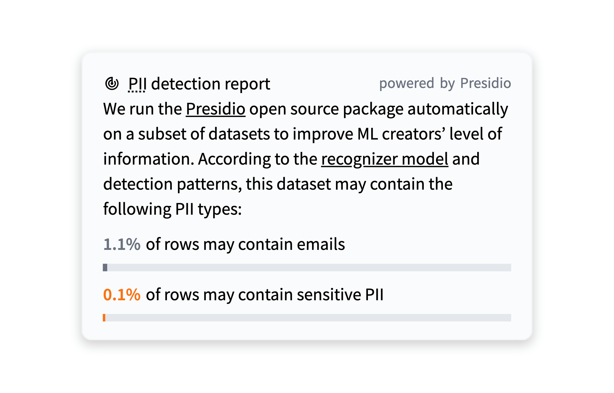

# [Presidio] Experimenting with Automatic PII Detection on the Hub

At Hugging Face, we've noticed an interesting trend in machine learning (ML) datasets – the emergence of Personal Identifiable Information (PII), which poses some unique challenges for ML practitioners.
In this blog post, we'll explore different types of datasets containing PII, the issues they present, and a new feature we're experimenting with on the Dataset Hub to help address these challenges.

## Types of Datasets with PII

We noticed two types of datasets that contain PII:

1. Annotated PII datasets: These datasets are specifically designed to train PII Detection Models, which are used to detect and mask PII. For example, these models can help with online content moderation or provide anonymized databases.
2. Pre-training datasets: These are large-scale datasets, often terabytes in size, that are typically obtained through web crawls. While these datasets are generally filtered to remove certain types of PII, small amounts of sensitive information can still slip through the cracks due to the sheer volume of data and the imperfections of PII Detection Models.

## The Challenges of PII in ML Datasets

The presence of PII in ML datasets can create several challenges for practitioners. 
First and foremost, it raises privacy concerns and can be used to infer sensitive information about individuals.
Additionally, PII can impact the performance of ML models if it is not properly handled.
For example, if a model is trained on a dataset containing PII, it may learn to associate certain PII with specific outcomes, leading to biased predictions or to generating PII from the training set.

## A New Experiment on the Dataset Hub: Presidio Reports

To help address these challenges, we're experimenting with a new feature on the Dataset Hub that uses [Presidio](https://github.com/microsoft/presidio), an open-source state-of-the-art PII detection tool.
Presidio relies on detection patterns and machine learning models to identify PII.

With this new feature, users will be able to see a report that estimates the presence of PII in a dataset.
This information can be valuable for ML practitioners, helping them make informed decisions before training a model.
For example, if the report indicates that a dataset contains sensitive PII, practitioners may choose to further filter the dataset using tools like Presidio.

Dataset owners can also benefit from this feature by using the reports to validate their PII filtering processes before releasing a dataset.

## An Example of a Presidio Report

Let's take a look at an example of a Presidio report for this [pre-training dataset](https://huggingface.co/datasets/allenai/c4):

In this case, Presidio has detected small amounts of emails and sensitive PII in the dataset.

## Conclusion

The presence of PII in ML datasets is an evolving challenge for the ML community. At Hugging Face, we're committed to transparency and helping practitioners navigate these challenges. By experimenting with new features like Presidio reports on the Dataset Hub, we hope to empower users to make informed decisions and build more robust and ethical ML models. Stay tuned for more updates on this exciting development!
