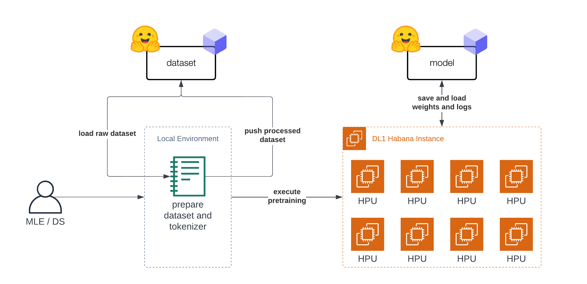
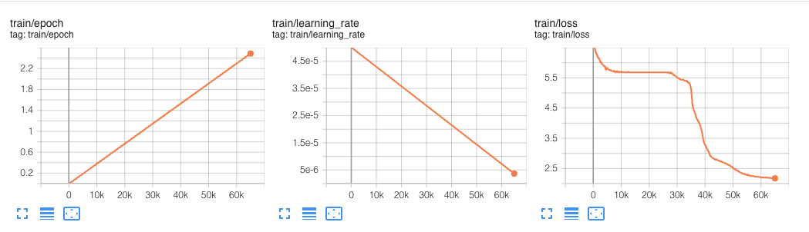

<h1>
   Pre-Training BERT with Hugging Face Transformers and Habana Gaudi
</h1>

<div class="blog-metadata">
    <small>Published Aug 22, 2022.</small>
    <a target="_blank" class="btn no-underline text-sm mb-5 font-sans" href="https://github.com/huggingface/blog/blob/main/prertraining-bert.md">
        Update on GitHub
</div>

<div class="author-card">
    <a href="/philschmid">
        
        <div class="bfc">
            <code>philschmid</code>
            <span class="fullname">Philipp Schmid</span>
        </div>
    </a>
</div>

In this Tutorial, you will learn how to pre-train [BERT-base](https://huggingface.co/bert-base-uncased) from scratch using a Habana Gaudi-based [DL1 instance](https://aws.amazon.com/ec2/instance-types/dl1/) on AWS to take advantage of the cost-performance benefits of Gaudi. We will use the Hugging Face [Transformers](https://huggingface.co/docs/transformers), [Optimum Habana](https://huggingface.co/docs/optimum/main/en/habana_index) and [Datasets](https://huggingface.co/docs/datasets) libraries to pre-train a BERT-base model using masked-language modeling, one of the two original BERT pre-training tasks. Before we get started, we need to set up the deep learning environment.

</a>
    <a target="_blank" class="btn no-underline text-sm mb-5 font-sans" href="https://github.com/philschmid/deep-learning-habana-huggingface/blob/master/pre-training/pre-training-bert.ipynb">
    View Code
</a>


You will learn how to:
1. [Prepare the dataset](#1-prepare-the-dataset)
2. [Train a Tokenizer](#2-train-a-tokenizer)
3. [Preprocess the dataset](#3-preprocess-the-dataset)
4. [Pre-train BERT on Habana Gaudi](#4-pre-train-bert-on-habana-gaudi)

_Note: Steps 1 to 3 can/should be run on a different instance size since those are CPU intensive tasks._

<figure class="image table text-center m-0 w-full">
  
</figure>

**Requirements**

Before we start, make sure you have met the following requirements

* AWS Account with quota for [DL1 instance type](https://aws.amazon.com/ec2/instance-types/dl1/)
* [AWS CLI](https://docs.aws.amazon.com/cli/latest/userguide/getting-started-install.html) installed
* AWS IAM user [configured in CLI](https://docs.aws.amazon.com/cli/latest/userguide/cli-chap-configure.html) with permission to create and manage ec2 instances

**Helpful Resources**

* [Setup Deep Learning environment for Hugging Face Transformers with Habana Gaudi on AWS](https://www.philschmid.de/getting-started-habana-gaudi)
* [Deep Learning setup made easy with EC2 Remote Runner and Habana Gaudi](https://www.philschmid.de/habana-gaudi-ec2-runner)
* [Optimum Habana Documentation](https://huggingface.co/docs/optimum/main/en/habana_index)
* [Pre-training script](./scripts/run_mlm.py)
* [Code: pre-training-bert.ipynb](https://github.com/philschmid/deep-learning-habana-huggingface/blob/master/pre-training/pre-training-bert.ipynb)


## What is BERT? 

BERT, short for Bidirectional Encoder Representations from Transformers, is a Machine Learning (ML) model for natural language processing. It was developed in 2018 by researchers at Google AI Language and serves as a swiss army knife solution to 11+ of the most common language tasks, such as sentiment analysis and named entity recognition.

Read more about BERT in our [BERT 101 🤗 State Of The Art NLP Model Explained](https://huggingface.co/blog/bert-101) blog.

## What is a Masked Language Modeling (MLM)?

MLM enables/enforces bidirectional learning from text by masking (hiding) a word in a sentence and forcing BERT to bidirectionally use the words on either side of the covered word to predict the masked word.

**Masked Language Modeling Example:**

```bash
“Dang! I’m out fishing and a huge trout just [MASK] my line!”
```
Read more about Masked Language Modeling [here](https://huggingface.co/blog/bert-101).

--- 

Let's get started. 🚀

_Note: Steps 1 to 3 were run on a AWS c6i.12xlarge instance._

## 1. Prepare the dataset

The Tutorial is "split" into two parts. The first part (step 1-3) is about preparing the dataset and tokenizer. The second part (step 4) is about pre-training BERT on the prepared dataset. Before we can start with the dataset preparation we need to setup our development environment. As mentioned in the introduction you don't need to prepare the dataset on the DL1 instance and could use your notebook or desktop computer. 

At first we are going to install `transformers`, `datasets` and `git-lfs` to push our tokenizer and dataset to the [Hugging Face Hub](https://huggingface.co) for later use.


```python
!pip install transformers datasets
!sudo apt-get install git-lfs
```

To finish our setup let's log into the [Hugging Face Hub](https://huggingface.co/models) to push our dataset, tokenizer, model artifacts, logs and metrics during training and afterwards to the Hub. 

_To be able to push our model to the Hub, you need to register on the [Hugging Face Hub](https://huggingface.co/join)._

We will use the `notebook_login` util from the `huggingface_hub` package to log into our account. You can get your token in the settings at [Access Tokens](https://huggingface.co/settings/tokens).


```python
from huggingface_hub import notebook_login

notebook_login()

```

Since we are now logged in let's get the `user_id`, which will be used to push the artifacts.


```python
from huggingface_hub import HfApi

user_id = HfApi().whoami()["name"]

print(f"user id '{user_id}' will be used during the example")
```


The [original BERT](https://arxiv.org/abs/1810.04805) was pretrained on [Wikipedia](https://huggingface.co/datasets/wikipedia) and [BookCorpus](https://huggingface.co/datasets/bookcorpus) datasets. Both datasets are available on the [Hugging Face Hub](https://huggingface.co/datasets) and can be loaded with `datasets`. 

_Note: For wikipedia we will use the `20220301`, which is different from the original split._

As a first step we are loading the datasets and merging them together to create on big dataset.


```python
from datasets import concatenate_datasets, load_dataset

bookcorpus = load_dataset("bookcorpus", split="train")
wiki = load_dataset("wikipedia", "20220301.en", split="train")
wiki = wiki.remove_columns([col for col in wiki.column_names if col != "text"])  # only keep the 'text' column

assert bookcorpus.features.type == wiki.features.type
raw_datasets = concatenate_datasets([bookcorpus, wiki])
```
_We are not going to do some advanced dataset preparation, like de-duplication, filtering or any other pre-processing. If you are planning to apply this notebook to train your own BERT model from scratch I highly recommend including those data preparation steps into your workflow. This will help you improve your Language Model._

## 2. Train a Tokenizer

To be able to train our model we need to convert our text into a tokenized format. Most Transformer models are coming with a pre-trained tokenizer, but since we are pre-training our model from scratch we also need to train a Tokenizer on our data. We can train a tokenizer on our data with `transformers` and the `BertTokenizerFast` class. 

More information about training a new tokenizer can be found in our [Hugging Face Course](https://huggingface.co/course/chapter6/2?fw=pt).


```python
from tqdm import tqdm
from transformers import BertTokenizerFast

# repositor id for saving the tokenizer
tokenizer_id="bert-base-uncased-2022-habana"

# create a python generator to dynamically load the data
def batch_iterator(batch_size=10000):
    for i in tqdm(range(0, len(raw_datasets), batch_size)):
        yield raw_datasets[i : i + batch_size]["text"]

# create a tokenizer from existing one to re-use special tokens
tokenizer = BertTokenizerFast.from_pretrained("bert-base-uncased")

```

We can start training the tokenizer with `train_new_from_iterator()`.


```python
bert_tokenizer = tokenizer.train_new_from_iterator(text_iterator=batch_iterator(), vocab_size=32_000)
bert_tokenizer.save_pretrained("tokenizer")
```

We push the tokenizer to the [Hugging Face Hub](https://huggingface.co/models) for later training our model.

```python
# you need to be logged in to push the tokenizer
bert_tokenizer.push_to_hub(tokenizer_id)
```

## 3. Preprocess the dataset

Before we can get started with training our model, the last step is to pre-process/tokenize our dataset. We will use our trained tokenizer to tokenize our dataset and then push it to the hub to load it easily later in our training. The tokenization process is also kept pretty simple, if documents are longer than `512` tokens those are truncated and not split into several documents.


```python
from transformers import AutoTokenizer
import multiprocessing

# load tokenizer
# tokenizer = AutoTokenizer.from_pretrained(f"{user_id}/{tokenizer_id}")
tokenizer = AutoTokenizer.from_pretrained("tokenizer")
num_proc = multiprocessing.cpu_count()
print(f"The max length for the tokenizer is: {tokenizer.model_max_length}")

def group_texts(examples):
    tokenized_inputs = tokenizer(
       examples["text"], return_special_tokens_mask=True, truncation=True, max_length=tokenizer.model_max_length
    )
    return tokenized_inputs

# preprocess dataset
tokenized_datasets = raw_datasets.map(group_texts, batched=True, remove_columns=["text"], num_proc=num_proc)
tokenized_datasets.features

```

As data processing function we will concatenate all texts from our dataset and generate chunks of `tokenizer.model_max_length` (512).

```python
from itertools import chain

# Main data processing function that will concatenate all texts from our dataset and generate chunks of
# max_seq_length.
def group_texts(examples):
    # Concatenate all texts.
    concatenated_examples = {k: list(chain(*examples[k])) for k in examples.keys()}
    total_length = len(concatenated_examples[list(examples.keys())[0]])
    # We drop the small remainder, we could add padding if the model supported it instead of this drop, you can
    # customize this part to your needs.
    if total_length >= tokenizer.model_max_length:
        total_length = (total_length // tokenizer.model_max_length) * tokenizer.model_max_length
    # Split by chunks of max_len.
    result = {
        k: [t[i : i + tokenizer.model_max_length] for i in range(0, total_length, tokenizer.model_max_length)]
        for k, t in concatenated_examples.items()
    }
    return result

tokenized_datasets = tokenized_datasets.map(group_texts, batched=True, num_proc=num_proc)
# shuffle dataset
tokenized_datasets = tokenized_datasets.shuffle(seed=34)

print(f"the dataset contains in total {len(tokenized_datasets)*tokenizer.model_max_length} tokens")
# the dataset contains in total 3417216000 tokens
```

The last step before we can start with our training is to push our prepared dataset to the hub.

```python
# push dataset to hugging face
dataset_id=f"{user_id}/processed_bert_dataset"
tokenized_datasets.push_to_hub(f"{user_id}/processed_bert_dataset")
```

## 4. Pre-train BERT on Habana Gaudi

In this example, we are going to use Habana Gaudi on AWS using the DL1 instance to run the pre-training. We will use the [Remote Runner](https://github.com/philschmid/deep-learning-remote-runner) toolkit to easily launch our pre-training on a remote DL1 Instance from our local setup. You can check-out [Deep Learning setup made easy with EC2 Remote Runner and Habana Gaudi](https://www.philschmid.de/habana-gaudi-ec2-runner) if you want to know more about how this works. 


```python
!pip install rm-runner
```

When using GPUs you would use the [Trainer](https://huggingface.co/docs/transformers/v4.19.4/en/main_classes/trainer#transformers.Trainer) and [TrainingArguments](https://huggingface.co/docs/transformers/v4.19.4/en/main_classes/trainer#transformers.TrainingArguments). Since we are going to run our training on Habana Gaudi we are leveraging the `optimum-habana` library, we can use the [GaudiTrainer](https://huggingface.co/docs/optimum/main/en/habana_trainer) and GaudiTrainingArguments instead. The `GaudiTrainer` is a wrapper around the [Trainer](https://huggingface.co/docs/transformers/v4.19.4/en/main_classes/trainer#transformers.Trainer) that allows you to pre-train or fine-tune a transformer model on Habana Gaudi instances.

```diff
-from transformers import Trainer, TrainingArguments 
+from optimum.habana import GaudiTrainer, GaudiTrainingArguments

# define the training arguments
-training_args = TrainingArguments(
+training_args = GaudiTrainingArguments(
+  use_habana=True,
+  use_lazy_mode=True,
+  gaudi_config_name=path_to_gaudi_config,
  ...
)

# Initialize our Trainer
-trainer = Trainer(
+trainer = GaudiTrainer(
    model=model,
    args=training_args,
    train_dataset=train_dataset
    ... # other arguments
)
```

The `DL1` instance we use has 8 available HPU-cores meaning we can leverage distributed data-parallel training for our model. 
To run our training as distributed training we need to create a training script, which can be used with multiprocessing to run on all HPUs. 
We have created a [run_mlm.py](https://github.com/philschmid/deep-learning-habana-huggingface/blob/master/pre-training/scripts/run_mlm.py) script implementing masked-language modeling using the `GaudiTrainer`. To execute our distributed training we use the `DistributedRunner` runner from `optimum-habana` and pass our arguments. Alternatively, you could check-out the [gaudi_spawn.py](https://github.com/huggingface/optimum-habana/blob/main/examples/gaudi_spawn.py) in the [optimum-habana](https://github.com/huggingface/optimum-habana) repository.


Before we can start our training we need to define the `hyperparameters` we want to use for our training. We are leveraging the [Hugging Face Hub](https://huggingface.co/models) integration of the `GaudiTrainer` to automatically push our checkpoints, logs and metrics during training into a repository. 


```python
from huggingface_hub import HfFolder

# hyperparameters
hyperparameters = {
    "model_config_id": "bert-base-uncased",
    "dataset_id": "philschmid/processed_bert_dataset",
    "tokenizer_id": "philschmid/bert-base-uncased-2022-habana",
    "gaudi_config_id": "philschmid/bert-base-uncased-2022-habana",
    "repository_id": "bert-base-uncased-2022",
    "hf_hub_token": HfFolder.get_token(),  # need to be logged in with `huggingface-cli login`
    "max_steps": 100_000,
    "per_device_train_batch_size": 32,
    "learning_rate": 5e-5,
}
hyperparameters_string = " ".join(f"--{key} {value}" for key, value in hyperparameters.items())

```

We can start our training by creating a `EC2RemoteRunner` and then `launch` it. This will then start our AWS EC2 DL1 instance and run our `run_mlm.py` script on it using the `huggingface/optimum-habana:latest` container.


```python
from rm_runner import EC2RemoteRunner
# create ec2 remote runner
runner = EC2RemoteRunner(
  instance_type="dl1.24xlarge",
  profile="hf-sm",  # adjust to your profile
  region="us-east-1",
  container="huggingface/optimum-habana:4.21.1-pt1.11.0-synapse1.5.0"
  )

# launch my script with gaudi_spawn for distributed training
runner.launch(
    command=f"python3 gaudi_spawn.py --use_mpi --world_size=8 run_mlm.py {hyperparameters_string}",
    source_dir="scripts",
)

```

<figure class="image table text-center m-0 w-full">
  
</figure>
_This [experiment](https://huggingface.co/philschmid/bert-base-uncased-2022-habana-test-6) ran for 60k steps_

In our `hyperparameters` we defined a `max_steps` property, which limited the pre-training to only `100_000` steps. The `100_000` steps with a global batch size of `256` took around 12,5 hours. 

BERT was originally pre-trained on [1 Million Steps](https://arxiv.org/pdf/1810.04805.pdf) with a global batch size of `256`: 
> We train with batch size of 256 sequences (256 sequences * 512 tokens = 128,000 tokens/batch) for 1,000,000 steps, which is approximately 40 epochs over the 3.3 billion word corpus. 

Meaning if we want to do a full pre-training it would take around 125h hours (12,5 hours * 10) and would cost us around ~$1,650 using  Habana Gaudi on AWS, which is extremely cheap.

For comparison, the DeepSpeed Team, who holds the record for the [fastest BERT-pretraining](https://www.deepspeed.ai/tutorials/bert-pretraining/), [reported](https://www.deepspeed.ai/tutorials/bert-pretraining/) that pre-training BERT on 1 [DGX-2](https://www.nvidia.com/en-us/data-center/dgx-2/) (powered by 16 NVIDIA V100 GPUs with 32GB of memory each) takes around 33,25 hours.

To compare the cost we can use the [p3dn.24xlarge](https://aws.amazon.com/de/ec2/instance-types/p3/) as reference, which comes with 8x NVIDIA V100 32GB GPUs and costs ~31,22$/h. We would need two of these instances to have the same "setup" as the one DeepSpeed reported, for now we are ignoring any overhead created to the multi-node setup (I/O, Network etc.). 
This would bring the cost of the DeepSpeed GPU based training on AWS to around ~$2,075, which is 25% more than what Habana Gaudi currently delivers. 

_Something to note here is that using [DeepSpeed](https://www.deepspeed.ai/tutorials/bert-pretraining/#deepspeed-single-gpu-throughput-results) in general improves the performance by a factor of ~1.5 - 2. A factor of ~1.5 - 2x, means that the same pre-training job without DeepSpeed would likely take twice as long and cost twice as much or ~$3-4k._ 

We are looking forward on to do the experiment again once the [Gaudi DeepSpeed integration](https://docs.habana.ai/en/latest/PyTorch/DeepSpeed/DeepSpeed_User_Guide.html#deepspeed-configs) is more widely available.


## Conclusion

That's it for this Tutorial. Now you know the basics on how to pre-train BERT from scratch using Hugging Face Transformers and Habana Gaudi. You also saw how easy it is to migrate from the `Trainer` to the `GaudiTrainer`. 

We compared our implementation with the [fastest BERT-pretraining](https://www.deepspeed.ai/Tutorials/bert-pretraining/) results and saw that Habana Gaudi still delivers a 25% cost reduction and allows us to pre-train BERT for ~$1,650. 

Those results are incredible since it will allow companies to adapt their pre-trained models to their language and domain to [improve accuracy up to 10%](https://huggingface.co/pile-of-law/legalbert-large-1.7M-1#evaluation-results) compared to the general BERT models.

If you are interested in training your own BERT or other Transformers models from scratch to reduce cost and improve accuracyy, [contact our experts](mailto:expert-acceleration@huggingface.co) to learn about our [Expert Acceleration Program](https://huggingface.co/support). To learn more about Habana solutions, [read about our partnership and how to contact them](https://huggingface.co/hardware/habana).

Code: [pre-training-bert.ipynb](https://github.com/philschmid/deep-learning-habana-huggingface/blob/master/pre-training/pre-training-bert.ipynb)

--- 

Thanks for reading! If you have any questions, feel free to contact me, through [Github](https://github.com/huggingface/transformers), or on the [forum](https://discuss.huggingface.co/c/optimum/59). You can also connect with me on [Twitter](https://twitter.com/_philschmid) or [LinkedIn](https://www.linkedin.com/in/philipp-schmid-a6a2bb196/).