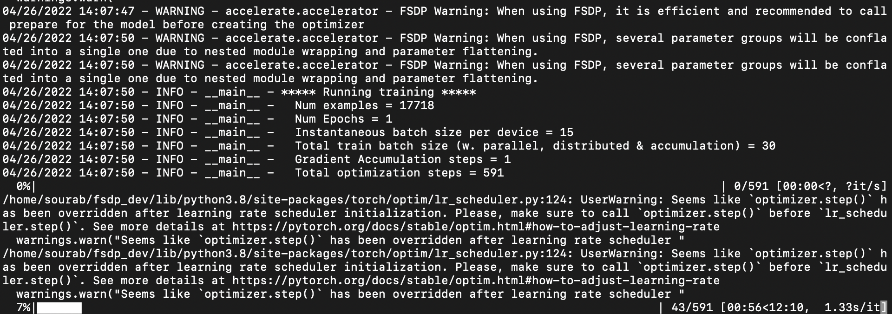
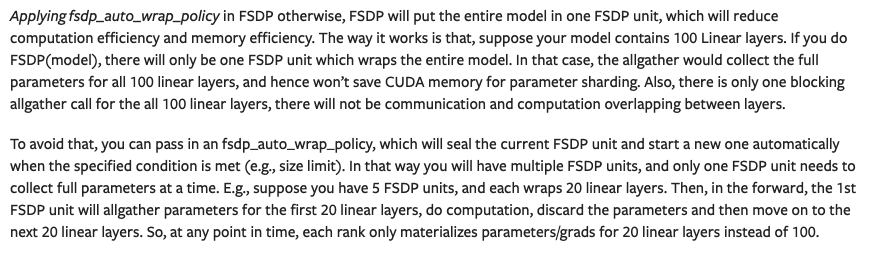
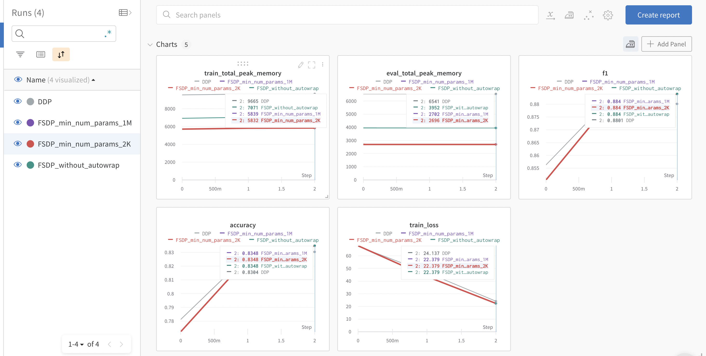
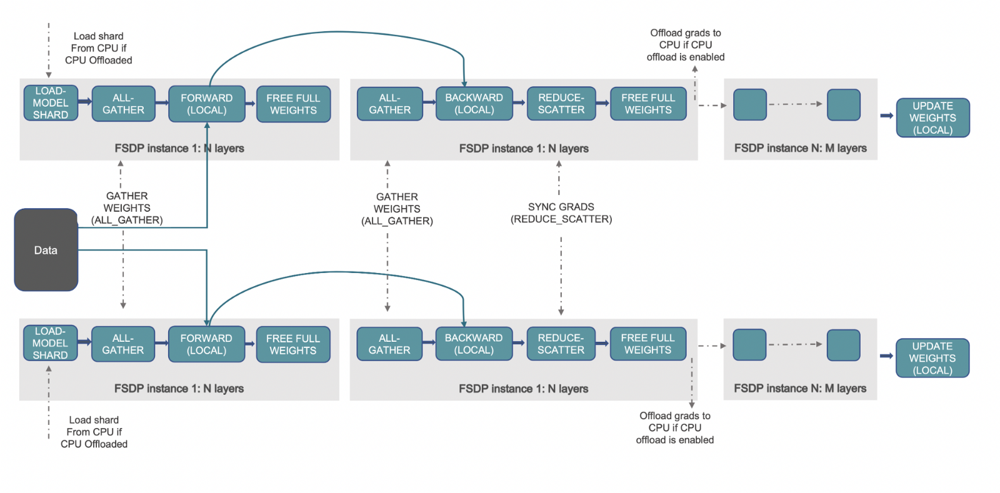

# Accelerate Large Model Training using PyTorch Fully Sharded Data Parallel


In this post we will look at how we can leverage **[Accelerate](https://github.com/huggingface/accelerate)** Library for training large models which enables users to leverage the latest features of **[PyTorch FullyShardedDataParallel (FSDP)](https://pytorch.org/blog/introducing-pytorch-fully-sharded-data-parallel-api/)**.

## Motivation 🤗

**With the ever increasing scale, size and parameters of the Machine Learning (ML) models, ML practitioners are finding it difficult to train or even load such large models on their hardware.** On one hand, it has been found that large models learn quickly (data and compute efficient) and are significantly more performant when compared to smaller models [1]; on the other hand, it  becomes prohibitive to train such models on most of the available hardware.  

Distributed training is the key to enable training such large ML models. There have been major recent advances in the field of **Distributed Training at Scale**. Few the most notable advances are given below:
1. Data Parallelism using ZeRO - Zero Redundancy Optimizer [2]
    1. Stage 1: Shards optimizer states across data parallel workers/GPUs
    2. Stage 2: Shards optimizer states + gradients across data parallel workers/GPUs
    3. Stage 3: Shards optimizer states + gradients + model parameters across data parallel workers/GPUs
    4. CPU Offload: Offloads the gradients + optimizer states to CPU building on top of ZERO Stage 2 [3]
2. Tensor Parallelism [4]: Form of model parallelism wherein sharding parameters of individual layers with huge number of parameters across accelerators/GPUs is done in a clever manner to achieve parallel computation while avoiding expensive communication synchronization overheads. 
3. Pipeline Parallelism [5]: Form of model parallelism wherein different layers of the model are put across different accelerators/GPUs and pipelining is employed to keep all the accelerators running simultaneously. Here, for instance, the second accelerator/GPU computes on the first micro-batch while the first accelerator/GPU computes on the second micro-batch. 
4. 3D parallelism [3]: Employs Data Parallelism using ZERO + Tensor Parallelism + Pipeline Parallelism to train humongous models in the order of 100s of Billions of parameters. For instance, BigScience 176B parameters Language Model employ this [6].

In this post we will look at Data Parallelism using ZeRO and more specifically the latest PyTorch feature **[FullyShardedDataParallel (FSDP)](https://pytorch.org/blog/introducing-pytorch-fully-sharded-data-parallel-api/)**.  **[DeepSpeed](https://github.com/microsoft/deepspeed)** and **[FairScale](https://github.com/facebookresearch/fairscale/)** have implemented the core ideas of the ZERO paper. These have already been integrated in `transformers` Trainer and accompanied by great blog [Fit More and Train Faster With ZeRO via DeepSpeed and FairScale](https://huggingface.co/blog/zero-deepspeed-fairscale) [10]. PyTorch recently upstreamed the Fairscale FSDP into PyTorch Distributed with additional optimizations.

## Accelerate 🚀:  Leverage PyTorch FSDP without any code changes

We will look at the task of Causal Language Modelling using GPT-2 Large (762M) and XL (1.5B) model variants.

Below is the code for pre-training GPT-2 model. It is similar to the official causal language modeling example [here](https://github.com/huggingface/transformers/blob/main/examples/pytorch/language-modeling/run_clm_no_trainer.py) with the addition of 2 arguments `n_train` (2000) and `n_val` (500) to prevent preprocessing/training on entire data in order to perform quick proof of concept benchmarks.

<a href="./assets/62_pytorch_fsdp/run_clm_no_trainer.py" target="_parent">run_clm_no_trainer.py</a>

Sample FSDP config after running the command `accelerate config`:
```bash
compute_environment: LOCAL_MACHINE
deepspeed_config: {}
distributed_type: FSDP
fsdp_config:
  min_num_params: 2000
  offload_params: false
  sharding_strategy: 1
machine_rank: 0
main_process_ip: null
main_process_port: null
main_training_function: main
mixed_precision: 'no'
num_machines: 1
num_processes: 2
use_cpu: false
```

### Multi-GPU FSDP

Here, we experiment on the Single-Node Multi-GPU setting. We compare the performance of Distributed Data Parallel (DDP) and FSDP in various configurations. First, GPT-2 Large(762M) model is used wherein DDP works with certain batch sizes without throwing Out Of Memory (OOM) errors. Next, GPT-2 XL (1.5B) model is used wherein DDP fails with OOM error even on batch size of 1. We observe that FSDP enables larger batch sizes for GPT-2 Large model and it enables training the GPT-2 XL model with decent batch size unlike DDP.

**Hardware setup**: 2X24GB NVIDIA Titan RTX GPUs. 

Command for training GPT-2 Large Model (762M parameters):
```bash
export BS=#`try with different batch sizes till you don't get OOM error,
#i.e., start with larger batch size and go on decreasing till it fits on GPU`

time accelerate launch run_clm_no_trainer.py \
--model_name_or_path gpt2-large \
--dataset_name wikitext \
--dataset_config_name wikitext-2-raw-v1 \
--per_device_train_batch_size $BS 
--per_device_eval_batch_size $BS 
--num_train_epochs 1 
--block_size 128
```
Sample FSDP Run:



| Method | Batch Size Max ($BS) | Approx Train Time (minutes) | Notes |
| --- | --- | --- | --- |
| DDP (Distributed Data Parallel) | 7 | 15 |  |
| DDP + FP16 | 7 | 8 |  |
| FSDP with SHARD_GRAD_OP | 11 | 11 |  |
| FSDP with min_num_params = 1M + FULL_SHARD | 15 | 12 |  |
| FSDP with min_num_params = 2K + FULL_SHARD | 15 | 13 |  |
| FSDP with min_num_params = 1M  + FULL_SHARD  + Offload to CPU  | 20 | 23 |  |
| FSDP with min_num_params = 2K + FULL_SHARD + Offload to CPU | 22 | 24 |  |

Table 1: Benchmarking FSDP on GPT-2 Large (762M) model

With respect to DDP, from Table 1 we can observe that FSDP **enables larger batch sizes**, up to **2X-3X** without and with CPU offload setting, respectively. In terms of train time, DDP with mixed precision is the fastest followed by FSDP using ZERO Stage 2 and Stage 3, respectively. As the task of causal language modelling always has fixed context sequence length (--block_size), the train time speedup with FSDP wasn’t that great. For applications with dynamic batching, FSDP which enables larger batch sizes will likely have considerable speed up in terms of train time. FSDP mixed precision support currently has few [issues](https://github.com/pytorch/pytorch/issues/75676) with transformer. Once this is supported, the training time speed up will further improve considerably.


#### CPU Offloading to enable training humongous models that won’t fit the GPU memory

Command for training GPT-2 XL Model (1.5B parameters):
```bash
export BS=#`try with different batch sizes till you don't get OOM error,
#i.e., start with larger batch size and go on decreasing till it fits on GPU`

time accelerate launch run_clm_no_trainer.py \
--model_name_or_path gpt2-xl \
--dataset_name wikitext \
--dataset_config_name wikitext-2-raw-v1 \
--per_device_train_batch_size $BS 
--per_device_eval_batch_size $BS 
--num_train_epochs 1 
--block_size 128
```

| Method | Batch Size Max ($BS) | Num GPUs | Approx Train Time (Hours) | Notes |
| --- | --- | --- | --- | --- |
| DDP | 1 | 1 | NA | OOM Error RuntimeError: CUDA out of memory. Tried to allocate 40.00 MiB (GPU 0; 23.65 GiB total capacity; 22.27 GiB already allocated; 20.31 MiB free; 22.76 GiB reserved in total by PyTorch)  |
| DDP | 1 | 2 | NA | OOM Error RuntimeError: CUDA out of memory. Tried to allocate 40.00 MiB (GPU 0; 23.65 GiB total capacity; 22.27 GiB already allocated; 20.31 MiB free; 22.76 GiB reserved in total by PyTorch) |
| DDP + FP16 | 1 | 1 | NA | OOM Error RuntimeError: CUDA out of memory. Tried to allocate 40.00 MiB (GPU 0; 23.65 GiB total capacity; 22.27 GiB already allocated; 20.31 MiB free; 22.76 GiB reserved in total by PyTorch)  |
| FSDP with min_num_params = 2K | 5 | 2 | 0.6 |  |
| FSDP with min_num_params = 2K + Offload to CPU | 10 | 1 | 3 |  |
| FSDP with min_num_params = 2K + Offload to CPU | 14 | 2 | 1.16 |  |

Table 2: Benchmarking FSDP on GPT-2 XL (1.5B) model

From Table 2, we can observe that DDP (w and w/o fp16) isn’t even able to run with batch size of 1 and results in CUDA OOM error. FSDP with Zero-Stage 3 is able to be run on 2 GPUs with batch size of 5 (effective batch size =10 (5 X 2)). FSDP with CPU offload can further increase the max batch size to 14 per GPU when using 2 GPUs. **FSDP with CPU offload enables training GPT-2 1.5B model on a single GPU with a batch size of 10**. This enables ML practitioners with minimal compute resources to train such large models, thereby democratizing large model training.

### Capabilities and limitations of the FSDP Integration

Let’s dive into the current support that Accelerate provides for FSDP integration and the known limitations.

**Required PyTorch version for FSDP support**: PyTorch Nightly (or 1.12.0 if you read this after it has been released) as the model saving with FSDP activated is only available with recent fixes.

**Configuration through CLI:**

1. **Sharding Strategy**: [1] FULL_SHARD, [2] SHARD_GRAD_OP
2. **Min Num Params**: FSDP's minimum number of parameters for Default Auto Wrapping.
3. **Offload Params**: Decides Whether to offload parameters and gradients to CPU.

For more control, users can leverage the `FullyShardedDataParallelPlugin` wherein they can specify `auto_wrap_policy`, `backward_prefetch` and `ignored_modules`.

After creating an instance of this class, users can pass it when creating the Accelerator object.

For more information on these options, please refer to the PyTorch [FullyShardedDataParallel](https://github.com/pytorch/pytorch/blob/0df2e863fbd5993a7b9e652910792bd21a516ff3/torch/distributed/fsdp/fully_sharded_data_parallel.py#L236) code.

Next, we will see the importance of the `min_num_params` config. Below is an excerpt from [8] detailing the importance of FSDP Auto Wrap Policy.



(Source: [link](https://pytorch.org/tutorials/intermediate/FSDP_tutorial.html))

When using the `default_auto_wrap_policy`, a layer is wrapped in FSDP module if the number of parameters in that layer is more than the min_num_params . The code for finetuning BERT-Large (330M) model on the GLUE MRPC task is the official complete NLP example outlining how to properly use FSDP feature with the addition of utilities for tracking peak memory usage.

[fsdp_with_peak_mem_tracking.py](https://github.com/huggingface/accelerate/tree/main/examples/by_feature/fsdp_with_peak_mem_tracking.py)

We leverage the tracking functionality support in Accelerate to log the train and evaluation peak memory usage along with evaluation metrics. Below is the snapshot of the plots from wandb [run](https://wandb.ai/smangrul/FSDP-Test?workspace=user-smangrul). 


We can observe that the DDP takes twice as much memory as FSDP with auto wrap.  FSDP without auto wrap takes more memory than FSDP with auto wrap but considerably less than that of DDP. FSDP with auto wrap with min_num_params=2k takes marginally less memory when compared to setting with min_num_params=1M. This highlights the importance of the FSDP Auto Wrap Policy and users should play around with the `min_num_params` to find the setting which considerably saves memory and isn’t resulting in lot of communication overhead. PyTorch team is working on auto tuning tool for this config as mentioned in [8].

#### **Few caveats to be aware of**

- PyTorch FSDP auto wraps sub-modules, flattens the parameters and shards the parameters in place. Due to this, any optimizer created before model wrapping gets broken and occupies more memory. Hence, it is highly recommended and efficient to prepare model before creating optimizer. `Accelerate` will automatically wrap the model and create an optimizer for you in case of single model with a warning message.
    
    > FSDP Warning: When using FSDP, it is efficient and recommended to call prepare for the model before creating the optimizer
    > 

However, below is the recommended way to prepare model and optimizer while using FSDP:

```diff
model = AutoModelForSequenceClassification.from_pretrained("bert-base-cased", return_dict=True)
+ model = accelerator.prepare(model)

optimizer = torch.optim.AdamW(params=model.parameters(), lr=lr)

- model, optimizer, train_dataloader, eval_dataloader, lr_scheduler = accelerator.prepare(model,
-        optimizer, train_dataloader, eval_dataloader, lr_scheduler
-    )

+ optimizer, train_dataloader, eval_dataloader, lr_scheduler = accelerator.prepare(
+         optimizer, train_dataloader, eval_dataloader, lr_scheduler
+        )
```

- In case of a single model, if you have created optimizer with multiple parameter groups and called prepare with them together, then the parameter groups will be lost and the following warning is displayed:
    
    > FSDP Warning: When using FSDP, several parameter groups will be conflated into a single one due to nested module wrapping and parameter flattening.
    > 
    
This is because parameter groups created before wrapping will have no meaning post wrapping due parameter flattening of nested FSDP modules into 1D arrays (which can consume many layers). For instance, below are the named parameters of FSDP model on GPU 0 (When using 2 GPUs. Around 55M (110M/2) params in 1D arrays as this will have the 1st shard of the parameters). Here, if one has applied no weight decay for [bias, LayerNorm.weight] named parameters of unwrapped BERT-Base model, it can’t be applied to the below FSDP wrapped model as there are no named parameters with either of those strings and the parameters of those layers are concatenated with parameters of various other layers. More details mentioned in this [issue](https://github.com/pytorch/pytorch/issues/76501) (`The original model parameters' .grads are not set, meaning that they cannot be optimized separately (which is why we cannot support multiple parameter groups)`).

    ```
    {
    '_fsdp_wrapped_module.flat_param': torch.Size([494209]),
    
    '_fsdp_wrapped_module._fpw_module.bert.embeddings.word_embeddings._fsdp_wrapped_module.flat_param': torch.Size([11720448]),
    
    '_fsdp_wrapped_module._fpw_module.bert.encoder._fsdp_wrapped_module.flat_param': torch.Size([42527232])
    }
    ```
- In case of multiple models, it is necessary to prepare the models before creating optimizers else it will throw an error.

- Mixed precision is currently not supported with FSDP as we wait for PyTorch to fix support for it.

## How it works 📝



(Source: [link](https://pytorch.org/blog/introducing-pytorch-fully-sharded-data-parallel-api/))

The above workflow gives an overview of what happens behind the scenes when FSDP is activated. Let's first understand how DDP works and how FSDP improves it. In DDP, each worker/accelerator/GPU has a replica of the entire model parameters, gradients and optimizer states. Each worker gets a different batch of data, it goes through the forwards pass, a loss is computed followed by the backward pass to generate gradients. Now, an all-reduce operation is performed wherein each worker gets the gradients from the remaining workers and averaging is done. In this way, each worker now has the same global gradients which are used by the optimizer to update the model parameters. We can see that having full replicas consume a lot of redundant memory on each GPU, which limits the batch size as well as the size of the models. 

FSDP precisely addresses this by sharding the optimizer states, gradients and model parameters across the data parallel workers. It further facilitates CPU offloading of all those tensors, thereby enabling loading large models which won't fit the available GPU memory. Similar to DDP, each worker gets a different batch of data. During the forward pass, if the CPU offload is enabled, the parameters of the local shard are first copied to the GPU/accelerator. Then, each worker performs all-gather operation for a given FSDP wrapped module/layer(s) to all get the needed parameters, computation is performed followed by releasing/emptying the parameter shards of other workers. This continues for all the FSDP modules. The loss gets computed after the forward pass and during the backward pass, again an all-gather operation is performed to get all the needed parameters for a given FSDP module, computation is performed to get local gradients followed by releasing the shards of other workers. Now, the local gradients are averaged and sharded to each relevant workers using reduce-scatter operation. This allows each worker to update the parameters of its local shard. If CPU offload is activated, the gradients are passed to CPU for updating parameters directly on CPU. 

Please refer [7, 8, 9] for all the in-depth details on the workings of the PyTorch FSDP and the extensive experimentation carried out using this feature.

## Issues

If you encounter any issues with the integration part of PyTorch FSDP, please open an Issue in [accelerate](https://github.com/huggingface/accelerate/issues).

But if you have problems with PyTorch FSDP configuration, and deployment - you need to ask the experts in their domains, therefore, please, open a [PyTorch Issue](https://github.com/pytorch/pytorch/issues) instead.


## References

[1] [Train Large, Then Compress: Rethinking Model Size for Efficient Training and Inference of Transformers](http://nlp.cs.berkeley.edu/pubs/Li-Wallace-Shen-Lin-Keutzer-Klein-Gonzalez_2020_Transformers_paper.pdf)

[2] [ZeRO: Memory Optimizations Toward Training Trillion Parameter Models](https://arxiv.org/pdf/1910.02054v3.pdf)

[3] [DeepSpeed: Extreme-scale model training for everyone - Microsoft Research](https://www.microsoft.com/en-us/research/blog/deepspeed-extreme-scale-model-training-for-everyone/)

[4] [Megatron-LM: Training Multi-Billion Parameter Language Models Using
Model Parallelism](https://arxiv.org/pdf/1909.08053.pdf)

[5] [Introducing GPipe, an Open Source Library for Efficiently Training Large-scale Neural Network Models](https://ai.googleblog.com/2019/03/introducing-gpipe-open-source-library.html)

[6] [Which hardware do you need to train a 176B parameters model?](https://bigscience.huggingface.co/blog/which-hardware-to-train-a-176b-parameters-model)

[7] [Introducing PyTorch Fully Sharded Data Parallel (FSDP) API | PyTorch](https://pytorch.org/blog/introducing-pytorch-fully-sharded-data-parallel-api/)

[8] [Getting Started with Fully Sharded Data Parallel(FSDP) — PyTorch Tutorials 1.11.0+cu102 documentation](https://pytorch.org/tutorials/intermediate/FSDP_tutorial.html)

[9] [Training a 1 Trillion Parameter Model With PyTorch Fully Sharded Data Parallel on AWS | by PyTorch | PyTorch | Mar, 2022 | Medium](https://medium.com/pytorch/training-a-1-trillion-parameter-model-with-pytorch-fully-sharded-data-parallel-on-aws-3ac13aa96cff)

[10] [Fit More and Train Faster With ZeRO via DeepSpeed and FairScale](https://huggingface.co/blog/zero-deepspeed-fairscale)

