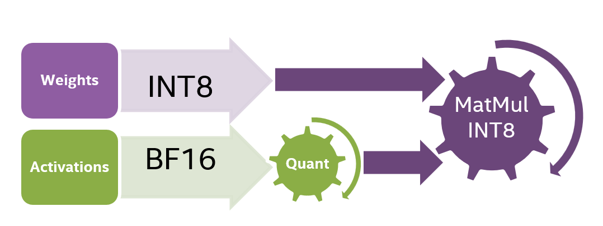
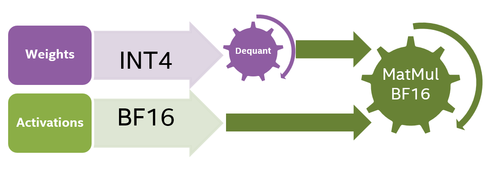

# Fast Code Generation with Q4-StarCoder and Speculative Decoding on Intel Xeon

## Introduction

Recently, code generation models have become very popular, especially with the release of state-of-the-art open-source models such as BigCode’s [StarCoder](https://huggingface.co/blog/starcoder) and Meta AI’s [Code Llama](https://ai.meta.com/blog/code-llama-large-language-model-coding). A growing number of works focuses on making Large Language Models (LLMs) more optimized and accessible. In this blog, we are happy to share the latest results of LLM optimization on Intel Xeon focusing on the popular code generation LLM, StarCoder.

The StarCoder Model is a cutting-edge LLM specifically designed for assisting the user with various coding tasks such as code completion, bug fixing, code summarization, and even generating code snippets from natural language descriptions. The StarCoder model is a member of the StarCoder family which includes the StarCoderBase variant as well. These Large Language Models for Code (Code LLMs) are trained on permissively licensed data from GitHub, including over 80 programming languages, Git commits, GitHub issues, and Jupyter notebooks. In this work we show more than 7x inference acceleration of StarCoder-15B model on Intel 4th generation Xeon by integrating 8bit and 4bit quantization with [assisted generation](https://huggingface.co/blog/assisted-generation).

## Step 1: Baseline and Evaluation

We establish our baseline using StarCoder (15B) coupled with PyTorch and [Intel Extension for PyTorch](https://github.com/intel/intel-extension-for-pytorch) (IPEX). There are several datasets designed to evaluate the quality of automated code completion. In this work, we use the popular [HumanEval](https://huggingface.co/datasets/openai_humaneval) dataset to evaluate the model’s quality and performance. HumanEval consists of 164 programming problems, in the form of a function signature with a docstring and the model completes the function’s code. The average length of the prompt is 139. We measure the quality using Bigcode Evaluation Harness and report the pass@1 metric. We measure model performance by measuring the Time To First Token (TTFT) and Time Per Output Token (TPOT) on the HumanEval test set and report the average TTFT and TPOT. 
The 4th generation Intel Xeon processors feature AI infused acceleration known as Intel® Advanced Matrix Extensions (Intel® AMX). Specifically, it has built-in [BFloat16](https://en.wikipedia.org/wiki/Bfloat16_floating-point_format) (BF16) and Int8 GEMM accelerators in every core to accelerate deep learning training and inference workloads. AMX accelerated inference is introduced through PyTorch 2.0 and [Intel Extension for PyTorch](https://github.com/intel/intel-extension-for-pytorch) (IPEX) in addition to other optimizations for various common operators used in LLM inference (e.g. layer normalization, SoftMax, scaled dot product).
As the starting point we use out-of-the-box optimizations in PyTorch and IPEX to perform inference using a BF16 model. Figure 1 shows the latency of the baseline model and Tables 1 and 2 show its
latency as well as its accuracy.

 
  
<em>Figure 1. Latency of the baseline model.</em> 

 

### LLM Quantization

Text generation in LLMs is performed in an auto-regressive manner thus requiring the entire model to be loaded from memory to the CPU for each new token generation. We find that the bandwidth between the off-chip memory (DRAM) and the CPU poses the biggest bottleneck in the token generation process. Quantization is a popular approach for mitigating this issue. It reduces model size and hence decreases model weights loading time.

In this work we focus on two types of quantization:

1. Weight Only Quantization (WOQ) - the weights of the model being quantized but not the activations while computation is performed in higher precision (e.g. BF16) which requires dequantization.
2. Static Quantization (SQ) - both the weights and the activations are quantized. This quantization process includes pre-calculating the quantization parameters through a calibration step which enables the computation to be executed in lower precision (e.g. INT8). Figure 2 shows the INT8 static quantization computation process.

## Step 2: 8bit Quantization (INT8)
[SmoothQuant](https://huggingface.co/blog/generative-ai-models-on-intel-cpu) is a post training quantization algorithm that is used to quantize LLMs for INT8 with minimal accuracy loss. Static quantization methods were shown to be underperforming on LLMs due to large magnitude outliers found in specific channels of the activations. Since activations are quantized token-wise, static quantization results in either truncated outliers or underflowed low-magnitude activations. SmoothQuant algorithm solves this problem by introducing a pre-quantization phase where additional smoothing scaling factors are applied to both activations and weights which smooths the outliers in the activations and ensures better utilization of the quantization levels.

 
  
<em>Figure 2. Computation diagram for INT8 static quantization.</em> 

 

Using IPEX, we apply SmoothQuant to the StarCoder model. We used the test split of the [MBPP](https://huggingface.co/datasets/nuprl/MultiPL-E) dataset as our calibration dataset and introduced Q8-StarCoder. Our evaluation shows that Q8-StarCoder holds no accuracy loss over the baseline (if fact, there is even a slight improvement). In terms of performance, Q8-StarCoder achieves ~2.19x speedup in TTFT and ~2.20x speedup in TPOT. Figure 3 shows the latency (TPOT) of Q8-StarCoder compared to the BF16 baseline model.

 
  
<em>Figure 3. Latency speedup of quantized model.</em> 

 

## Step 3: 4bit Quantization (INT4)

Although INT8 decreases the model size by 2x compared to BF16 (8 bits per weight compared with 16 bits), the memory bandwidth is still the biggest bottleneck. To further decrease the model’s loading time from the memory, we quantized the model’s weights to 4 bits using WOQ. Note that WOQ requires dequantization to 16bit before the computation (Figure 4). 

 
  
<em>Figure 4. Computation diagram for model quantized to INT4.</em> 

 

A vanilla tensor-wise asymmetric Round To Nearest (RTN) quantization poses challenges and often results in accuracy reduction, however it was shown in the [literature](https://arxiv.org/pdf/2206.01861.pdf) (Zhewei Yao, 2022) that groupwise quantization of the model’s weights helps in retaining accuracy. To avoid accuracy degradation, we perform 4-bit quantization in groups (e.g. 128) of consequent values along the input channel, with scaling factors calculated per group. We found that groupwise 4bit RTN is sufficient to retain StarCoder’s accuracy on the HumanEval dataset. The 4-bit model achieves 3.35x speedup in TPOT compared to the BF16 baseline (figure 5), however it suffers from expected slowdown in TTFT due to the overhead of dequantizing the 4bit to 16bit before computation. 

 
  
<em>Figure 5. Latency speedup of quantized model.</em> 

 

## Step 4: Assisted Generation (AG)
 
Another method to mitigate the high inference latency and alleviate the memory bandwidth bottleneck issue is [Assisted generation](https://huggingface.co/blog/assisted-generation) (AG) which is a practical implementation of [speculative decoding](https://arxiv.org/pdf/2211.17192.pdf). AG mitigates this issue by better balancing memory and computational operations. It relies on the premise that a smaller and faster assistant draft model often generates the same tokens as a larger target model. 

AG uses a small, fast draft model to greedily generate K candidate tokens. These output tokens are generated much faster, but some of them may not resemble the output tokens of the original target model. Hence, in the next step, the target model checks the validity of all K candidate tokens in parallel in a single forward pass. This process speeds up the decoding since the latency of parallel decoding of K tokens is smaller than generating K tokens autoregressively.

For accelerating StarCoder, we use [bigcode/tiny_starcoder_py](https://huggingface.co/bigcode/tiny_starcoder_py) as the draft model. This model shares similar architecture with StarCoder but includes only 164M parameters - ~95x smaller than StarCoder, and thus much faster. To achieve an even greater speedup, we applied quantization to the draft model as well. We consider both SmoothQuant and WOQ quantization for the draft model. Theoretically, the draft model has the same bottlenecks as the target model, however, when evaluating both quantization options for the draft we find that SmoothQuant performs better for the draft model yielding ~1.94x speedup in TTFT and ~7.30x speedup in TPOT (Figure 6).

We found that generating the first token which includes processing the entire input prompt is an operation of high arithmetic intensity, thus compute resources are the bottleneck and performing the compute in INT8 precision yields better performance in comparison to performing the compute in BF16 precision in the baseline and in WOQ case. After generating the first token, when we enter the auto-regressive process without assisted generation, each individual weight, loaded from DRAM to the chip memory, is used only for a single multiplication operation per new input token. Consequently, the significant factor to evaluate here is not FLOPS, but rather the memory bandwidth. When applying quantization together with assisted generation we observed the following:

1. When we use the 8bit quantized StarCoder with 164M parameters as draft model, the model mostly fits in the CPU cache. The memory bandwidth bottleneck is alleviated, as token generation occurs without repeatedly reading the target model from off-chip memory for each token. In this case, there is no memory bottleneck, and we see better speedup with StarCoder-164M quantized to 8bit in comparison to StarCoder-164M quantized to 4bit WOQ.
2. The target model processes a sequence of K tokens generated from the draft model. Forwarding through the target model K tokens at once instead of forwarding through the target model K times a single input significantly reduces memory bandwidth bottleneck. Therefore, we observed (see Figure 6) that running inference with 8bit quantization is faster than with 4bit WOQ where we have to decompress every single weight to BF16.

 
  
<em>Figure 6. Latency speedup of optimized model.</em> 

 

---
| StarCoder | Quantization | Precision | HumanEval(pass@1) | TTFT (ms) | TPOT (ms) | TPOT Speedup |
| --------- | ------------ | --------- | ----------------- | --------- | --------- | ------------ |

| Baseline  |     None     |    A16W16 |        33.54      |   357.9   |   181.0   |    1.00x     |
|   INT8    |  SmoothQuant |    A8W8   |        33.96      |   163.4   |    82.4   |    2.20x     |
|   INT4    |  RTN (g128)  |    A16W4  |        32.80      |   425.1   |    54.0   |    3.35x     |
|INT8 + AG**|  SmoothQuant |    A8W8   |        33.96      |   183.6   |    24.8   |    7.30x     |

Table 1: Accuracy and latency measurements of the StarCoder model on Intel 4th Gen Xeon

---

## Is 4bit Quantization always Preferred over 8bit?

8bit-SQ and 4bit-WOQ are both viable options. Choosing between them depends on the process at hand. 4bit quantization results in smaller models than 8bit and therefore better mitigate memory bound processes. However, 4bit requires de-quantizing the weights to float16 before processing which means higher compute bourdain. In contrast, 8bit quantization schemes do not require de-quantization before processing thanks to the 8bit computations support of Intel Xeon processors which makes them a preferred option for compute bound processes.

Generally,  we should keep in mind that TTFT reflects a compute bound prompt processing, while TPOT is a memory bound token by token generation process. The token generation process can be decomposed to two phases: the prefilling and the decoding phase. During prefilling, the keys and values of intermediate states are being computed, this step is computationally intensive (and increases with the batch size and the input length). The decoding phase will generate output tokens in autoregressive manner, reusing the pre-computed keys and values and will be repeated as many times as the number of generated tokens, this step is memory-bound because the system needs to load the weights of the model repeatedly for each new token generation. The time to generate the first token which includes the prompt processing  is always higher than the following ones, as it will also include this prefilling phase (TTFT >= TPOT).

From our tests we conclude that the decision which quantization method to use depends on the batch size, prompt length and the number of generated tokens. We found that those 3 attributes affect greatly which quantization method will yield the best performance as measured by the total time of generation. As the batch size increases so do the computational resources required for each forward pass of the model, shifting the bottleneck balance from memory bandwidth to compute resources. That is, for a large enough batch size 8bit-SQ is preferred over 4bit-WOQ, see the ‘Total time’ (equal to TTFT + TPOT * num_tokens, where num_tokens is the number of generated tokens which is set to 128 in our experiments) in Table 3. As expected, we find that the prompt length has the same effect as the batch size, the lengthier the prompt the more compute is required and 8bit-SQ is preferable over 4bit-WOQ, see Table 4. On the other hand, increasing the number of generated tokens doesn’t change the balance between the required compute resources and memory BW and the workload is still memory bound, hence 4bit quantization is preferred in this case. see Table 5. 

---
| StarCoder | Batch size   | TTFT (ms) | TPOT (ms) |Total time (s)|
| --------- | ------------ | --------- | --------- | ------------ |

|   INT8    |       1      |   419.5   |    84.8   |    11.3      |
|   INT4    |       1      |   969.0   |    56.8   |     8.2      |
|   INT8    |       4      |  1649.2   |    89.9   |    13.2      |
|   INT4    |       4      |  4199.7   |    63.5   |    12.3      |
|   INT8    |       8      |  3400.2   |    93.2   |    15.3      |
|   INT4    |       8      |  9527.2   |    71.1   |    18.6      |

Table 2: 8bit-SQ vs 4bit-WOQ comparison for varying batch sizes. Prompt length = 512, # generated tokens = 128

---

---
| StarCoder | Prompt length | TTFT (ms) | TPOT (ms) |Total time (s)|
| --------- | ------------- | --------- | --------- | ------------ |

|   INT8    |       512     |   419.5   |    84.8   |    11.3      |
|   INT4    |       512     |   969.0   |    56.8   |     8.2      |
|   INT8    |      2048     |  3599.4   |    87.9   |    14.8      |
|   INT4    |      2048     |  6074.6   |    60.2   |    13.8      |
|   INT8    |      4096     | 12448.7   |    90.7   |    24.1      |
|   INT4    |      4096     | 18369.8   |    63.14  |    26.5      |

Table 3: 8bit-SQ vs 4bit-WOQ comparison for varying prompt lengths. Batch size = 1, # generated tokens = 128

---

---
| StarCoder | New tokens   | TTFT (ms) | TPOT (ms) |Total time (s)|
| --------- | ------------ | --------- | --------- | ------------ |

|   INT8    |       32     |   424.4   |    84.6   |     3.1      |
|   INT4    |       32     |   958.1   |    56.5   |     2.8      |
|   INT8    |      128     |   419.5   |    84.8   |    11.3      |
|   INT4    |      128     |   969.0   |    56.8   |     8.2      |
|   INT8    |      512     |   432.1   |    88.4   |    45.7      |
|   INT4    |      512     |   982.6   |    60.5   |    32.0      |

Table 4: 8bit-SQ vs 4bit-WOQ comparison for varying number of generated tokens. Batch size = 1, prompt length = 512

---
