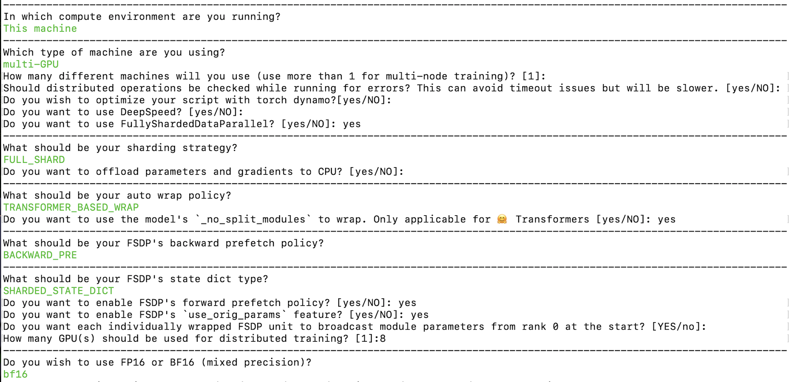
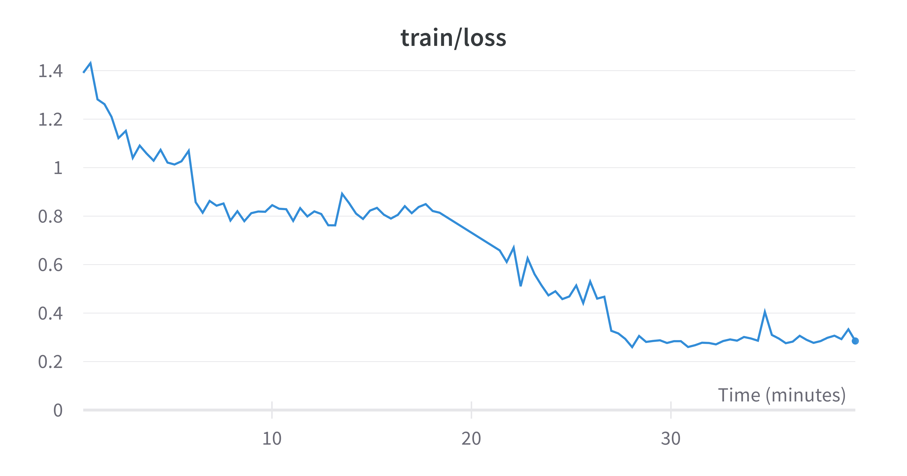

In this blog, we will look at how to fine-tune Llama-70B using PyTorch FSDP and related best practices. We will be leveraging Hugging Face Transformers, Accelerate and TRL. We will also learn how to use Accelerate with SLURM. For more information on what PyTorch FSDP is, please refer to this blog: [Accelerate Large Model Training using PyTorch Fully Sharded Data Parallel](https://huggingface.co/blog/pytorch-fsdp)

# Hardware Used

Number of nodes: 8. Minimum required is 1.
Number of GPUs per node: 8
GPU type: A100
GPU memory: 80GB
intra-node connection: NVLink
RAM per node: 1TB
CPU cores per node: 96
inter-node connection: Elastic Fabric Adapter

# Challenges

1. FSDP wraps the model after loading the pre-trained model. If each process/rank within a node loads the Llama-70B model, it would require 70*4*8 GB ~ 2TB of CPU RAM. This would result in the CPU RAM getting out of memory leading to processes being terminated.

2. Saving entire intermediate checkpoints using FULL_STATE_DICT with CPU offloading on rank 0 takes a lot of time and often results in NCCL Timeout errors due to indefinite hang during broadcasting. However, at the end of training, we want the whole model state dict instead of the sharded state dict which is only compatible with FSDP. 

3. We need to improve the speed and reduce the VRAM usage to train faster and save compute costs.

Let’s look at how to solve the above challenges and fine-tune 70B model. 
All the required resources:
1. Codebase:
https://github.com/pacman100/DHS-LLM-Workshop/tree/main/code_assistant/training with flash-attn V2 monkey patch

2. FSDP config: https://github.com/pacman100/DHS-LLM-Workshop/blob/main/code_assistant/training/configs/fsdp_config.yaml

3. SLURM script `launch.slurm`: https://gist.github.com/pacman100/1cb1f17b2f1b3139a63b764263e70b25

4. Model: `meta-llama/Llama-2-70b-chat-hf`

5. Dataset: [smangrul/code-chat-assistant-v1](https://huggingface.co/datasets/smangrul/code-chat-assistant-v1) (mix of LIMA+GUANACO with proper formatting in a ready-to-train format)

## Pre-requisites

First follow the these steps to install the Flash Attention V2:  Dao-AILab/flash-attention: Fast and memory-efficient exact attention (github.com). Install the latest nightlies of PyTorch with CUDA ≥11.8. Install the remaining requirements as per DHS-LLM-Workshop/code_assistant/training/requirements.txt

# Fine-Tuning

## Addressing Challenge 1
PRs [huggingface/transformers#25107](https://github.com/huggingface/transformers/pull/25107) and [huggingface/accelerate#1777](https://github.com/huggingface/accelerate/pull/1777) solve the first challenge and requires no code changes from user side.  It does the following: 

1. Have the model load on `meta` device on all ranks
2. Load the state dict only on rank==0 and set the param values from `meta` to `cpu` for rank==0
3. For all other ranks, do `torch.empty(*param.size(), dtype=dtype)` for every parameter on `meta` device
4. So, rank==0 will have loaded the model with correct state dict while all other ranks will have random/0 weights.
5. Set `sync_module_states=True` so that FSDP object takes care of broadcasting them to all the ranks before training starts.

Below is the output on a 7B model on 2 GPUs measuring the memory consumed and model parameters at various stages. We can observe that during loading the pre-trained model rank 0 & rank 1 have CPU total peak memory of `32744 MB` and `1506 MB` , respectively. Therefore, only rank 0 is loading the pre-trained model leading to efficient usage of CPU RAM. 

```bash
accelerator.process_index=0 GPU Memory before entering the loading : 0
accelerator.process_index=0 GPU Memory consumed at the end of the loading (end-begin): 0
accelerator.process_index=0 GPU Peak Memory consumed during the loading (max-begin): 0
accelerator.process_index=0 GPU Total Peak Memory consumed during the loading (max): 0
accelerator.process_index=0 CPU Memory before entering the loading : 926
accelerator.process_index=0 CPU Memory consumed at the end of the loading (end-begin): 26415
accelerator.process_index=0 CPU Peak Memory consumed during the loading (max-begin): 31818
accelerator.process_index=0 CPU Total Peak Memory consumed during the loading (max): 32744
accelerator.process_index=0 model.lm_head.weight=Parameter containing:
tensor([[-0.0179,  0.0201, -0.0273,  ..., -0.0275, -0.0396, -0.0131],
        [-0.0510, -0.0079, -0.0383,  ..., -0.0481,  0.0581,  0.0282],
        [-0.0217, -0.0216, -0.0064,  ..., -0.0508,  0.0554, -0.0013],
        ...,
        [ 0.0425,  0.0452, -0.0131,  ...,  0.0019,  0.0476,  0.0342],
        [-0.0170, -0.0085,  0.0449,  ..., -0.0074,  0.0178,  0.0043],
        [-0.0439, -0.0859, -0.0820,  ...,  0.0130,  0.0669,  0.0884]],
       requires_grad=True)
accelerator.process_index=1 GPU Memory before entering the loading : 0
accelerator.process_index=1 GPU Memory consumed at the end of the loading (end-begin): 0
accelerator.process_index=1 GPU Peak Memory consumed during the loading (max-begin): 0
accelerator.process_index=1 GPU Total Peak Memory consumed during the loading (max): 0
accelerator.process_index=1 CPU Memory before entering the loading : 933
accelerator.process_index=1 CPU Memory consumed at the end of the loading (end-begin): 10
accelerator.process_index=1 CPU Peak Memory consumed during the loading (max-begin): 573
accelerator.process_index=1 CPU Total Peak Memory consumed during the loading (max): 1506
accelerator.process_index=1 model.lm_head.weight=Parameter containing:
tensor([[0., 0., 0.,  ..., 0., 0., 0.],
        [0., 0., 0.,  ..., 0., 0., 0.],
        [0., 0., 0.,  ..., 0., 0., 0.],
        ...,
        [0., 0., 0.,  ..., 0., 0., 0.],
        [0., 0., 0.,  ..., 0., 0., 0.],
        [0., 0., 0.,  ..., 0., 0., 0.]], requires_grad=True)
accelerator.process_index=0 GPU Memory before entering the prepare : 0
accelerator.process_index=0 GPU Memory consumed at the end of the prepare (end-begin): 13202
accelerator.process_index=0 GPU Peak Memory consumed during the prepare (max-begin): 15458
accelerator.process_index=0 GPU Total Peak Memory consumed during the prepare (max): 15458
accelerator.process_index=0 CPU Memory before entering the prepare : 27345
accelerator.process_index=0 CPU Memory consumed at the end of the prepare (end-begin): -26394
accelerator.process_index=0 CPU Peak Memory consumed during the prepare (max-begin): 0
accelerator.process_index=0 CPU Total Peak Memory consumed during the prepare (max): 27345
FullyShardedDataParallel(
  (_fsdp_wrapped_module): RWForCausalLM(
    (transformer): RWModel(
      (word_embeddings): Embedding(65024, 4544)
      (h): ModuleList(
        (0-31): 32 x FullyShardedDataParallel(
          (_fsdp_wrapped_module): DecoderLayer(
            (input_layernorm): LayerNorm((4544,), eps=1e-05, elementwise_affine=True)
            (self_attention): Attention(
              (maybe_rotary): RotaryEmbedding()
              (query_key_value): Linear(in_features=4544, out_features=4672, bias=False)
              (dense): Linear(in_features=4544, out_features=4544, bias=False)
              (attention_dropout): Dropout(p=0.0, inplace=False)
            )
            (mlp): MLP(
              (dense_h_to_4h): Linear(in_features=4544, out_features=18176, bias=False)
              (act): GELU(approximate='none')
              (dense_4h_to_h): Linear(in_features=18176, out_features=4544, bias=False)
            )
          )
        )
      )
      (ln_f): LayerNorm((4544,), eps=1e-05, elementwise_affine=True)
    )
    (lm_head): Linear(in_features=4544, out_features=65024, bias=False)
  )
)
accelerator.process_index=1 GPU Memory before entering the prepare : 0
accelerator.process_index=1 GPU Memory consumed at the end of the prepare (end-begin): 13202
accelerator.process_index=1 GPU Peak Memory consumed during the prepare (max-begin): 15458
accelerator.process_index=1 GPU Total Peak Memory consumed during the prepare (max): 15458
accelerator.process_index=1 CPU Memory before entering the prepare : 945
accelerator.process_index=1 CPU Memory consumed at the end of the prepare (end-begin): 4
accelerator.process_index=1 CPU Peak Memory consumed during the prepare (max-begin): 4
accelerator.process_index=1 CPU Total Peak Memory consumed during the prepare (max): 949
accelerator.process_index=1 model.lm_head.weight=Parameter containing:
tensor([[-0.0179,  0.0201, -0.0273,  ..., -0.0275, -0.0396, -0.0131],
        [-0.0510, -0.0079, -0.0383,  ..., -0.0481,  0.0581,  0.0282],
        [-0.0217, -0.0216, -0.0064,  ..., -0.0508,  0.0554, -0.0013],
        ...,
        [ 0.0425,  0.0452, -0.0131,  ...,  0.0019,  0.0476,  0.0342],
        [-0.0170, -0.0085,  0.0449,  ..., -0.0074,  0.0178,  0.0043],
        [-0.0439, -0.0859, -0.0820,  ...,  0.0130,  0.0669,  0.0884]],
       device='cuda:1', requires_grad=True)
accelerator.process_index=0 model.lm_head.weight=Parameter containing:
tensor([[-0.0179,  0.0201, -0.0273,  ..., -0.0275, -0.0396, -0.0131],
        [-0.0510, -0.0079, -0.0383,  ..., -0.0481,  0.0581,  0.0282],
        [-0.0217, -0.0216, -0.0064,  ..., -0.0508,  0.0554, -0.0013],
        ...,
        [ 0.0425,  0.0452, -0.0131,  ...,  0.0019,  0.0476,  0.0342],
        [-0.0170, -0.0085,  0.0449,  ..., -0.0074,  0.0178,  0.0043],
        [-0.0439, -0.0859, -0.0820,  ...,  0.0130,  0.0669,  0.0884]],
       device='cuda:0', requires_grad=True)
```

## Addressing Challenge 2
It is addressed via choosing `SHARDED_STATE_DICT` state dict type when creating FSDP config.

Let’s create the accelerate config via below command:
```
accelerate config --config_file "fsdp_config.yaml"
```


The resulting config is available here: DHS-LLM-Workshop/code_assistant/training/configs/fsdp_config.yaml at main. Here, the sharding strategy is `FULL_SHARD`. We are using `TRANSFORMER_BASED_WRAP` for auto wrap policy and it uses `_no_split_module`  to find the Transformer block name for nested FSDP auto wrap. We use  `SHARDED_STATE_DICT` to save the intermediate checkpoints and optimizer states in this format recommended by the PyTorch team. Make sure to enable broadcasting module parameters from rank 0 at the start as mentioned in the above paragraph on addressing Challenge 1. We are enabling bf16 mixed precision training.

For final checkpoint being the whole model state dict, below code snippet is used:

```python
if trainer.is_fsdp_enabled:
    trainer.accelerator.state.fsdp_plugin.set_state_dict_type("FULL_STATE_DICT")

trainer.save_model(script_args.output_dir) # alternatively, trainer.push_to_hub() if the whole ckpt is below 50GB as the LFS limit per file is 50GB 
```

## Addressing Challenge 3
Flash Attention and enabling gradient checkpointing are required for faster training and reducing VRAM usage to enable fine-tuning and save compute costs. 

# Bringing it all-together

We will be fine-tuning the model leveraging `SFTTrainer` from `trl` library.  Below is the important snippet from the SLURM script showcasing how to use `Accelerate` launcher with SLURM. Notice that we are overriding `main_process_ip` , `main_process_port` , `machine_rank` , `num_processes`  and `num_machines` values of the `fsdp_config.yaml` . Here, another important point to note is that the storage is stored between all the nodes.


```
GPUS_PER_NODE=8
NNODES=$SLURM_NNODES
NUM_PROCESSES=$(expr $NNODES \* $GPUS_PER_NODE)

# so processes know who to talk to
MASTER_ADDR=$(scontrol show hostnames $SLURM_JOB_NODELIST | head -n 1)
MASTER_PORT=6000

export LAUNCHER="accelerate launch \
    --config_file configs/fsdp_config.yaml \
    --main_process_ip $MASTER_ADDR \
    --main_process_port $MASTER_PORT \
    --machine_rank \$SLURM_PROCID \
    --num_processes $NUM_PROCESSES \
    --num_machines $NNODES \
    "
# Note: it is important to escape `$SLURM_PROCID` since we want the srun on each node to evaluate this variable

export PROGRAM="\
train.py \
--model_name "meta-llama/Llama-2-70b-chat-hf" \
--dataset_name "smangrul/code-chat-assistant-v1" \
--max_seq_len 2048 \
--bf16 True \
--num_train_epochs 2 \
--logging_steps 1 \
--packing True \
--output_dir "shared_storage/sourab/temp/full-finetune-llama70b-chat-asst" \
--per_device_train_batch_size 1 \
--gradient_accumulation_steps 1 \
--dataset_text_field "content" \
--learning_rate 5e-5  \
--lr_scheduler_type "cosine" \
--weight_decay 0.01 \
--warmup_ratio 0.03 \
--use_flash_attn True \
--use_gradient_checkpointing True
"


export CMD="$LAUNCHER $PROGRAM"

srun --jobid $SLURM_JOBID bash -c "$CMD" 2>&1 | tee -a $LOG_PATH
```

Fine-tuning completed in ~1 hour and below is the training loss plot.


# Conclusion
We successfully fine-tuned 70B Llama model using PyTorch FSDP in a multi-node multi-gpu setting while addressing various challenges. 