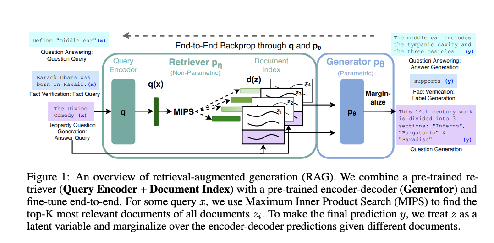

## Retrieval Augmented Generation with Huggingface Transformers and Ray

_[Huggingface Transformers](https://huggingface.co/) recently added the [Retrieval Augmented Generation (RAG)](https://twitter.com/huggingface/status/1310597560906780680) model, a new NLP model architecture that leverages external documents (like Wikipedia) to augment its knowledge and achieve state of the art results on knowledge intensive tasks. In this blog post we introduce the addition of [Ray](https://docs.ray.io/en/master/), a library for building scalable applications, for document retrieval, resulting in 2x speedup per retrieval call and allowing distributed [fine-tuning](https://github.com/huggingface/transformers/tree/master/examples/research_projects/rag) of RAG to scale._


## Introduction

Recently, [Huggingface](https://huggingface.co/) partnered with [Facebook AI](https://ai.facebook.com/) to introduce [Retrieval Augmented Generation](https://twitter.com/huggingface/status/1310597560906780680) model as part of its library. [Retrieval Augmented Generation](https://ai.facebook.com/blog/retrieval-augmented-generation-streamlining-the-creation-of-intelligent-natural-language-processing-models/), or RAG, was [published in NeurIPS 2020](https://arxiv.org/abs/2005.11401) and is a new architecture that retrieves contextual documents from a text corpus (like Wikipedia) to augment its knowledge. RAG has shown to be successful in a variety of knowledge-intensive tasks that require external sources, such as Q&A, fact verification, and Jeopardy style question generation.

[Huggingface](https://huggingface.co/) makes it incredibly easy to use an already fine-tuned RAG model. However, oftentimes you need to use the pre-trained [RAG](https://ai.facebook.com/blog/retrieval-augmented-generation-streamlining-the-creation-of-intelligent-natural-language-processing-models/) components and [fine-tune](https://huggingface.co/transformers/training.html) it yourself on a custom task or dataset, leveraging multiple GPUs for distributed training.


## Why Ray?

Ok great, so we can already leverage Huggingface’s script to fine-tune RAG using multiple GPUs. Why do we need to add Ray to this?

When doing distributed fine-tuning, the document retrieval aspect is particularly costly and can limit training scalability. The previous implementation of RAG fine-tining leveraged the [torch.distributed](https://pytorch.org/docs/stable/distributed.html) communication package for the external document retrieval portion. However, this implementation required the same workers used for training to also load the document index. This was problematic since it did not scale well, the index could not fit into GPU memory with the model, and it made the RAG implementation Pytorch specific.

Instead, we needed a framework-agnostic and a more flexible implementation for ad-hoc concurrent RPC, and this is where [Ray](https://ray.io/) comes in. Using Ray for distributed document retrieval, we can achieve 2x speedup per retrieval call, and better fine-tuning scalability.

Let’s first go more in depth into the RAG architecture, and then see how Ray fits in for the document retrieval.


## The RAG Architecture


An overview of Retrieval Augmented Generation Model. Video taken from [https://ai.facebook.com/blog/retrieval-augmented-generation-streamlining-the-creation-of-intelligent-natural-language-processing-models](https://ai.facebook.com/blog/retrieval-augmented-generation-streamlining-the-creation-of-intelligent-natural-language-processing-models).

[RAG](https://ai.facebook.com/blog/retrieval-augmented-generation-streamlining-the-creation-of-intelligent-natural-language-processing-models/) acts just like any other [seq2seq model](https://blog.keras.io/a-ten-minute-introduction-to-sequence-to-sequence-learning-in-keras.html), but the fundamental difference is that [RAG](https://ai.facebook.com/blog/retrieval-augmented-generation-streamlining-the-creation-of-intelligent-natural-language-processing-models/) has an intermediate step where it queries an external knowledge base to find contextual documents which are used in conjunction with the original sequence and passed into the [generator](https://huggingface.co/blog/how-to-generate).

This information retrieval step allows [RAG](https://ai.facebook.com/blog/retrieval-augmented-generation-streamlining-the-creation-of-intelligent-natural-language-processing-models/) to make use of multiple sources of knowledge -- those that are baked into the model parameters and the information that is contained in the contextual passages, allowing RAG to outperform other state-of-the-art seq2seq models.





From https://arxiv.org/pdf/2005.11401.pdf 

Overall, [RAG](https://ai.facebook.com/blog/retrieval-augmented-generation-streamlining-the-creation-of-intelligent-natural-language-processing-models/) has 3 main components:


1. A **query encoder** based on [Facebook’s Dense Passage Retrieval](https://arxiv.org/pdf/2004.04906.pdf) that encodes the input sequence.
2. A **document** **retriever**  that takes in the encoded query representation and retrieves contextual documents from the indexed knowledge base.
3. A **generator **based on [Facebook’s BART](https://arxiv.org/pdf/1910.13461.pdf) that takes in the original question and the contextual documents and outputs the result sequence.

You can find more information on RAG in a [blog post written by the authors](https://ai.facebook.com/blog/retrieval-augmented-generation-streamlining-the-creation-of-intelligent-natural-language-processing-models) or by trying out RAG for yourself using a [demo provided by Huggingface](https://huggingface.co/rag/)!


## Ray for Document Retrieval

One of the principle components of the [RAG](https://ai.facebook.com/blog/retrieval-augmented-generation-streamlining-the-creation-of-intelligent-natural-language-processing-models/) model is the retrieval of contextual documents from an indexed dataset. However this index query can be costly depending on the size of the dataset. And in a data parallel multi-GPU setup where there are multiple training workers each acting on different inputs, it’s not feasible for each worker to load its own copy of the index due to its size. In this distributed setting, the retrieval needs to happen concurrently for each input and should not be a bottleneck for fine-tuning.

The previous implementation of [RAG](https://ai.facebook.com/blog/retrieval-augmented-generation-streamlining-the-creation-of-intelligent-natural-language-processing-models/) on [Huggingface](https://huggingface.co/) leveraged the [torch.distributed](https://pytorch.org/docs/stable/distributed.html) communication package for the distributed retrieval with _only the rank 0 worker_ loading the index into memory. 

However this implementation had a few limitations:


1. **Synchronization bottleneck**: The rank 0 worker had to receive the inputs from all workers, perform the index query, and then send the results back to the other workers. This limited performance with multiple training workers.
2. **Can’t load index into GPU**: Since the index is loaded into the same process as the training worker, both the model and the index cannot fit on GPU.
3. **Pytorch specific**: The document retrieval process group had to latch onto the existing process group used for training, meaning that Pytorch had to be used for training as well.

To overcome these limitations, we introduced a [Ray](https://docs.ray.io/en/master/) based implementation of distributed retrieval. With [Ray’s stateful actor abstractions](https://docs.ray.io/en/master/actors.html), multiple processes that are separate from training are used to load the index and handle the retrieval queries. With multiple actors, there is no longer a single process retrieving the documents, and since this occurs in a separate process than training, there is enough memory to load the index into GPU.

And as you can see below, using the [Ray](https://docs.ray.io/en/master/) based implementation leads to better retrieval performance for multi-GPU fine-tuning. The following results show the seconds per retrieval call and we can see that as we increase the number of GPUs that we train on, using Ray has comparatively better performance than torch.distributed. Also, if we increase the number of Ray processes that perform retrieval, we also get better performance with more training workers since a single retrieval process is no longer a bottleneck.


<table>
  <tr>
   <td>
   </td>
   <td>2 GPU
   </td>
   <td>3 GPU
   </td>
   <td>4 GPU
   </td>
  </tr>
  <tr>
   <td>torch.distributed
   </td>
   <td>2.12 sec/retrieval
   </td>
   <td>2.62 sec/retrieve
   </td>
   <td>3.438 sec/retrieve
   </td>
  </tr>
  <tr>
   <td>Ray 2 retrieval processes
   </td>
   <td>1.49 sec/retrieve
   </td>
   <td>1.539 sec/retrieve
   </td>
   <td>2.029 sec/retrieve
   </td>
  </tr>
  <tr>
   <td>Ray 4 retrieval processes
   </td>
   <td>1.145 sec/retrieve
   </td>
   <td>1.484 sec/retrieve
   </td>
   <td>1.66 sec/retrieve
   </td>
  </tr>
</table>


A performance comparison of different retrieval implementations. For each document retrieval implementation, we run 500 training steps with a per-GPU batch size of 8, and measure the time it takes to retrieve the contextual documents for each batch on the rank 0 training worker. As the results show, using multiple retrieval processes improves performance, especially as we scale training to multiple GPUs.


### How do I use it?

[Huggingface](https://huggingface.co/) provides a [Pytorch Lightning](https://github.com/PyTorchLightning/pytorch-lightning) based [fine tuning script](https://github.com/huggingface/transformers/tree/master/examples/research_projects/rag), and we extended it to add the Ray retrieval implementation as an option. 

To try it out, first install the necessary requirements


```
pip install ray
pip install transformers
pip install -r transformers/examples/research_projects/rag/requirements.txt
```


Then, you can specify your data paths and other configurations and run [finetune-rag-ray.sh](https://github.com/huggingface/transformers/blob/master/examples/research_projects/rag/finetune_rag_ray.sh)!


```
# Sample script to finetune RAG using Ray for distributed retrieval.

# Add parent directory to python path to access lightning_base.py
export PYTHONPATH="../":"${PYTHONPATH}"

# Start a single-node Ray cluster.
ray start --head

# A sample finetuning run, you need to specify data_dir, output_dir and model_name_or_path
# run ./examples/rag/finetune_rag_ray.sh --help to see all the possible options

python examples/rag/finetune_rag.py \
    --data_dir $DATA_DIR \
    --output_dir $OUTPUT_DIR \
    --model_name_or_path $MODEL_NAME_OR_PATH \
    --model_type rag_sequence \
    --fp16 \
    --gpus 8 \
    --profile \
    --do_train \
    --do_predict \
    --n_val -1 \
    --train_batch_size 8 \
    --eval_batch_size 1 \
    --max_source_length 128 \
    --max_target_length 25 \
    --val_max_target_length 25 \
    --test_max_target_length 25 \
    --label_smoothing 0.1 \
    --dropout 0.1 \
    --attention_dropout 0.1 \
    --weight_decay 0.001 \
    --adam_epsilon 1e-08 \
    --max_grad_norm 0.1 \
    --lr_scheduler polynomial \
    --learning_rate 3e-05 \
    --num_train_epochs 100 \
    --warmup_steps 500 \
    --gradient_accumulation_steps 1 \
    --distributed_retriever ray \
    --num_retrieval_workers 4

# Stop the Ray cluster.
ray stop
```


## What’s next?

Using [RAG](https://ai.facebook.com/blog/retrieval-augmented-generation-streamlining-the-creation-of-intelligent-natural-language-processing-models) on [Huggingface transformers](https://github.com/huggingface/transformers/tree/master/examples/research_projects/rag) and the [Ray retrieval implementation](https://github.com/huggingface/transformers/blob/master/examples/research_projects/rag/finetune_rag_ray.sh) for faster distributed fine-tuning, you can leverage RAG for retrieval-based generation on your own knowledge-intensive tasks.

Also, hyperparameter tuning is another aspect of transformer fine tuning and can have [huge impacts on accuracy](https://medium.com/distributed-computing-with-ray/hyperparameter-optimization-for-transformers-a-guide-c4e32c6c989b). For scalable and easy hyperparameter tuning, check out the [Ray Tune](https://docs.ray.io/en/latest/tune/) library. By using [Ray Tune’s integration with Pytorch Lightning](https://medium.com/distributed-computing-with-ray/scaling-up-pytorch-lightning-hyperparameter-tuning-with-ray-tune-4bd9e1ff9929), or the [built-in integration with Huggingface transformers](https://huggingface.co/blog/ray-tune), you can run experiments to find the perfect hyperparameters for your RAG model.

And lastly, stay tuned for a potential Tensorflow implementation of [RAG](https://ai.facebook.com/blog/retrieval-augmented-generation-streamlining-the-creation-of-intelligent-natural-language-processing-models) on [Huggingface](https://huggingface.co/)!

If you plan to try RAG+Ray integration out, please feel free to share your experiences on the [Ray Discourse](https://discuss.ray.io/) or join the [Ray community Slack](https://docs.google.com/forms/d/e/1FAIpQLSfAcoiLCHOguOm8e7Jnn-JJdZaCxPGjgVCvFijHB5PLaQLeig/viewform) for further discussion -- we’d love to hear from you!
