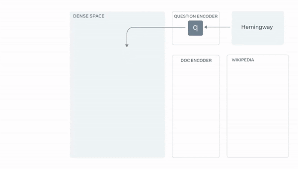
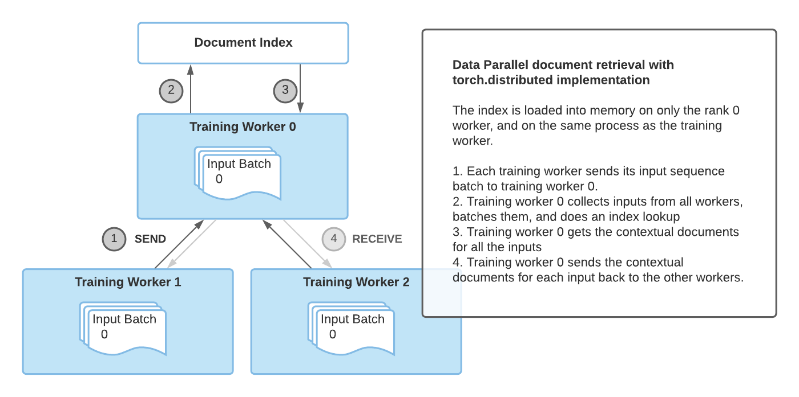
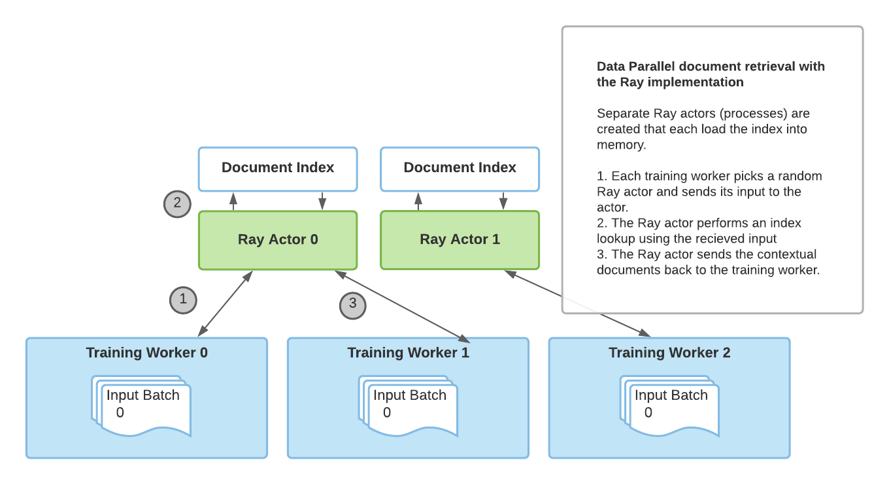

# Retrieval Augmented Generation with Huggingface Transformers and Ray

<div class="blog-metadata">
    <small>Published Feb 10, 2021.</small>
    <a target="_blank" class="btn no-underline text-sm mb-5 font-sans" href="https://github.com/huggingface/blog/blob/master/ray-rag.md">
        Update on GitHub
    </a>
</div>

<div class="author-card">
    <a href="/ray-project">
        
        <div class="bfc">
            <code>ray-project</code>
            <span class="fullname">Ray Project (Anyscale)</span>
            <span class="bg-gray-100 rounded px-1 text-gray-600 text-sm font-mono">guest</span>
        </div>
    </a>
</div>

##### A guest blog post by <a href="/amogkam">Amog Kamsetty</a> from the Anyscale team

[Huggingface Transformers](https://huggingface.co/) recently added the [Retrieval Augmented Generation (RAG)](https://twitter.com/huggingface/status/1310597560906780680) model, a new NLP architecture that leverages external documents (like Wikipedia) to augment its knowledge and achieve state of the art results on knowledge-intensive tasks. In this blog post, we introduce the integration of [Ray](https://docs.ray.io/en/master/), a library for building scalable applications, into the RAG contextual document retrieval mechanism. This speeds up retrieval calls by 2x and improves the scalability of RAG distributed [fine-tuning](https://github.com/huggingface/transformers/tree/master/examples/research_projects/rag).


### What is Retrieval Augmented Generation (RAG)?


_An overview of RAG. The model retrieves contextual documents from an external dataset as part of its execution. These contextual documents are used in conjunction with the original input to produce an output. The  GIF is taken from [Facebook's original blog post](https://ai.facebook.com/blog/retrieval-augmented-generation-streamlining-the-creation-of-intelligent-natural-language-processing-models)._


Recently, [Huggingface](https://huggingface.co/) partnered with [Facebook AI](https://ai.facebook.com/) to introduce the [RAG](https://twitter.com/huggingface/status/1310597560906780680) model as part of its Transformers library. 


[RAG](https://ai.facebook.com/blog/retrieval-augmented-generation-streamlining-the-creation-of-intelligent-natural-language-processing-models/) acts just like any other [seq2seq model](https://blog.keras.io/a-ten-minute-introduction-to-sequence-to-sequence-learning-in-keras.html). However, [RAG](https://ai.facebook.com/blog/retrieval-augmented-generation-streamlining-the-creation-of-intelligent-natural-language-processing-models/) has an intermediate component that retrieves contextual documents from an external knowledge base (like a Wikipedia text corpus). These documents are then used in conjunction with the input sequence and passed into the underlying seq2seq [generator](https://huggingface.co/blog/how-to-generate).


This information retrieval step allows [RAG](https://ai.facebook.com/blog/retrieval-augmented-generation-streamlining-the-creation-of-intelligent-natural-language-processing-models/) to make use of multiple sources of knowledge -- those that are baked into the model parameters and the information that is contained in the contextual passages, allowing it to outperform other state-of-the-art models in tasks like question answering. You can try it for yourself using this [demo provided by Huggingface](https://huggingface.co/rag/)!


### Scaling up fine-tuning
This retrieval of contextual documents is crucial for RAG's state-of-the-art results but introduces an extra layer of complexity. When scaling up the training process via a data-parallel training routine, a naive implementation of the document lookup can become a bottleneck for training. Further, the **document index** used in the retrieval component is often quite large, making it infeasible for each training worker to load its own replicated copy of the index.

The previous implementation of RAG fine-tuning leveraged the [torch.distributed](https://pytorch.org/docs/stable/distributed.html) communication package for the  document retrieval portion. However, this implementation sometimes proved to be inflexible and limited in scalability.

Instead, a framework-agnostic and a more flexible implementation for ad-hoc concurrent programming is required. [Ray](https://ray.io/) fits the bill perfectly. Ray is a simple, yet powerful Python library for general-purpose distributed and parallel programming. Using Ray for distributed document retrieval, we achieved a **2x speedup per retrieval call compared to `torch.distributed`**, and overall better fine-tuning scalability.

### Ray for Document Retrieval

_Document retrieval with the torch.distributed implementation_


The main drawback of the [torch.distributed](https://pytorch.org/docs/stable/distributed.html) implementation for document retrieval was that it latched onto the same process group used for training and only the rank 0 training worker loaded the index into memory.

As a result, this implementation had some limitations:

1. **Synchronization bottleneck**: The rank 0 worker had to receive the inputs from all workers, perform the index query, and then send the results back to the other workers. This limited performance with multiple training workers.
2. **PyTorch specific**: The document retrieval process group had to latch onto the existing process group used for training, meaning that PyTorch had to be used for training as well.


_Document retrieval with the Ray implementation_

To overcome these limitations, we introduced a novel implementation of distributed retrieval based on Ray. With [Ray’s stateful actor abstractions](https://docs.ray.io/en/master/actors.html), multiple processes that are separate from the training processes are used to load the index and handle the retrieval queries. With multiple Ray actors, retrieval is no longer a bottleneck and PyTorch is no longer a requirement for RAG.

And as you can see below, using the [Ray](https://docs.ray.io/en/master/) based implementation leads to better retrieval performance for multi-GPU fine-tuning. The following results show the seconds per retrieval call and we can see that as we increase the number of GPUs that we train on, using Ray has comparatively better performance than `torch.distributed`. Also, if we increase the number of Ray processes that perform retrieval, we also get better performance with more training workers since a single retrieval process is no longer a bottleneck.


<table>
  <tr>
   <td>
   </td>
   <td>2 GPU
   </td>
   <td>3 GPU
   </td>
   <td>4 GPU
   </td>
  </tr>
  <tr>
   <td>torch.distributed
   </td>
   <td>2.12 sec/retrieval
   </td>
   <td>2.62 sec/retrieve
   </td>
   <td>3.438 sec/retrieve
   </td>
  </tr>
  <tr>
   <td>Ray 2 retrieval processes
   </td>
   <td>1.49 sec/retrieve
   </td>
   <td>1.539 sec/retrieve
   </td>
   <td>2.029 sec/retrieve
   </td>
  </tr>
  <tr>
   <td>Ray 4 retrieval processes
   </td>
   <td>1.145 sec/retrieve
   </td>
   <td>1.484 sec/retrieve
   </td>
   <td>1.66 sec/retrieve
   </td>
  </tr>
</table>


_A performance comparison of different retrieval implementations. For each document retrieval implementation, we run 500 training steps with a per-GPU batch size of 8, and measure the time it takes to retrieve the contextual documents for each batch on the rank 0 training worker. As the results show, using multiple retrieval processes improves performance, especially as we scale training to multiple GPUs._


### How do I use it?

[Huggingface](https://huggingface.co/) provides a [PyTorch Lightning](https://github.com/PyTorchLightning/pytorch-lightning) based [fine tuning script](https://github.com/huggingface/transformers/tree/master/examples/research_projects/rag), and we extended it to add the Ray retrieval implementation as an option. 

To try it out, first install the necessary requirements


```bash
pip install ray
pip install transformers
pip install -r transformers/examples/research_projects/rag/requirements.txt
```


Then, you can specify your data paths and other configurations and run [finetune-rag-ray.sh](https://github.com/huggingface/transformers/blob/master/examples/research_projects/rag/finetune_rag_ray.sh)!


```bash
# Sample script to finetune RAG using Ray for distributed retrieval.

# Add parent directory to python path to access lightning_base.py
export PYTHONPATH="../":"${PYTHONPATH}"

# Start a single-node Ray cluster.
ray start --head

# A sample finetuning run, you need to specify data_dir, output_dir and model_name_or_path
# run ./examples/rag/finetune_rag_ray.sh --help to see all the possible options

python examples/rag/finetune_rag.py \
    --data_dir $DATA_DIR \
    --output_dir $OUTPUT_DIR \
    --model_name_or_path $MODEL_NAME_OR_PATH \
    --model_type rag_sequence \
    --fp16 \
    --gpus 8 \
    --profile \
    --do_train \
    --do_predict \
    --n_val -1 \
    --train_batch_size 8 \
    --eval_batch_size 1 \
    --max_source_length 128 \
    --max_target_length 25 \
    --val_max_target_length 25 \
    --test_max_target_length 25 \
    --label_smoothing 0.1 \
    --dropout 0.1 \
    --attention_dropout 0.1 \
    --weight_decay 0.001 \
    --adam_epsilon 1e-08 \
    --max_grad_norm 0.1 \
    --lr_scheduler polynomial \
    --learning_rate 3e-05 \
    --num_train_epochs 100 \
    --warmup_steps 500 \
    --gradient_accumulation_steps 1 \
    --distributed_retriever ray \
    --num_retrieval_workers 4

# Stop the Ray cluster.
ray stop
```

## What’s next?

Using RAG with [Huggingface transformers](https://github.com/huggingface/transformers/tree/master/examples/research_projects/rag) and the [Ray retrieval implementation](https://github.com/huggingface/transformers/blob/master/examples/research_projects/rag/finetune_rag_ray.sh) for faster distributed fine-tuning, you can leverage RAG for retrieval-based generation on your own knowledge-intensive tasks.


Also, hyperparameter tuning is another aspect of transformer fine tuning and can have [huge impacts on accuracy](https://medium.com/distributed-computing-with-ray/hyperparameter-optimization-for-transformers-a-guide-c4e32c6c989b). For scalable and easy hyperparameter tuning, check out the [Ray Tune](https://docs.ray.io/en/latest/tune/) library. By using [Ray Tune’s integration with PyTorch Lightning](https://medium.com/distributed-computing-with-ray/scaling-up-pytorch-lightning-hyperparameter-tuning-with-ray-tune-4bd9e1ff9929), or the [built-in integration with Huggingface transformers](https://huggingface.co/blog/ray-tune), you can run experiments to find the perfect hyperparameters for your RAG model.

And lastly, stay tuned for a potential Tensorflow implementation of [RAG](https://ai.facebook.com/blog/retrieval-augmented-generation-streamlining-the-creation-of-intelligent-natural-language-processing-models) on [Huggingface](https://huggingface.co/)!

If you plan to try RAG+Ray integration out, please feel free to share your experiences on the [Ray Discourse](https://discuss.ray.io/) or join the [Ray community Slack](https://docs.google.com/forms/d/e/1FAIpQLSfAcoiLCHOguOm8e7Jnn-JJdZaCxPGjgVCvFijHB5PLaQLeig/viewform) for further discussion -- we’d love to hear from you!


> Also published at https://medium.com/distributed-computing-with-ray/retrieval-augmented-generation-with-huggingface-transformers-and-ray-b09b56161b1e

