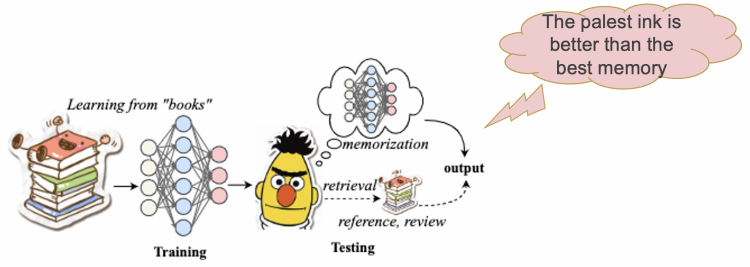
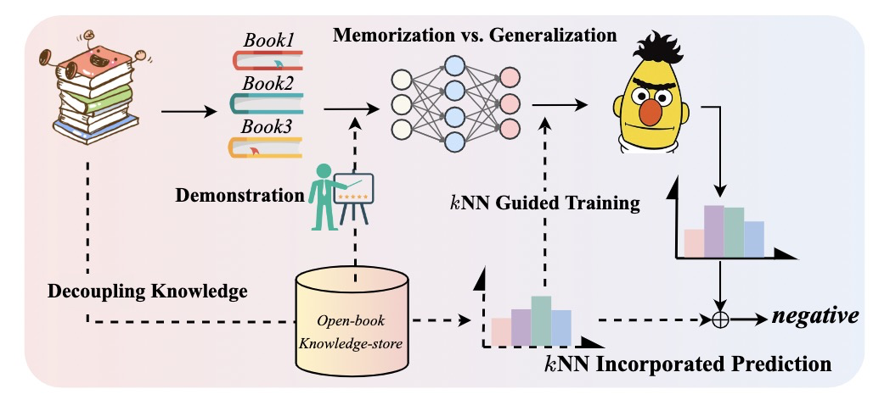
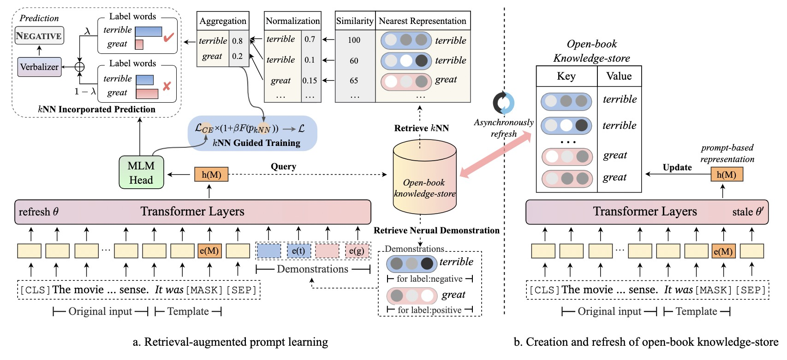
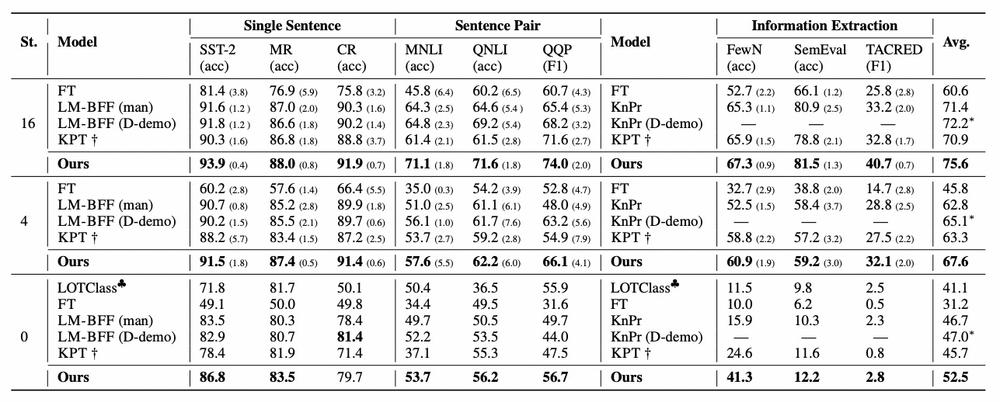
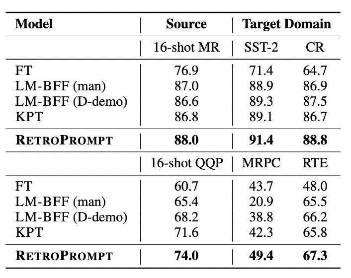

<h1>Decoupling Knowledge from Memorization for Prompt Learning</h1>

<div class="blog-metadata">
    <small>Published November 23, 2022.</small>
    <a target="_blank" class="btn no-underline text-sm mb-5 font-sans" href="https://github.com/huggingface/blog/blob/main/retroprompt.md">
        Update on GitHub
    </a>
</div>

<div class="author-card">
    <a href="/OE-Heart"> 
        
        <div class="bfc">
            <code>OE-Heart</code>
            <span class="fullname">Yixin Ou</span>
        </div>
    </a>
</div>

## Introduction

Large parametric language models have achieved dramatic empirical success in natural language processing (NLP). Notably, pre-trained language models (PLMs) have learned a substantial amount of in-depth knowledge from data, and have archived tremendous promise in few-shot/zero-shot learning ability with the natural language prompts.

However, prompt learning with PLMs usually generalizes unstably in an extremely low-resource setting or emerging domains. One potential reason is that, it is non-trivial for parametric models to learn rare or hard patterns well with rote memorization, thus, resulting in inefficient generalizable performance.

The limitations of rote memorization remind us of the human learning process of “learn by analogy” and the proverb that “the palest ink is better than the best memory”. Note that humans can perform associative learning to recall relevant skills in deep memories for reinforcing each other, thus, owning the extraordinary abilities to solve few-shot and zero-shot tasks.

Motivated by these, this blog will present our team's work accepted for NeurIPS 2022: **RetroPrompt**, which decouples the knowledge from memorization by constructing an open-book knowledge-store from the training data; thus, referring to related knowledge could provide a strong enhancement signal to help the model strike a balance between generalization and memorization. In short, this work improves the generalization ability of prompt learning by decoupling knowledge from memorization.

[paper] [Decoupling Knowledge from Memorization: Retrieval-augmented Prompt Learning](https://arxiv.org/abs/2205.14704)

[code] https://github.com/zjunlp/PromptKG/tree/main/research/RetroPrompt




## Memorization vs. Generalization

Intuitively, if we regard the whole training data as a book and the test phase as the examination, the current training-test procedure of prompt learning (based on batch data training) can be viewed as page-by-page memorization and closed-book examination. During training, vanilla prompt learning may struggle to memorize atypical instances in a fully-supervised setting or overfit shallow patterns with low-shot data. Specifically, recent studies have proposed a long-tail theory, which states that if training data form a long-tail distribution and have small “sub-populations” with atypical instances, then PLMs indeed predict on the test data through rote memorizing these atypical instances rather than learning the common patterns.

The limitations of rote memorization remind us of the property of analogical learning in humans, i.e., the ability to recall relevant skills from deep memory through associative learning, which mutually reinforce each other and thus possess an extraordinary ability to solve small and zero-sample tasks. Based on these ideas, we attempt to improve the generalization ability of cue learning through retrieval and association. Our intuition is that if we can decouple knowledge from memory by constructing an open knowledge base from training data, then the above problem may be greatly alleviated. As shown in the figure below, reference-related knowledge can provide a powerful augmentation signal to help the model strike a balance between generalization and memory.



## RetroPrompt: Retrieval-augmented Prompt Learning

Specifically, we introduce a novel retrieval-augmented framework based on prompt learning (RetroPrompt).

The open-book knowledge store (K, V), defined as the set of key: prompt- based example embeddings and value: corresponding label words constructed from the training data, are served as additional references for the model to decouple knowledge from pure memorization to some extent.

Specifically, to integrate retrieved knowledge into the input, Firstly, we design to incorporate neural demonstrations into the input sequences as in-context augmentation, where the demonstration is retrieved from the knowledge-store.

Then, we apply a non-parametric algorithm kNN over the input query and knowledge store, and regard kNN results as an indication of easy vs. hard examples in the training set, and automatically force the model to focus on the hard examples identified by kNN by assigning a scaling during training. Lastly, the kNN results are further employed by linearly interpolating the output of prompt learning with a non-parametric nearest neighbor distribution during inference.

### Retrieval of Neural Demonstration

To enhance the PLMs with the ability to learn by analogy through the knowledge-store, we further combine RetroPrompt with neural demonstrations, an orthogonal technique enhancing language models, to improve the generalization ability of our model.

For the $t$-th query instance qt, we first utilize prompt-based representation $\boldsymbol{h}_{\hat{q}_t}$ to query the cached representations of open-book knowledge- store. Then we retrieve $m$ nearest neighbors $\left\{\left\{\boldsymbol{c}_1^{(1)}, \ldots, \boldsymbol{c}_m^{(1)}\right\}, \ldots,\left\{\boldsymbol{c}_1^{(L)}, \ldots, \boldsymbol{c}_m^{(L)}\right\}\right\}$ of $\boldsymbol{q}_t$, where the superscript $L$ denotes the total number of the classes and the $c_i^{(l)}$ is retrieved as the $i$-th nearest neighbor in the $l$-th class. After the model retrieves the Top-$m$ candidates for each class, their corresponding representation $\boldsymbol{h}_{\hat{c}_i}^{(l)}$ and label word $v^{(l)}$ from knowledge-store will be incorporatedi nto the encoder to act as a demonstration learning. Since the  $\boldsymbol{h}_{\hat{c}_i}^{(l)}$  is already vector, we intuitively
aggregate the $m$ neighbor vectors for each class according to their similarity and incorporate the demonstration into the input representation of $\hat{\boldsymbol{x}}$ after the word embedding layer of the $\mathcal{M}$ as follows:
$$
\mathcal{I}=e(\hat{\boldsymbol{x}}) \oplus\left[\sum_{i \in[1: m]} \alpha_i^{(1)} \boldsymbol{h}_{\hat{\boldsymbol{c}}_i}^{(1)}, e\left(v^{(1)}\right)\right] \oplus \ldots \oplus\left[\sum_{i \in[1: m]} \alpha_i^{(L)} \boldsymbol{h}_{\hat{c}_i}^{(L)}, e\left(v^{(L)}\right)\right] ; \alpha_i^{(l)}=\frac{e^{h_{\hat{q}} \cdot h_{\hat{c}_i}^{(l)}}}{\sum_{i \in[1: m]} e^{h_{\hat{q}} \cdot h_{\hat{c}_i}^{(l)}}}
$$
where $e(\cdot)$ represents the word embedding layer of $\mathcal{M}$, $\oplus$ denotes the concatenation of input sequences, $\alpha^{(l)}_{i}$ is the softmax score for the $i$-th retrieval belonging to $l$-th class label to denote their relevance with $\hat{\boldsymbol{q}}$, and $\mathcal{I}$ is the sequence features for inputting the next layer of PLM. 

```python
embedding_output = self.embeddings(
    input_ids=input_ids,
    position_ids=position_ids,
    token_type_ids=token_type_ids,
    inputs_embeds=inputs_embeds,
    past_key_values_length=past_key_values_length,
)
        
if demo_mask_features is not None:  # add mask features as virtual demo
    embedding_output[block_flag_for_demo > 0] = demo_mask_features.view(-1, self.config.hidden_size)
```


### Retrieve kNN for Guiding Training

Eager learners, such as PLMs, are trained to provide a global approximating function that maps from input to output space. Lazy learners such as k-nearest neighbor classifiers, on the contrary, focus on approximating the neighborhoods around test examples. Since kNN can easily predict for each encountered query instance based on pre-trained representation without an extra classifier, it is intuitively to leverage the kNN’s classification results as the prior external knowledge to guide the PLMs’ parameters attending to hard examples during the training process. 

Given the $t$-th query instance $\boldsymbol{q}_t$, we leverage the $\boldsymbol{h}_{q_t}$ querying the open-book knowledge-store $(\mathcal{K}, \mathcal {V})$ to retrieve the $k$-nearest neighbors $N$ of $\boldsymbol{q}_t$ according to a similarity function $d(\cdot, \cdot)$, where $d(\cdot, \cdot)$ typically adopt he inner product similarity. Then, we compute a distribution over neighbors based on a softmax of their similarities and aggregate probability mass for each label word across all its occurrences in the retrieved targets:
$$
P_{k \mathrm{NN}}\left(y \mid \boldsymbol{q}_t\right) \propto \sum_{\left(\boldsymbol{c}_i, y_i\right) \in \mathcal{N} } \mathbb{1}_{y=y_i} \exp \left(d\left(\boldsymbol{h}_{\hat{\boldsymbol{q}}_t}, \boldsymbol{h}_{\hat{ \boldsymbol{c}}_i}\right)\right)
$$
Given the probability $p_{k \mathrm{NN}}$ of the query instance $\boldsymbol{q}_t$ being predicted as the gold class, we propose to retrieve the kNN for guiding the training process of prompt learning. The kNN guider reweights the cross-entropy loss $\mathcal{L}_{C E}$ by adjusting the relative loss for the correctly-classified or misclassified instances identified by kNN, respectively. Specifically, we apply the negative log-likelihood as the modulating factor $F\left(p_{k \mathrm{NN}}\right)$. The final loss $\mathcal{L}$ is defined as:
$$
F\left(p_{k \mathrm{NN}}\right)=-\log \left(p_{k \mathrm{NN}}\right), \quad \mathcal{L}=\left(1+\beta F\left(p_{k \mathrm{NN}}\right)\right) \mathcal{L}_{C E},
$$
where $\beta$ denotes a scalar to determine the proportion of each loss term. 

```python
class knnLoss(nn.Module):
    def __init__(self):
        super(knnLoss, self).__init__()


    def loss(self, logits, knn_logits, targets, coeff):
        loss = F.cross_entropy(logits, targets, reduction="mean")

        p = knn_logits / torch.sum(knn_logits, -1, keepdims=True)
        knn_loss = F.nll_loss(torch.clamp(torch.log(p), min=-100),
            targets, reduction="mean")

        loss = loss + torch.mul(loss, knn_loss * coeff)
        
        return torch.sum(loss) / targets.shape[0]

    def forward(
        self, pred_logits, knn_logits,
        targets, coeff
    ):
        loss = self.loss(
            pred_logits, knn_logits, targets,
            coeff)
        return loss
```



### kNN based probability for Cloze-style Prediction

Apart from the neural demonstration on the input side and kNN guided training process (also referred as kNN-test for the abbreviation), we further present kNN based probability for Cloze-style prediction on the inference process, providing the PLM ability to retrieve nearest neighbors for decisions rather than making predictions only based on memorized parameters.

Given the non-parametric $k$ nearest neighbor distribution $P_{k \mathrm{NN}}$ of the query instance $\boldsymbol{q}_t$ being predicted as $y$, the $P\left(y \mid \boldsymbol{q}_t\right)$ is reformulated by interpolating the $P_{k \mathrm{NN}}$ with the already-trained base PLM’s MLM prediction $P_{\mathcal{M}}$ using parameter $\lambda$ to produce the final probability of the label:
$$
P\left(y \mid \boldsymbol{q}_t\right)=\lambda P_{k \mathrm{NN}}\left(y \mid \boldsymbol{q}_t\right)+(1-\lambda) g\left(P_{\mathcal{M}}\left([\operatorname{MASK}]=v \mid \mathcal{T}\left(\boldsymbol{q}_t\right)\right)\right)
$$
Different from kNN-LM that uses tokens to augment the language modeling directly, we explicitly take advantage of prompt-based instance representation for classification tasks, which is more deeply rooted in prompt learning.

```python
def combine_knn_and_vocab_probs(knn_p, vocab_p, coeff=0.5):
    combine_probs = torch.stack([vocab_p, knn_p], dim=0)
    coeffs = torch.ones_like(combine_probs)
    coeffs[0] = np.log(1 - coeff)
    coeffs[1] = np.log(coeff)
    curr_prob = torch.logsumexp(combine_probs + coeffs, dim=0)

    return curr_prob
```


## Experiments

We evaluate RetroPrompt on 9 NLU datasets in the few-shot and zero-shot setting. The performance shows that  our systematic retrieval mechanism helps the model to make better use of scarce data for generalization.





## Conclusion

The blog presents our team's work accepted for NeurIPS 2022. We propose RetroPrompt that decouples knowledge from memorization by introducing retrieval augmentation to further improve the generalization ability of prompt learning on the input side and the whole process of model training and prediction. RetroPrompt, is a straightforward yet effective retrieval method that combines both neural demonstrations, kNN guider for training and prediction. Our extensive results show that it outperforms other demonstration-enhanced prompt methods and knowledge-enhanced prompt methods in few-shot, zero-shot and fully-supervised settings. Analyzing the essence of memorization validates the effectiveness of decoupling knowledge from memorization. Interesting future directions include: 1) apply to other tasks, such as QA and NLG, 2) explore the noise data mining for unsupervised learning, 3) further improve the retrieve efficiency for large datasets, etc.
