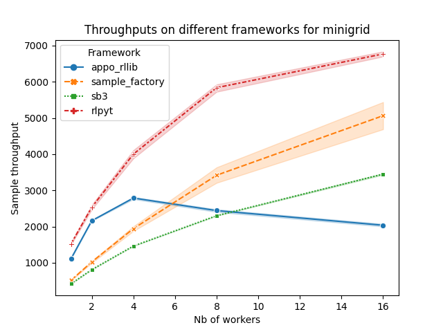
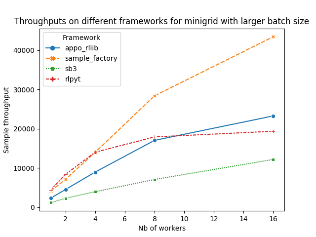
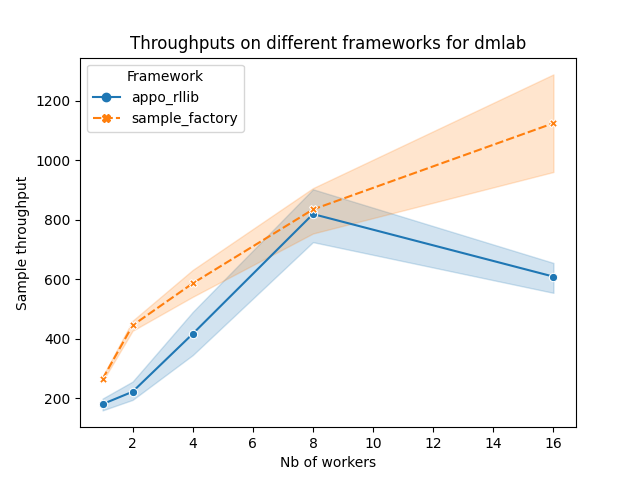

<h1>Exploring different Deep Reinforcement Learning libraries and their limitations</h1>
<h2>Code available in this <a href="https://github.com/huggingface/rl-frameworks"> Github repository 🤗</a></h2>

    <a href="/aliciafmachado">
        
        

            <code>aliciafmachado</code>
            Alicia Fortes Machado
        

  </a>

During my internship at Hugging Face, I performed an empirical evaluation of common Deep Reinforcement Learning libraries and would like to share my results with the community. 

Deep RL algorithms are often tricky to implement and prone to  subtle and annoying bugs. This situation happens even more frequently when algorithms involve temporal dependencies such as [LSTMs](http://www.bioinf.jku.at/publications/older/2604.pdf). Because it’s complex to implement these algorithms from scratch, libraries that contain their implementations become even more valuable - when, hopefully, they provide robust implementations. Our question was thus: how do we know these implementations are functional? And more than that, are they fast? Reliable? Extensible? These are the questions we will be discussing throughout this work.

Although this work is an **empirical** evaluation, the reader is expected to have a minimal understanding of Deep Reinforcement Learning to understand the blog post. If not, you can start from our [Hugging Face course in Deep Reinforcement Learning](https://github.com/huggingface/deep-rl-class) 🤗.

**Disclaimer**: I spent a little more than one month to conduct this empirical evaluation, and therefore didn’t have time to get as deep as possible in each of the libraries. So there might be issues that could be solved if I had more time. Feel free to comment or reach out if you find a way to circumvent some of the limits mentioned below, or if you feel something is missing in this analysis!

# Task and Motivation

Our main motivation started from a recent initiative to improve the support of reinforcement learning frameworks on the 🤗 hub, by helping integrations with Deep RL Libraries. In order to so, we decided to understand the landscape libraries better to identify the interests of the community as well as the most promising frameworks for our future research work at Hugging Face as well.

In that sense, after discussing with the community of researchers and investigating first-hand different RL libraries, we identified the following aspects as some of the most relevant:

## User friendliness 🤝

When you are a student in machine learning who just started exploring RL libraries or even a seasoned researcher. “Oh, but this library is so hard to use. Bugs, broken dependencies and poor documentations.“ These are things you would want to avoid when looking for a user friendly library. Of course, you might also be working in industry or simply wanting to contribute or do research in the area, and would like to adopt a library for your work. You probably don’t want to use something that requires a lot of energy to understand!

## Reproducibility 👬

Every library must have a way to set seeds and reproduce results. However, as these grow more and more complex, it becomes very important to be able to 1. reproduce results by properly fixing seeds on each random component; 2. do not bias or unbalance environments or data by using the same seed on multiple instances of the same environment as this can lead to diminished performances.

## Final performance 📈

Final performances are dependent of the chosen implementation of an algorithm, how you process inputs, and even (strongly) on the chosen hyper-parameters. Final performances can also indicate underlying problems in the implementation when they fail catastrophically. However, it’s important to keep in mind that results might also be influenced by many factors like randomness.

## Speed 🚗

What we mean by speed in this post is the throughput that a library can achieve when sampling from a given environment. Of course, the obtained throughput is highly dependent on the environment. Some environments are more lightweight while others can take longer to render and process e.g. physics simulations. However, given a fixed environment, we can study how a library is able to support and parallelize multiple environments, and how it uses the power on your laptop or even cluster to train algorithms quicker.

## Flexibility 🧘🏽‍♀️

Which kinds of inputs are accepted by the algorithms provided by each library? Can we easily tweak or modify models, or use a custom model together? These questions circle around flexibility or how each library can be used by an experienced user or by someone who simply want to define their own custom environment.

# Libraries

For starters, let’s have a look on some well known libraries highlighting the known good points and pitfalls of them. These libraries were selected considering if they had LSTM-policies, and they were widely used in the RL community:

## Rllib

[Github repository](https://github.com/ray-project/ray/tree/master/rllib/).

[RLlib](https://docs.ray.io/en/latest/rllib/index.html) is an open-source library for reinforcement learning (RL), offering support for production-level, highly distributed RL workloads while maintaining unified and simple APIs for a large variety of industry applications. It contains multi-agent setup which can train from purely offline datasets or externally connected simulators. It also provides a simple and versatile solution for decision making needs, even in industrial levels.

Rllib has an impressively large support across different algorithms and variations. In order to use Rllib one mostly doesn’t need prior knowledge on how Deep RL algorithms work. However, as Rllib contains many algorithms, documentation for a specific parameter or case can be difficult to find, which may slow down the learning process on how to use it. A number of [issues](https://github.com/ray-project/ray/issues/5278) over PPO with LSTMs being slow have been listed as well.

## Stable-Baselines 3

[Github repository](https://github.com/DLR-RM/stable-baselines3).

Stable-Baselines-3 (SB3) is a set of reliable implementations of RL algorithms using Pytorch, which is a successor to the well known [Stable Baselines](https://github.com/hill-a/stable-baselines). SB3 is generally easy to use and provide support for sampling using multiple cores. An accompanying training framework called [rl-baselines3-zoo](https://github.com/DLR-RM/rl-baselines3-zoo) also allows one to use pre-trained SB3 agents, and train new ones while enjoying features such as hyperparameter optimization.

SB3 is rather easy to use out of the box, and has support for numerous algorithms. A good experience for first time users. However, SB3 doesn’t provide support for PPO with memory at the time of this study. It seems that since then this feature has been added to the library. Another point is that SB3 supports multiple CPUs running environments, but doesn’t (yet) support multi-threading (multiple environments per CPU).

## Rlpyt

[Github repository](https://github.com/astooke/rlpyt).

This is an optimized and modular RL library, which contains interesting features such as an asynchronous version of PPO, and provides alternate sampling, which can speed up sampling in 2 times.

In this library, there is an asynchronous version of PPO, which is quite fast. It also has support for PPO with LSTMs. However, it has not been updated since a couple of years, and we found it not one of the easiest to use.

## Sample-Factory

[Github repository](https://github.com/alex-petrenko/sample-factory).

Sample-Factory aims to get high throughput and to make training really fast by using an asynchronous algorithm called APPO (Asynchronous Proximal Policy Optimization). Sample-Factory contains only this single algorithm, which is highly optimized for libraries such as vizdoom, dmlab, and gym environments. SF can also be used for multi-agent and population-based experiments.

In use, sample-factory fulfills its purpose: to sample very quickly while training an asynchronous version of PPO. It uses similar features already seen in Rlpyt. It has support for parallelization, and can be used with other environments. The major (current) limitation is that it only provide APPO, and it’s rather difficult to add other asynchronous algorithms in the code base.

## Tianshou

[Github repository](https://github.com/thu-ml/tianshou).

Tianshou implements multiple deep reinforcement learning algorithms using only ~4000 lines of code. It claims to be a fast-speed modularized framework and pythonic API for building deep reinforcement learning agents.

This library provides multiple algorithms with short implementations, that train quite quickly. However, with environments that don’t have EnvPool support (MiniGrid and Deepmind Lab, for example), it can be quite slow to train using Tianshou. Other than that, the library doesn't provide much documentation around memory based algorithms and there seemed (at the time of study) to be an [issue](https://github.com/thu-ml/tianshou/issues/486) on memory-based environments leading to limited performances.

# Environments

The main environments used for this evaluation were MiniGrid and DeepMind Lab, which are described in more details below. MiniGrid was chosen due to its simplicity: it’s a lightweight and easy to use full-python environment, but despite its implicity contains interesting elements, e.g. environment instances that require memory. DeepMind Lab was chosen due to being a much more complex set of environments which also required processing images in pixels space.

## MiniGrid 🧊

[Github repository](https://github.com/Farama-Foundation/gym-minigrid)

Minigrid is a set of open-source environments widely used in the literature and easy to access, which is also simple, lightweight and fast to iterate. It’s a grid-like environment where the agent can have various goals and behaviors (e.g. lava tiles finish the episode instantly while walls prevent the agent from going to some spaces). The environment also provide plenty of wrappers for different tasks, and good documentation.

As we were mainly interested in tasks that required memory, we decided to focus on two particular tasks:

1. RedBlueDoors: This first environment can (surprisingly) be solved without memory. The agent is randomly placed within a room with one red and one blue door facing opposite directions. The agent has to open the red door and then open the blue door, in that order.
2. MiniGrid-Memory: This second environment is harder: it’s a memory test. The agent starts in a small room where it sees an object and then has to go through a narrow hallway which ends in a split. At each end of the split there is an object, one of which is the same as the object in the starting room. The agent has to remember the initial object, and go to the matching object at split.

## Deepmind Lab 🧫

[Github repository](https://github.com/deepmind/lab)

[Deepmind Lab](https://arxiv.org/pdf/1612.03801.pdf) is a 3D learning environment mainly based on id Software's [Quake III Arena](https://github.com/id-Software/Quake-III-Arena) via [ioquake3](https://github.com/ioquake/ioq3). It provides challenging tasks on navigation and puzzle-solving.

The set of tasks **dmlab-30** consist of tasks with different goals and levels of complexity and the whole description of all tasks can be found [here](https://github.com/deepmind/lab/tree/master/game_scripts/levels/contributed/dmlab30).

The task of main interest to us was [explore_obstructed_goals_small](https://github.com/deepmind/lab/tree/master/game_scripts/levels/contributed/dmlab30#object-locations-small), which we choose due to requiring memory from the agent, since on a given episode in this environment, the agent has to explore the map so that it can maximize the number of times it’s able to find the apples that give reward. In this particular instance, there are also doors in the maze, and they change of state after each reset.

The random agent and human performances in this environment are [6.76](https://github.com/deepmind/scalable_agent/blob/master/dmlab30.py#L121) and [206](https://github.com/deepmind/scalable_agent/blob/master/dmlab30.py#L88), respectively. 

# Method

So, we defined our environments, libraries, and aspects of interest. Now we need to understand and define how to measure these relevant aspects. 

We decided to focus on the [PPO](https://arxiv.org/pdf/1707.06347.pdf) algorithm implementations as it’s supposed to be easier to tune and make work in comparison with other Deep RL algorithms. More specifically, we will focus on memory-based PPO where it’s implemented and supported in the library. In general the layman reader should keep in mind that it can still be quite tricky to set up the memory-based variant of PPO as explained [here](https://iclr-blog-track.github.io/2022/03/25/ppo-implementation-details/).

In terms of speed, we will focus in measuring the throughput on these tasks, by running training for a fixed amount of steps using different numbers of workers. Our goal –in addition to comparing the absolute value– was to understand how throughput increases with parameters. Notice that when using action repeat (which is standard in many environments), our throughput will be the number of frames per second divided by the action repeat.

We also fully trained policies for MiniGrid and Deepmind Lab to evaluate whether there are significant differences in performance.

In addition to speed and performance, we also discuss user friendliness, reproducibility, number of algorithms supported, and parallelization features.

# Results

Here is our main table summarizing the main aspects of the libraries we explored:

|  | Rllib | Stable Baselines 3 | rlpyt | Sample Factory | Tianshou |
| --- | --- | --- | --- | --- | --- |
| RNN support | ✅ | ❌ * | ✅  | ✅ | ✅ **** |
| Number of algorithms | 21 | 12 | 8 ** | 1 *** | 20 |
| Multi GPUs | ✅ | ❌ | ✅ | ✅ | ✅ |
| Multi CPUs | ✅ | ✅ | ✅ | ✅ | ✅ |
| Multi threading | ✅ | ❌ | ✅ | ✅ | ✅ (only for some envs) |
| Multiple nodes | ✅ | ❌ | ❌ | ✅ (on NGC cluster) | ✅ (using Ray) |
| User friendly | Industrial use. Can be long to set up and understand all the components. | Research use. Easy to set up but not so modulable. | Fast, but with scarce documentation and unhelpful errors. | Very fast, and easy to setup at first. Restricted to a single algorithm. | Easy to set up, but documentation can be scattered, mainly about RNNs usage. |
| Reproducibility | Seeding on trainer is enough. | Seed directly on model and environment vectorizers. | Seed set by set_seed which calls seeding on np, torch, random, torch.cuda. It's also required to set the seed on the runner. | Seed is passed on command line. | Need to seed np and torch. |
| Framework | TF / Pytorch | Pytorch | Pytorch | Pytorch | Pytorch |

**Legend**: Comparisons between five different RL libraries. We compare how easy is to setup it from scratch, parallelization aspects, how many algorithms and RNN (LSTMs, and GRUs as well) support. Conducted in April / May 2022.

***** SB3 is developing PPO with LSTM policy [here](https://github.com/Stable-Baselines-Team/stable-baselines3-contrib/pull/53).

****** In Tianshou, it says 9, but I would consider 8 if we don't count certain variations.

******* only APPO but very fast.

******** Tianshou has support for LSTMs on DQNs, and supposedly for AC architectures, but it doesn't have proper documentation, and I haven't been able to use LSTMs with PPO so far.

We will now analyze in details the throughputs on the two main sets of environments cited previously. Notice that these experiments can be reproduced with [our code base](https://github.com/huggingface/rl-frameworks).

## MiniGrid

### Throughput

Experiments were done using the environment **MiniGrid-RedBlueDoors-6x6-v0,** where the PPO / APPO agents for a fixed amount of steps. In this case, we didn’t use a recurrent agent, so that we could include Stable Baselines 3 in our comparision.

Results are shown below:

Notice that, on Stable Baselines 3, a single environment was used per worker (due to it not having support for multiple environments per worker), but in the other frameworks, we used 4 environments per worker, due to restrictions on minimum number of workers on these. Another point is that we didn't include Tianshou's throughput measurements since it didn't log this metric out-of-the-box and we had a limited amount of time on this project.

From this graph we can conclude that rlpyt and sample-factory seem to have higher throughput / scale better. Though rlpyt has had no support since 2020 and was not the most user friendly it took some time to setup. With respect to Rllib, it seems like it actually decreases from 8 workers - which is seems strange but is explained in the next paragraph. When compared to Stable Baselines 3, Sample-Factory has the benefit of being able to scale by increasing the number of environments per worker, while in the first, there is the restriction of using a single environment per worker.

It's important notice, in Sample-Factory's [paper](https://arxiv.org/pdf/2006.11751.pdf), they obtain higher throughput than rlpyt, while in this plot, we don't see that. The explanation is that: 1. the neural networks are different: in sample-factory they use ResNet Impala, whereas in rlpyt the architecture is AtariNet; 2. the batch size used underutilizes the GPU, while the idea is that Sample-Factory exploits the most out of the hardware. The second reason also explains why Rllib's behaviour in the first graph: such a number of workers and environments per worker is better used with larger batch sizes. We confirmed those explanations by checking the models used by the libraries and running experiments with larger batches of size 8192, which are shown below:

### Performance

To investigate the performances, we decided to use RedBlueDoors-6x6-v0, a slightly simpler problem than **MiniGrid-MemoryS11-v0**. Three libraries of our test (Rlpyt, Sample-Factory and Rllib) contained support to LSTMs and good documentation. These libraries provided PPO-LSTM policies with hyper-parameters adapted to this environment and all of them were able to solve the task by getting final rewards greater than 0.9 indicating implementations that should be trustable (according to this limited metric….). Hyper-parameters can be found in the end of the post. 

## Deepmind Lab

### Throughput

We show the throughput results below, when using 4 environments per worker.

Other than that, notice that we don’t plot the performances of rlpyt with Deepmind Lab, even though it has LSTM support and should supposedly work. Due the lack of documentation and a couple of bugs we encounter, we were not able to get this environment to work properly.

Here again, we have the same behaviour in Rllib after 8 workers, but now, as we have shown in the previous section, we know why.

### Performance

It was difficult to get good performance with our libraries on this environment. In the limited time we had allocated our-self we only managed to successfully train a policy on the task [explore_obstructed_goals_small](https://github.com/deepmind/lab/tree/master/game_scripts/levels/contributed/dmlab30#object-locations-small) in Deepmind Lab when using the Sample-Factory library. Training with PPO on Rllib might have succeeded in the end but was unfortunately too slow for our time buget. We ended not running training with APPO since our goal was to compare with the original PPO from Rllib.

Hyper-parameters can be found in the end of the post.

# Discussion

We’ve conducted multiple experiments to identify the main benefits and issues of each of the libraries we decided to study. In terms of throughput, **sample-factory** performed the best: in some cases it started slower when using less workers but usually scaled well when increasing the number of workers and surpassed other frameworks at larger setups. When focusing on performance, **Rlpyt** converged to an optimal policy faster in terms of time steps than other frameworks on the MiniGrid environment despite being somehow more cumbersome to use. 

When looking for a framework for the standpoint of someone starting in RL, **Stable-Baselines-3** seems the way to go, due to its strong support, many algorithms, it being reasonably fast even with its constraint on running all parallel environments in a single thread. The main issue for us was that it didn’t provide support for recurrent policies at the time of the study which was our focus.

*However it’s important to note that the time we gave ourself to investigate all this frameworks and also the compute time we allocated ourself were both limited so we had to stop early in our investigation of the two other promising frameworks, **Rllib** and **Tianshou** because we were not able to get high enough metrics for the environments and algorithm we were focused on during the compute time we had allocated ourself for each library. As such this investigation is rather a study of “out-of-the-box” performances and user-experience rather and a complete and in-details investigation of them*.

From this discussion, we conclude that all these frameworks have interesting features that could be used, however, given the constraint to choose a single one that implements PPO / APPO with recurrent policy, and for an usage on an environment that demands a high throughput, such as Deepmind Lab, **Sample-Factory** seemed like the way to go for our research project (more on it soon 🤩).

**Other relevant libraries / implementations (non-exhaustive)**:

- [Spinning up](https://github.com/openai/spinningup) - Stopped getting updates on 2020 January, so it's not quite up-to-date and doesn’t have RNNs support. There are implementations in Pytorch and TF1. Good for newcomers trying to understand RL algorithms.
- [pytorch-a2c-ppo-acktr-gail](https://github.com/ikostrikov/pytorch-a2c-ppo-acktr-gail) - Well known implementation. Have support for recurrent policies, but only using GRUs, not LSTMs. Can use multiple processes and multiple threads.
- [torch-ac](https://github.com/lcswillems/torch-ac) - Contains two implementations of well-known actor-critic algorithms: PPO and Synchronous A3C.
- [clean-rl](https://github.com/vwxyzjn/cleanrl) - It’s a Deep RL library that provides high-quality single-file implementation with research-friendly features.
- [rlberry](https://github.com/rlberry-py/rlberry) - Library that proposes to implement RL tools so that running agents in parallel, averaging and plotting results, optimizing hyperparameters, etc, can be done in few lines. It also contains benchmarks.

# Contributing 📖

If there are any nice libraries that you are a contributor or that you particularly enjoy, feel free to fork the repository and contribute by adding your own benchmark.

# Hyperparameters

The hyperparameters used on PPO for both sets of environments are shown below:

| Environment | Entropy Weight | Learning Rate | Training batch size (n_steps * n_workers) | n_workers (train) | Mini batch size | Nb of parallel agents | Gamma |
| --- | --- | --- | --- | --- | --- | --- | --- |
| minigrid | $0.01$ | $0.001$ | $2048$ | $16$ | $256$ | $1$ | $0.99$ |
| dmlab | $0.005$ | $0.01$ | $1600$ | $8$ | $200$ | $1$ | $0.99$ |

| Environment | Nb of consecutive steps | GAE parameter  | N epochs | Nb total steps | LSTM hidden size | Backpropagation length |
| --- | --- | --- | --- | --- | --- | --- |
| minigrid | $1$ | $0.95$ | $20$ | $10^{7}$ steps  | $64$ | $32$ |
| dmlab | $4$ | $0.95$ | $2$ | $10^{9}$ steps (action repeat equal 4)  | $256$ | $32$ |

**Obs**. When training using asynchronous versions of PPO (e.g. Sample-Factory), different hyperparameters were used (the default ones for DMLab on its repository).

**Obs2**. Other parameters than the cited above were the default ones from each library.
