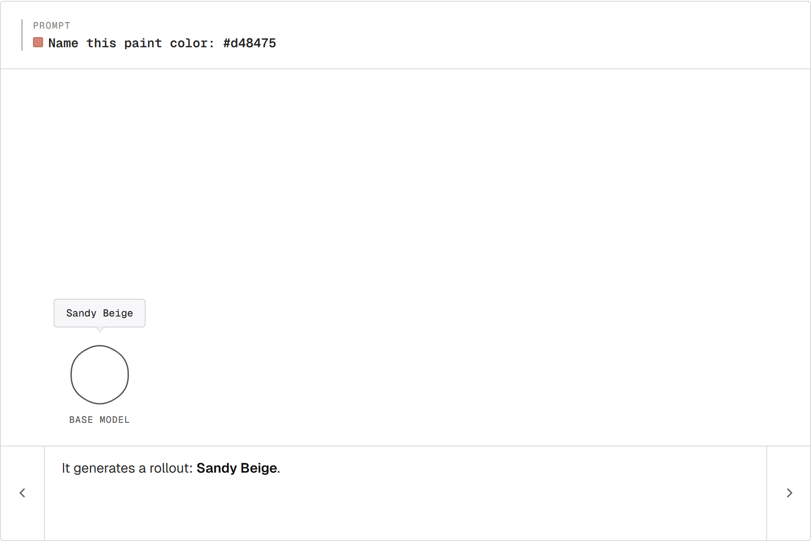
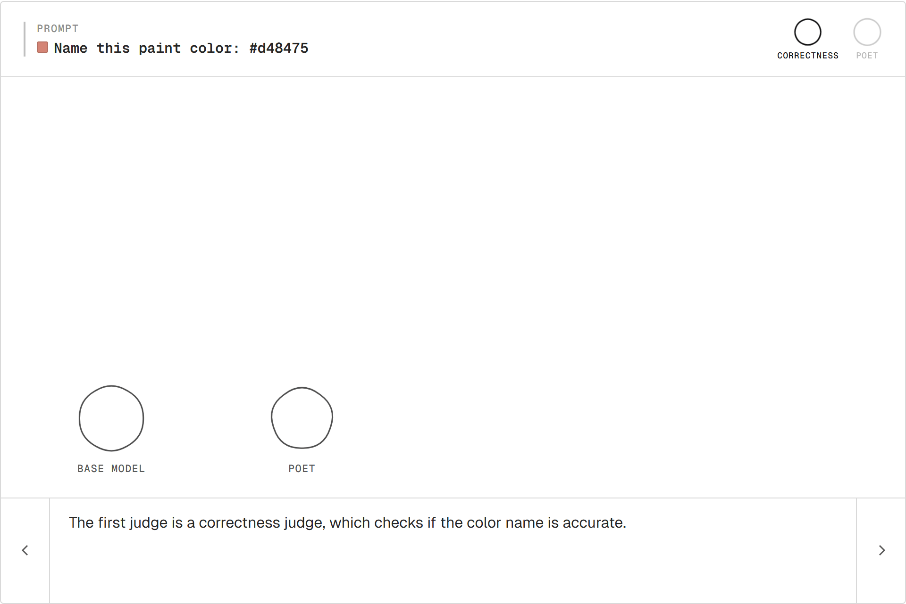
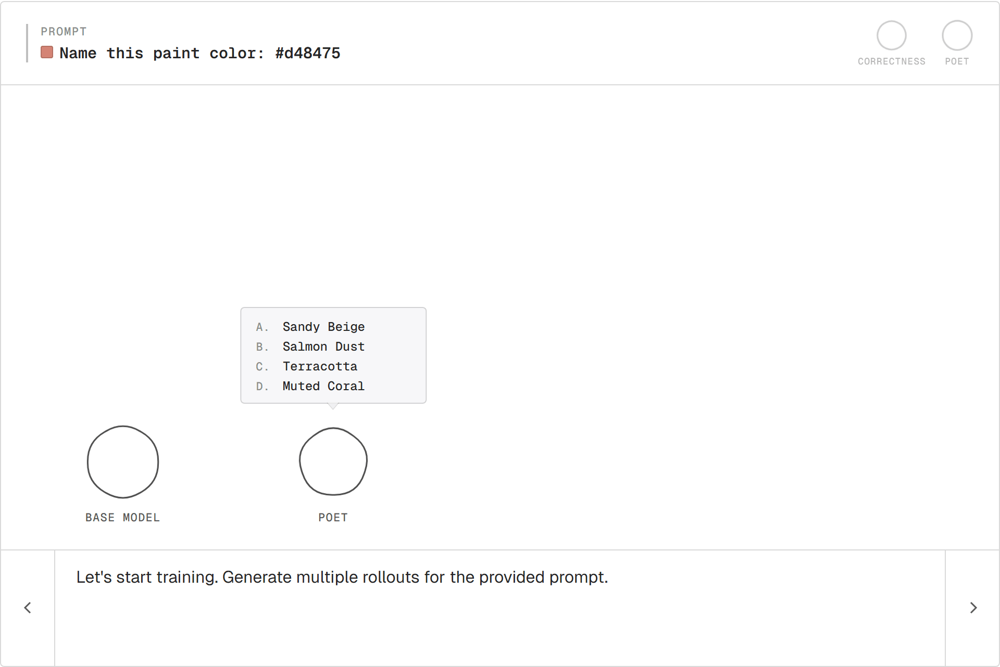
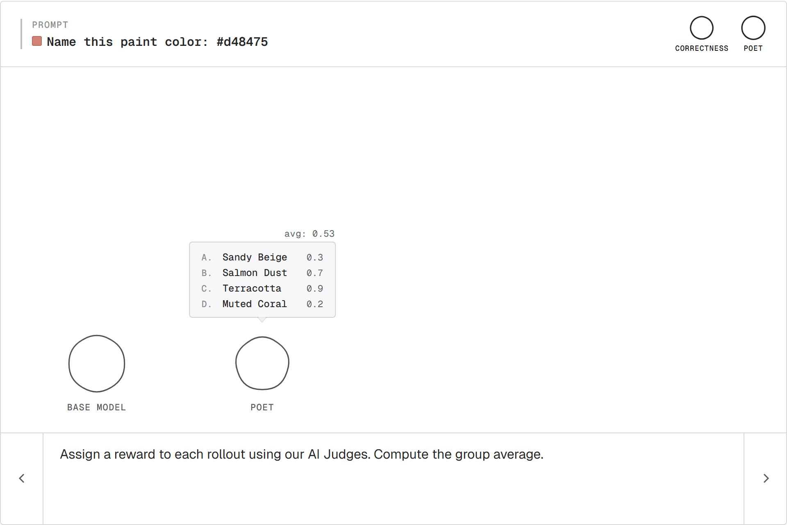
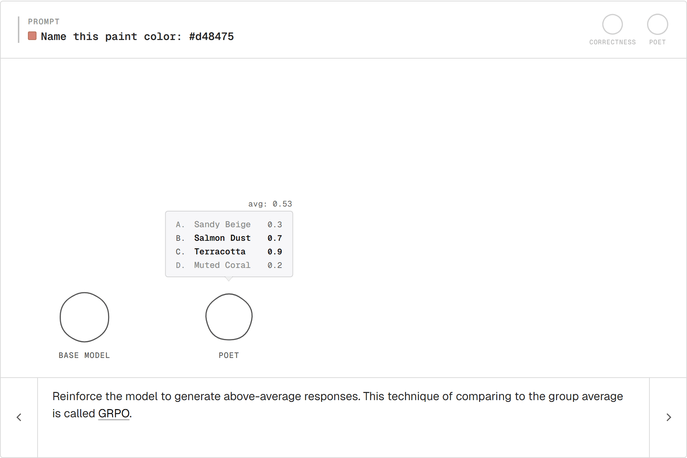
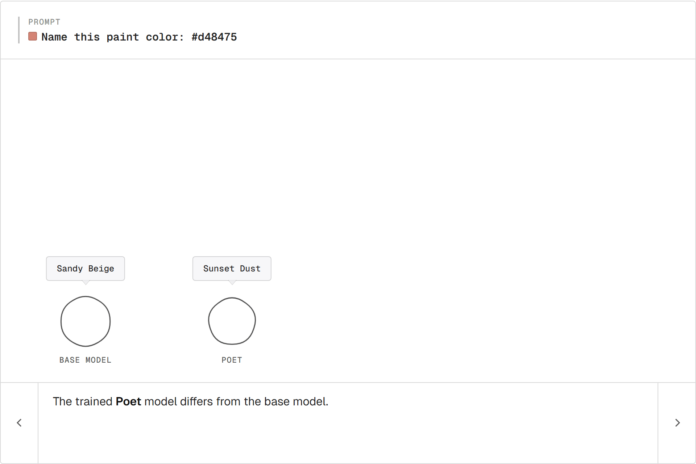
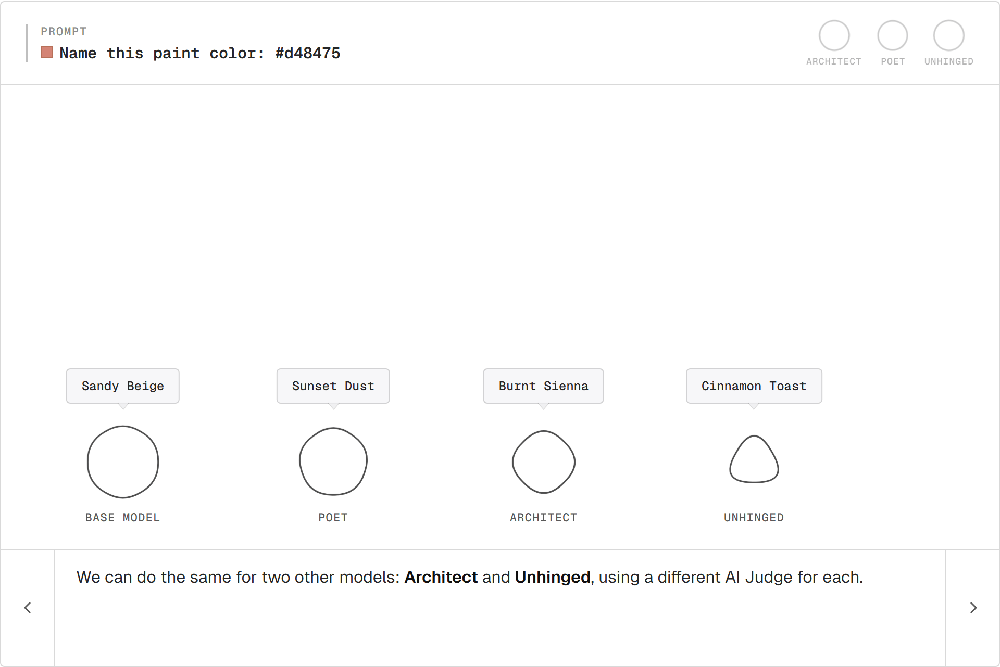
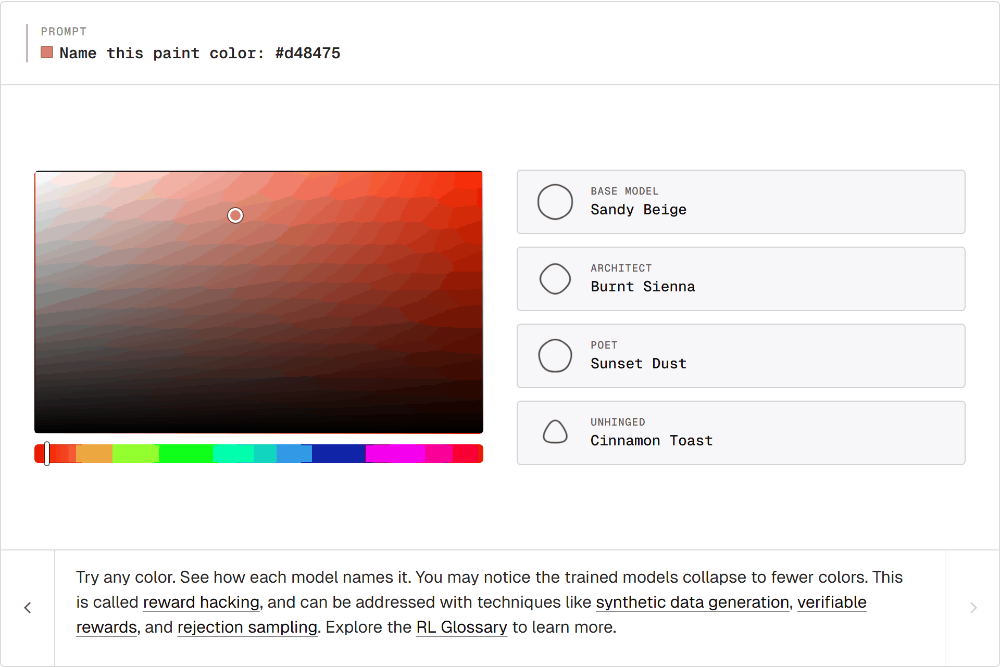

# Reinforcement learning, visualized

[Reinforcement learning](https://dev.adaptive-ml.com/training/post-training/rl) trains a model from rewards. A model generates a few outputs for a prompt, a [reward](https://dev.adaptive-ml.com/rewards) is assigned to each one, and the model is updated toward the better ones.

Let's walk through how it works step-by-step with an example.

<iframe
  src="https://dylanebert-rl-painters.static.hf.space/index.html"
  frameborder="0"
  width="100%"
  height="720px"
  style="border: 1px solid #e6e6e6; border-radius: 4px;"
  title="RL Painters interactive walkthrough"
></iframe>

[Open the Space in a new tab →](https://huggingface.co/spaces/dylanebert/rl-painters)

## The Task

The model is a base [LLM](https://dev.adaptive-ml.com/training/llm). It's tasked with naming paint colors:

> Name this paint color: #d48475

There's no single right answer. Two people can disagree about whether "Sunset Dust" beats "Sandy Beige" and both be right. We'll use RL to train the model toward different tastes.

## Rollout

The model generates one output for the prompt. That single output is called a **rollout**.

For `#d48475`, the base model says **Sandy Beige**.

<picture>
  <source media="(prefers-color-scheme: dark)" srcset="./assets/rl-visualized/01-rollout-dark.png">
  <source media="(prefers-color-scheme: light)" srcset="./assets/rl-visualized/01-rollout-light.png">
  
</picture>

## Reward

To train, we need a signal: *this output was good* or *this one wasn't*. That signal is the **reward**.

A reward is anything that takes a model output and produces a number. Where the number comes from is open:

- A human ranking outputs (the basis for [RLHF](https://dev.adaptive-ml.com/rewards/rlhf)).
- A unit test that passes or fails, or any other rule-based check ([RLVR](https://dev.adaptive-ml.com/rewards/rlvr)).
- Another model entirely ([RLAIF](https://dev.adaptive-ml.com/rewards/rlaif)).

For our judges, we'll use another LLM as the scorer. This pattern is called [**LLM-as-a-judge**](https://dev.adaptive-ml.com/evaluation/llm-as-judge).

The **Poet** judge asks: does the name evoke something? "Sunset Dust" scores higher than "Sandy Beige."

Poet alone has a problem. Reward "Banana" for a red and the model drifts. A second judge guards against that:

- **Correctness.** Does the name actually describe `#d48475`?

<picture>
  <source media="(prefers-color-scheme: dark)" srcset="./assets/rl-visualized/02-judge-dark.png">
  <source media="(prefers-color-scheme: light)" srcset="./assets/rl-visualized/02-judge-light.png">
  
</picture>

The two scores combine into one reward per rollout.

## Sampling a Group

One rollout on its own isn't enough to learn from. Generating several samples for the same prompt gives a **group** of rollouts.

<picture>
  <source media="(prefers-color-scheme: dark)" srcset="./assets/rl-visualized/03-group-dark.png">
  <source media="(prefers-color-scheme: light)" srcset="./assets/rl-visualized/03-group-light.png">
  
</picture>

The variation across the group is what RL works with.

## Scoring

Each rollout goes through the judges. Each comes back with a number.

<picture>
  <source media="(prefers-color-scheme: dark)" srcset="./assets/rl-visualized/04-rewards-dark.png">
  <source media="(prefers-color-scheme: light)" srcset="./assets/rl-visualized/04-rewards-light.png">
  
</picture>

The group average is the bar. Above is good, below is bad, both relative to this prompt.

## GRPO

Push the model toward above-average rollouts, away from below-average ones.

<picture>
  <source media="(prefers-color-scheme: dark)" srcset="./assets/rl-visualized/05-grpo-dark.png">
  <source media="(prefers-color-scheme: light)" srcset="./assets/rl-visualized/05-grpo-light.png">
  
</picture>

This is **[GRPO](https://dev.adaptive-ml.com/optimization/grpo)** (Group Relative Policy Optimization). Each rollout's reward gets compared to the group's average. Recent variants like [GSPO](https://dev.adaptive-ml.com/optimization/gspo) and [DAPO](https://dev.adaptive-ml.com/optimization/dapo) are refinements on the same core loop.

## The Poet

<picture>
  <source media="(prefers-color-scheme: dark)" srcset="./assets/rl-visualized/06-poet-dark.png">
  <source media="(prefers-color-scheme: light)" srcset="./assets/rl-visualized/06-poet-light.png">
  
</picture>

The base model still says "Sandy Beige." The trained copy says "Sunset Dust." Nobody wrote a "be more poetic" rule. The Poet rewarded poetic outputs; the model followed.

## Three Painters

The same recipe with two more judges:

- **Architect** rewards terse, material-led names. Pulls toward "Burnt Sienna."
- **Unhinged** rewards vivid, off-register names. Pulls toward "Cinnamon Toast."

Same base model. Three different judges. Three trained painters.

<picture>
  <source media="(prefers-color-scheme: dark)" srcset="./assets/rl-visualized/07-painters-dark.png">
  <source media="(prefers-color-scheme: light)" srcset="./assets/rl-visualized/07-painters-light.png">
  
</picture>

## Reward Hacking

The Unhinged painter collapses onto a handful of names. Most reds become "Mulled Wine." Most warm tones become "Cinnamon Toast."

<picture>
  <source media="(prefers-color-scheme: dark)" srcset="./assets/rl-visualized/08-explorer-dark.png">
  <source media="(prefers-color-scheme: light)" srcset="./assets/rl-visualized/08-explorer-light.png">
  
</picture>

This is **[reward hacking](https://dev.adaptive-ml.com/rewards/reward-hacking)**. "Mulled Wine" scores high with the Unhinged judge for most reds, so the model just says it for anything red-ish. The judge can't tell the difference; the model takes the shortcut. ([Goodhart's law](https://en.wikipedia.org/wiki/Goodhart%27s_law): when a measure becomes a target, it stops being a good measure.)

Potential fixes:

- [Synthetic data](https://dev.adaptive-ml.com/data/synthetic-data) for broader prompt coverage.
- [Verifiable rewards](https://dev.adaptive-ml.com/rewards/rlvr) when an answer can be checked exactly. Common in math and code.
- [Rejection sampling](https://dev.adaptive-ml.com/optimization/rejection-sampling) to filter the worst outputs before they reach the loss.

## Closing Thoughts

A reward and a loop. That's RL.

Three judges produced three painters. Anything you can score becomes a training signal: math, code, conversation. Same loop, different reward.

## Want to learn more about RL?

<!-- feel free to add TRL or other resources here -->
[Browse the RL Glossary →](https://dev.adaptive-ml.com)
