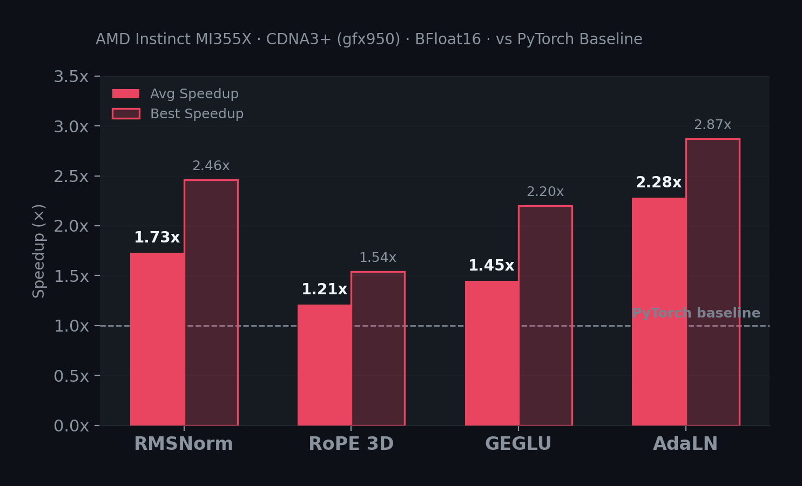
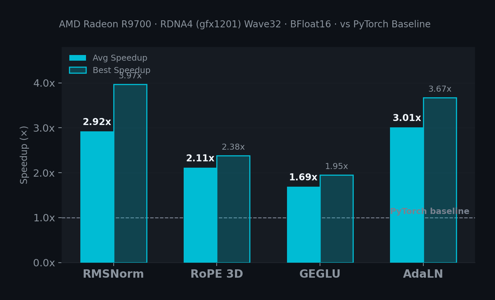
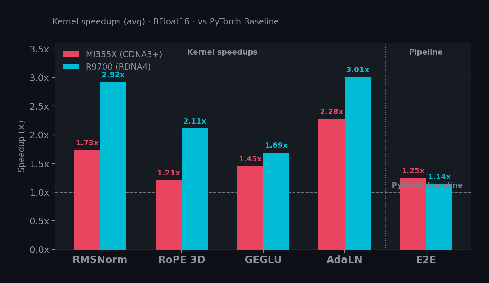

# ROCm Kernel Skill: Custom Triton Kernels for AMD, from Datacenter to Desktop


tl;dr: We built an agent skill that teaches coding agents how to write optimized Triton kernels for AMD GPUs. We tested it on two fundamentally different architectures — **MI355X** (CDNA3+, datacenter) and **R9700** (RDNA4, desktop) — with four kernel types. All passed correctness checks. R9700 reached **3.97x** peak kernel speedup with **79.5%** bandwidth utilization; MI355X delivered **25%** end-to-end speedup on LTX-Video. No CUDA required.

We recently released a [CUDA kernel skill](https://huggingface.co/blog/custom-cuda-kernels-agent-skills) that teaches coding agents to write production NVIDIA kernels. Now we are bringing the same capability to AMD — but this is not a port. AMD kernel development uses a different language, faces different constraints, and targets fundamentally different hardware. It required a skill built from scratch.

## Why AMD needs its own kernel skill

You might assume an AMD kernel skill is the CUDA skill with a few parameters changed. It is not. Three fundamental differences forced us to build a separate skill.

**Different language.** The CUDA skill generates C/C++ kernel source with PyTorch C++ bindings. On AMD, we chose [Triton](https://triton-lang.org/) — a Python-native kernel language that compiles to AMD GCN/RDNA ISA via ROCm. No C++ bindings needed, no `torch_binding.cpp`, no `build.toml` with cuda-capabilities. The entire development workflow is Python end to end.

**Different constraints.** ROCm's Triton has restrictions that do not exist on NVIDIA:

```python
# These work on NVIDIA Triton, but FAIL on ROCm
tl.libdevice.tanh(x)    # Not available
tl.math.tanh(x)          # Not available

# ROCm requires manual implementation
e2x = tl.exp(2.0 * x)
tanh_x = (e2x - 1.0) / (e2x + 1.0)
```

Autotuning `BLOCK_D` — perfectly safe on NVIDIA — produces **silently wrong results** on ROCm because the autotuner may pick a block size smaller than the row width, causing partial row processing. The skill encodes these pitfalls so the agent avoids them.

**Different hardware.** The CUDA skill targets H100, A100, and T4 — variations of the same NVIDIA architecture family. The ROCm skill targets two architectures that have almost nothing in common:

| | MI355X (CDNA3+) | R9700 (RDNA4) |
| :---- | :---: | :---: |
| Target | Datacenter | Desktop |
| Wavefront | Wave64 | Wave32 |
| XCDs (Chiplets) | 32 | 1 (monolithic) |
| LDS per CU | 160 KB | 64 KB |
| Memory BW | 8 TB/s | 608 GB/s |
| XCD Swizzle | Mandatory for GEMM | Not needed |

Wave64 vs Wave32 changes how reductions work. XCD Swizzle is mandatory on MI355X — without it, GEMM blocks cluster on a few chiplets and waste 90%+ of the GPU — but is meaningless on R9700. One skill must teach the agent to handle both.

## What is in the skill

The skill provides structured guidance, Triton kernel templates, hardware-specific optimization guides, and integration examples for HuggingFace libraries.

It covers:

- **Architecture-aware optimization** for MI355X (gfx950) and R9700 (gfx1201), including LDS budgets, wave sizing, and XCD swizzle patterns
- **Four Triton kernel templates**: RMSNorm, RoPE 3D, GEGLU, and AdaLN — all using ROCm-safe patterns (manual tanh, fixed BLOCK_D)
- **Integration patterns** for `diffusers` (LTX-Video, SD3, FLUX) and `transformers` (LLaMA, Qwen)
- **Benchmarking workflows** for isolated micro-benchmarks and end-to-end pipeline comparisons
- **ROCm troubleshooting guide** covering platform-specific pitfalls

```
.claude/skills/rocm-kernels/
├── SKILL.md                              # Main instructions
├── scripts/
│   ├── benchmark_kernels.py              # Micro-benchmark (4 kernels)
│   ├── benchmark_e2e.py                  # End-to-end pipeline benchmark
│   ├── ltx_kernel_injection_example.py   # Diffusers integration
│   ├── transformers_injection_example.py # Transformers integration
│   └── huggingface_kernels_example.py    # Kernel Hub integration
└── references/
    ├── mi355x-optimization-guide.md      # MI355X (CDNA3+) deep dive
    ├── r9700-optimization-guide.md       # R9700 (RDNA4) deep dive
    ├── diffusers-integration.md
    ├── transformers-integration.md
    ├── kernel-templates.md               # 4 Triton kernel templates
    └── troubleshooting.md                # ROCm-specific issues
```

## Installing the skill

The skill ships with the `kernels` library:

```shell
pip install git+https://github.com/huggingface/kernels.git#subdirectory=kernels
kernels skills add rocm-kernels --claude
```

For other agents:

```shell
# Codex
kernels skills add rocm-kernels --codex

# OpenCode
kernels skills add rocm-kernels --opencode

# Custom destination
kernels skills add rocm-kernels --dest ./my-agent/skills/
```

Once installed, prompt your agent:

```
Build an optimized RMSNorm Triton kernel for MI355X targeting LTX-Video in diffusers.
Benchmark it against the PyTorch baseline.
```

Or for the R9700:

```
Write a Triton GEGLU kernel optimized for R9700 (RDNA4, Wave32).
Use the R9700 optimization guide for block sizing and num_warps.
```

The agent reads the skill, selects architecture-specific parameters, generates the Triton kernel, and creates benchmark scripts — all in Python, no C++ required.

## Benchmarking the kernels

We tested four kernel types — RMSNorm, RoPE 3D, GEGLU, and AdaLN — on both MI355X and R9700 to validate the skill across architectures. All benchmarks used BFloat16 precision.

### MI355X (CDNA3+, Datacenter)

**Hardware**: AMD Instinct MI355X, 288 GB HBM3e, ROCm 7.0

#### Isolated kernel micro-benchmarks



RMSNorm bandwidth: 3,546 GB/s achieved (44% of MI355X theoretical 8 TB/s).

<details>
<summary>Table</summary>

| Kernel | Avg Speedup | Best Speedup | Best Config |
| :---- | :---: | :---: | :---- |
| RMSNorm | **1.73x** | 2.46x | [4×4096×3072] |
| RoPE 3D | **1.21x** | 1.54x | [2×4096×16×128] |
| GEGLU | **1.45x** | 2.20x | [4×4096×8192] |
| AdaLN | **2.28x** | 2.87x | [4×4096×3072] |

**Detailed RMSNorm results:**

| Shape | Triton (ms) | PyTorch (ms) | Speedup |
| :---- | :---: | :---: | :---: |
| [1×1024×2048] | 0.029 | 0.037 | **1.29x** |
| [2×1024×2048] | 0.029 | 0.044 | **1.48x** |
| [4×1024×2048] | 0.033 | 0.051 | **1.57x** |
| [1×4096×2048] | 0.032 | 0.050 | **1.56x** |
| [2×4096×3072] | 0.042 | 0.085 | **2.02x** |
| [1×8192×2048] | 0.040 | 0.067 | **1.69x** |
| [4×4096×3072] | 0.056 | 0.138 | **2.46x** |

</details>

#### End-to-end: LTX-Video (25 frames, 480×704, 30 steps)

A 25% end-to-end speedup from custom Triton kernels alone. Combined with `torch.compile`, the pipeline reaches 1.52x over baseline. Peak memory stays at 18.58 GB in all configurations.

<details>
<summary>Table</summary>

| Mode | Time (s) | Per Step (s) | Speedup |
| :---- | :---: | :---: | :---: |
| Baseline | 1.25 | 0.042 | 1.00x |
| **Triton Kernels** | **1.00** | **0.033** | **1.25x** |
| torch.compile | 0.82 | 0.027 | 1.52x |

</details>

### R9700 (RDNA4, Desktop)

**Hardware**: AMD Radeon R9700, RDNA4 (Wave32), ROCm 7.1

#### Isolated kernel micro-benchmarks



RMSNorm bandwidth: ~479 GB/s achieved (79.5% of R9700 theoretical 608 GB/s).

<details>
<summary>Table</summary>

| Kernel | Avg Speedup | Best Speedup | Best Config |
| :---- | :---: | :---: | :---- |
| RMSNorm | **2.92x** | 3.97x | [1×8192×2048] |
| RoPE 3D | **2.11x** | 2.38x | — |
| GEGLU | **1.69x** | 1.95x | [2×1024×8192] |
| AdaLN | **3.01x** | 3.67x | [4×4096×3072] |

</details>

#### End-to-end: LTX-Video (25 frames, 480×704, 30 steps)

<details>
<summary>Table</summary>

| Mode | Time (s) | Speedup |
| :---- | :---: | :---: |
| Baseline | 6.89 | 1.00x |
| **Triton Kernels** | **6.06** | **1.14x** |
| torch.compile | 5.07 | 1.36x |

</details>

### Cross-hardware insights



<details>
<summary>Table</summary>

| Kernel | R9700 (RDNA4) | MI355X (CDNA3+) |
| :---- | :---: | :---: |
| RMSNorm | **2.92x** | 1.73x |
| RoPE 3D | **2.11x** | 1.21x |
| GEGLU | **1.69x** | 1.45x |
| AdaLN | **3.01x** | 2.28x |
| E2E Speedup | 1.14x | **1.25x** |
| BW Utilization | **79.5%** | 44% |

</details>

R9700's kernel-level speedups are higher across the board — up to 2.92x average for RMSNorm versus MI355X's 1.73x. This is because the default PyTorch code paths on desktop AMD GPUs have more room for optimization, so custom Triton kernels deliver a larger relative gain.

MI355X wins on end-to-end throughput (1.25x vs 1.14x) thanks to its raw compute power and 8 TB/s memory bandwidth. In absolute time, MI355X generates 25 frames in 1.00s versus R9700's 6.06s.

The bandwidth utilization tells an efficiency story: R9700 reaches 79.5% of its theoretical memory bandwidth, nearly double MI355X's 44%. The Triton kernels are well-matched to the RDNA4 memory system, making R9700 a surprisingly strong platform for custom kernel workloads.

## Conclusion

We built an agent skill for AMD kernel development and validated it on two fundamentally different architectures. The skill encodes the domain knowledge that makes AMD kernel development hard — ROCm-specific Triton constraints, Wave64 vs Wave32 differences, XCD Swizzle requirements, and library integration pitfalls — so coding agents can produce working, optimized kernels out of the box.

The [CUDA kernel skill](https://huggingface.co/blog/custom-cuda-kernels-agent-skills) covers NVIDIA. The ROCm kernel skill covers AMD. Together, they let coding agents write production kernels for any major GPU platform.

## Resources

- [ROCm Kernels Skill in `kernels`](https://github.com/huggingface/kernels/tree/main/skills/rocm-kernels)
- [CUDA Kernels Skill in `kernels`](https://github.com/huggingface/kernels/tree/main/skills/cuda-kernels)
- [Custom CUDA Kernels Blog](https://huggingface.co/blog/custom-cuda-kernels-agent-skills)
- [HuggingFace Kernel Hub Blog](https://huggingface.co/blog/hello-hf-kernels)
- [HuggingFace Kernels Community](https://huggingface.co/kernels-community)
- [Triton Documentation](https://triton-lang.org/)
- [ROCm Documentation](https://rocm.docs.amd.com/)
