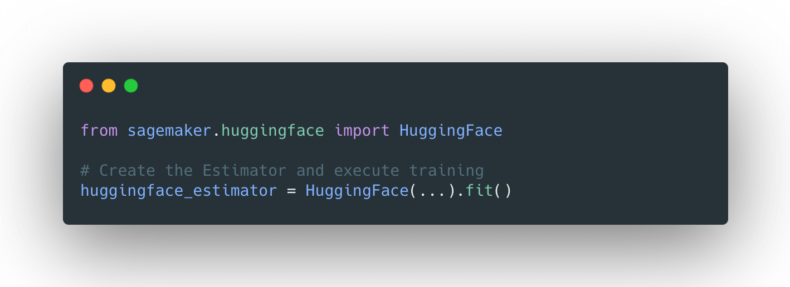
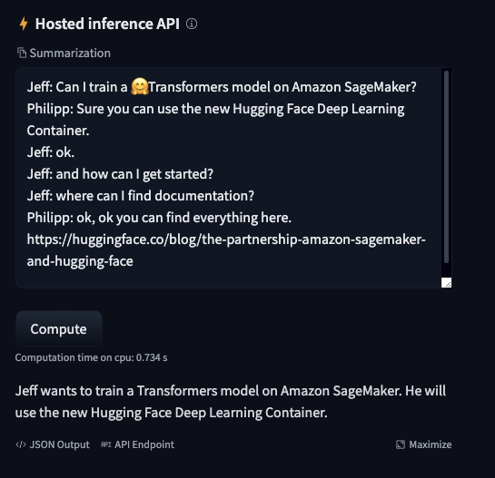

# Distributed Training: Train BART/T5 for Summarization using 🤗 Transformers and Amazon SageMaker

<!-- {blog_metadata} -->
<!-- {authors} -->

<a target="_blank" href="https://github.com/huggingface/notebooks/blob/master/sagemaker/08_distributed_summarization_bart_t5/sagemaker-notebook.ipynb">
    
</a>


In case you missed it: on March 25th [we announced a collaboration with Amazon SageMaker](https://huggingface.co/blog/the-partnership-amazon-sagemaker-and-hugging-face) to make it easier to create State-of-the-Art Machine Learning models, and ship cutting-edge NLP features faster.  

Together with the SageMaker team, we built 🤗  Transformers optimized [Deep Learning Containers](https://github.com/aws/deep-learning-containers/blob/master/available_images.md#huggingface-training-containers) to accelerate training of Transformers-based models. Thanks AWS friends!🤗 🚀 

With the new HuggingFace estimator in the [SageMaker Python SDK](https://sagemaker.readthedocs.io/en/stable/), you can start training with a single line of code. 



The [announcement blog post](https://huggingface.co/blog/the-partnership-amazon-sagemaker-and-hugging-face) provides all the information you need to know about the integration, including a "Getting Started" example and links to documentation, examples, and features.

listed again here:

- [🤗 Transformers Documentation: Amazon SageMaker](https://huggingface.co/transformers/sagemaker.html)
- [Example Notebooks](https://github.com/huggingface/notebooks/tree/master/sagemaker)
- [Amazon SageMaker documentation for Hugging Face](https://docs.aws.amazon.com/sagemaker/latest/dg/hugging-face.html)
- [Python SDK SageMaker documentation for Hugging Face](https://sagemaker.readthedocs.io/en/stable/frameworks/huggingface/index.html)
- [Deep Learning Container](https://github.com/aws/deep-learning-containers/blob/master/available_images.md#huggingface-training-containers)

If you're not familiar with Amazon SageMaker: *"Amazon SageMaker is a fully managed service that provides every developer and data scientist with the ability to build, train, and deploy machine learning (ML) models quickly. SageMaker removes the heavy lifting from each step of the machine learning process to make it easier to develop high quality models." [[REF](https://aws.amazon.com/sagemaker/faqs/)]*

---

# Tutorial

We will use the new [Hugging Face DLCs](https://github.com/aws/deep-learning-containers/tree/master/huggingface) and [Amazon SageMaker extension](https://sagemaker.readthedocs.io/en/stable/frameworks/huggingface/sagemaker.huggingface.html#huggingface-estimator) to train a distributed Seq2Seq-transformer model on the `summarization` task using the `transformers` and `datasets` libraries, and then upload the model to [huggingface.co](http://huggingface.co) and test it.

As [distributed training strategy](https://huggingface.co/transformers/sagemaker.html#distributed-training-data-parallel) we are going to use [SageMaker Data Parallelism](https://aws.amazon.com/blogs/aws/managed-data-parallelism-in-amazon-sagemaker-simplifies-training-on-large-datasets/), which has been built into the [Trainer](https://huggingface.co/transformers/main_classes/trainer.html) API. To use data-parallelism we only have to define the `distribution` parameter in our `HuggingFace` estimator.

```python
# configuration for running training on smdistributed Data Parallel
distribution = {'smdistributed':{'dataparallel':{ 'enabled': True }}}
```

In this tutorial, we will use an Amazon SageMaker Notebook Instance for running our training job. You can learn [here how to set up a Notebook Instance](https://docs.aws.amazon.com/sagemaker/latest/dg/nbi.html).

**What are we going to do:**

- Set up a development environment and install sagemaker
- Choose 🤗 Transformers `examples/` script
- Configure distributed training and hyperparameters
- Create a `HuggingFace` estimator and start training
- Upload the fine-tuned model to [huggingface.co](http://huggingface.co)
- Test inference

### Model and Dataset

We are going to fine-tune [facebook/bart-large-cnn](https://huggingface.co/facebook/bart-large-cnn) on the [samsum](https://huggingface.co/datasets/samsum) dataset. *"BART is sequence-to-sequence model trained with denoising as pretraining objective."* [[REF](https://github.com/pytorch/fairseq/blob/master/examples/bart/README.md)]

The `samsum` dataset contains about 16k messenger-like conversations with summaries. 

```json
{"id": "13818513",
 "summary": "Amanda baked cookies and will bring Jerry some tomorrow.",
 "dialogue": "Amanda: I baked cookies. Do you want some?\r\nJerry: Sure!\r\nAmanda: I'll bring you tomorrow :-)"}
```

---

## Set up a development environment and install sagemaker

After our SageMaker Notebook Instance is running we can select either Jupyer Notebook or JupyterLab and create a new Notebook with the `conda_pytorch_p36 kernel`.

_**Note:** The use of Jupyter is optional: We could also launch SageMaker Training jobs from anywhere we have an SDK installed, connectivity to the cloud and appropriate permissions, such as a Laptop, another IDE or a task scheduler like Airflow or AWS Step Functions._

After that we can install the required dependencies

```bash
!pip install transformers "datasets[s3]" sagemaker --upgrade
```

[install](https://github.com/git-lfs/git-lfs/wiki/Installation) `git-lfs` for model upload.

```bash
!curl -s https://packagecloud.io/install/repositories/github/git-lfs/script.rpm.sh | sudo bash
!sudo yum install git-lfs -y
!git lfs install
```

To run training on SageMaker we need to create a sagemaker Session and provide an IAM role with the right permission. This IAM role will be later attached to the `TrainingJob` enabling it to download data, e.g. from Amazon S3.

```python
import sagemaker

sess = sagemaker.Session()
role = sagemaker.get_execution_role()

print(f"IAM role arn used for running training: {role}")
print(f"S3 bucket used for storing artifacts: {sess.default_bucket()}")

```

---

# Choose 🤗 Transformers `examples/` script

The [🤗 Transformers repository](https://github.com/huggingface/transformers/tree/master/examples) contains several `examples/`scripts for fine-tuning models on tasks from `language-modeling` to `token-classification`. In our case, we are using the `run_summarization.py` from the `seq2seq/` examples. 

***Note**: you can use this tutorial as-is to train your model on a different examples script.*

Since the `HuggingFace` Estimator has git support built-in, we can specify a [training script stored in a GitHub repository](https://sagemaker.readthedocs.io/en/stable/overview.html#use-scripts-stored-in-a-git-repository) as `entry_point` and `source_dir`.

We are going to use the `transformers 4.4.2` DLC which means we need to configure the `v4.4.2` as the branch to pull the compatible example scripts.

```python
#git_config = {'repo': 'https://github.com/huggingface/transformers.git','branch': 'v4.4.2'} # v4.4.2 is referring to the `transformers_version you use in the estimator.
# used due an missing package in v4.4.2 
git_config = {'repo': 'https://github.com/philschmid/transformers.git','branch': 'master'} # v4.4.2 is referring to the `transformers_version you use in the estimator.
```

---

## Configure distributed training and hyperparameters

Next, we will define our `hyperparameters` and configure our distributed training strategy. As hyperparameter, we can define any [Seq2SeqTrainingArguments](https://huggingface.co/transformers/main_classes/trainer.html#seq2seqtrainingarguments) and the ones defined in [run_summarization.py](https://github.com/huggingface/transformers/tree/main/examples/legacy/seq2seq#sequence-to-sequence-training-and-evaluation). 

```python
# hyperparameters, which are passed into the training job
hyperparameters={
    'per_device_train_batch_size': 4,
    'per_device_eval_batch_size': 4,
    'model_name_or_path':'facebook/bart-large-cnn',
    'dataset_name':'samsum',
    'do_train':True,
    'do_predict': True,
    'predict_with_generate': True,
    'output_dir':'/opt/ml/model',
    'num_train_epochs': 3,
    'learning_rate': 5e-5,
    'seed': 7,
    'fp16': True,
}

# configuration for running training on smdistributed Data Parallel
distribution = {'smdistributed':{'dataparallel':{ 'enabled': True }}}
```

Since, we are using [SageMaker Data Parallelism](https://aws.amazon.com/blogs/aws/managed-data-parallelism-in-amazon-sagemaker-simplifies-training-on-large-datasets/) our `total_batch_size` will be `per_device_train_batch_size` * `n_gpus`.

---

## Create a `HuggingFace` estimator and start training

The last step before training is creating a `HuggingFace` estimator. The Estimator handles the end-to-end Amazon SageMaker training. We define which fine-tuning script should be used as `entry_point`, which `instance_type` should be used, and which `hyperparameters` are passed in.

```python
from sagemaker.huggingface import HuggingFace

# create the Estimator
huggingface_estimator = HuggingFace(
      entry_point='run_summarization.py', # script
      source_dir='./examples/seq2seq', # relative path to example
      git_config=git_config,
      instance_type='ml.p3dn.24xlarge',
      instance_count=2,
      transformers_version='4.4.2',
      pytorch_version='1.6.0',
      py_version='py36',
      role=role,
      hyperparameters = hyperparameters,
      distribution = distribution
)
```

As `instance_type` we are using `ml.p3dn.24xlarge`, which contains 8x NVIDIA A100 with an `instance_count` of 2. This means we are going to run training on 16 GPUs and a `total_batch_size` of 16*4=64. We are going to train a 400 Million Parameter model with a `total_batch_size` of 64, which is just wow.
To start our training we call the `.fit()` method.

```python
# starting the training job
huggingface_estimator.fit()
```
```bash
2021-04-01 13:00:35 Starting - Starting the training job...
2021-04-01 13:01:03 Starting - Launching requested ML instancesProfilerReport-1617282031: InProgress
2021-04-01 13:02:23 Starting - Preparing the instances for training......
2021-04-01 13:03:25 Downloading - Downloading input data...
2021-04-01 13:04:04 Training - Downloading the training image...............
2021-04-01 13:06:33 Training - Training image download completed. Training in progress
....
....
2021-04-01 13:16:47 Uploading - Uploading generated training model
2021-04-01 13:27:49 Completed - Training job completed
Training seconds: 2882
Billable seconds: 2882
```

The training seconds are 2882 because they are multiplied by the number of instances. If we calculate 2882/2=1441 is it the duration from "Downloading the training image" to "Training job completed". 
Converted to real money, our training on 16 NVIDIA Tesla V100-GPU for a State-of-the-Art summarization model comes down to ~28$.

---

## Upload the fine-tuned model to [huggingface.co](http://huggingface.co)

Since our model achieved a pretty good score we are going to upload it to [huggingface.co](http://huggingface.co), create a `model_card` and test it with the Hosted Inference widget. To upload a model you need to [create an account here](https://huggingface.co/join).

We can download our model from Amazon S3 and unzip it using the following snippet.

```python
import os
import tarfile
from sagemaker.s3 import S3Downloader

local_path = 'my_bart_model'

os.makedirs(local_path, exist_ok = True)

# download model from S3
S3Downloader.download(
    s3_uri=huggingface_estimator.model_data, # s3 uri where the trained model is located
    local_path=local_path, # local path where *.tar.gz will be saved
    sagemaker_session=sess # sagemaker session used for training the model
)

# unzip model
tar = tarfile.open(f"{local_path}/model.tar.gz", "r:gz")
tar.extractall(path=local_path)
tar.close()
os.remove(f"{local_path}/model.tar.gz")
```

Before we are going to upload our model to [huggingface.co](http://huggingface.co) we need to create a `model_card`. The `model_card` describes the model and includes hyperparameters, results, and specifies which dataset was used for training. To create a `model_card` we create a `README.md` in our `local_path` 

```python
# read eval and test results 
with open(f"{local_path}/eval_results.json") as f:
    eval_results_raw = json.load(f)
    eval_results={}
    eval_results["eval_rouge1"] = eval_results_raw["eval_rouge1"]
    eval_results["eval_rouge2"] = eval_results_raw["eval_rouge2"]
    eval_results["eval_rougeL"] = eval_results_raw["eval_rougeL"]
    eval_results["eval_rougeLsum"] = eval_results_raw["eval_rougeLsum"]

with open(f"{local_path}/test_results.json") as f:
    test_results_raw = json.load(f)
    test_results={}
    test_results["test_rouge1"] = test_results_raw["test_rouge1"]
    test_results["test_rouge2"] = test_results_raw["test_rouge2"]
    test_results["test_rougeL"] = test_results_raw["test_rougeL"]
    test_results["test_rougeLsum"] = test_results_raw["test_rougeLsum"]
```

After we extract all the metrics we want to include we are going to create our `README.md`. Additionally to the automated generation of the results table we add the metrics manually to the `metadata` of our model card under `model-index`

```python
import json

MODEL_CARD_TEMPLATE = """
---
language: en
tags:
- sagemaker
- bart
- summarization
license: apache-2.0
datasets:
- samsum
model-index:
- name: {model_name}
  results:
  - task: 
      name: Abstractive Text Summarization
      type: abstractive-text-summarization
    dataset:
      name: "SAMSum Corpus: A Human-annotated Dialogue Dataset for Abstractive Summarization" 
      type: samsum
    metrics:
       - name: Validation ROGUE-1
         type: rogue-1
         value: 42.621
       - name: Validation ROGUE-2
         type: rogue-2
         value: 21.9825
       - name: Validation ROGUE-L
         type: rogue-l
         value: 33.034
       - name: Test ROGUE-1
         type: rogue-1
         value: 41.3174
       - name: Test ROGUE-2
         type: rogue-2
         value: 20.8716
       - name: Test ROGUE-L
         type: rogue-l
         value: 32.1337
widget:
- text: | 
    Jeff: Can I train a 🤗 Transformers model on Amazon SageMaker? 
    Philipp: Sure you can use the new Hugging Face Deep Learning Container. 
    Jeff: ok.
    Jeff: and how can I get started? 
    Jeff: where can I find documentation? 
    Philipp: ok, ok you can find everything here. https://huggingface.co/blog/the-partnership-amazon-sagemaker-and-hugging-face 
---

## `{model_name}`

This model was trained using Amazon SageMaker and the new Hugging Face Deep Learning container.

For more information look at:
- [🤗 Transformers Documentation: Amazon SageMaker](https://huggingface.co/transformers/sagemaker.html)
- [Example Notebooks](https://github.com/huggingface/notebooks/tree/master/sagemaker)
- [Amazon SageMaker documentation for Hugging Face](https://docs.aws.amazon.com/sagemaker/latest/dg/hugging-face.html)
- [Python SDK SageMaker documentation for Hugging Face](https://sagemaker.readthedocs.io/en/stable/frameworks/huggingface/index.html)
- [Deep Learning Container](https://github.com/aws/deep-learning-containers/blob/master/available_images.md#huggingface-training-containers)

## Hyperparameters

    {hyperparameters}


## Usage
    from transformers import pipeline
    summarizer = pipeline("summarization", model="philschmid/{model_name}")

    conversation = '''Jeff: Can I train a 🤗 Transformers model on Amazon SageMaker? 
    Philipp: Sure you can use the new Hugging Face Deep Learning Container. 
    Jeff: ok.
    Jeff: and how can I get started? 
    Jeff: where can I find documentation? 
    Philipp: ok, ok you can find everything here. https://huggingface.co/blog/the-partnership-amazon-sagemaker-and-hugging-face                                           
    '''
    nlp(conversation)

## Results

| key | value |
| --- | ----- |
{eval_table}
{test_table}


"""

# Generate model card (todo: add more data from Trainer)
model_card = MODEL_CARD_TEMPLATE.format(
    model_name=f"{hyperparameters['model_name_or_path'].split('/')[1]}-{hyperparameters['dataset_name']}",
    hyperparameters=json.dumps(hyperparameters, indent=4, sort_keys=True),
    eval_table="\n".join(f"| {k} | {v} |" for k, v in eval_results.items()),
    test_table="\n".join(f"| {k} | {v} |" for k, v in test_results.items()),
)

with open(f"{local_path}/README.md", "w") as f:
    f.write(model_card)
```

After we have our unzipped model and model card located in `my_bart_model` we can use the either `huggingface_hub` SDK to create a repository and upload it to [huggingface.co](https://huggingface.co) – or just to https://huggingface.co/new an create a new repository and upload it.

```python
from getpass import getpass
from huggingface_hub import HfApi, Repository

hf_username = "philschmid" # your username on huggingface.co
hf_email = "philipp@huggingface.co" # email used for commit
repository_name = f"{hyperparameters['model_name_or_path'].split('/')[1]}-{hyperparameters['dataset_name']}" # repository name on huggingface.co
password = getpass("Enter your password:") # creates a prompt for entering password

# get hf token
token = HfApi().login(username=hf_username, password=password)

# create repository
repo_url = HfApi().create_repo(token=token, name=repository_name, exist_ok=True)

# create a Repository instance
model_repo = Repository(use_auth_token=token,
                        clone_from=repo_url,
                        local_dir=local_path,
                        git_user=hf_username,
                        git_email=hf_email)

# push model to the hub
model_repo.push_to_hub()
```

---

## Test inference

After we uploaded our model we can access it at `https://huggingface.co/{hf_username}/{repository_name}` 

```python
print(f"https://huggingface.co/{hf_username}/{repository_name}")
```

And use the "Hosted Inference API" widget to test it. 

[https://huggingface.co/philschmid/bart-large-cnn-samsum](https://huggingface.co/philschmid/bart-large-cnn-samsum)


