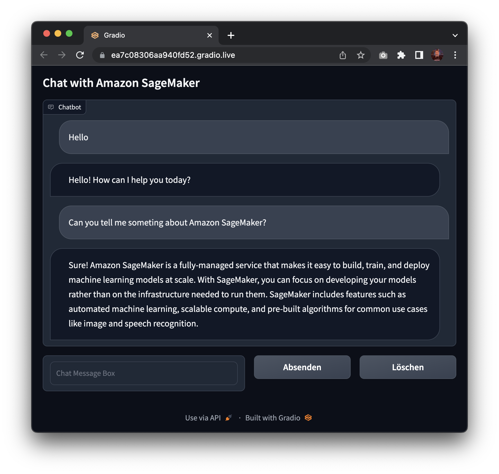

# Introducing the Hugging Face LLM Inference Container for Amazon SageMaker


This is an example on how to deploy the open-source LLMs, like [BLOOM](https://huggingface.co/bigscience/bloom) to Amazon SageMaker for inference using the new Hugging Face LLM Inference Container.
We will deploy the 12B [Pythia Open Assistant Model](https://huggingface.co/OpenAssistant/pythia-12b-sft-v8-7k-steps), an open-source Chat LLM trained with the Open Assistant dataset.

The example covers:

1. [Setup development environment](#1-setup-development-environment)
2. [Retrieve the new Hugging Face LLM DLC](#2-retrieve-the-new-hugging-face-llm-dlc)
3. [Deploy Open Assistant 12B to Amazon SageMaker](#3-deploy-deploy-open-assistant-12b-to-amazon-sagemaker)
4. [Run inference and chat with our model](#4-run-inference-and-chat-with-our-model)
5. [Create Gradio Chatbot backed by Amazon SageMaker](#5-create-gradio-chatbot-backed-by-amazon-sagemaker)

You can find the code for the example also in the [notebooks repository](https://github.com/huggingface/notebooks/blob/main/sagemaker/27_deploy_large_language_models/sagemaker-notebook.ipynb).

## What is Hugging Face LLM Inference DLC?

Hugging Face LLM DLC is a new purpose-built Inference Container to easily deploy LLMs in a secure and managed environment. The DLC is powered by [Text Generation Inference (TGI)](https://github.com/huggingface/text-generation-inference), an open-source, purpose-built solution for deploying and serving Large Language Models (LLMs). TGI enables high-performance text generation using Tensor Parallelism and dynamic batching for the most popular open-source LLMs, including StarCoder, BLOOM, GPT-NeoX, Llama, and T5.
Text Generation Inference is already used by customers such as IBM, Grammarly, and the Open-Assistant initiative implements optimization for all supported model architectures, including:

- Tensor Parallelism and custom cuda kernels
- Optimized transformers code for inference using [flash-attention](https://github.com/HazyResearch/flash-attention) on the most popular architectures
- Quantization with [bitsandbytes](https://github.com/TimDettmers/bitsandbytes)
- [Continuous batching of incoming requests](https://github.com/huggingface/text-generation-inference/tree/main/router) for increased total throughput
- Accelerated weight loading (start-up time) with [safetensors](https://github.com/huggingface/safetensors)
- Logits warpers (temperature scaling, topk, repetition penalty ...)
- Watermarking with [A Watermark for Large Language Models](https://arxiv.org/abs/2301.10226)
- Stop sequences, Log probabilities
- Token streaming using Server-Sent Events (SSE)

Officially supported model architectures are currently:

- [BLOOM](https://huggingface.co/bigscience/bloom) / [BLOOMZ](https://huggingface.co/bigscience/bloomz)
- [MT0-XXL](https://huggingface.co/bigscience/mt0-xxl)
- [Galactica](https://huggingface.co/facebook/galactica-120b)
- [SantaCoder](https://huggingface.co/bigcode/santacoder)
- [GPT-Neox 20B](https://huggingface.co/EleutherAI/gpt-neox-20b) (joi, pythia, lotus, rosey, chip, RedPajama, open assistant)
- [FLAN-T5-XXL](https://huggingface.co/google/flan-t5-xxl) (T5-11B)
- [Llama](https://github.com/facebookresearch/llama) (vicuna, alpaca, koala)
- [Starcoder](https://huggingface.co/bigcode/starcoder) / [SantaCoder](https://huggingface.co/bigcode/santacoder)
- [Falcon 7B](https://huggingface.co/tiiuae/falcon-7b) / [Falcon 40B](https://huggingface.co/tiiuae/falcon-40b)

With the new Hugging Face LLM Inference DLCs on Amazon SageMaker, AWS customers can benefit from the same technologies that power highly concurrent, low latency LLM experiences like [HuggingChat](https://hf.co/chat), [OpenAssistant](https://open-assistant.io/), and Inference API for LLM models on the Hugging Face Hub.

Let's get started!

## 1. Setup development environment

We are going to use the `sagemaker` python SDK to deploy BLOOM to Amazon SageMaker. We need to make sure to have an AWS account configured and the `sagemaker` python SDK installed.

```python
!pip install "sagemaker==2.175.0" --upgrade --quiet
```

If you are going to use Sagemaker in a local environment, you need access to an IAM Role with the required permissions for Sagemaker. You can find [here](https://docs.aws.amazon.com/sagemaker/latest/dg/sagemaker-roles.html) more about it.

```python
import sagemaker
import boto3
sess = sagemaker.Session()
# sagemaker session bucket -> used for uploading data, models and logs
# sagemaker will automatically create this bucket if it not exists
sagemaker_session_bucket=None
if sagemaker_session_bucket is None and sess is not None:
    # set to default bucket if a bucket name is not given
    sagemaker_session_bucket = sess.default_bucket()

try:
    role = sagemaker.get_execution_role()
except ValueError:
    iam = boto3.client('iam')
    role = iam.get_role(RoleName='sagemaker_execution_role')['Role']['Arn']

sess = sagemaker.Session(default_bucket=sagemaker_session_bucket)

print(f"sagemaker role arn: {role}")
print(f"sagemaker session region: {sess.boto_region_name}")

```

## 2. Retrieve the new Hugging Face LLM DLC

Compared to deploying regular Hugging Face models, we first need to retrieve the container uri and provide it to our `HuggingFaceModel` model class with a `image_uri` pointing to the image. To retrieve the new Hugging Face LLM DLC in Amazon SageMaker, we can use the `get_huggingface_llm_image_uri` method provided by the `sagemaker` SDK. This method allows us to retrieve the URI for the desired Hugging Face LLM DLC based on the specified `backend`, `session`, `region`, and `version`. You can find the available versions [here](https://github.com/aws/deep-learning-containers/blob/master/available_images.md#huggingface-text-generation-inference-containers)

```python
from sagemaker.huggingface import get_huggingface_llm_image_uri

# retrieve the llm image uri
llm_image = get_huggingface_llm_image_uri(
  "huggingface",
  version="1.0.3"
)

# print ecr image uri
print(f"llm image uri: {llm_image}")
```

## 3. Deploy Open Assistant 12B to Amazon SageMaker

_Note: Quotas for Amazon SageMaker can vary between accounts. If you receive an error indicating you've exceeded your quota, you can increase them through the [Service Quotas console](https://console.aws.amazon.com/servicequotas/home/services/sagemaker/quotas)._

To deploy [Open Assistant Model](OpenAssistant/pythia-12b-sft-v8-7k-steps) to Amazon SageMaker we create a `HuggingFaceModel` model class and define our endpoint configuration including the `hf_model_id`, `instance_type` etc. We will use a `g5.12xlarge` instance type, which has 4 NVIDIA A10G GPUs and 96GB of GPU memory.

_Note: We could also optimize the deployment for cost and use `g5.2xlarge` instance type and enable int-8 quantization._


```python
import json
from sagemaker.huggingface import HuggingFaceModel

# sagemaker config
instance_type = "ml.g5.12xlarge"
number_of_gpu = 4
health_check_timeout = 300

# Define Model and Endpoint configuration parameter
config = {
  'HF_MODEL_ID': "OpenAssistant/pythia-12b-sft-v8-7k-steps", # model_id from hf.co/models
  'SM_NUM_GPUS': json.dumps(number_of_gpu), # Number of GPU used per replica
  'MAX_INPUT_LENGTH': json.dumps(1024),  # Max length of input text
  'MAX_TOTAL_TOKENS': json.dumps(2048),  # Max length of the generation (including input text)
  # 'HF_MODEL_QUANTIZE': "bitsandbytes", # comment in to quantize
}

# create HuggingFaceModel with the image uri
llm_model = HuggingFaceModel(
  role=role,
  image_uri=llm_image,
  env=config
)
```

After we have created the `HuggingFaceModel` we can deploy it to Amazon SageMaker using the `deploy` method. We will deploy the model with the `ml.g5.12xlarge` instance type. TGI will automatically distribute and shard the model across all GPUs.

```python
# Deploy model to an endpoint
# https://sagemaker.readthedocs.io/en/stable/api/inference/model.html#sagemaker.model.Model.deploy
llm = llm_model.deploy(
  initial_instance_count=1,
  instance_type=instance_type,
  # volume_size=400, # If using an instance with local SSD storage, volume_size must be None, e.g. p4 but not p3
  container_startup_health_check_timeout=health_check_timeout, # 10 minutes to be able to load the model
)

```

SageMaker will now create our endpoint and deploy the model to it. This can take 5-10 minutes.

## 4. Run inference and chat with our model

After our endpoint is deployed we can run inference on it using the `predict` method from the `predictor`. We can use different parameters to control the generation, defining them in the `parameters` attribute of the payload. As of today TGI supports the following parameters:

- `temperature`: Controls randomness in the model. Lower values will make the model more deterministic and higher values will make the model more random. Default value is 1.0.
- `max_new_tokens`: The maximum number of tokens to generate. Default value is 20, max value is 512.
- `repetition_penalty`: Controls the likelihood of repetition, defaults to `null`.
- `seed`: The seed to use for random generation, default is `null`.
- `stop`: A list of tokens to stop the generation. The generation will stop when one of the tokens is generated.
- `top_k`: The number of highest probability vocabulary tokens to keep for top-k-filtering. Default value is `null`, which disables top-k-filtering.
- `top_p`: The cumulative probability of parameter highest probability vocabulary tokens to keep for nucleus sampling, default to `null`
- `do_sample`: Whether or not to use sampling; use greedy decoding otherwise. Default value is `false`.
- `best_of`: Generate best_of sequences and return the one if the highest token logprobs, default to `null`.
- `details`: Whether or not to return details about the generation. Default value is `false`.
- `return_full_text`: Whether or not to return the full text or only the generated part. Default value is `false`.
- `truncate`: Whether or not to truncate the input to the maximum length of the model. Default value is `true`.
- `typical_p`: The typical probability of a token. Default value is `null`.
- `watermark`: The watermark to use for the generation. Default value is `false`.

You can find the open api specification of TGI in the [swagger documentation](https://huggingface.github.io/text-generation-inference/)

The `OpenAssistant/pythia-12b-sft-v8-7k-steps` is a conversational chat model meaning we can chat with it using the following prompt:

```
<|prompter|>[Instruction]<|endoftext|>
<|assistant|>
```

lets give it a first try and ask about some cool ideas to do in the summer:

```python
chat = llm.predict({
	"inputs": """<|prompter|>What are some cool ideas to do in the summer?<|endoftext|><|assistant|>"""
})

print(chat[0]["generated_text"])
#     <|prompter|>What are some cool ideas to do in the summer?<|endoftext|><|assistant|>There are many fun and exciting things you can do in the summer. Here are some ideas:
```

Now we will show how to use generation parameters in the `parameters` attribute of the payload. In addition to setting custom `temperature`, `top_p`, etc, we also stop generation after the turn of the `bot`.

```python
# define payload
prompt="""<|prompter|>How can i stay more active during winter? Give me 3 tips.<|endoftext|><|assistant|>"""

# hyperparameters for llm
payload = {
  "inputs": prompt,
  "parameters": {
    "do_sample": True,
    "top_p": 0.7,
    "temperature": 0.7,
    "top_k": 50,
    "max_new_tokens": 256,
    "repetition_penalty": 1.03,
    "stop": ["<|endoftext|>"]
  }
}

# send request to endpoint
response = llm.predict(payload)

# print(response[0]["generated_text"][:-len("<human>:")])
print(response[0]["generated_text"])
```

## 5. Create Gradio Chatbot backed by Amazon SageMaker

We can also create a gradio application to chat with our model. Gradio is a python library that allows you to quickly create customizable UI components around your machine learning models. You can find more about gradio [here](https://gradio.app/).

```python
!pip install gradio  --upgrade
```

```python
import gradio as gr

# hyperparameters for llm
parameters = {
    "do_sample": True,
    "top_p": 0.7,
    "temperature": 0.7,
    "top_k": 50,
    "max_new_tokens": 256,
    "repetition_penalty": 1.03,
    "stop": ["<|endoftext|>"]
  }

with gr.Blocks() as demo:
    gr.Markdown("## Chat with Amazon SageMaker")
    with gr.Column():
        chatbot = gr.Chatbot()
        with gr.Row():
            with gr.Column():
                message = gr.Textbox(label="Chat Message Box", placeholder="Chat Message Box", show_label=False)
            with gr.Column():
                with gr.Row():
                    submit = gr.Button("Submit")
                    clear = gr.Button("Clear")

    def respond(message, chat_history):
        # convert chat history to prompt
        converted_chat_history = ""
        if len(chat_history) > 0:
          for c in chat_history:
            converted_chat_history += f"<|prompter|>{c[0]}<|endoftext|><|assistant|>{c[1]}<|endoftext|>"
        prompt = f"{converted_chat_history}<|prompter|>{message}<|endoftext|><|assistant|>"

        # send request to endpoint
        llm_response = llm.predict({"inputs": prompt, "parameters": parameters})

        # remove prompt from response
        parsed_response = llm_response[0]["generated_text"][len(prompt):]
        chat_history.append((message, parsed_response))
        return "", chat_history

    submit.click(respond, [message, chatbot], [message, chatbot], queue=False)
    clear.click(lambda: None, None, chatbot, queue=False)

demo.launch(share=True)
```



Awesome! 🚀 We have successfully deployed Open Assistant Model to Amazon SageMaker and run inference on it. Additionally, we have built a quick gradio application to chat with our model.

Now, it's time for you to try it out yourself and build Generation AI applications with the new Hugging Face LLM DLC on Amazon SageMaker.

To clean up, we can delete the model and endpoint.

```python
llm.delete_model()
llm.delete_endpoint()
```

## Conclusion

The new Hugging Face LLM Inference DLC enables customers to easily and securely deploy open-source LLMs on Amazon SageMaker. The easy-to-use API and deployment process allows customers to build scalable AI chatbots and virtual assistants with state-of-the-art models like Open Assistant. Overall, this new DLC is going to empower developers and businesses to leverage the latest advances in natural language generation.

---

Thanks for reading! If you have any questions, feel free to contact me on [Twitter](https://twitter.com/_philschmid) or [LinkedIn](https://www.linkedin.com/in/philipp-schmid-a6a2bb196/).
