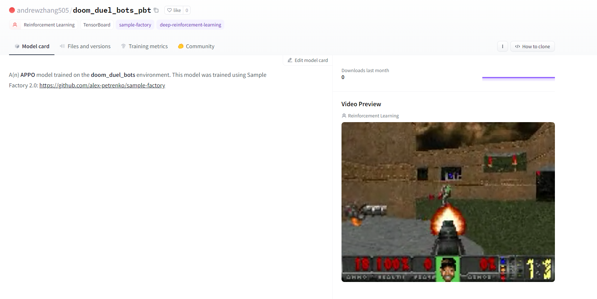

<h1>
    Welcome Sample Factory to the Hugging Face Hub 🤗
</h1>

<div class="blog-metadata">
    <small>Published December 13, 2022.</small>
    <a target="_blank" class="btn no-underline text-sm mb-5 font-sans" href="https://github.com/huggingface/blog/blob/main/sample-factory.md">
        Update on GitHub
    </a>
</div>

<div class="author-card">
    <a href="/ThomasSimonini"> 
        
        <div class="bfc">
            <code>ThomasSimonini</code>
            <span class="fullname">Thomas Simonini</span>
        </div>
    </a>
</div>
<div class="author-card">
    <a href="/edbeeching"> 
        
        <div class="bfc">
            <code>edbeeching</code>
            <span class="fullname">Edward Beeching</span>
        </div>
    </a>
</div>


At Hugging Face, we are contributing to the ecosystem for Deep Reinforcement Learning researchers and enthusiasts. That’s why we’re happy to announce that we integrated [Sample Factory](https://github.com/alex-petrenko/sample-factory) to the Hugging Face Hub, one of the most advanced RL framesworks available.

So, are you ready to take your Deep Reinforcement Learning training to the next level? Look no further than Hugging Face's latest integration with [Sample Factory](https://github.com/alex-petrenko/sample-factory)!

Sample Factory is a powerful library for high-throughput, asynchronous reinforcement learning, making it easy to train your agents across a variety of environments including IsaacGym, DeepMind Lab, Mujoco,  Atari, and VizDoom. With the integration with Hugging Face, you can now host your saved models and access powerful models from the community.

But that's not all - Sample Factory includes advanced features not found in most Deep RL frameworks, such as multi-agent training, self-play, and multi-GPU population-based training. Plus, it supports vectorized and GPU-accelerated environments for even faster training.

In this article, we'll show you the basics of Sample Factory, including installation and trying out the provided examples. In a future tutorial, we'll dive into more advanced features like multi-GPU population-based training and show you how to train an agent to play multiplayer Doom.
<figure class="image table text-center m-0 w-full">
  
  <figcaption>An example of an agent playing Doom.
</figcaption>
</figure>
Sounds exciting? Let's get started!

- [Installing the library]()
- [Exploring samaple-factory in the Hub]()
- [Loading models from the Hub]()


## Installing the library
Installing sample-factory is easy with pip:
`pip install sample-factory`


## Exploring sample-factory models in the Hub

You can find `sample-factory` models by filtering at the left of the [models page](https://huggingface.co/models?library=sample-factory).

All models on the Hub come up with useful features:
1. An automatically generated model card with a description, a training configuration, and more.
2. Metadata tags that help for discoverability.
3. Evaluation results to compare with other models.
4. A video widget where you can watch your agent performing.

<figure class="image table text-center m-0 w-full">
  
  <figcaption>An example of a model card of an agent playing Doom
</figcaption>
</figure>


## Loading models from the Hub
### Using load_from_hub

To download a model from the HuggingFace Hub to use with Sample-Factory, use the `load_from_hub` script:

```
python -m sample_factory.huggingface.load_from_hub -r <HuggingFace_repo_id> -d <train_dir_path>
```

The command line arguments are:

- `-r`: The repo ID for the HF repository to download. The repo ID should be in the format `<username>/<repo_name>`
- `-d`: An optional argument to specify the directory to save the experiment to. Defaults to `./train_dir` which will save the repo to `./train_dir/<repo_name>`

### Download Model Repository Directly

HuggingFace repositories can be downloaded directly using `git clone`:

```
git clone <URL of HuggingFace Repo>
```

## Using Downloaded Models with Sample-Factory

After downloading the model, you can run the models in the repo with the enjoy script corresponding to your environment. For example, if you are downloading a `mujoco-ant` model, it can be run with:

```
python -m sf_examples.mujoco_examples.enjoy_mujoco --algo=APPO --env=mujoco_ant --experiment=<repo_name> --train_dir=./train_dir
```

Note, you may have to specify the `--train_dir` if your local train_dir has a different path than the one in the `cfg.json`

## Sharing your models
### Using push_to_hub

If you want to upload without generating evaluation metrics or a replay video, you can use the `push_to_hub` script:

```
python -m sample_factory.huggingface.push_to_hub -r <hf_repo_name> -u <hf_username> -d <experiment_dir_path>
```

The command line arguments are:

- `-r`: The name of the repo to save on HF Hub. This is the same as `hf_repository` in the enjoy script
- `-u`: Your HuggingFace username
- `-d`: The full path to your experiment directory to upload


### Using enjoy.py

You can upload your models to the Hub using your environment's `enjoy` script with the `--push_to_hub` flag. Uploading using `enjoy` can also generate evaluation metrics and a replay video.

The evaluation metrics are generated by running your model on the specified environment for a number of episodes and reporting the mean and std reward of those runs.

Other relevant command line arguments are:

- `--hf_username`: Your HuggingFace username
- `--hf_repository`: The repository to push to. The model will be saved to `https://huggingface.co/hf_username/hf_repository`
- `--max_num_episodes`: Number of episodes to evaluate on before uploading. Used to generate evaluation metrics. It is recommended to use multiple episodes to generate an accurate mean and std.
- `--max_num_frames`: Number of frames to evaluate on before uploading. An alternative to `max_num_episodes`
- `--no_render`: A flag that disables rendering and showing the environment steps. It is recommended to set this flag to speed up the evaluation process.

You can also save a video of the model during evaluation to upload to the hub with the `--save_video` flag

- `--video_frames`: The number of frames to be rendered in the video. Defaults to -1 which renders an entire episode
- `--video_name`: The name of the video to save as. If `None`, will save to `replay.mp4` in your experiment directory

For example:

```
python -m sf_examples.mujoco_examples.enjoy_mujoco --algo=APPO --env=mujoco_ant --experiment=<repo_name> --train_dir=./train_dir --max_num_episodes=10 --push_to_hub --hf_username=<username> --hf_repository=<hf_repo_name> --save_video --no_render
```

## What's next?
In the coming weeks and months, we plan on supporting other tools from the ecosystem:

- Integrating [CleanRL](https://github.com/vwxyzjn/cleanrl) to the Hub.
- Expanding our repository of Decision Transformer models with models trained or finetuned in an online setting [1]
- Add Hub intergration to the [Godot RL library](https://github.com/edbeeching/godot_rl_agents/)

The best way to keep in touch is to **[join our discord server](https://discord.gg/YRAq8fMnUG)** to exchange with us and with the community.

Finally, we would like to thank the SB3 team and in particular Alexsei Petrenko, Andrew Zhang and Ming Wang for their contribution in building this library 🤗.

### Would you like to integrate your library to the Hub?

This integration is possible thanks to the [`huggingface_hub`](https://github.com/huggingface/huggingface_hub) library which has all our widgets and the API for all our supported libraries. If you would like to integrate your library to the Hub, we have a [guide](https://huggingface.co/docs/hub/models-adding-libraries) for you!

