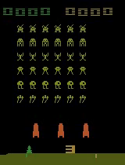

<h1>
    Welcome Stable-baselines3 to the Hugging Face Hub 🤗
</h1>

<div class="blog-metadata">
    <small>Published January 21, 2022.</small>
    <a target="_blank" class="btn no-underline text-sm mb-5 font-sans" href="https://github.com/huggingface/blog/blob/main/sb3.md">
        Update on GitHub
    </a>
</div>

<div class="author-card">
    <a href="/ThomasSimonini"> 
        
        <div class="bfc">
            <code>ThomasSimonini</code>
            <span class="fullname">Thomas Simonini</span>
        </div>
    </a>
</div>

At Hugging Face, we are contributing to the ecosystem for Deep Reinforcement Learning researchers and enthusiasts. That’s why we’re happy to announce that we integrated [Stable-Baselines3](https://github.com/DLR-RM/stable-baselines3) to the Hugging Face Hub.

[Stable-Baselines3](https://github.com/DLR-RM/stable-baselines3) is one of the most popular PyTorch Deep Reinforcement Learning library that makes it easy to train and test your agents in a variety of environments (Gym, Atari, MuJoco, Procgen...).
With this integration, you can now host your saved models 💾 and load powerful models from the community.

In this article, we’re going to show how you can do it. 

### Installation

To use stable-baselines3 with Hugging Face Hub, you just need to install these 2 libraries:

```bash
pip install huggingface_hub
pip install huggingface_sb3
```

### Finding Models

We’re currently uploading saved models of agents playing Space Invaders, Breakout, LunarLander and more. On top of this, you can find [all stable-baselines-3 models from the community here](https://huggingface.co/models?other=stable-baselines3)

When you found the model you need, you just have to copy the repository id:


### Download a model from the Hub

The coolest feature of this integration is that you can now very easily load a saved model from Hub to Stable-baselines3. 

In order to do that you just need to copy the repo-id that contains your saved model and the name of the saved model zip file in the repo.

For instance`sb3/demo-hf-CartPole-v1`:

```python
import gym

from huggingface_sb3 import load_from_hub
from stable_baselines3 import PPO
from stable_baselines3.common.evaluation import evaluate_policy

# Retrieve the model from the hub
## repo_id = id of the model repository from the Hugging Face Hub (repo_id = {organization}/{repo_name})
## filename = name of the model zip file from the repository including the extension .zip
checkpoint = load_from_hub(
    repo_id="sb3/demo-hf-CartPole-v1",
    filename="ppo-CartPole-v1.zip",
)
model = PPO.load(checkpoint)

# Evaluate the agent and watch it
eval_env = gym.make("CartPole-v1")
mean_reward, std_reward = evaluate_policy(
    model, eval_env, render=True, n_eval_episodes=5, deterministic=True, warn=False
)
print(f"mean_reward={mean_reward:.2f} +/- {std_reward}")
```

### Sharing a model to the Hub
In just a minute, you can get your saved model in the Hub.

First, you need to be logged in to Hugging Face to upload a model:
- If you're using Colab/Jupyter Notebooks:

````python
from huggingface_hub import notebook_login
notebook_login()
````
- Else:

`````bash
huggingface-cli login
`````

Then, in this example, we train a PPO agent to play CartPole-v1 and push it to a new repo `ThomasSimonini/demo-hf-CartPole-v1`
`
`````python
from huggingface_sb3 import push_to_hub
from stable_baselines3 import PPO

# Define a PPO model with MLP policy network
model = PPO("MlpPolicy", "CartPole-v1", verbose=1)

# Train it for 10000 timesteps
model.learn(total_timesteps=10_000)

# Save the model
model.save("ppo-CartPole-v1")

# Push this saved model to the hf repo
# If this repo does not exists it will be created
## repo_id = id of the model repository from the Hugging Face Hub (repo_id = {organization}/{repo_name})
## filename: the name of the file == "name" inside model.save("ppo-CartPole-v1")
push_to_hub(
    repo_id="ThomasSimonini/demo-hf-CartPole-v1",
    filename="ppo-CartPole-v1",
    commit_message="Added Cartpole-v1 model trained with PPO",
)
``````
Try it out and share your models with the community!

### What's next?

In the coming weeks and months, we will be extending the ecosystem by:

- Integrating [RL-baselines3-zoo](https://github.com/DLR-RM/rl-baselines3-zoo)
- Uploading [RL-trained-agents models](https://github.com/DLR-RM/rl-trained-agents/tree/master) into the Hub: a big collection of pre-trained Reinforcement Learning agents using stable-baselines3
- Integrating other Deep Reinforcement Learning libraries
- Implementing Decision Transformers 🔥
- And more to come 🥳

The best way to keep in touch is to [join our discord server](https://discord.gg/YRAq8fMnUG) to exchange with us and with the community.

And if you want to dive deeper, we wrote a tutorial where you’ll learn:
- How to train a Deep Reinforcement Learning lander agent to land correctly on the Moon 🌕 
- How to upload it to the Hub 🚀


- How to download and use a saved model from the Hub that plays Space Invaders 👾.



👉 [The tutorial](https://github.com/huggingface/huggingface_sb3/blob/main/Stable_Baselines_3_and_Hugging_Face_%F0%9F%A4%97_tutorial.ipynb)


### Conclusion

We're excited to see what you're working on with Stable-baselines3 and try your models in the Hub 😍.

And we would love to hear your feedback 💖. 📧 Feel free to [reach us](mailto:thomas.simonini@huggingface.co).

Finally, we would like to thank the SB3 team and in particular [Antonin Raffin](https://araffin.github.io/) for their precious help for the integration of the library 🤗.

### Would you like to integrate your library to the Hub?

This integration is possible thanks to the [`huggingface_hub`](https://github.com/huggingface/huggingface_hub) library which has all our widgets and the API for all our supported libraries. If you would like to integrate your library to the Hub, we have a [guide](https://huggingface.co/docs/hub/models-adding-libraries) for you!
