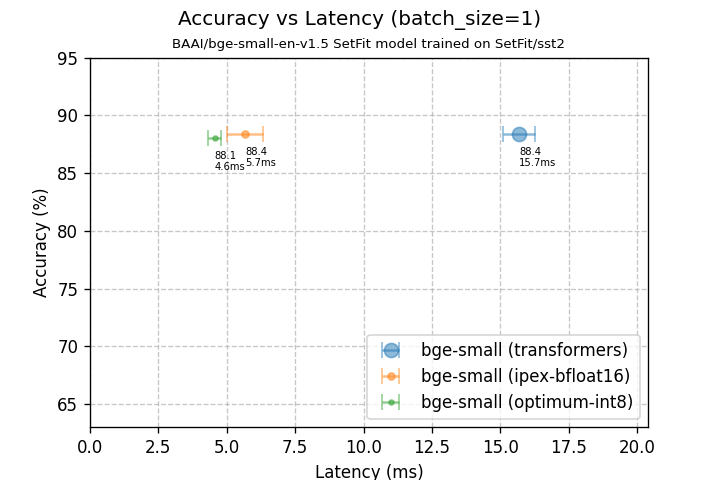

# Enabling assisted generation with any assistant model

The unprecedented success of LLMs has redefined the limits of NLP. However, a major challenge in their deployment is optimizing performance to reduce their response time.
Speculative decoding is a very popular and practical approach for accelerating LLMs achieving considerable speedups.
 
The core concept of this method involves using a pair of models, referred to as the target and draft models. The draft model is a smaller, more efficient version of the target model, such as using Llama3-8b as the draft model for the larger Llama3-70b target model.
Speculative decoding is an iterative process, during each cycle, the draft model generates a sequence of tokens autoregressively, one at a time. The target model then verifies these draft tokens in a single forward pass. The speedup is achieved by generating multiple tokens in each forward pass of the target model, rather than producing just one token at a time.

## SUBSECTION EXAMPLE

```python
print("This is a python code block example")
```

## EXAMPLE RESULTS SECTION
<p align="center">
    
</p>
<p align="center">
    <em>IMAGE CAPTION HERE</em>
</p>

| target | assistant | dataset | task | speedup |
|----------------------|---------------------|---------------------------|---------------------------|---------------------------|
| `codellama/CodeLlama-13b-Instruct-hf` | `bigcode/tiny_starcoder_py` | `openai/humaneval` | code generation | **2.01x** |
| `microsoft/Phi-3-medium-128k-instruct` | `Qwen/Qwen2-0.5B-Instruct`  | `tau/scrolls`   | long-context summarization | **1.65x** |
| `google/gemma-2-9b` | `double7/vicuna-68m`  | `cnn_dailymail`   | summarization | **1.72x** |

## Summary

INSERT SUMMARY HERE

## References

* Lewis Tunstall, Nils Reimers, Unso Eun Seo Jo, Luke Bates, Daniel Korat, Moshe Wasserblat, Oren Pereg, 2022. "Efficient Few-Shot Learning Without Prompts". https://arxiv.org/abs/2209.11055
