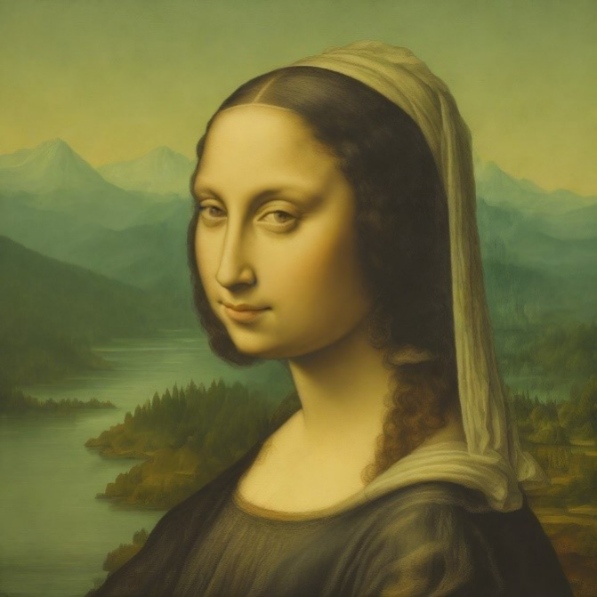
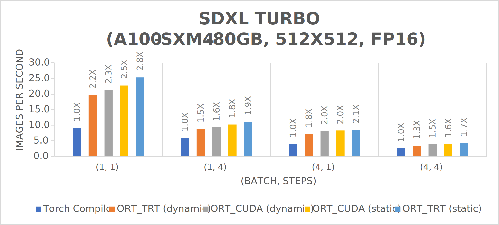
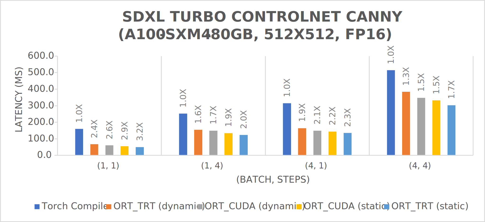
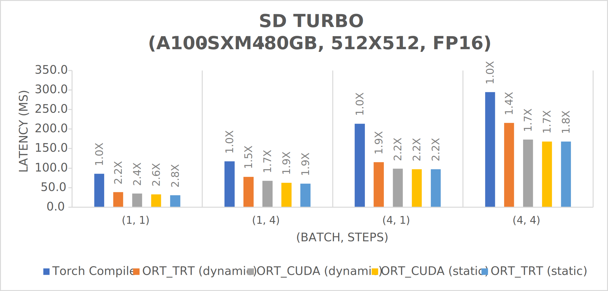
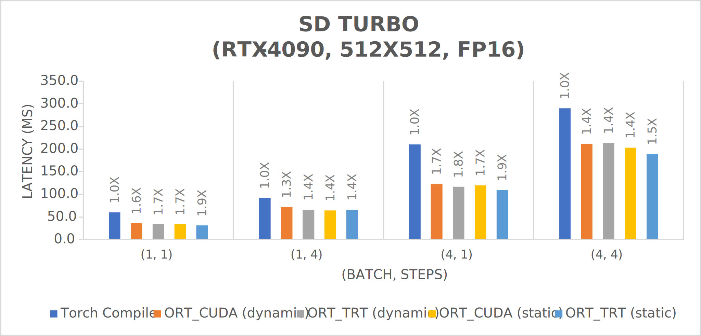

# Accelerating SD Turbo and SDXL Turbo Inference with ONNX Runtime

## Introduction
[SD Turbo](https://huggingface.co/stabilityai/sd-turbo) and [SDXL Turbo](https://huggingface.co/stabilityai/sdxl-turbo) are two fast generative text-to-image models capable of running inference in just one network evaluation. 
SD Turbo is a distilled version of Stable Diffusion 2.1 with fewer parameters, and SDXL Turbo is a distilled version of SDXL 1.0 with more parameters. 
We’ve [previously shown](https://medium.com/microsoftazure/accelerating-stable-diffusion-inference-with-onnx-runtime-203bd7728540) how to accelerate Stable Diffusion inference with ONNX Runtime.
In this post, we will introduce optimizations in the ONNX Runtime CUDA and TensorRT execution providers that speed up inference of SD Turbo and SDXL Turbo on NVIDIA GPUs by as much as 3x over Torch Compile.

Not only does ONNX Runtime provide performance benefits when used with SD Turbo and SDXL Turbo, but it also makes the models accessible in languages other than Python, like C#. A tutorial for how to run SD Turbo and SDXL Turbo is coming soon. In the meantime, check out our previous tutorial on [inferencing Stable Diffusion with C# and ONNX Runtime](https://onnxruntime.ai/docs/tutorials/csharp/stable-diffusion-csharp.html).

## Diffusion demo
You may try SD Turbo and SDXL Turbo inference with ONNX Runtime using the CUDA or TensorRT execution provider. 
To reproduce latency numbers in the benchmark results below, run the demo with docker using the [instructions found here](https://github.com/microsoft/onnxruntime/blob/main/onnxruntime/python/tools/transformers/models/stable_diffusion/README.md#run-demo-with-docker).
The demo can generate an image guided by a text prompt for a variety of different scenarios, including the use of features like 
[LCM LoRA](https://github.com/microsoft/onnxruntime/tree/main/onnxruntime/python/tools/transformers/models/stable_diffusion#generate-an-image-guided-by-a-text-prompt-using-lcm-lora) and 
[ControlNet](https://github.com/microsoft/onnxruntime/tree/main/onnxruntime/python/tools/transformers/models/stable_diffusion#generate-an-image-with-a-text-prompt-using-a-control-net).
In this first example, we generate an image with the SDXL Turbo model guided by a text prompt:

```bash
python3 demo_txt2img_xl.py \
  --version xl-turbo \
  "little cute gremlin wearing a jacket, cinematic, vivid colors, intricate masterpiece, golden ratio, highly detailed"
```

<p align="center"> 
 <br> 
<em>Figure 1. Little cute gremlin wearing a jacket image generated with text prompt using SDXL Turbo.</em> 
</p> 


In this second example, we generate an image with text prompt using [ControlNet](https://huggingface.co/docs/diffusers/api/pipelines/controlnet) as follows

```bash
wget https://hf.co/datasets/huggingface/documentation-images/resolve/main/diffusers/input_image_vermeer.png 
python3 demo_txt2img_xl.py \
  --controlnet-type canny \
  --controlnet-scale 0.5 \
  --controlnet-image input_image_vermeer.png \
  --version xl-turbo \
  --height 1024 \
  --width 1024 \
  "portrait of Mona Lisa with mysterious smile and mountain, river and forest in the background" 
```

<p align="center"> 
 <br> 
 <em>Figure 2. Mona Lisa portrait generated with text prompt using SDXL Turbo and ControlNet.</em> 
</p> 


## Benchmark results
We benchmarked the SD Turbo and SDXL Turbo models with Standard_ND96amsr_A100_v4 VM using A100-SXM4-80GB and a [Lenovo Desktop](https://www.lenovo.com/us/en/p/desktops/legion-desktops/legion-t-series-towers/legion-tower-7i-gen-8-(34l-intel)/90v7003bus) 
with RTX-4090 GPU (WSL Ubuntu 20.04) to generate images of resolution 512x512 using the Euler Ancestral Discrete Scheduler and float16 models. 
The results are measured using these specifications:
- onnxruntime-gpu==1.17.0 (built from source)
- torch==2.1.0a0+32f93b1
- tensorrt==8.6.1
- transformers==4.35.2
- diffusers==0.24.0
- onnx==1.14.1
- onnx-graphsurgeon==0.3.27
- polygraphy==0.49.0
To reproduce these results, we also recommend using the instructions included above in the ‘Diffusers demo’ section.
The baseline is a diffusers pipeline that applied channel-last memory format and `torch.compile` with reduce-overhead mode on UNet and ControlNet. 
Since the original VAE of SDXL Turbo cannot run in float16 precision, we used [sdxl-vae-fp16-fix](https://huggingface.co/madebyollin/sdxl-vae-fp16-fix) in testing SDXL Turbo. 
There are slight discrepancies between its output and that of the original VAE, but the decoded images are close enough for most purposes.
The following charts illustrate the throughput in images per second vs. different (batch size, number of steps) combinations for various frameworks. It is worth noting that the label above each bar indicates the speedup vs. Torch Compile – e.g., in the first chart, ORT_TRT (static) is 2.8X faster than Torch Compile for (batch, steps) combination (1, 1).
We elected to use 1 and 4 steps because both SD Turbo and SDXL Turbo can generate viable images in as little as 1 step but typically produce images of the best quality in 3-5 steps.

## SDXL Turbo
The graph below illustrates the throughput in images per second for the SDXL Turbo model.
Results were gathered on an A100-SXM4-80GB GPU for different (batch size, number of steps) combinations.



The next graph also illustrates throughput in images per second for the SDXL Turbo models, this time when ControlNet is used on the same GPU.



## SD Turbo
The final two graphs illustrate throughput in images per second for the SD Turbo model on two different types of GPUs: A100-SXM4-80GB and RTX-4090.





## Analysis
These results demonstrate that ONNX Runtime significantly outperforms Torch Compile with both CUDA and TensorRT execution providers in static and dynamic shape for all (batch, steps) combinations shown.
This conclusion applies to both model sizes (SD Turbo and SDXL Turbo), as well as both GPUs tested. 

Notably, ONNX Runtime with TensorRT (static shape) is up to 3x faster than Torch Compile for (batch, steps) combination (1, 1).
Additionally, ONNX Runtime with the TensorRT execution provider performs slightly better for static shape given that the ORT_TRT latency is lower than the corresponding ORT_CUDA latency for all (batch, steps) combinations.
Static shape is typically favored when the user knows the batch and image size at graph definition time (e.g., the user is only planning to generate images with batch size 1 and image size 512x512). 

In these situations, the static shape has faster performance. 
However, if the user decides to switch to a different batch and/or image size, TensorRT must create a new engine (meaning double the engine files in the disk) and switch engines (meaning additional time spent loading the new engine).
On the other hand, ONNX Runtime with the CUDA execution provider is a better choice for dynamic shape for SD Turbo and SDXL Turbo models when using an A100-SXM4-80GB GPU, but ONNX Runtime with the TensorRT execution provider performs slightly better on dynamic shape for most (batch, steps) combinations when using an RTX-4090 GPU. 

The benefit of using dynamic shape is that users can run inference more quickly when the batch and image sizes are not known until graph execution time (e.g., running batch size 1 and image size 512x512 for one image and batch size 4 and image size 512x768 for another). 
When dynamic shape is used in these cases, users only need to build and save one engine, rather than switching engines during inference.

## GPU optimizations
Besides the techniques introduced in our [previous Stable Diffusion blog](https://medium.com/microsoftazure/accelerating-stable-diffusion-inference-with-onnx-runtime-203bd7728540), the following optimizations
were applied by ONNX Runtime to yield the SD Turbo and SDXL Turbo results outlined in this post:
- Enable CUDA graph for static shape inputs.
- Add Flash Attention V2.
- Remove extra outputs in text encoder (keep the hidden state output specified by clip_skip
parameter).
- Add SkipGroupNorm fusion to fuse group normalization with Add nodes that precede it.
- 
Additionally, we have added support for new features, including [LoRA](https://huggingface.co/docs/peft/conceptual_guides/lora) weights for latent consistency models (LCMs) and [ControlNet](https://huggingface.co/docs/diffusers/api/pipelines/controlnet). 
Instructions for SDXL Turbo with ControlNet, along with the A100-SXM4-80GB GPU benchmarking results are provided in previous sections.


## Next steps
Stay tuned for our upcoming blog post about optimizing SD Turbo and SDXL Turbo with Olive, an easy-to- use tool that further streamlines this process.
In the future, we also plan to continue improving upon our SD Turbo and SDXL Turbo work by updating the demo pipeline to support new features such as inpainting and T2I-Adapter. 
Additionally, we would like to integrate the optimization into one popular Stable Diffusion UI.


## Resources
Check out the optimized SD Turbo and SDXL Turbo ONNX models discussed in this post on Hugging Face:
- [SD Turbo](https://huggingface.co/tlwu/sd-turbo-onnxruntime)
- [SDXL Turbo](https://huggingface.co/tlwu/sdxl-turbo-onnxruntime)
