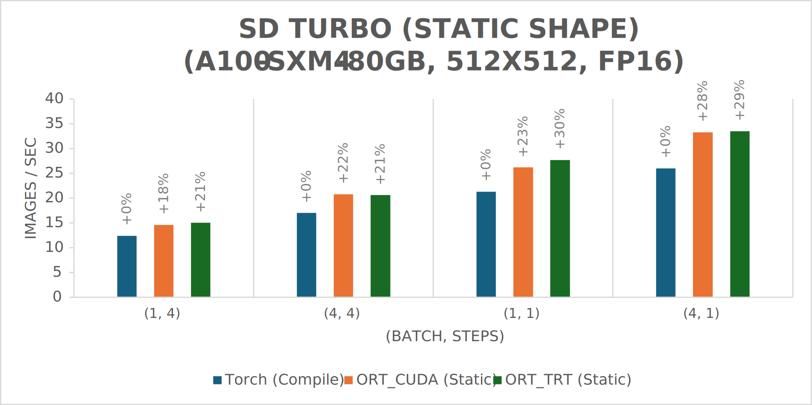

# Accelerating SD Turbo and SDXL Turbo Inference with ONNX Runtime and Olive

## Introduction
[SD Turbo](https://huggingface.co/stabilityai/sd-turbo) and [SDXL Turbo](https://huggingface.co/stabilityai/sdxl-turbo) are two fast generative text-to-image models capable of generating viable images in as little as one step, a significant improvement over the 30+ steps often required with previous Stable Diffusion models. SD Turbo is a distilled version of [Stable Diffusion 2.1](https://huggingface.co/stabilityai/stable-diffusion-2-1), and SDXL Turbo is a distilled version of [SDXL 1.0](https://huggingface.co/stabilityai/stable-diffusion-xl-base-1.0). We’ve [previously shown](https://medium.com/microsoftazure/accelerating-stable-diffusion-inference-with-onnx-runtime-203bd7728540) how to accelerate Stable Diffusion inference with ONNX Runtime. Not only does ONNX Runtime provide performance benefits when used with SD Turbo and SDXL Turbo, but it also makes the models accessible in languages other than Python, like C# and Java.

### Performance gains
In this post, we will introduce optimizations in the ONNX Runtime CUDA and TensorRT execution providers that speed up inference of SD Turbo and SDXL Turbo on NVIDIA GPUs significantly.

ONNX Runtime outperformed PyTorch for all (batch size, number of steps) combinations tested, with throughput gains as high as 229% for the SDXL Turbo model and 120% for the SD Turbo model. ONNX Runtime CUDA has particularly good performance for dynamic shape but demonstrates a marked improvement over PyTorch for static shape as well.


## How to run SD Turbo and SDXL Turbo
To accelerate inference with the ONNX Runtime CUDA execution provider, access our optimized versions of [SD Turbo](https://huggingface.co/tlwu/sd-turbo-onnxruntime) and [SDXL Turbo](https://huggingface.co/tlwu/sdxl-turbo-onnxruntime) on Hugging Face.

The models are generated by [Olive](https://github.com/microsoft/Olive/tree/main/examples/stable_diffusion), an easy-to-use model optimization tool that is hardware aware. Note that fp16 VAE must be enabled through the command line for best performance, as shown in the optimized versions shared. For instructions on how to run the SD and SDXL pipelines with the ONNX files hosted on Hugging Face, see the [SD Turbo usage example](https://huggingface.co/tlwu/sd-turbo-onnxruntime#usage-example) and the [SDXL Turbo usage example](https://huggingface.co/tlwu/sdxl-turbo-onnxruntime#usage-example).

To accelerate inference with the ONNX Runtime TensorRT execution provider instead, follow the instructions found [here](https://github.com/microsoft/onnxruntime/blob/main/onnxruntime/python/tools/transformers/models/stable_diffusion/README.md#run-demo-with-docker).

The following is an example of image generation with the SDXL Turbo model guided by a text prompt:

```bash
python3 demo_txt2img_xl.py \
  --version xl-turbo \
  "little cute gremlin wearing a jacket, cinematic, vivid colors, intricate masterpiece, golden ratio, highly detailed"
```

<p align="center"> 
 <br> 
<em>Figure 1. Little cute gremlin wearing a jacket image generated with text prompt using SDXL Turbo.</em> 
</p> 

Note that the example image was generated in 4 steps, demonstrating the ability of SD Turbo and SDXL Turbo to generate viable images in fewer steps than previous Stable Diffusion models.

For a user-friendly way to try out Stable Diffusion models, see our [ONNX Runtime Extension for Automatic1111’s SD WebUI](https://github.com/tianleiwu/Stable-Diffusion-WebUI-OnnxRuntime). This extension enables optimized execution of the Stable Diffusion UNet model on NVIDIA GPUs and uses the ONNX Runtime CUDA execution provider to run inference against models optimized with Olive. At this time, the extension has only been optimized for Stable Diffusion 1.5. SD Turbo and SDXL Turbo models can be used as well, but performance optimizations are still in progress.

### Applications of Stable Diffusion in C# and Java
Taking advantage of the cross-platform, performance, and usability benefits of ONNX Runtime, members of the community have also contributed samples and UI tools of their own using Stable Diffusion with ONNX Runtime.

These community contributions include [OnnxStack](https://github.com/saddam213/OnnxStack), a .NET library that builds upon our [previous C# tutorial](https://github.com/cassiebreviu/StableDiffusion/) to provide users with a variety of capabilities for many different Stable Diffusion models when performing inference with C# and ONNX Runtime.

Additionally, Oracle has released a [Stable Diffusion sample with Java](https://github.com/oracle-samples/sd4j) that runs inference on top of ONNX Runtime. This project is also based on our C# tutorial.


## Benchmark results
We benchmarked the SD Turbo and SDXL Turbo models with Standard_ND96amsr_A100_v4 VM using A100-SXM4-80GB and a [Lenovo Desktop](https://www.lenovo.com/us/en/p/desktops/legion-desktops/legion-t-series-towers/legion-tower-7i-gen-8-(34l-intel)/90v7003bus) with RTX-4090 GPU (WSL Ubuntu 20.04) to generate images of resolution 512x512 using the LCM Scheduler and fp16 models. The results are measured using these specifications:
- onnxruntime-gpu==1.17.0 (built from source)
- torch==2.1.0a0+32f93b1
- tensorrt==8.6.1
- transformers==4.36.0
- diffusers==0.24.0
- onnx==1.14.1
- onnx-graphsurgeon==0.3.27
- polygraphy==0.49.0

To reproduce these results, we recommend using the instructions linked in the ‘Usage example’ section.

Since the original VAE of SDXL Turbo cannot run in fp16 precision, we used [sdxl-vae-fp16-fix](https://huggingface.co/madebyollin/sdxl-vae-fp16-fix) in testing SDXL Turbo. There are slight discrepancies between its output and that of the original VAE, but the decoded images are close enough for most purposes.

The PyTorch pipeline for static shape has applied channel-last memory format and torch.compile with reduce-overhead mode.

The following charts illustrate the throughput in images per second vs. different (batch size, number of steps) combinations for various frameworks. It is worth noting that the label above each bar indicates the speedup percentage vs. Torch Compile – e.g., in the first chart, ORT_TRT (Static) is 31% faster than Torch (Compile) for (batch, steps) combination (4, 1).

We elected to use 1 and 4 steps because both SD Turbo and SDXL Turbo can generate viable images in as little as 1 step but typically produce images of the best quality in 3-5 steps.

### SDXL Turbo
The graphs below illustrate the throughput in images per second for the SDXL Turbo model with both static and dynamic shape. Results were gathered on an A100-SXM4-80GB GPU for different (batch size, number of steps) combinations. For dynamic shape, the TensorRT engine supports batch size 1 to 8 and image size 512x512 to 768x768, but it is optimized for batch size 1 and image size 512x512.


### SD Turbo
The next two graphs illustrate throughput in images per second for the SD Turbo model with both static and dynamic shape on an A100-SXM4-80GB GPU.




The final set of graphs illustrates throughput in images per second for the SD Turbo model with both static and dynamic shape on an RTX-4090 GPU. In this dynamic shape test, the TensorRT engine is built for batch size 1 to 8 (optimized for batch size 1) and fixed image size 512x512 due to memory limitation.


### How fast are SD Turbo and SDXL Turbo with ONNX Runtime?
These results demonstrate that ONNX Runtime significantly outperforms PyTorch with both CUDA and TensorRT execution providers in static and dynamic shape for all (batch, steps) combinations shown. This conclusion applies to both model sizes (SD Turbo and SDXL Turbo), as well as both GPUs tested. Notably, ONNX Runtime with CUDA (dynamic shape) was shown to be 229% faster than Torch Eager for (batch, steps) combination (1, 4).

Additionally, ONNX Runtime with the TensorRT execution provider performs slightly better for static shape given that the ORT_TRT throughput is higher than the corresponding ORT_CUDA throughput for most (batch, steps) combinations. Static shape is typically favored when the user knows the batch and image size at graph definition time (e.g., the user is only planning to generate images with batch size 1 and image size 512x512). In these situations, the static shape has faster performance. However, if the user decides to switch to a different batch and/or image size, TensorRT must create a new engine (meaning double the engine files in the disk) and switch engines (meaning additional time spent loading the new engine).

On the other hand, ONNX Runtime with the CUDA execution provider is often a better choice for dynamic shape for SD Turbo and SDXL Turbo models when using an A100-SXM4-80GB GPU, but ONNX Runtime with the TensorRT execution provider performs slightly better on dynamic shape for most (batch, steps) combinations when using an RTX-4090 GPU. The benefit of using dynamic shape is that users can run inference more quickly when the batch and image sizes are not known until graph execution time (e.g., running batch size 1 and image size 512x512 for one image and batch size 4 and image size 512x768 for another). When dynamic shape is used in these cases, users only need to build and save one engine, rather than switching engines during inference.


## GPU optimizations
Besides the techniques introduced in our [previous Stable Diffusion blog](https://medium.com/microsoftazure/accelerating-stable-diffusion-inference-with-onnx-runtime-203bd7728540), the following optimizations were applied by ONNX Runtime to yield the SD Turbo and SDXL Turbo results outlined in this post:
- Enable CUDA graph for static shape inputs.
- Add Flash Attention V2.
- Remove extra outputs in text encoder (keep the hidden state output specified by clip_skip parameter).
- Add SkipGroupNorm fusion to fuse group normalization with Add nodes that precede it.

Additionally, we have added support for new features, including [LoRA](https://huggingface.co/docs/peft/conceptual_guides/lora) weights for latent consistency models (LCMs).


## Next steps
In the future, we plan to continue improving upon our Stable Diffusion work by updating the demo to support new features, such as [IP Adapter](https://github.com/tencent-ailab/IP-Adapter) and Stable Video Diffusion. [ControlNet](https://huggingface.co/docs/diffusers/api/pipelines/controlnet) support will also be available shortly.

We are also working on optimizing SD Turbo and SDXL Turbo performance with our [existing Stable Diffusion web UI extension](https://github.com/tianleiwu/Stable-Diffusion-WebUI-OnnxRuntime) and plan to help add support for both models to a Windows UI developed by a member of the ONNX Runtime community.

Additionally, a tutorial for how to run SD Turbo and SDXL Turbo with C# and ONNX Runtime is coming soon. In the meantime, check out our [previous tutorial on Stable Diffusion](https://onnxruntime.ai/docs/tutorials/csharp/stable-diffusion-csharp.html).


## Resources
Check out some of the resources discussed in this post:
- [SD Turbo](https://huggingface.co/tlwu/sd-turbo-onnxruntime): Olive-optimized SD Turbo for ONNX Runtime CUDA model hosted on Hugging Face.
- [SDXL Turbo](https://huggingface.co/tlwu/sdxl-turbo-onnxruntime): Olive-optimized SDXL Turbo for ONNX Runtime CUDA model hosted on Hugging Face.
- [Stable Diffusion GPU Optimization](https://github.com/microsoft/onnxruntime/blob/main/onnxruntime/python/tools/transformers/models/stable_diffusion/README.md): Instructions for optimizing Stable Diffusion with NVIDIA GPUs in ONNX Runtime GitHub repository.
- [ONNX Runtime Extension for Automatic1111’s SD WebUI](https://github.com/tianleiwu/Stable-Diffusion-WebUI-OnnxRuntime): Extension enabling optimized execution of Stable Diffusion UNet model on NVIDIA GPUs.
- [OnnxStack](https://github.com/saddam213/OnnxStack): Community-contributed .NET library enabling Stable Diffusion inference with C# and ONNX Runtime.
- [SD4J (Stable Diffusion in Java)](https://github.com/oracle-samples/sd4j): Oracle sample for Stable Diffusion with Java and ONNX Runtime.
- [Inference Stable Diffusion with C# and ONNX Runtime](https://onnxruntime.ai/docs/tutorials/csharp/stable-diffusion-csharp.html): Previously published C# tutorial.