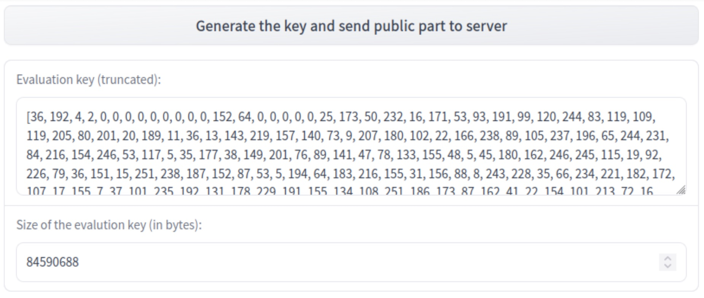
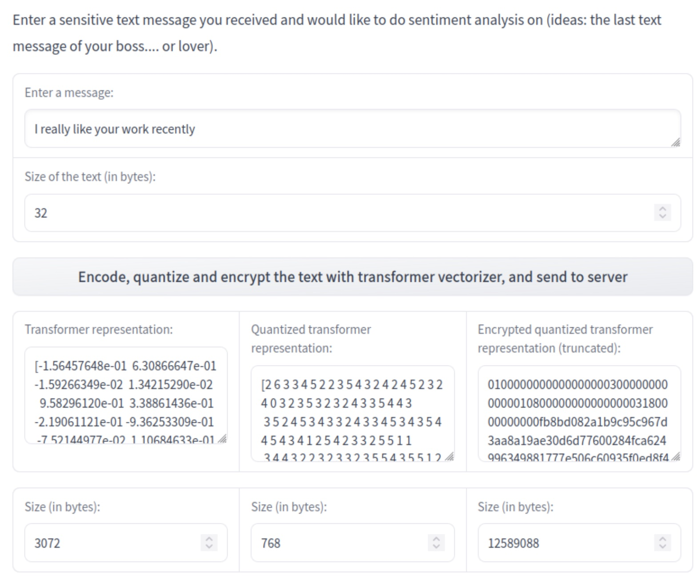
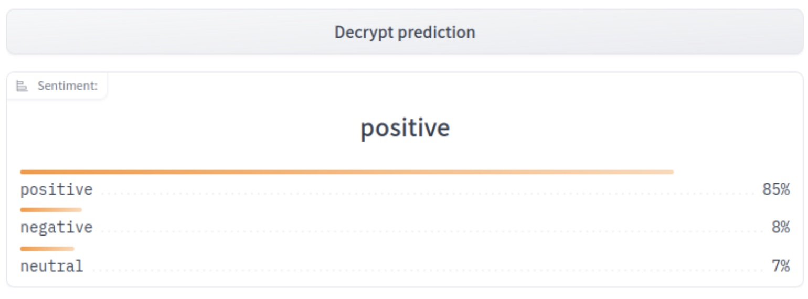

# Sentiment Analysis on Encrypted Data with Homomorphic Encryption

<div class="blog-metadata">
    <small>Published November 2, 2022.</small>
    <a target="_blank" class="btn no-underline text-sm mb-5 font-sans" href="https://github.com/huggingface/blog/blob/main/sentiment-analysis-fhe.md">
        Update on GitHub
    </a>
</div>

<div class="author-card">
    <a href="/jfrery-zama">
        
        <div class="bfc">
            <code>jfrery-zama</code>
            <span class="fullname">Jordan Frery</span>
        </div>
    </a>
</div>

When a client wants to predict whether a specific text contains positive, neutral or negative feedback using a cloud service provider without actually revealing the text during the process, it needs to be done with methods data scientists already master. We can utilize a machine learning model that can predict over encrypted data thanks to the [Concrete-ML library](https://github.com/zama-ai/concrete-ml), whose APIs are close to what is already in use by data scientists.

This notebook tackles sentiment classification with _Fully Homomorphic Encryption_ to help you better grasp how Concrete-ML operates and why it may be the best choice for your specialized needs.

Our post will discuss:

- transformers
- how to use transformers with XGBoost to perform sentiment analysis
- how to do the training
- how to use Concrete-ML to turn predictions into predictions over encrypted data
- how to deploy to a client/server protocol

Last but not least, we’ll finish with a complete demo over [HuggingFace Spaces](https://huggingface.co/spaces) to show this functionality in action.

## Using a public dataset

The dataset we use in this notebook can be found [here](https://www.kaggle.com/datasets/crowdflower/twitter-airline-sentiment).

To represent the text for sentiment analysis, we chose to use a transformer hidden representation as it yields high accuracy for the final model in a very efficient way. For a comparison of this representation set against a more common procedure like the TF-IDF approach, please see this [full notebook](https://github.com/zama-ai/concrete-ml/blob/release/0.4.x/use_case_examples/encrypted_sentiment_analysis/SentimentClassification.ipynb).

Alright, let’s first import a few requirements.

```python
from sklearn.model_selection import GridSearchCV
import pandas as pd
from concrete.ml.sklearn import XGBClassifier
from sklearn.model_selection import train_test_split
import numpy
import time
```

Now we can open the dataset and visualize some statistics.

```python
train = pd.read_csv('data/Tweets.csv')
text_X = train['text']
y = train['airline_sentiment']
y = y.replace(['negative', 'neutral', 'positive'], [0, 1, 2])
pos_ratio = y.value_counts()[2] / y.value_counts().sum()
neg_ratio = y.value_counts()[0] / y.value_counts().sum()
neutral_ratio = y.value_counts()[1] / y.value_counts().sum()
print(f'Proportion of positive examples: {round(pos_ratio * 100, 2)}%')
print(f'Proportion of negative examples: {round(neg_ratio * 100, 2)}%')
print(f'Proportion of neutral examples: {round(neutral_ratio * 100, 2)}%')
```

The output, then, looks like this:

```
Proportion of positive examples: 16.14%
Proportion of negative examples: 62.69%
Proportion of neutral examples: 21.17%
```

The ratio of positive and negative examples is rather similar, though we have significantly more negative examples. Let’s keep this in mind to select the final evaluation metric.

Now we can split our dataset into training and test sets. We will use a seed for this code to ensure it is perfectly reproducible.

```python
text_X_train, text_X_test, y_train, y_test = train_test_split(text_X, y,
    test_size=0.1, random_state=42)
```

## Text representation using a transformer

[Transformers](https://en.wikipedia.org/wiki/Transformer_(machine_learning_model)) are neural networks often trained to predict the next words to appear in a text (this task is commonly called self-supervised learning). They can also be fine-tuned on some specific subtasks such that they specialize and get better results on a given problem.

They are powerful tools for all kinds of Natural Language Processing tasks. In fact, we can leverage their representation for any text and feed it to a more FHE-friendly, machine learning model for classification. In this notebook we will use XGBoost.

We start by importing the requirements for transformers. Here, we use the popular library from [HuggingFace](https://huggingface.co) to get a transformer quickly.

```python
import torch
import tqdm
from transformers import AutoModelForSequenceClassification, AutoTokenizer
device = "cuda:0" if torch.cuda.is_available() else "cpu"
```

The model we have chosen is a BERT transformer, fine-tuned on the Stanford Sentiment Treebank dataset.

```python
# Load the tokenizer (converts text to tokens)
tokenizer = AutoTokenizer.from_pretrained("distilbert-base-uncased-finetuned-sst-2-english")

# Load the pre-trained model
transformer_model = AutoModelForSequenceClassification.from_pretrained(
   "distilbert-base-uncased-finetuned-sst-2-english"
)
```

This should download the model, which is now ready to be used.

Now, using the hidden representation for some text can be a bit tricky at first, especially since we could tackle this with many different approaches. Below is the approach we chose.

First, we tokenize the text. This means that we split the text into tokens, or a sequence of specific characters that can also be words, and replace each of them with a number. Then, we send the tokenized text to the transformer model, which outputs a hidden representation for each word. Finally, we average the representations for each word to get a text-level representation.

The result is a matrix of shape (number of examples, hidden size). The hidden size is the number of dimensions in the hidden representation. For BERT, the hidden size is 768. The hidden representation is a vector of numbers that represents the text that can be used for many different tasks. In this case, we will use it for classification with [XGBoost](https://github.com/dmlc/xgboost) afterwards.

```python
# Function that transforms a list of texts to their representation
# learned by the transformer.
def text_to_tensor(
   list_text_X_train: list,
   transformer_model: AutoModelForSequenceClassification,
   tokenizer: AutoTokenizer,
   device: str,
) -> numpy.ndarray:
   # Tokenize each text in the list one by one
   tokenized_text_X_train_split = []
   for text_x_train in list_text_X_train:
       tokenized_text_X_train_split.append(tokenizer.encode(text_x_train, return_tensors="pt"))

   # Send the model to the device
   transformer_model = transformer_model.to(device)
   output_hidden_states_list = []

   for tokenized_x in tqdm.tqdm(tokenized_text_X_train_split):
       # Pass the tokens through the transformer model and get the hidden states
       # Only keep the last hidden layer state for now
       output_hidden_states = transformer_model(tokenized_x.to(device), output_hidden_states=True)[
           1
       ][-1]
       # Average over the tokens axis to get a representation at the text level.
       output_hidden_states = output_hidden_states.mean(dim=1)
       output_hidden_states = output_hidden_states.detach().cpu().numpy()
       output_hidden_states_list.append(output_hidden_states)

   return numpy.concatenate(output_hidden_states_list, axis=0)
```

```python
# Let's vectorize the text using the transformer
list_text_X_train = text_X_train.tolist()
list_text_X_test = text_X_test.tolist()

X_train_transformer = text_to_tensor(list_text_X_train, transformer_model, tokenizer, device)
X_test_transformer = text_to_tensor(list_text_X_test, transformer_model, tokenizer, device)
```

This transformation of the text (text to transformer representation) would need to be executed on the client machine as the encryption is done over the transformer representation.

## Classifying with XGBoost

Now that we have our training and test sets properly built to train a classifier, next comes the training of our FHE model. Here it will be very straightforward, using a hyper-parameter tuning tool such as GridSearch from scikit-learn.

```python
# Now we have a representation for each tweet, we can train a model on these.
grid_search = GridSearchCV(model, parameters, cv=3, n_jobs=1, scoring="accuracy")
grid_search.fit(X_train_transformer, y_train)

# Check the accuracy of the best model
print(f"Best score: {grid_search.best_score_}")

# Check best hyperparameters
print(f"Best parameters: {grid_search.best_params_}")

# Extract best model
best_model = grid_search.best_estimator_
```

The output is as follows:

```
Best score: 0.8378111718275654
Best parameters: {'max_depth': 1, 'n_bits': 3, 'n_estimators': 50, 'n_jobs': -1}
```

Now, let’s see how the model performs on the test set.

```python
# Compute the metrics for each class
y_proba = best_model.predict_proba(X_test_transformer)

# Compute the accuracy
y_pred = numpy.argmax(y_proba, axis=1)
accuracy_transformer_xgboost = numpy.mean(y_pred == y_test)
print(f"Accuracy: {accuracy_transformer_xgboost:.4f}")

y_pred_positive = y_proba[:, 2]
y_pred_negative = y_proba[:, 0]
y_pred_neutral = y_proba[:, 1]

ap_positive_transformer_xgboost = average_precision_score((y_test == 2), y_pred_positive)
ap_negative_transformer_xgboost = average_precision_score((y_test == 0), y_pred_negative)
ap_neutral_transformer_xgboost = average_precision_score((y_test == 1), y_pred_neutral)

print(f"Average precision score for positive class: " f"{ap_positive_transformer_xgboost:.4f}")
print(f"Average precision score for negative class: " f"{ap_negative_transformer_xgboost:.4f}")
print(f"Average precision score for neutral class: " f"{ap_neutral_transformer_xgboost:.4f}")
```

Again, the output:

```
Accuracy: 0.8504
Average precision score for positive class: 0.8917
Average precision score for negative class: 0.9597
Average precision score for neutral class: 0.7341
```

Further, we can print some examples with extreme probabilities in the test set and see what they look like:


```python
# Get probabilities predictions in clear
y_pred_test = best_model.predict_proba(X_test_transformer)

# Let's see what are the top predictions based on the probabilities in y_pred_test
print("5 most positive tweets (class 2):")
for i in range(5):
   print(text_X_test.iloc[y_pred_test[:, 2].argsort()[-1 - i]])

print("-" * 100)

print("5 most negative tweets (class 0):")
for i in range(5):
   print(text_X_test.iloc[y_pred_test[:, 0].argsort()[-1 - i]])
```

5 most positive tweets (class 2):

```
@SouthwestAir love them! Always get the best deals!
@AmericanAir THANK YOU FOR ALL THE HELP!  :P You guys are the best.  #americanairlines #americanair
@SouthwestAir - Great flight from Phoenix to Dallas tonight!Great service and ON TIME! Makes @timieyancey very happy! http://t.co/TkVCMhbPim
@AmericanAir AA2416 on time and awesome flight. Great job American!
@SouthwestAir AMAZING c/s today by SW thank you SO very much. This is the reason we fly you #southwest
```

5 most negative tweets (class 0):

```
@AmericanAir This entire process took sooooo long that no decent seats are left.  #customerservice
@USAirways Not only did u lose the flight plan! Now ur flight crew is FAA timed out! Thx for havin us sit on the tarmac for an hr! #Pathetic
@United site errored out at last step of changing award. Now can't even pull up reservation. 60 minute wait time.  Thanks @United!
@united OKC ticket agent Roger McLarren(sp?) LESS than helpful with our Intl group travel problems Can't find a supervisor for help.
@AmericanAir the dinner and called me "hon". Not the service I would expect from 1st class.  #disappointed
```

## Predicting over encrypted data

Now let’s predict over encrypted text. The idea here is that we are going to encrypt the representation given by the transformer rather than the raw text itself. In Concrete-ML you can do this very easily by just setting the parameter `execute_in_fhe=True` in the predict function. This is obviously just a developer feature (mainly used to check the running time of the FHE model). We will see how we can make this work in a deployment setting a bit further down.

```python
# Compile the model to get the FHE inference engine
# (this may take a few minutes depending on the selected model)
start = time.perf_counter()
best_model.compile(X_train_transformer)
end = time.perf_counter()
print(f"Compilation time: {end - start:.4f} seconds")

# Let's write a custom example and predict in FHE
tested_tweet = ["AirFrance is awesome, almost as much as Zama!"]
X_tested_tweet = text_to_tensor(tested_tweet, transformer_model, tokenizer, device)
clear_proba = best_model.predict_proba(X_tested_tweet)

# Now let's predict with FHE over a single tweet and print the time it takes
start = time.perf_counter()
decrypted_proba = best_model.predict_proba(X_tested_tweet, execute_in_fhe=True)
end = time.perf_counter()
fhe_exec_time = end - start
print(f"FHE inference time: {fhe_exec_time:.4f} seconds")
```

The output becomes:

```
Compilation time: 9.3354 seconds
FHE inference time: 4.4085 seconds
```

A check that the FHE predictions are the same as the clear predictions is also necessary.

```python
print(f"Probabilities from the FHE inference: {decrypted_proba}")
print(f"Probabilities from the clear model: {clear_proba}")
```

This output reads:

```
Probabilities from the FHE inference: [[0.08434131 0.05571389 0.8599448 ]]
Probabilities from the clear model: [[0.08434131 0.05571389 0.8599448 ]]
```

## Deployment

At this point, our model is fully trained and compiled, ready to be deployed. In Concrete-ML, you can use a [deployment API](https://docs.zama.ai/concrete-ml/advanced-topics/client_server) to do this easily:

```python
# Let's save the model to be pushed to a server later
from concrete.ml.deployment import FHEModelDev

fhe_api = FHEModelDev("sentiment_fhe_model", best_model)
fhe_api.save()
```

These few lines are enough to export all the files needed for both the client and the server. You can check out the notebook explaining this deployment API in detail [here](https://github.com/zama-ai/concrete-ml/blob/release/0.4.x/docs/advanced_examples/ClientServer.ipynb).

## Full example in an HuggingFace Space

You can also have a look at the [final application on HuggingFace Space](https://huggingface.co/spaces/zama-fhe/encrypted_sentiment_analysis). The client app was developed with [Gradio](https://gradio.app/) while the server runs with [Uvicorn](https://www.uvicorn.org/) and was developed with [FastAPI](https://fastapi.tiangolo.com/).

The process is as follows:

- User generates a new private/public key



- User types a message that will be encoded, quantized, and encrypted



- Server receives the encrypted data and starts the prediction over encrypted data, using the public evaluation key
- Server sends back the encrypted predictions and the client can decrypt them using his private key



## Conclusion

We have presented a way to leverage the power of transformers where the representation is then used to:

1. train a machine learning model to classify tweets, and
2. predict over encrypted data using this model with FHE.

The final model (Transformer representation + XGboost) has a final accuracy of 85%, which is above the transformer itself with 80% accuracy (please see this [notebook](https://github.com/zama-ai/concrete-ml/blob/release/0.4.x/use_case_examples/encrypted_sentiment_analysis/SentimentClassification.ipynb)  for the comparisons).

The FHE execution time per example is 4.4 seconds on a 16 cores cpu.

The files for deployment are used for a sentiment analysis app that allows a client to request sentiment analysis predictions from a server while keeping its data encrypted all along the chain of communication.

[Concrete-ML](https://github.com/zama-ai/concrete-ml) (Don't forget to star us on Github ⭐️💛) allows straightforward ML model building and conversion to the FHE equivalent to be able to predict over encrypted data.

Hope you enjoyed this post and let us know your thoughts/feedback!

And special thanks to [Abubakar Abid](https://huggingface.co/abidlabs) for his previous advice on how to build our first Hugging Face Space!
