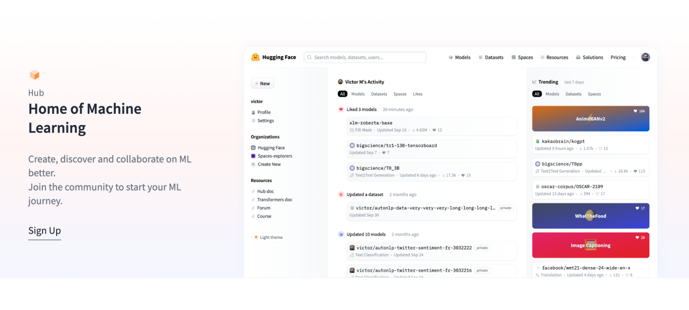
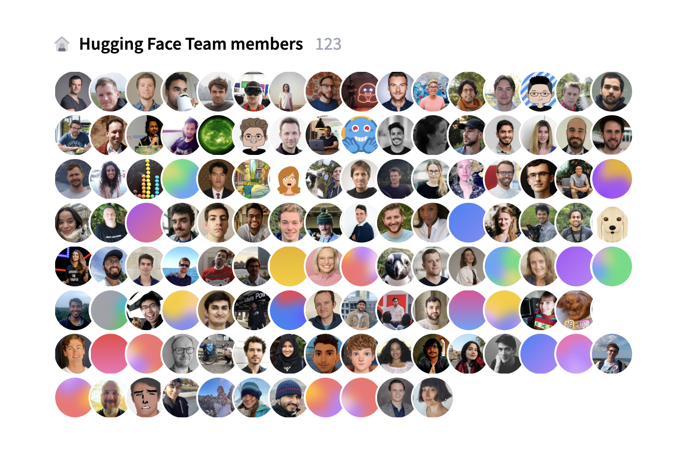

<h1>We Raised $100 Million for Open & Collaborative Machine Learning 🚀</h1>

    <small>Published May 9, 2022.</small>
    <a target="_blank" class="btn no-underline text-sm mb-5 font-sans" href="https://github.com/huggingface/blog/blob/main/sentiment-analysis-python.md">
        Update on GitHub
    </a>

    <a href="/huggingface">
        
        

            <code>huggingface</code>
            The Hugging Face Team
        

    </a>

Today we have some exciting news to share! Hugging Face has raised $100 Million in Series C funding 🔥🔥🔥 led by Lux Capital with major participations from Sequoia, Coatue and support of existing investors Addition, Betaworks, AIX Ventures, Cygni Capital, Kevin Durant, Olivier Pomel (co-founder & CEO at Datadog) and more.

We've come a long way since we first open sourced [PyTorch BERT](https://twitter.com/Thom_Wolf/status/1068637731281088513) in 2018 and are just getting started! 🙌

Machine learning is becoming the default way to build technology. When you think about your average day, machine learning is everywhere: from your Zoom background, to searching on Google, to ordering an Uber or writing an email with auto-complete --it's all machine learning.

Hugging Face is now the fastest growing community & most used platform for machine learning! With 100,000 pre-trained models & 10,000 datasets hosted on the platform for NLP, computer vision, speech, time-series, biology, reinforcement learning, chemistry and more, the [Hugging Face Hub](https://huggingface.co/models) has become the Home of Machine Learning to create, collaborate, and deploy state-of-the-art models.

<figure class="image table text-center m-0 w-full">
  
</figure>

Over 10,000 companies are now using Hugging Face to build technology with machine learning. Their Machine Learning scientists, Data scientists and Machine Learning engineers have saved countless hours while accelerating their machine learning roadmaps with the help of our [products](https://huggingface.co/platform) and [services](https://huggingface.co/support). 

We want to have a positive impact on the AI field. We think the direction of more responsible AI is through openly sharing models, datasets, training procedures, evaluation metrics and working together to solve issues. We believe open source and open science bring trust, robustness, reproducibility, and continuous innovation. With this in mind, we are leading [BigScience](https://bigscience.huggingface.co/), a collaborative workshop around the study and creation of very large language models gathering more than 1,000 researchers of all backgrounds and disciplines. We are now training the [world's largest open source multilingual language model](https://twitter.com/BigScienceLLM) 🌸

⚠️ But there’s still a huge amount of work left to do.

At Hugging Face, we know that Machine Learning has some important limitations and challenges that need to be tackled now like biases, PII, and energy consumption. With openness, transparency & collaboration, we can foster responsible & inclusive progress, understanding & accountability to mitigate these challenges.

Thanks to the new funding, we’ll be doubling down on research, open-source, products and responsible democratization of AI.

<figure class="image table text-center m-0 w-full">
  
</figure>

It's been a hell of a ride to grow from 30 to 120+ team members in the past 12 months. We were super lucky to have been joined by incredibly talented (and fun!) teammates and we don't plan to stop here. We're [hiring for every position](https://apply.workable.com/huggingface) you can think of for every level of seniority. We are a remote-friendly, decentralized organization with transparency and value-inspired decision making by default.

Huge thanks to every contributor in our amazing community and team, our customers, partners, and investors for helping us reach this point. We couldn't have done it without you, and we can't wait to work together with you on what's next. Your contributions are key to helping build a better future where AI is founded on open source, open science, ethics and collaboration.

---

*For press inquiries, please contact <a href="mailto:team@huggingface.co">team@huggingface.co</a>*
