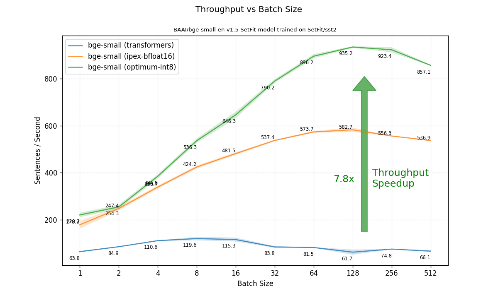

# Blazing Fast SetFit Inference with 🤗 Optimum Intel on Xeon

SetFit is a promising solution for a common modeling problem: how to deal with data that has few to no labels. Developed with Hugging Face’s research partners at [Intel Labs](https://www.intel.com/content/www/us/en/research/overview.html) and the [UKP Lab](https://www.informatik.tu-darmstadt.de/ukp/ukp_home/index.en.jsp), SetFit is an efficient framework for few-shot fine-tuning of [Sentence Transformers](https://sbert.net/) models. 

SetFit achieves high accuracy with little labeled data - for example, SetFit [outperforms](https://arxiv.org/pdf/2311.06102.pdf) GPT-3.5 in 3-shot prompting and with 5 shot it also outperforms 3-shot GPT-4 on the Banking 77 financial intent dataset.

Compared to LLM based methods, SetFit has two unique advantages:

<p>🗣 <strong>No prompts or verbalisers</strong>: few-shot in-context learning with LLMs requires handcrafted prompts which make the results brittle, sensitive to phrasing and dependent on user expertise. SetFit dispenses with prompts altogether by generating rich embeddings directly from a small number of labeled text examples.</p>

<p>🏎 <strong>Fast to train</strong>: SetFit doesn't require large-scale models like T0 or GPT-3 to achieve high accuracy. As a result, it is typically an order of magnitude (or more) faster to train and run inference with.</p>

For more details on SetFit, check out our [paper](https://arxiv.org/abs/2209.11055), [blog](https://huggingface.co/blog/setfit), [code](https://github.com/huggingface/setfit), and [data](https://huggingface.co/SetFit).

Setfit has been widely adopted by the AI developer community, with ~100k downloads per month and [~1500](https://huggingface.co/models?library=setfit) SetFit models on the Hub, and growing with an average of ~4 models per day!

## Faster!

In this blog post, we'll explain how you can accelerate inference with SetFit even further on Intel CPUs, by optimizing your SetFit model with 🤗 [Optimum Intel](https://github.com/huggingface/optimum). We’ll show how you can achieve huge throughput gains by performing a simple post-training quantization step on your model.
This can enable production-grade deployment of SetFit solutions using Intel Xeon CPUs. Our blog is accompanied by a [notebook](https://github.com/huggingface/setfit/blob/main/notebooks/setfit-optimum-intel.ipynb) for a step-by-step walkthrough.

## Step 1: Quantize the SetFit Model using 🤗 Optimum Intel

In order to optimize our SetFit model, we will apply quantization to the model body, using [Intel Neural Compressor](https://www.intel.com/content/www/us/en/developer/tools/oneapi/neural-compressor.html) (INC), part of Optimum Intel.

**Quantization** is a very popular deep learning model optimization technique for improving inference speeds. It minimizes the number of bits required to represent the weights and/or activations in a neural network. This is done by converting a set of real-valued numbers into their lower-bit data representations, such as INT8. Moreover, quantization can enable faster computations in lower precision.

Specifically, we'll apply post-training static quantization (PTQ). PTQ can reduce the memory footprint and latency for inference, while still preserving the accuracy of the model, with only a small unlabeled calibration set and without any training.

### Prepare a Calibration Dataset

The calibration dataset should be able to represent the data distribution of unseen data. In general, preparing 100 samples is enough for calibration. We'll use the `rotten_tomatoes` dataset in our case, since it’s composed of movie reviews, like our target dataset, `sst2`.

First, we’ll load 100 random samples from this dataset. Then, to prepare the dataset for quantization, we'll need to tokenize each example. We won’t need the “text” and “label” columns, so let’s remove them.

```python
calibration_set = load_dataset("rotten_tomatoes", split="train").shuffle(seed=42).select(range(100)) 

def tokenize(examples):
   return tokenizer(examples["text"], padding="max_length", max_length=512, truncation=True)
 
tokenizer = setfit_model.model_body.tokenizer
calibration_set = calibration_set.map(tokenize, remove_columns=["text", "label"])
```

### Run Quantization

Before we run quantization, we need to define the desired quantization process - in our case - **Static Post Training Quantization**, and use `optimum.intel` to run the quantization on our calibration dataset:

```python
from optimum.intel import INCQuantizer
from neural_compressor.config import PostTrainingQuantConfig

setfit_body = setfit_model.model_body[0].auto_model
quantizer = INCQuantizer.from_pretrained(setfit_body)
optimum_model_path = "/tmp/bge-small-en-v1.5_setfit-sst2-english_opt"
quantization_config = PostTrainingQuantConfig(approach="static", backend="ipex", domain="nlp")

quantizer.quantize(
    quantization_config=quantization_config,
    calibration_dataset=calibration_set,
    save_directory=optimum_model_path,
    batch_size=1,
)
tokenizer.save_pretrained(optimum_model_path)
```

That’s it! We now have a local copy of our quantized SetFit model. Let’s test it out.

## Step 2: Benchmark Inference

In our [notebook](https://github.com/huggingface/setfit/blob/main/notebooks/setfit-optimum-intel.ipynb), we’ve set up a `PerformanceBenchmark` class to compute model latency and throughput, as well as an accuracy measure. Let’s use it to benchmark the original model (with PyTorch backend) and our newly optimized model.

Load our test dataset, `sst2`, and run the benchmark on the original model:

```python
from datasets import load_dataset
from setfit import SetFitModel


test_dataset = load_dataset("SetFit/sst2")["validation"]

model_path = "dkorat/bge-small-en-v1.5_setfit-sst2-english"
setfit_model = SetFitModel.from_pretrained(model_path)
pb = PerformanceBenchmark(
    setfit_model,
    test_dataset,
    "bge-small (PyTorch)"
)
perf_metrics = pb.run_benchmark()
```

Now let's run the benchmark on on our optimized model. We’ll first need to define a wrapper around our SetFit model which plugs in our quantized model body at inference (instead of the original model body). Then, we can run the benchmark using this wrapper.

```python
import optimum.intel


class OptimumSetFitModel:
   def __init__(self, setfit_model, model_body):
       model_body.tokenizer = setfit_model.model_body.tokenizer
       self.model_body = model_body
       self.model_head = setfit_model.model_head


optimum_model = optimum.intel.IPEXModel.from_pretrained(optimum_model_path)
optimum_setfit_model = OptimumSetFitModel(setfit_model, model_body=optimum_model)

pb = PerformanceBenchmark(
   optimum_setfit_model,
   test_dataset,
   f"bge-small (optimum intel)",
   model_path=optimum_model_path,
   enable_autocast=True,
)
perf_metrics.update(pb.run_benchmark())
```

## Results
<p align="center">
    
</p>
<p align="center">
    <em>Accuracy vs latency at batch size=1</em>
</p>


|                      | bge-small (PyTorch) | bge-small (optimum intel) |
|----------------------|---------------------|---------------------------|
| Model Size           | 127.32 MB           | 44.65 MB                  |
| Accuracy on test set | 88.4%               | 88.1%                     |


When inspecting the performance at batch size 1, there’s a **3.68x reduction in latency** with our optimized model. Note that this is achieved with virtually no drop in accuracy! 
It's also worth mentioning that the model size has shrunk by 2.85x. 

<p align="center">
    
</p>

We move on to our main focus, which is the reported throughputs with different batch sizes.
Here, the optimization has garnered even greater speedups. When comparing the highest achievable throughput (at any batch size), the optimized model is **6.91x faster than before!**

## Summary

In this blog post, we have learned how to use quantization capabilities present in 🤗 Optimum Intel to optimize SetFit models. After running a quick and easy post-training quantization procedure, we've observed that accuracy level was preserved, while inference throughput increased by nearly 7x. This optimization method can be readily applied to any existing SetFit deployment running on Intel Xeon.


## References

* Lewis Tunstall, Nils Reimers, Unso Eun Seo Jo, Luke Bates, Daniel Korat, Moshe Wasserblat, Oren Pereg, 2022. "Efficient Few-Shot Learning Without Prompts". https://arxiv.org/abs/2209.11055