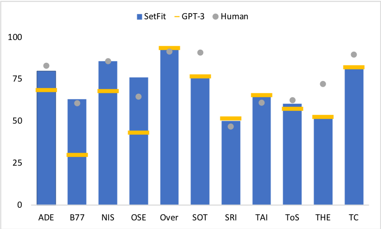

<div class="blog-metadata">
    <small>Published September 24, 2022.</small>
   
<h1>SetFit: Efficient Few-Shot Learning Without Prompts</h1>

</div>

<div class="author-card">
    <a href="/unsojo">
        <div class="bfc">
            <code>unsojo</code>
            <span class="fullname">Unso Jo</span>
        </div>
  </a>
</div>


# SetFit: Efficient Few-Shot Learning Without Prompts
### Hugging Face, Intel labs, and the UKP team introduce a new prompt-free few-shot learning regime called Setfit with accompanying [code](https://github.com/SetFit/setfit), longer [paper](), and datasets on [HF hub](https://huggingface.co/SetFit)

<p align="center">
    
</p>
<p align="center">
    Fig.1: SetFit and Fine-tuning performance on SentEval test set, a sentiment classification task
</p>


## Introducing SetFit
In a collaborative effort among Hugging Face, Intel labs, and the UKP lab we introduce SetFit, a prompt-free few-shot regime made with practicality and efficiency in mind. Recent discussions in ML have focused on few-shot regimes where only few (zero to a few dozen) data points are needed to extend language model applications to downstream classification tasks. Examples of such regimes include T-few, GPT-3, and ADAPET. But these methods sometimes require large, inaccessible computational resources and finicky, manually crafted prompts. SetFit performs on-par or better than comparable models while also being prompt-free and only requiring small models that can fit on commercial personal computers. We make all code and data used in the development of SetFit publicly available.


<p align="center">
    
</p>
<p align="center">
    Fig.2: SetFit, GPT-3, Human Baseline performance on RAFT benchmark
</p>


## SetFit’s Few-Shot Performance
While run prompt-free and on much smaller base models, SetFit performs on par or better than state of the art few-shot regimes on a variety of benchmarks. On [RAFT](https://huggingface.co/spaces/ought/raft-leaderboard), a few-shot benchmark dataset as of September 2022, SetFit Roberta (using the Roberta-Large ST base model) with 355 million parameters outforms PET and GPT-3 and places just under average human performance and the 11 billion parameter T-few, a model 30 times the size of SetFit Roberta (Table 1; Fig.2). SetFit also outperforms the human baseline on 7 of the 11 RAFT tasks. There is no information on state of the art "YiWise" on the RAFT.

| Rank | Method | Accuracy | Model Size | 
| :------: | ------ | :------: | :------: | 
| 1 | YiWise | 76.8 | N/A |
| 2 | T-Few | 75.8 | 11B | 
| 4 | Human Baseline | 73.5 | N/A | 
| 6 | SetFit (Roberta Large) | 71.3 | 355M |
| 9 | PET | 69.6 | 235M |
| 11 | SetFit (MP-Net) | 66.9 | 110M |
| 12 | GPT-3 | 62.7 | 175 B |

<h5>Table 1: RAFT performance leaderboard as of September 2022</h5>

On other datasets, SetFit shows robustness across a variety of tasks (Table 2). It outperforms PERFECT, T-Few 3 billion, ADAPET and fine-tuned vanilla transformers, on many tasks on sentiment, emotion, counterfactual, and unwanted language classification tasks at very few (n=8) and few (n=64) - shot learning scenarios. 


| Method | SST-5 | AmazonCF | SentEval | Emotion | EnronSpam | AGNews | Average |
| ---- | :----: | :----: | :----: | :----: | :----: | :----: | :----: | 
| &nbsp; |&nbsp;|  &nbsp;|   &nbsp; | `\|N\| = 8` |  &nbsp;| &nbsp;| &nbsp; |
| Finetune | 33.5 (2.1) | 9.2 (4.9) | 58.8 (6.3) | 28.7 (6.8) | 85.0 (6.0) | 81.7 (3.8) | 43.0 (5.2)|
| ADAPET | 50.0 (1.9) | 19.4 (7.3) | 91.0 (1.3) | 46.2 (3.7) | 85.1 (3.7) | 85.1 (2.7) | 58.3 (3.6)|
| PERFECT | 34.9 (3.1) | 18.1 (5.3) | 81.5 (8.6) | 29.8 (5.7)  | 79.3 (7.4) | 80.8 (5.0) | 48.7 (6.0) |
|T-Few 3B | 55.0 (1.4) | 19.0 (3.9) | 92.1 (1.0) | 57.4 (1.8) | 93.1 (1.6) | NA | 63.4 (1.9) | 
|SetFit (MPNet)| 43.6(3.0) | 40.3 (11.8) | 88.5 (1.9) | 48.8 (4.5) | 90.1 (3.4) | 82.9 (2.8) | 62.3 (4.9) | 
| &nbsp; | &nbsp; | &nbsp; | &nbsp; | `\|N\| = 64` | &nbsp; | &nbsp; | &nbsp; |
| Finetune | 45.9 (6.9) | 52.8 (12.1) | 88.9 (1.9) | 65.0 (17.2) | 95.9 (0.8) | 88.4 (0.9) | 69.7 (7.8)|
| ADAPET | 54.1 (0.8) | 54.1 (6.4) | 92.6 (0.7) | 72.0 (2.2) | 96.0 (0.9) | 88.0 (0.6) | 73.8 (2.2)|
| PERFECT | 49.1 (0.7) | 65.1 (5.2) | 92.2 (0.5)  | 61.7 (2.7)  | 95.4 (1.1) | 89.0 (0.3) | 72.7 (1.9) |
|T-Few 3B | 56.0 (0.6) | 34.7 (4.5) | 93.1  (1.0) | 70.9 (1.1) | 97.0 (0.3) | NA | 70.3 (1.5) | 
|SetFit (MPNet)| 51.9 (0.6) | 61.9 (2.9) | 90.4 (0.6) | 76.2 (1.3) | 96.1 (0.8) | 88.0 (0.7) | 75.3 (1.2) | 

<h5>Table 2: Fine-tuning, ADAPET, PERFECT, T-few 3B, and SetFit performance across various tasks. Averages do not include AGNews performance because T-few has AGNews in its training set</h5>

And just by switching out the base ST model to a multilingual one, SetFit can function seamlessly in multilingual contexts. In our experiments, SetFit’s performance shows promising results on classification in German, Japanese, Mandarin, French and Spanish, in both in-language and cross linguistic settings.


| Method | Inference FLOPS | Train FLOPS | Speed-Up | Score | 
| ---- | :----: | :----: | :----: | :----: |
| T-few 3B | 2.3e11 | 5.5e15 | 1x | 63.4 (1.9) | 
|SetFit (RoBERTa) | 3.6e10 | 8.5e14 | 6x | 61.7 (5.9)|
|SetFit (MPNet) | 1.1e10 | 2.6e14 | 21x | 62.3 (4.9) | 
| SetFit (MiniLM) | 2.3e9 | 5.5e13 | 100x | 45.1 (4.2) |

<h5>Table 3: Computational cost comparison of methods</h5>

This is all the more impressive because of SetFit's size and speed. While SetFit does not beat the state of the art by a significant margin, its easy of use and cost effectiveness are unparalleled. Table 3 compares SetFit's inference & train FLOPS  with T-Few with the 3 billion base model. Even when paired the biggest base model, SetFit is a magnitude smaller than T-Few in FLOPS count with a near 6x speed-up. This only comes at a small average score trade-off. This makes SetFit one of the only models out there with this level of practicality.


## What is SetFit?

The strength of SetFit is its efficiency and simplicity. SetFit first finetunes a Sentence Transformer (ST) model then trains a classifier head on the embeddings generated from the finetuned ST. 


<p align="center">
    
</p>


SetFit takes advantage of sentence transformers’ ability to generate dense embeddings based on paired sentences. In the data input stage, it maximizes the limited labeled input data by contrastive training, where positive and negative pairs are created by in-class and out-class selection. The sentence transformer model then trains on these pairs (or triplets) and generates dense vectors per example. This is SetFit’s fine-tuning step. In the second step, the classification head, such as a logistic regression model, trains on the encoded embeddings with their respective class labels. At inference time, the unseen example passes through the fine-tuned ST, generating an embedding that when fed to the classification head outputs a class label prediction.

## How to use SetFit

Using SetFit is as simple as just a few lines of code. There is need for hyperparameter searching or prompt-engineering.
s
To start using SetFit, first install it using pip. This will also install dependencies such as datasets and sentence-transformers. 
```sh
pip install setfit
```
We first import relevant functions. In particular we import SetFitModel and SetFitTrainer, two functions that have streamlined the SetFit procedure for us.
```sh
from datasets import load_dataset
from sentence_transformers.losses import CosineSimilarityLoss

from setfit.modeling import SetFitModel
from setfit.trainer import SetFitTrainer
```
We download our dataset from the HF hub. In this case we start with the SentEval-CR task, the performance of which is shown in our Fig.1. 
```sh

# Load a dataset
dataset = load_dataset("SetFit/SentEval-CR")
```
Let's now select our N, the number of examples per class. In this case we make this 8. N will vary depending on your dataset constraints. 
```sh
# Select N examples per class (8 in this case)
train_ds = dataset["train"].shuffle(seed=42).select(range(8 * 2))
test_ds = dataset["test"]
```
We will load a pretrained Sentence Transformer model from the HF hub then create a SetFitTrainer. 
```sh
# Load SetFit model from Hub
model = SetFitModel.from_pretrained("sentence-transformers/paraphrase-mpnet-base-v2")

# Create trainer
trainer = SetFitTrainer(
    model=model,
    train_dataset=train_ds,
    eval_dataset=test_ds,
    loss_class=CosineSimilarityLoss,
    batch_size=16,
    num_epochs=20,
)
```
Training this is easy! We can then evaluate with train.evaluate().
```sh
# Train and evaluate!
trainer.train()
metrics = trainer.evaluate()
```

Remember to push your trained model to the HF hub :) 
```sh
# Push model to the Hub
trainer.push_to_hub("my-awesome-setfit-model")

```