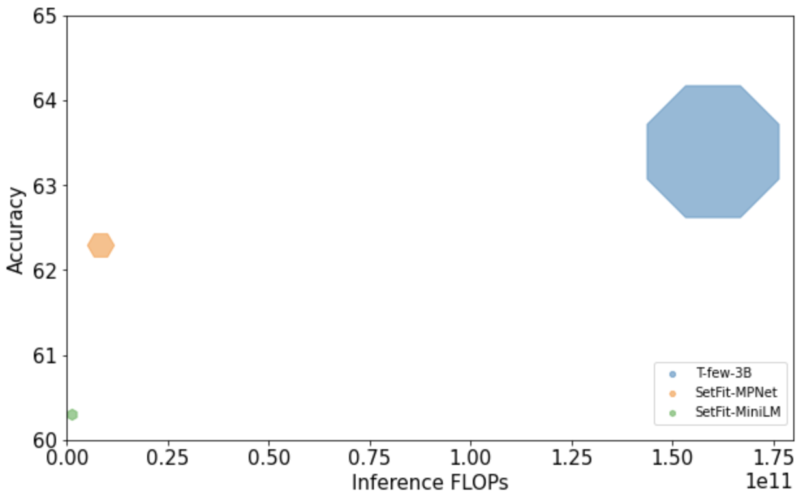

<div class="blog-metadata">
    <small>Published September 24, 2022.</small>
   
<h1>SetFit: Efficient Few-Shot Learning Without Prompts</h1>

</div>
<div class="author-card">
    <a href="/eunseojo">
        
        <div class="bfc">
            <code>eunseojo</code>
            <span class="fullname">Unso Eun Seo Jo</span>
        </div>
    </a>
</div>

Few-shot learning with pretrained language models has emerged as a promising solution to every data scientist's nightmare: dealing with data that has few to no labels 😱.

Together with our research partners at Intel Labs and the UKP Lab, we are excited to introduce SetFit: an efficient framework for few-shot fine-tuning of Sentence Transformers.

Compared to other few-shot learning methods, SetFit has several unique features:

        📈 High accuracy with little labeled data: SetFit achieves comparable (or better) results than current state-of-the-art methods for text classification. For example, with only 8 labelled examples per class on the CR sentiment dataset, SetFit is competitive with fine-tuning RoBERTa-large on the full training set of 3k examples.

        🗣 No prompts or verbalisers: Current techniques for few-shot fine-tuning require handcrafted prompts or verbalisers to convert examples into a format that's suitable for the underlying language model. SetFit dispenses with prompts altogether by generating rich embeddings directly from text examples.

        🏎 Fast to train: SetFit doesn't require large-scale models like T0 or GPT-3 to achieve high accuracy. As a result, it is typically an order of magnitude (or more) faster to train and run inference with.

For more details, you can check out our paper (ADD LINK), [data](https://huggingface.co/SetFit) and [code](https://github.com/huggingface/setfit). In this blog post, we'll explain how SetFit works and how to train your very own models. Let's dive in!

<p align="center">
    
</p>
<p align="center">
    Fig.1: SetFit and Fine-tuning performance on SentEval test set, a sentiment classification task
</p>

## How does it work?

SetFit is designed with efficiency and simplicity in mind. SetFit first finetunes a Sentence Transformer (ST) model then trains a classifier head on the embeddings generated from the finetuned ST. 

<p align="center">
    
</p>
<p align="center">
    Fig.2: SetFit's 2-Part Process
</p>

SetFit takes advantage of sentence transformers’ ability to generate dense embeddings based on paired sentences. In the data input stage, it maximizes the limited labeled input data by contrastive training, where positive and negative pairs are created by in-class and out-class selection. The ST model then trains on these pairs (or triplets) and generates dense vectors per example. This is SetFit’s fine-tuning step. In the second step, the classification head, such as a logistic regression model, trains on the encoded embeddings with their respective class labels. At inference time, the unseen example passes through the fine-tuned ST, generating an embedding that when fed to the classification head outputs a class label prediction.

And just by switching out the base ST model to a multilingual one, SetFit can function seamlessly in multilingual contexts. In our experiments, SetFit’s performance shows promising results on classification in German, Japanese, Mandarin, French and Spanish, in both in-language and cross linguistic settings.


## Benchmarking SetFit

| Rank | Method | Accuracy | Model Size | 
| :------: | ------ | :------: | :------: | 
| 1 | YiWise | 76.8 | N/A |
| 2 | T-Few | 75.8 | 11B | 
| 4 | Human Baseline | 73.5 | N/A | 
| 6 | SetFit (Roberta Large) | 71.3 | 355M |
| 9 | PET | 69.6 | 235M |
| 11 | SetFit (MP-Net) | 66.9 | 110M |
| 12 | GPT-3 | 62.7 | 175 B |

<h4>Table 1: RAFT performance leaderboard as of September 2022</h4>


While run prompt-free and on much smaller base models, SetFit performs on par or better than state of the art few-shot regimes on a variety of benchmarks. On [RAFT](https://huggingface.co/spaces/ought/raft-leaderboard), a few-shot benchmark dataset as of September 2022, SetFit Roberta (using the Roberta-Large ST base model) with 355 million parameters outforms PET and GPT-3 and places just under average human performance and the 11 billion parameter T-few, a model 30 times the size of SetFit Roberta (Table 1). SetFit also outperforms the human baseline on 7 of the 11 RAFT tasks. There is no information on state of the art "YiWise" on the RAFT.


<p align="center">
    
</p>
<p align="center">
    Fig.3: Comparing Setfit performance against other methods on 3 tasks
</p>


On other datasets, SetFit shows robustness across a variety of tasks. It outperforms PERFECT, T-Few 3 billion, ADAPET and fine-tuned vanilla transformers, on many tasks on sentiment, emotion, counterfactual, and unwanted language classification tasks at very few (n=8) and few (n=64) - shot learning scenarios. Figure 3 shows a comparison on three chosen tasks: Emotion, SentEval-CR, and Amazon Counterfactual. 


## Fast training and inference

<p align="center">
    
</p>
<p align="center">
    Fig.4: Comparing (MPNet, MiniLM) inference FLOPs, model size (radius of marker), accuracy (average scores)
</p>

This is all the more impressive because of SetFit's size and speed. While SetFit does not beat the state of the art by a significant margin, its easy of use and cost effectiveness are unparalleled. Figure 4 compares SetFit's inference & train FLOPS  with T-Few with the 3 billion base model. Even when paired the biggest base model, SetFit is an order of magnitude smaller than T-Few in FLOPS count with a near 6x speed-up. This comes at a miniscule average score trade-off. This makes SetFit the only few-shot model out there that can be run on just a personal computer or Google Colab. In fact, if run on cloud, SetFit's cost efficiency blows other models out of the water. For SetFit it takes just 30 seconds to run the N=8 split on a V100, costing a total of $0.025. The same experiment on T-Few would run for 700 seconds on an A100 and cost $0.7 -- 28 times more.  


## Training your own model

Using SetFit is as simple as just a few lines of code. There is need for hyperparameter searching or prompt-engineering.
s
To start using SetFit, first install it using pip. This will also install dependencies such as datasets and sentence-transformers. 
```sh
pip install setfit
```
We first import relevant functions. In particular we import SetFitModel and SetFitTrainer, two functions that have streamlined the SetFit procedure for us.
```sh
from datasets import load_dataset
from sentence_transformers.losses import CosineSimilarityLoss

from setfit.modeling import SetFitModel
from setfit.trainer import SetFitTrainer
```
We download our dataset from the HF hub. In this case we start with the SentEval-CR task, the performance of which is shown in our Fig.1. 
```sh
# Load a dataset
dataset = load_dataset("SetFit/SentEval-CR")
```
Let's now select our N, the number of examples per class. In this case we make this 8. N will vary depending on your dataset constraints. 
```sh
# Select N examples per class (8 in this case)
train_ds = dataset["train"].shuffle(seed=42).select(range(8 * 2))
test_ds = dataset["test"]
```
We will load a pretrained Sentence Transformer model from the HF hub then create a SetFitTrainer. 
```sh
# Load SetFit model from Hub
model = SetFitModel.from_pretrained("sentence-transformers/paraphrase-mpnet-base-v2")

# Create trainer
trainer = SetFitTrainer(
    model=model,
    train_dataset=train_ds,
    eval_dataset=test_ds,
    loss_class=CosineSimilarityLoss,
    batch_size=16,
    num_epochs=20,
)
```
Training this is easy! We can then evaluate with train.evaluate().
```sh
# Train and evaluate!
trainer.train()
metrics = trainer.evaluate()
```

Remember to push your trained model to the HF hub :) 
```sh
# Push model to the Hub
trainer.push_to_hub("my-awesome-setfit-model")
```
While this example showed how this can be done with one specific type of base model, any ST base model could be traded in here for different performance and tasks. For intance, using a multilingual ST base can extend few-shot to multilingual settings.


