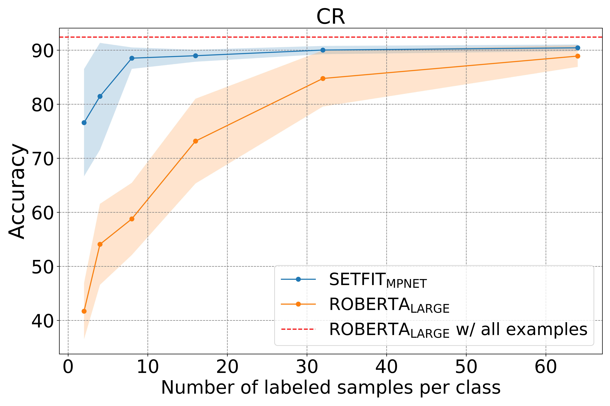

<div class="blog-metadata">
    <small>Published September 26, 2022.</small>
   
<h1>SetFit: Efficient Few-Shot Learning Without Prompts</h1>

</div>
<div class="author-card">
    <a href="/Unso">
        
        <div class="bfc">
            <code>Unso</code>
            <span class="fullname">Unso Eun Seo Jo</span>
        </div>
    </a>

<a href="/lewtun">
    
    <div class="bfc">
        <code>lewtun</code>
        <span class="fullname">Lewis Tunstall</span>
    </div>
</a>

<a href="/luketheduke">
    
    <div class="bfc">
        <code>luketheduke</code>
        <span class="fullname">Luke Bates</span>
    </div>
</a>

    
<a href="/dkorat">
    
    <div class="bfc">
        <code>dkorat</code>
        <span class="fullname">Daniel Korat</span>
    </div>
</a>
 
<a href="/orenpereg">
       <div class="bfc">
        <code>orenpereg</code>
        <span class="fullname">Oren Pereg</span>
    </div>
 </a>
<a href="/moshew">
    
    <div class="bfc">
        <code>moshew</code>
        <span class="fullname">Moshe Wasserblat</span>
    </div>
</a>   
    
</div>


<p align="center">
    
</p>
<p align="center">
    <em>SetFit is significantly more sample efficient and robust to noise than standard fine-tuning.</em>
</p>

Few-shot learning with pretrained language models has emerged as a promising solution to every data scientist's nightmare: dealing with data that has few to no labels 😱.

Together with our research partners at [Intel Labs](https://www.intel.com/content/www/us/en/research/overview.html) and the [UKP Lab](https://www.informatik.tu-darmstadt.de/ukp/ukp_home/index.en.jsp), Hugging Face is excited to introduce SetFit: an efficient framework for few-shot fine-tuning of [Sentence Transformers](https://sbert.net/). SetFit achieves high accuracy with little labeled data - for example, with only 8 labeled examples per class on the Customer Reviews (CR) sentiment dataset, SetFit is competitive with fine-tuning RoBERTa Large on the full training set of 3k examples 🤯!

Compared to other few-shot learning methods, SetFit has several unique features:

<p>🗣 <strong>No prompts or verbalisers</strong>: Current techniques for few-shot fine-tuning require handcrafted prompts or verbalisers to convert examples into a format that's suitable for the underlying language model. SetFit dispenses with prompts altogether by generating rich embeddings directly from a small number of labeled text examples. </p>

<p>🏎 <strong>Fast to train</strong>: SetFit doesn't require large-scale models like T0 or GPT-3 to achieve high accuracy. As a result, it is typically an order of magnitude (or more) faster to train and run inference with. </p>

<p>🌎 <strong>Multilingual support</strong>: SetFit can be used with any Sentence Transformer on the Hub, which means you can classify text in multiple languages by simply fine-tuning a multilingual checkpoint. </p>

For more details, check out our [paper](https://arxiv.org/abs/2209.11055), [data](https://huggingface.co/SetFit), and [code](https://github.com/huggingface/setfit). In this blog post, we'll explain how SetFit works and how to train your very own models. Let's dive in!


## How does it work?

SetFit is designed with efficiency and simplicity in mind. SetFit first fine-tunes a Sentence Transformer model on a small number of labeled examples (typically 8 or 16 per class). This is followed by training a classifier head on the embeddings generated from the fine-tuned Sentence Transformer. 

<p align="center">
    
</p>
<p align="center">
    <em>SetFit's two-stage training process</em>
</p>

SetFit takes advantage of Sentence Transformers’ ability to generate dense embeddings based on paired sentences. In the initial fine-tuning phase stage, it makes use of the limited labeled input data by contrastive training, where positive and negative pairs are created by in-class and out-class selection. The Sentence Transformer model then trains on these pairs (or triplets) and generates dense vectors per example. In the second step, the classification head trains on the encoded embeddings with their respective class labels. At inference time, the unseen example passes through the fine-tuned Sentence Transformer, generating an embedding that when fed to the classification head outputs a class label prediction.

And just by switching out the base Sentence Transformer model to a multilingual one, SetFit can function seamlessly in multilingual contexts. In our [experiments](https://arxiv.org/abs/2209.11055), SetFit’s performance shows promising results on classification in German, Japanese, Mandarin, French and Spanish, in both in-language and cross linguistic settings.


## Benchmarking SetFit

Although based on much smaller models than existing few-shot methods, SetFit performs on par or better than state of the art few-shot regimes on a variety of benchmarks. On [RAFT](https://huggingface.co/spaces/ought/raft-leaderboard), a few-shot classification benchmark, SetFit Roberta (using the [`all-roberta-large-v1`](https://huggingface.co/sentence-transformers/all-roberta-large-v1)) with 355 million parameters outforms PET and GPT-3. It places just under average human performance and the 11 billion parameter T-few - a model 30 times the size of SetFit Roberta. SetFit also outperforms the human baseline on 7 of the 11 RAFT tasks.

| Rank | Method | Accuracy | Model Size | 
| :------: | ------ | :------: | :------: | 
| 2 | T-Few | 75.8 | 11B | 
| 4 | Human Baseline | 73.5 | N/A | 
| 6 | SetFit (Roberta Large) | 71.3 | 355M |
| 9 | PET | 69.6 | 235M |
| 11 | SetFit (MP-Net) | 66.9 | 110M |
| 12 | GPT-3 | 62.7 | 175 B |

<p align="center">
    <em>Prominent methods on the RAFT leaderboard (as of September 2022)</em>
</p>

On other datasets, SetFit shows robustness across a variety of tasks. As shown in the above figure, with just 8 examples per class, it typically outperforms PERFECT, ADAPET and fine-tuned vanilla transformers. SetFit also achieves comparable results to T-Few 3B, despite being prompt-free and 27 times smaller.

<p align="center">
    
</p>
<p align="center">
    <em>Comparing Setfit performance against other methods on 3 classification datasets.</em>
</p>


## Fast training and inference

<p align="center">
    
</p>
<p align="center">
    Comparing training cost and average performance for T-Few 3B and SetFit (MPNet), with 8 labeled examples per class.
</p>

Since SetFit achieves high accuracy with relatively small models, it's blazing fast to train and on much lower cost. For instance, training SetFit on an NVIDIA V100 with 8 labeled examples takes just 30 seconds, at a cost of $0.025. By comparison, training T-Few 3B requires an NVIDIA A100 and takes 11 minutes, at a cost of around $0.7 for the same experiment - a factor of 28x more. In fact, SetFit can run on a single GPU like the ones found on Google Colab and even train SetFit on CPU in just a few minutes! As shown in the figure above, SetFit's speed-up comes with comparable model performance. Similar gains are also achieved for [inference](https://arxiv.org/abs/2209.11055) and distilling the SetFit model can bring speed-ups of 123x 🤯.


## Training your own model

To make SetFit accessible to the community, we've created a small `setfit` [library](https://github.com/huggingface/setfit) that allows you to train your own models with just a few lines of code. 
The first thing to do is install it by running the following command:
```sh
pip install setfit
```
Next, we import `SetFitModel` and `SetFitTrainer`, two core classes that streamline the SetFit training process:
```python
from datasets import load_dataset
from sentence_transformers.losses import CosineSimilarityLoss

from setfit import SetFitModel, SetFitTrainer

```
Now, let's download a text classification dataset from the Hugging Face Hub. We'll use the `SentEval-CR` dataset, which is a dataset of customer reviews: 
```python
dataset = load_dataset("SetFit/SentEval-CR")
```
To simulate a real-world scenario with just a few labeled examples, we'll sample 8 examples per class from the training set: 
```python
# Select N examples per class (8 in this case)
train_ds = dataset["train"].shuffle(seed=42).select(range(8 * 2))
test_ds = dataset["test"]
```
Now that we have a dataset, the next step is to load a pretrained Sentence Transformer model from the Hub and instantiate a `SetFitTrainer`. Here we use the  `paraphrase-mpnet-base-v2` model, which we found to give great results across many datasets:
```python
# Load SetFit model from Hub
model = SetFitModel.from_pretrained("sentence-transformers/paraphrase-mpnet-base-v2")

# Create trainer
trainer = SetFitTrainer(
    model=model,
    train_dataset=train_ds,
    eval_dataset=test_ds,
    loss_class=CosineSimilarityLoss,
    batch_size=16,
    num_epochs=20,
)
```
The last step is to train and evaluate the model:
```python
# Train and evaluate!
trainer.train()
metrics = trainer.evaluate()
```

And that's it - you've now trained your first SetFit model! Remember to push your trained model to the Hub :) 
```python
# Push model to the Hub
# Make sure you're logged in with huggingface-cli login first
trainer.push_to_hub("my-awesome-setfit-model")
```

While this example showed how this can be done with one specific type of base model, any [Sentence Transformer](https://huggingface.co/models?library=sentence-transformers&sort=downloads) model could be switched in for different performance and tasks. For instance, using a multilingual Sentence Transformer body can extend few-shot classification to multilingual settings.

## Next steps
We've shown that SetFit is an effective method for few-shot classification tasks. In the coming months, we'll be exploring how well the method generalizes to tasks like natural language inference and token classification. In the meantime, we're excited to see how industry practitioners apply SetFit to their use cases - if you have any questions or feedback, open an issue on our [GitHub repo](https://github.com/huggingface/setfit) 🤗.

Happy few-shot learning!


