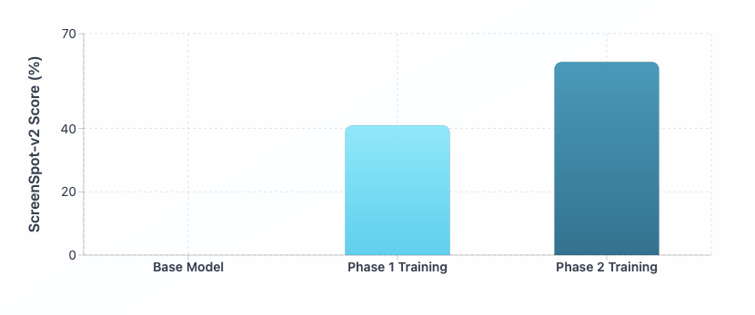

# Smol2Operator: Post-Training GUI Agents for Computer Use

**TL;DR:** This work shows how a lightweight vision–language model can acquire GUI-grounded skills and evolve into an agentic GUI coder. We release all training recipes, data-processing tools, and datasets to enable full reproducibility and foster further research.

---

<figure style="text-align: center;">
  <iframe width="560" height="315"
    src="https://www.youtube.com/embed/FNoVhqCfcew?si=OEZL2RWrxXMhTbPB"
    title="YouTube video player" frameborder="0"
    allow="accelerometer; autoplay; clipboard-write; encrypted-media; gyroscope; picture-in-picture"
    allowfullscreen>
  </iframe>
  <figcaption style="font-size:14px; color:#555; margin-top:8px;">
    This video demonstrates the model obtained through the recipe described below, executing a task end-to-end.
  </figcaption>
</figure>

---

## Table of Contents

- [Introduction](#introduction)
- [1. Data Transformation and Unified Action Space](#1-data-transformation-and-unified-action-space)
  - [The Challenge of Inconsistent Action Spaces](#the-challenge-of-inconsistent-action-spaces)
  - [Our Unified Approach](#our-unified-approach)
  - [Example Data Transformation](#example-data-transformation)
  - [Custom Action Space Adaptation with Action Space Converter](#bonus-custom-action-space-adaptation-with-action-space-converter)
  - [Key Features](#key-features)
  - [Usage Example](#usage-example)
  - [Transformed and Released Datasets](#transformed-and-released-datasets)
- [2. Phase 1: From Zero to Perception](#2-phase-1-from-zero-to-perception)
  - [Training Data](#training-data)
  - [Optimization Experiments](#optimization-experiments)
  - [Image Resolution and Coordinate System Analysis](#image-resolution-and-coordinate-system-analysis)
  - [Key Findings](#key-findings)
  - [Phase 1 Results](#phase-1-results)
- [3. Phase 2: From Perception to Cognition](#3-phase-2-from-perception-to-cognition)
  - [Training Data](#training-data-1)
  - [Phase 2 Results](#phase-2-results)
- [4. All you need is Open Source](#4-all-you-need-is-open-source)
  - [Key Components](#key-components)
- [5. Conclusion](#5-conclusion)
- [What Next?](#what-next)

<br>

<div style="
  border: 1px solid #ddd; 
  border-radius: 8px; 
  padding: 16px; 
  margin: 16px 0;
  @media (prefers-color-scheme: dark) { border-color: #555; }
">
<strong>💡 Additional Resources:</strong>
<br><br>
• Github repository: <a href="https://github.com/huggingface/aguvis">https://github.com/huggingface/aguvis</a><br>
• Datasets: <a href="https://huggingface.co/datasets/smolagents/aguvis-stage-1"><code>smolagents/aguvis-stage-1</code></a>, <a href="https://huggingface.co/datasets/smolagents/aguvis-stage-2"><code>smolagents/aguvis-stage-2</code></a>
</div>

## Introduction

Graphical User Interface (GUI) automation represents one of the most challenging frontiers in computer vision. Developing the ability to understand and interact with user interfaces opens a new era of automation, where AI agents navigating mobile, desktop, and web platforms could reshape the future of digital interaction.

In this blog post, we present a comprehensive approach to training vision-language models for GUI automation through a multi-phase training strategy. We demonstrate how to transform a model with zero grounding capabilities into an agentic coder capable of understanding and interacting with graphical interfaces.

Rather than aiming for a SOTA model, our goal is to demonstrate the entire process, from data processing to model training, and, in doing so, show how to unlock GUI-grounding capabilities in VLMs.

<div align="center">


<p style="
  font-size: 0.85em; 
  color: #666; 
  text-align: center; 
  margin: 8px 0 0 0; 
  font-style: italic;
  @media (prefers-color-scheme: dark) { color: #999; }
"><em>GUI capabilities combine understanding of the interface and precise element localization. These abilities enable the model to translate high-level tasks into low-level GUI actions such as clicking, typing, …</em></p>

</div>

<br>


Our approach leverages [**SmolVLM2-2.2B-Instruct**](https://huggingface.co/HuggingFaceTB/SmolVLM2-2.2B-Instruct) as the baseline model, a small powerful vision-language model that initially has no grounding capabilities for GUI tasks. This makes it an ideal candidate to demonstrate the effectiveness of our training methodology. Through our two-phase training process, we first instill grounding capabilities in the model, then enhance it with agentic reasoning abilities using Supervised Fine-Tuning (SFT).

We evaluate our approach on an established perception benchmark: **ScreenSpot-v2**, which test the model’s ability to understand and locate elements within screenshots. Our process is inspired by the [AGUVIS](https://huggingface.co/papers/2412.04454) paper, and we leverage their carefully curated datasets to build upon their foundational work.

<div align="center">


<p style="
  font-size: 0.85em; 
  color: #666; 
  text-align: center; 
  margin: 8px 0 0 0; 
  font-style: italic;
  @media (prefers-color-scheme: dark) { color: #999; }
"><em>Evolution of ScreenSpot-v2 performance during the training phase of the base model **SmolVLM2-2.2B-Instruct**.</em></p>

</div>


## 1. Data Transformation and Unified Action Space

*This section explains how we **convert heterogeneous GUI actions format from multiple datasets into a single unified format**. By standardizing function names, signatures, and parameters, we create consistent, high-quality data that forms the foundation for effective model training.*

### The Challenge of Inconsistent Action Spaces

One of the primary challenges when working with multiple GUI automation datasets is the lack of standardization in action representations. Different datasets use varying function signatures, parameter naming conventions, and action taxonomies, making it difficult to train a unified model across diverse data sources.

### Our Unified Approach

We took the open-source datasets ([xlangai/aguvis-stage1](https://huggingface.co/datasets/xlangai/aguvis-stage1), [xlangai/aguvis-stage2](https://huggingface.co/datasets/xlangai/aguvis-stage2)), originally used by [AGUVIS](https://huggingface.co/papers/2412.04454), and implemented a comprehensive data transformation pipeline to create a unified action space. Our approach involved:

1. **Function Parsing and Normalization**: We developed a function parser (see `utils/function_parser.py`) that can extract and parse function calls from various formats across all datasets. This parser supports any function signature format, handles complex parameter structures, and can reconstruct function calls with proper parameter ordering.
2. **Action Space Unification**: We implemented a comprehensive action conversion system (see `preprocessing/action_conversion.py`) that transforms all original action representations into a standardized function naming and argument structure. This process highlighted the significant inconsistencies in function signatures across different datasets and allowed us to:
    - Remove undesired or redundant actions
    - Standardize parameter naming conventions
    - Create a cohesive action vocabulary
3. **(Bonus) Flexible Adaptation Framework**: Our transformation pipeline includes utilities that allow users to:
    - Adapt the entire dataset to their own action space naming conventions using the `utils/action_space_converter.py` tool
    - Extract and analyze the current action space structure

### Example Data Transformation

Here are real examples from our action conversion system (`preprocessing/action_conversion.py`) showing how we transform heterogeneous action representations into our unified format (grounding coordinates normalized to [0,1]):

**Before (Original Action Dataset Formats):**

```python
# Mobile Actions
mobile.home()
mobile.open_app(app_name='drupe')
mobile.swipe(from_coord=[0.581, 0.898], to_coord=[0.601, 0.518])
mobile.long_press(x=0.799, y=0.911)
mobile.terminate(status='success')
# Desktop Actions
pyautogui.click(x=0.8102, y=0.9463)
pyautogui.doubleClick(x=0.8102, y=0.9463)
pyautogui.hotkey(keys=['ctrl', 'c'])
pyautogui.scroll(page=-0.1)
pyautogui.write(message='bread buns')
pyautogui.dragTo(from_coord=[0.87, 0.423], to_coord=[0.8102, 0.9463])
```

**After (Unified Action Dataset Formats):**

```python
# Unified Mobile Actions
navigate_home()
open_app(app_name='drupe')
swipe(from_coord=[0.581, 0.898], to_coord=[0.601, 0.518])
long_press(x=0.799, y=0.911)
final_answer('success')
# Unified Desktop Actions
click(x=0.8102, y=0.9463)
double_click(x=0.8102, y=0.9463)
press(keys=['ctrl', 'c'])
scroll(direction='up', amount=10)  # Smart direction detection
type(text='bread buns')
drag(from_coord=[0.87, 0.423], to_coord=[0.8102, 0.9463])
```

This unification process was essential for creating coherent training data that allows the model to learn consistent action patterns across diverse GUI environments.

<br>

<div style="
  border: 1px solid #ddd; 
  border-radius: 8px; 
  padding: 16px; 
  margin: 16px 0;
  @media (prefers-color-scheme: dark) { border-color: #555; }
">
<strong>💡 Why Normalized Coordinates?</strong>
<br>
Using raw pixel coordinates in text-action datapoint (e.g. <code>click(x=302, y=63)</code>) ties them to a single image size. Vision Language Models (VLMs) often resize images, causing pixel coordinates to break and require adjustment. Normalized coordinates (relative to image size) remain valid at any resolution and keep the dataset consistent.</em>
</em></div>


### (Bonus) Custom Action Space Adaptation with Action Space Converter

To maximize flexibility for different use cases, we developed the **Action Space Converter** (`utils/action_space_converter.py`), a tool that allows users to easily adapt from an action space to their own custom action vocabularies and naming conventions. 

You can use this tool to transform one action signature (function names, parameter names, and parameter value changes, ...) into another:

**Before**

```python
assistant_message: "Action: click(x=0.5, y=0.3)"
```

**After**

```python
assistant_message: "Action: touch(x_coord=200, y_coord=300)"
```

### Key Features

The Action Space Converter provides:

1. **Configurable Mappings**: Define custom mappings between unified actions and your preferred action names
2. **Parameter Transformation**: Rename parameters, apply value transformations, and set default values
3. **Flexible Architecture**: Support for both simple parameter mappings and complex custom transformation functions
4. **Validation**: Built-in validation to ensure mapping configurations are valid

### Usage Example

```python
from utils.action_space_converter import ActionSpaceConverter, ActionMapping, ParameterMapping
from utils.function_parser import parse_function_call

# Create custom mappings
mappings = [
    ActionMapping(
        source_function="click",
        target_function="touch",
        parameter_mappings=[
            ParameterMapping(source_name="x", target_name="x_coord"),
            ParameterMapping(source_name="y", target_name="y_coord")
        ],
        description="Touch screen at coordinates"    ),
    ActionMapping(
        source_function="type", # source_function is the name of the function in the original function call
        target_function="write", # target_function is the name of the function in the target function call        
        parameter_mappings=[
            ParameterMapping(source_name="text", target_name="content")
            # source_name is the name of the parameter in the original function call            
            # target_name is the name of the parameter in the target function call        
        ],
        description="Input text"    
    )
]

assistant_message = "I'll interact at those coordinates for you. click(x=0.5, y=0.3) Now I'll input the text. type(text='hello world')"

# Parse function calls
parsed_function_calls = parse_function_call(text)

# Initialize converter
converter = ActionSpaceConverter(mappings)

# Convert actions
converted_actions = converter.convert_actions(parsed_function_calls)
for new_function_call, old_function_call in zip(converted_actions, parsed_function_calls):
    text = text.replace(old_function_call.to_string(), new_function_call.to_string())

print(text)
# Output: I'll interact at those coordinates for you. touch(x_coord=0.5, y_coord=0.3) Now I'll input the text. write(content='hello world')
```

This tool enables researchers and practitioners to:

- **Customize Training Data**: Adapt the dataset to match their specific action vocabulary requirements
- **Domain Adaptation**: Transform actions for different platforms (mobile vs. desktop vs. web)
- **Framework Integration**: Easily align training data with existing automation frameworks
- **Rapid Experimentation**: Quickly test different action space configurations
- **Release Preparation**: Standardize action spaces for production deployment with consistent naming conventions

The Action Space Converter is particularly valuable for preparing datasets for training, as it ensures consistent action vocabularies across different deployment environments while maintaining compatibility with existing automation frameworks.

### Transformed and Released Datasets

Through this pipeline, we transform the open-source datasets  [xlangai/aguvis-stage1](https://huggingface.co/datasets/xlangai/aguvis-stage1), [xlangai/aguvis-stage2](https://huggingface.co/datasets/xlangai/aguvis-stage2) into our unified action space (see [here](https://www.notion.so/Smol2Operator-Post-Training-GUI-Agents-for-Computer-Use-Draft-Blog-Post-2701384ebcac8035bbaad69b5b32ed99?pvs=21)). The output of this process is released as two new fully formatted datasets: [smolagents/aguvis-stage-1](https://huggingface.co/datasets/smolagents/aguvis-stage-1) and [smolagents/aguvis-stage-2](https://huggingface.co/datasets/smolagents/aguvis-stage-2).

## 2. Phase 1: From Zero to Perception

### Training Data

Phase 1 leverages the [smolagents/aguvis-stage-1](https://huggingface.co/datasets/smolagents/aguvis-stage-1) dataset, which introduces **GUI grounding** by pairing low-level instructions with diverse executable actions (expressed in code form). For example, a user/assistant turn in [smolagents/aguvis-stage-1](https://huggingface.co/datasets/smolagents/aguvis-stage-1) follows the structure:

```json
{
  "user": "click on more button",
  "assistant": "click(x=0.8875, y=0.2281)",
}
```

Each sample links a screenshot with multi-turn user/assistant interactions, enabling the model to learn fine-grained action grounding across dialogue turns. During fine-tuning, the data collator masks everything except the assistant’s answers when computing the loss. 

<iframe
  src="https://huggingface.co/datasets/smolagents/aguvis-stage-1/embed/viewer/ui_refexp/train"
  frameborder="0"
  width="100%"
  height="560px"
></iframe>

### Optimization Experiments

Before proceeding with full-scale Phase 1 training, we conducted comprehensive ablation studies to determine optimal training configurations

### Image Resolution and Coordinate System Analysis

We experimented with different image sizes and coordinate representation systems to identify the optimal configuration for SmolVLM2:

- **Image Sizes Tested**: 384px, 768px, 1152px
- **Coordinate Systems**: Pixel coordinates vs. normalized coordinates (0-1 range)
- **Training Data**: 400K samples from Aguvis datasets

> Some SOTA GUI VLMs (e.g., Qwen-VL) appear also to use a different normalized range (0–1000), which was not tested in this experiment.


<div style="overflow-x: auto; margin: 16px 0; width: 100%; text-align: center;">
<table style="
    display: inline-table; 
    width: 80%; 
    border-collapse: collapse;
">
<thead>
<tr style="
  border-bottom: 2px solid #ddd; 
  @media (prefers-color-scheme: dark) { border-bottom-color: #555; }
">
<th style="
  padding: 12px 16px; 
  text-align: center; 
  font-weight: 600; 
  border: 1px solid #ddd; 
  width: 50%;
  @media (prefers-color-scheme: dark) { border-color: #555; }
">Configuration (coords / image size)</th>
<th style="
  padding: 12px 16px; 
  text-align: center; 
  font-weight: 600; 
  border: 1px solid #ddd; 
  width: 50%;
  @media (prefers-color-scheme: dark) { border-color: #555; }
">Screenspot-v2 (%)</th>
</tr>
</thead>
<tbody>
<tr>
<td style="
  padding: 10px 16px; 
  font-style: italic; 
  font-weight: 500; 
  opacity: 0.7; 
  text-align: left;
  border: 1px solid #ddd;
  @media (prefers-color-scheme: dark) { border-color: #555; }
"><em>Normalized coordinates</em></td>
<td style="
  padding: 10px 16px; 
  text-align: center; 
  border: 1px solid #ddd;
  @media (prefers-color-scheme: dark) { border-color: #555; }
"></td>
</tr>
<tr>
<td style="
  padding: 10px 16px; 
  border: 1px solid #ddd; 
  padding-left: 32px;
  text-align: left;
  @media (prefers-color-scheme: dark) { border-color: #555; }
">Base / –</td>
<td style="
  padding: 10px 16px; 
  text-align: center; 
  border: 1px solid #ddd; 
  @media (prefers-color-scheme: dark) { border-color: #555; }
">0.47</td>
</tr>
<tr>
<td style="
  padding: 10px 16px; 
  border: 1px solid #ddd; 
  padding-left: 32px;
  text-align: left;
  @media (prefers-color-scheme: dark) { border-color: #555; }
">384</td>
<td style="
  padding: 10px 16px; 
  text-align: center; 
  border: 1px solid #ddd; 
  @media (prefers-color-scheme: dark) { border-color: #555; }
">31.28</td>
</tr>
<tr>
<td style="
  padding: 10px 16px; 
  border: 1px solid #ddd; 
  padding-left: 32px;
  text-align: left;
  @media (prefers-color-scheme: dark) { border-color: #555; }
">764</td>
<td style="
  padding: 10px 16px; 
  text-align: center; 
  border: 1px solid #ddd; 
  @media (prefers-color-scheme: dark) { border-color: #555; }
">32.32</td>
</tr>
<tr style="font-weight: 600;">
<td style="
  padding: 10px 16px; 
  border: 1px solid #ddd; 
  padding-left: 32px;
  text-align: left;
  @media (prefers-color-scheme: dark) { border-color: #555; }
">1152</td>
<td style="
  padding: 10px 16px; 
  text-align: center; 
  border: 1px solid #ddd; 
  @media (prefers-color-scheme: dark) { border-c    olor: #555; }
"><strong>33.72</strong></td>
</tr>
<tr>
<td style="
  padding: 10px 16px; 
  font-style: italic; 
  font-weight: 500; 
  opacity: 0.7; 
  text-align: left;
  border: 1px solid #ddd;
  @media (prefers-color-scheme: dark) { border-color: #555; }
"><em>Pixel coordinates</em></td>
<td style="
  padding: 10px 16px; 
  text-align: center; 
  border: 1px solid #ddd;
  @media (prefers-color-scheme: dark) { border-color: #555; }
"></td>
</tr>
<tr>
<td style="
  padding: 10px 16px; 
  border: 1px solid #ddd; 
  padding-left: 32px;
  text-align: left;
  @media (prefers-color-scheme: dark) { border-color: #555; }
">Base / –</td>
<td style="
  padding: 10px 16px; 
  text-align: center; 
  border: 1px solid #ddd; 
  @media (prefers-color-scheme: dark) { border-color: #555; }
">0.55</td>
</tr>
<tr>
<td style="
  padding: 10px 16px; 
  border: 1px solid #ddd; 
  padding-left: 32px;
  text-align: left;
  @media (prefers-color-scheme: dark) { border-color: #555; }
">384</td>
<td style="
  padding: 10px 16px; 
  text-align: center; 
  border: 1px solid #ddd; 
  @media (prefers-color-scheme: dark) { border-color: #555; }
">1.17</td>
</tr>
<tr>
<td style="
  padding: 10px 16px; 
  border: 1px solid #ddd; 
  padding-left: 32px;
  text-align: left;
  @media (prefers-color-scheme: dark) { border-color: #555; }
">764</td>
<td style="
  padding: 10px 16px; 
  text-align: center; 
  border: 1px solid #ddd; 
  @media (prefers-color-scheme: dark) { border-color: #555; }
">2.67</td>
</tr>
<tr>
<td style="
  padding: 10px 16px; 
  border: 1px solid #ddd; 
  padding-left: 32px;
  text-align: left;
  @media (prefers-color-scheme: dark) { border-color: #555; }
">1152</td>
<td style="
  padding: 10px 16px; 
  text-align: center; 
  border: 1px solid #ddd; 
  @media (prefers-color-scheme: dark) { border-color: #555; }
">4.32</td>
</tr>
</tbody>
</table>
<p style="
  font-size: 0.85em; 
  color: #666; 
  text-align: center; 
  margin: 8px 0 0 0; 
  font-style: italic;
  @media (prefers-color-scheme: dark) { color: #999; }
"><strong>Table 1:</strong> <em>Baseline on HuggingFaceTB/SmolVLM2-2.2B-Instruct (400k samples, aguvis-stage-1). Higher is better.</em></p>
</div>


*As demonstrated in our benchmark results, SmolVLM2-2.2B-Instruct base initially achieved 0% performance on perception benchmarks like ScreenSpot-v2. This complete lack of grounding capability provided us with a clean slate to evaluate the effectiveness of our training methodology.*

### Key Findings

From our experiments, we determined that:
- **Image Size**: 1152px
- **Coordinate System**: Normalized coordinates (0-1 range) proved most effective for SmolVLM2
- Note: The optimal choice between pixel and normalized coordinates may vary depending on the base model’s pre-training approach

### Phase 1 Results

Using the optimal configuration (1152px resolution with normalized coordinates), we trained for 2 epochs on the smolagents/aguvis-stage-1 dataset. The results were remarkable, **+41% improvement over baseline on ScreenSpot-v2**

This dramatic improvement demonstrates that our Phase 1 training successfully instilled fundamental grounding capabilities in the model, enabling it to understand and locate visual elements within screenshots.


<div style="overflow-x: auto; margin: 16px 0; width: 100%; text-align: center;">
<table style="
    display: inline-table; 
    width: 80%; 
    border-collapse: collapse;
">
<thead>
<tr style="
  border-bottom: 2px solid #ddd; 
  @media (prefers-color-scheme: dark) { border-bottom-color: #555; }
">
<th style="
  padding: 12px 16px; 
  text-align: center; 
  font-weight: 600; 
  border: 1px solid #ddd; 
  width: 50%;
  @media (prefers-color-scheme: dark) { border-color: #555; }
">Configuration (coords / image size)</th>
<th style="
  padding: 12px 16px; 
  text-align: center; 
  font-weight: 600; 
  border: 1px solid #ddd; 
  width: 50%;
  @media (prefers-color-scheme: dark) { border-color: #555; }
">Screenspot-v2 (%)</th>
</tr>
</thead>
<tbody>
<tr>
<td style="
  padding: 10px 16px; 
  border: 1px solid #ddd; 
  text-align: center;
  @media (prefers-color-scheme: dark) { border-color: #555; }
">Normalized coordinates / 1152</td>
<td style="
  padding: 10px 16px; 
  text-align: center; 
  border: 1px solid #ddd; 
  @media (prefers-color-scheme: dark) { border-color: #555; }
">41.27</td>
</tr>
</tbody>
</table>
<p style="
  font-size: 0.85em; 
  color: #666; 
  text-align: center; 
  margin: 8px 0 0 0; 
  font-style: italic;
  @media (prefers-color-scheme: dark) { color: #999; }
"><strong>Table 2:</strong> <em>Baseline on HuggingFaceTB/SmolVLM2-2.2B-Instruct (2 epochs, aguvis-stage-1).</em></p>
</div>


## 3. Phase 2: From Perception to Cognition

Whereas Phase 1 provided grounding capabilities, Phase 2 targets **agentic reasoning,** the ability to deliberate and plan before acting. This stage transforms the model from a reactive system identifying GUI elements into a proactive agent capable of executing complex, multi-step interactions.

### Training Data

Phase 2 uses the [smolagents/aguvis-stage-2](https://huggingface.co/datasets/smolagents/aguvis-stage-2) dataset, which introduces agentic scenarios:

- **Explicit reasoning** about upcoming actions

- **Context consistence** across multiple interaction steps

- **High-level instructions** require multi-step, low-level actions.

for example, the [smolagents/aguvis-stage-2](https://huggingface.co/datasets/smolagents/aguvis-stage-2) chat message is like this:

```json
{
  "system": "You are a helpful GUI agent. ...",
  "user": "Please generate the next move according to the UI screenshot, instruction and previous actions.\n\nInstruction: What information does the site provide about Judith Lauand's career, works and exhibitions?\n\nPrevious actions:\nNone",
  "assistant": "<think>\nClick on the link labeled 'Judith Lauand: Brazilian 1922-2022' to explore more about her career and exhibitions.\n</think>\n<code>\nclick(x=0.41, y=0.178)\n</code>",
}
```

Each sample links a screenshot with a system/user/assistant turn. During fine-tuning, the data collator masks everything except the assistant’s answers when computing the loss. 

<iframe
  src="https://huggingface.co/datasets/smolagents/aguvis-stage-2/embed/viewer/guiact-web-multi-l1/train"
  frameborder="0"
  width="100%"
  height="560px"
></iframe>

### Phase 2 Results

Starting from the Phase 1 checkpoint (1152 px resolution, normalized coordinates), we fine-tuned the model for two epochs on [smolagents/aguvis-stage-2](https://huggingface.co/datasets/smolagents/aguvis-stage-2). The accuracy on **ScreenSpot-v2 increased from 41% to 61%**, indicating that explicit reasoning improves GUI grounding performance.


<div style="overflow-x: auto; margin: 16px 0; width: 100%; text-align: center;">
<table style="
    display: inline-table; 
    width: 80%; 
    border-collapse: collapse;
">
<thead>
<tr style="
  border-bottom: 2px solid #ddd; 
  @media (prefers-color-scheme: dark) { border-bottom-color: #555; }
">
<th style="
  padding: 12px 16px; 
  text-align: center; 
  font-weight: 600; 
  border: 1px solid #ddd; 
  width: 50%;
  @media (prefers-color-scheme: dark) { border-color: #555; }
">Configuration (coords / image size)</th>
<th style="
  padding: 12px 16px; 
  text-align: center; 
  font-weight: 600; 
  border: 1px solid #ddd; 
  width: 50%;
  @media (prefers-color-scheme: dark) { border-color: #555; }
">Screenspot-v2 (%)</th>
</tr>
</thead>
<tbody>
<tr>
<td style="
  padding: 10px 16px; 
  border: 1px solid #ddd; 
  text-align: center;
  @media (prefers-color-scheme: dark) { border-color: #555; }
">Normalized coordinates / 1152</td>
<td style="
  padding: 10px 16px; 
  text-align: center; 
  border: 1px solid #ddd; 
  @media (prefers-color-scheme: dark) { border-color: #555; }
">61.71</td>
</tr>
</tbody>
</table>
<p style="
  font-size: 0.85em; 
  color: #666; 
  text-align: center; 
  margin: 8px 0 0 0; 
  font-style: italic;
  @media (prefers-color-scheme: dark) { color: #999; }
"><strong>Table 2:</strong> <em>Baseline on HuggingFaceTB/SmolVLM2-2.2B-Instruct after Phase 1 finetuning (2 epochs, aguvis-stage-1).</em></p>
</div>

<br>

<div style="
  border: 1px solid #ddd; 
  border-radius: 8px; 
  padding: 16px; 
  margin: 16px 0;
  @media (prefers-color-scheme: dark) { border-color: #555; }
">
💡  <em>We also reproduced the two-phase training on a much smaller VLM (nanoVLM-460M). Despite its reduced capacity, the model achieved <strong>~58% on ScreenSpot-v2</strong>, demonstrating that the training strategy scales down effectively, <strong>making it SOTA on ScreenSpot-v2 for this model size (460M parameters)</strong>. In addition, aguvis-stage-1 is already included in <a href="https://huggingface.co/datasets/HuggingFaceM4/FineVision">FineVision Dataset</a>!</em>
</div>


## 4. All you need is Open Source

All training code, data processing pipelines, datasets and model are open source !

### Key Components

1. **Training Recipe** ([`recipe.ipynb`](https://github.com/huggingface/aguvis/blob/main/recipe.ipynb)): Complete training pipeline for both Phase 1 and Phase 2, including dataset mixture configurations and training orchestration. We leverage the [TRL](https://huggingface.co/docs/trl/en/index) library to train our models.
2. **Datasets** ([`smolagents/aguvis-stage-1`](https://huggingface.co/datasets/smolagents/aguvis-stage-1), [`smolagents/aguvis-stage-2`](https://huggingface.co/datasets/smolagents/aguvis-stage-2)): all datasets used are open-source.
3. **Model** ([`smolagents/SmolVLM2-2.2B-Instruct-Agentic-GUI`](https://huggingface.co/smolagents/SmolVLM2-2.2B-Instruct-Agentic-GUI)): the model produced by applying the training recipe described above.
4. **Preprocessing Tools:**
    - **Function Parser** ([`utils/function_parser.py`](https://github.com/huggingface/aguvis/blob/main/utils/function_parser.py)): Utilities for parsing, normalizing, and reconstructing function calls from diverse dataset formats. Supports complex parameter structures, positional arguments, and multiple function call extraction.
    - **Action Conversion System** ([`preprocessing/action_conversion.py`](https://github.com/huggingface/aguvis/blob/main/preprocessing/action_conversion.py)): Core unification engine transforming mobile and PyAutoGUI desktop actions into a standardized API format. Features smart coordinate handling, direction detection for scroll actions, and comprehensive parameter normalization.
    - **Action Space Converter** ([`utils/action_space_converter.py`](https://github.com/huggingface/aguvis/blob/main/utils/action_space_converter.py)): Flexible tool for adapting the unified action space to custom vocabularies and naming conventions. Enables domain-specific customization through configurable parameter mappings.

<div style="
  border: 1px solid #ddd; 
  border-radius: 8px; 
  padding: 16px; 
  margin: 16px 0;
  @media (prefers-color-scheme: dark) { border-color: #555; }
">
💡 We’ve also opened a Space to experiment with the POC model’s agentic grounding capabilities: <a href="https://huggingface.co/spaces/A-Mahla/Smol2Operator">A-Mahla/Smol2Operator</a>
</div>

## 5. Conclusion

Our experiments demonstrate that high-quality, reasoning-oriented data can substantially improve GUI grounding, even for small VLMs, using only supervised fine-tuning (SFT). Beyond raw performance gains, these results show that the capabilities of a “GUI model” are largely determined by the structure of the data (i.e., the action space), which in turn instills within the model an internal representation of the user interface and the spatial organization of its interactive elements.

## What next?

High-quality, task-specific data for GUI interactions is a critical prerequisite for advancing agentic models. Carefully curated datasets teach models the structure and semantics of interfaces while providing the grounding needed for accurate action prediction and evaluation.

In addition, recent studies have also explored reinforcement learning (RL) and direct preference optimization (DPO) to enhance reasoning, planning, consistency, and execution in end-to-end agentic models. These approaches appear better suited to online, dynamic environments compared to SFT, signaling a new generation of GUI-grounded agents optimized through reinforcement-based methods, enabling richer reasoning and more reliable execution.