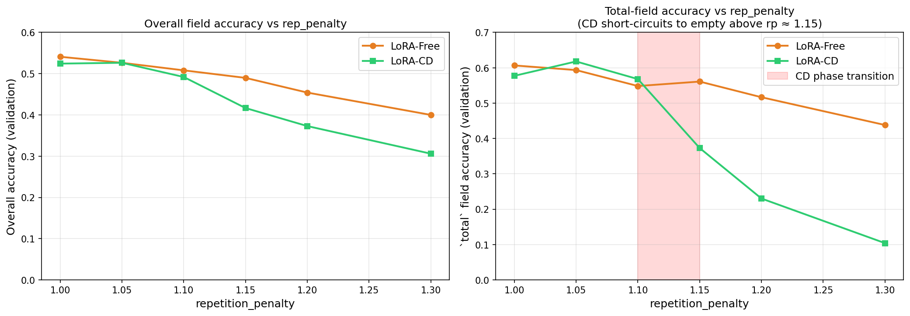

# When Does Constrained Decoding Actually Help a Small VLM?

There's an ongoing debate in the text-LLM world about constrained decoding (CD). One camp says it improves reasoning ([ACL 2025 Industry](https://aclanthology.org/2025.acl-industry.0/)). Another says it hurts semantic quality ([RANLP 2025](https://aclanthology.org/2025.ranlp-1.0/)). Both sides tested on text-only LLMs doing reasoning tasks.

Nobody has published clean numbers on small **vision-language models** doing structured document extraction. That's a different setting: the output is flat JSON, format correctness *is* the value (downstream pipelines need parseable data), and the models are tiny enough that every inference-time trick might matter more.

So I ran a simple experiment: take SmolVLM-256M, point it at scanned receipts, and measure what happens across four conditions.

## The setup

**Model:** [SmolVLM-256M-Instruct](https://huggingface.co/HuggingFaceTB/SmolVLM-256M-Instruct), a 256M-parameter VLM (Idefics3 architecture with a SmolLM2 language backbone).

**Dataset:** [SROIE](https://huggingface.co/datasets/podbilabs/sroie-donut), 500 training / 347 test scanned receipt images, each labeled with 4 fields.

**The schema that drives everything:**

```python
from pydantic import BaseModel

class Receipt(BaseModel):
    company: str
    date: str
    address: str
    total: str
```

This single class is the source of truth for training targets, [Outlines](https://github.com/dottxt-ai/outlines) constraint enforcement, evaluation, and the demo. Outlines compiles it into a token-level finite state machine that masks invalid tokens at every generation step, guaranteeing schema-valid output:

```python
import outlines
from transformers import AutoModelForImageTextToText, AutoProcessor

hf_model = AutoModelForImageTextToText.from_pretrained("HuggingFaceTB/SmolVLM-256M-Instruct")
processor = AutoProcessor.from_pretrained("HuggingFaceTB/SmolVLM-256M-Instruct")
model = outlines.from_transformers(hf_model, processor)

# Schema-constrained generation: output is guaranteed valid Receipt JSON
result = model([prompt, image], output_type=Receipt, max_new_tokens=256)
```

**The 4 cells:**

|   | Free decoding | Constrained decoding (Outlines) |
|---|---|---|
| **Zero-shot** | Cell 1: baseline | Cell 2: enforce structure only |
| **LoRA fine-tuned** | Cell 3: change weights only | Cell 4: both |

Fine-tuning uses LoRA (r=8, alpha=16) on the language model's attention and MLP layers, trained for 3 epochs on the 500 SROIE training receipts. The vision encoder stays frozen.

## Finding 1: Constrained decoding rescues the untrained model

The raw 256M model has never seen SROIE receipts. Ask it to extract a receipt and you get this:

```json
{
  "company": "OJC MARKETING SDN BHD",
  "address": ["- 81760 MASAI, JOHOR", "- 34-BARDI SENIRO, HONG KONG"],
  "total_price": ["193.00", "193.00 SR"],
  "cashier": {"name": "NG CHUAN MIN", "email": "[ng@ojcgroup.com]"},
  "salesperson": {"firstName": "FATIN", ...}
}
```

Wrong field names (`total_price` instead of `total`), arrays instead of strings, hallucinated objects (`cashier`, `salesperson`). Schema validity across the test set: **0.0%**. Every single output fails Pydantic validation.

Wrap the same untrained model with Outlines and force it to follow the `Receipt` schema:

| Cell | Schema valid | Overall accuracy |
|------|-------------|-----------------|
| ZS-Free | 0.0% | n/a |
| ZS-CD | **96.8%** | **20.8%** |

Same model, same weights, same images. Constrained decoding alone turns "unparseable garbage" into "valid Receipt JSON 97% of the time." Date and company are correct in about 40% of cases. The model can already *read* the receipt; it just can't *format* the output without structural guardrails.

The 3.2% residual failure is degenerate repetition loops where the model gets stuck inside a string value (`"0.00 0.00 0.00..."`) and never emits the closing quote within the token budget.

**Takeaway:** If you can't fine-tune (no training data, or you need instant deployment on a new document type), constrained decoding is not optional. It's the difference between a usable system and a broken one.

## Finding 2: Once the model is fine-tuned, constrained decoding adds nothing

Train LoRA on those 500 receipts, and the picture changes completely:

| Cell | FT | Decoding | Schema valid | Overall | Company | Date | Address | Total |
|------|-----|----------|-------------|---------|---------|------|---------|-------|
| ZS-Free | None | Free | 0.0% | n/a | 0% | 0% | 0% | 0% |
| ZS-CD | None | Constrained | 96.8% | 20.8% | 38% | 40% | 0% | 5% |
| **LoRA-Free** | **LoRA** | **Free** | **98.6%** | **49.6%** | **48%** | **82%** | **14%** | **55%** |
| **LoRA-CD** | **LoRA** | **Constrained** | **99.1%** | **49.8%** | **47%** | **82%** | **15%** | **55%** |

LoRA-Free vs LoRA-CD: within 0.2 percentage points on every metric. Statistically tied.

The two modes make slightly different micro-decisions on borderline tokens (11 test cases where Free gets `total` right and CD doesn't, roughly the same going the other way), but the aggregate is the same. After LoRA, the model has internalized the schema. Adding CD on top is like putting training wheels on a bike someone already knows how to ride.

**Takeaway:** If you have training data and can fine-tune, fine-tuning is sufficient. Constrained decoding is the tool you reach for when fine-tuning isn't available.

## Finding 3: The hyperparameter that fixes the untrained model breaks the trained one

This was the most surprising finding and came out of debugging an unexpected accuracy drop.

In the zero-shot CD regime, the model falls into degenerate loops (`"0.00 0.00 0.00..."` filling the token budget without ever closing the string). The standard fix is `repetition_penalty=1.2`, which downweights tokens that have already appeared. It works great for the untrained model.

But in the trained model + CD regime, it causes silent failures. Here's the mechanism:

By the time the FSM reaches the `"total":` field, every digit, period, and quote token has already appeared in previous fields (company name, date, address). With `rp=1.2`, all these tokens have been downweighted. The FSM allows two valid paths: a non-empty value like `"193.00"` (requiring penalized digits) or an empty value `""` (requiring zero penalized tokens). The empty path wins because it's rep-penalty-cheapest.

The result: `total` silently collapses to `""`. The schema still validates (an empty string is a valid `str`), so you only notice when you check accuracy.

A validation sweep across `repetition_penalty ∈ {1.0, 1.05, 1.10, 1.15, 1.20, 1.30}` makes the cliff visible:



CD's `total` accuracy drops from 57% at `rp=1.05` to 37% at `rp=1.15` to 10% at `rp=1.30`. Free decoding degrades too, but gradually. The cliff is specific to the interaction between the FSM's structural constraints and the penalty's token-level downweighting.

**Takeaway:** The optimal `repetition_penalty` is regime-dependent. The value that fixes the untrained model (1.2) actively hurts the trained one. If you're using constrained decoding on a fine-tuned model, test with `rp=1.0` (no penalty) first.

## Limitations

- **Single model scale.** These results are for 256M parameters. A larger model might behave differently.
- **Flat schema.** SROIE has 4 simple string fields. CD's structural enforcement could matter more on deeply nested schemas like CORD-v2 (where the model might hallucinate structural errors that LoRA doesn't fully prevent).
- **Exact-match metric.** Address accuracy (14%) understates quality: the model gets most characters right but a single OCR error (`MASAI` vs `MASAL`) counts as a miss. A character-level or edit-distance metric would be more generous.
- **Single seed.** The LoRA-Free vs LoRA-CD tie is a tie under one training run. Multiple seeds would give confidence intervals.

## Try it yourself

The full code, persisted predictions, and a Gradio demo are at [github.com/Arjun-Avadhanam/SmolVLM-CD](https://github.com/Arjun-Avadhanam/SmolVLM-CD).

```bash
git clone https://github.com/Arjun-Avadhanam/SmolVLM-CD.git
cd SmolVLM-CD && pip install -e .
python -m smolvlm_cd.demo
```

The demo exposes all 4 conditions plus a `repetition_penalty` slider. Select "LoRA + Constrained decoding", push the slider above 1.10, and watch the `total` field collapse to empty in real time. All predictions and metrics are persisted in the repo, so you can inspect results without re-running inference.
