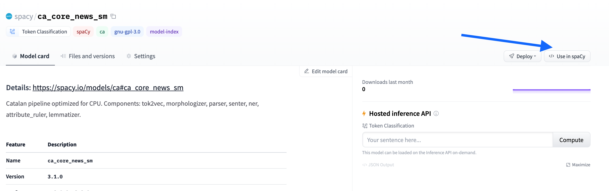
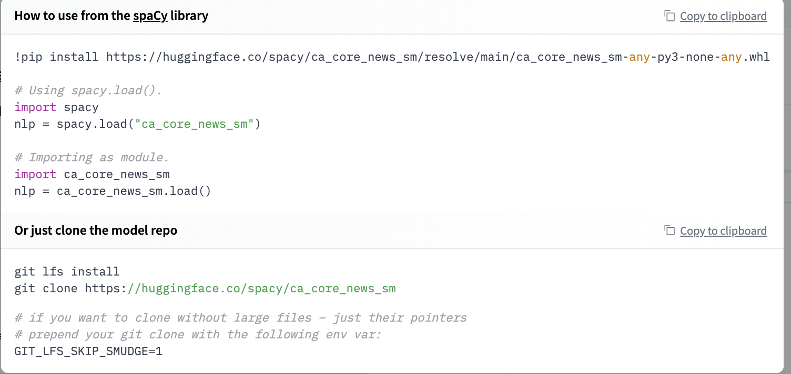

<h1>
    spaCy in the Hugging Face Hub
</h1>

<div class="blog-metadata">
    <small>Published July 28, 13.</small>
    <a target="_blank" class="btn no-underline text-sm mb-5 font-sans" href="https://github.com/huggingface/blog/blob/master/spacy-in-the-hub.md">
        Update on GitHub
    </a>
</div>

<div class="author-card">
    <a href="/osanseviero">
        
        <div class="bfc">
            <code>osanseviero</code>
            <span class="fullname">Omar Sanseviero</span>
        </div>
    </a>
    <a href="/ines">
        
        <div class="bfc">
            <code>ines</code>
            <span class="fullname">Ines Montani</span>
        </div>
    </a>
</div>

[spaCy](https://github.com/explosion/spaCy) is a cool library in the Natural Language Processing ecosystem used by dozens of thousands of persons. spaCy allows to easily use models for tasks such as Part of Speech and Named Entities Recognition.

Hugging Face makes it really easy to share your spaCy pipelines with the community! With a single command, you can upload any pipeline package, with a pretty model card and all required metadata auto-generated for you. The inference API currently supports NER out-of-the-box, and you can try out your pipeline interactively in your browser. You'll also get a live URL for your package that you can `pip install` from anywhere for a smooth path from prototype all the way to production!

### Finding models

Over 60 canonical models can be found in the [spaCy](https://hf.co/spacy) org. These models are from the [latest 3.1 release](https://explosion.ai/blog/spacy-v3-1), so you can try the latest realesed models right now! On top of this, you can find all spaCy models from the community here https://huggingface.co/models?filter=spacy.


### Widgets

This integration includes support for NER widgets, so all models with a NER component will have this out of the box! Coming soon there will be support for text classification and POS.


### Using existing models

All models from the Hub can be directly installed using `pip install`. 

```
!pip install https://huggingface.co/spacy/ca_core_news_sm/resolve/main/ca_core_news_sm-any-py3-none-any.whl

# Using spacy.load().
import spacy
nlp = spacy.load("ca_core_news_sm")
```

When you open a repository, you can click `Use in spaCy` and you will be given a working snippet that you can use to install and load the model!




You can even make HTTP requests to call the models from the Inference API, which is useful in production settings.


### Sharing your models

But probably the coolest feature is that now you can very easily share your models with the `spacy-huggingface-hub` [library](https://github.com/explosion/spacy-huggingface-hub), which extends the `spaCy` CLI with a new command, `push`. 

```bash
huggingface-cli login
python -m spacy package ./en_ner_fashion ./output --build wheel
cd ./output/en_ner_fashion-0.0.0/dist
python -m spacy huggingface-hub push en_ner_fashion-0.0.0-py3-none-any.whl
```

In just a minute, you can get your packaged model in the Hub, try it out directly in the browser, and share it with the rest of the community. All the required metadata will be uploaded for you and you even get a cool model card.

Try it out and share your models with the community!

## Would you like to integrate your library to the Hub?

This integration is possible thanks to the [`huggingface_hub`](https://github.com/huggingface/huggingface_hub) library which has all our widgets and the API for all our supported libraries. If you would like to integrate your library to the Hub, we have a [guide](https://huggingface.co/docs/hub/adding-a-library) for you!
