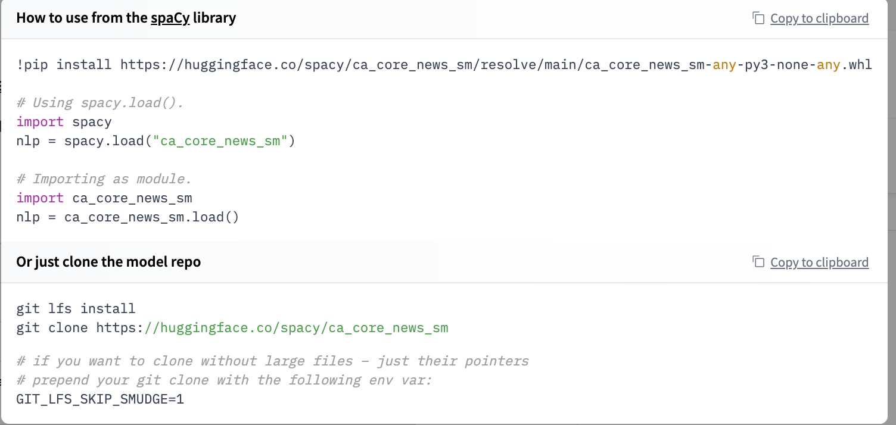

# Welcome spaCy to the Hugging Face Hub

{blog_metadata}

{authors}

[spaCy](https://github.com/explosion/spaCy) is a popular library for advanced Natural Language Processing used widely across industry. spaCy makes it easy to use and train pipelines for tasks like named entity recognition, text classification, part of speech tagging and more, and lets you build powerful applications to process and analyze large volumes of text.

Hugging Face makes it really easy to share your spaCy pipelines with the community! With a single command, you can upload any pipeline package, with a pretty model card and all required metadata auto-generated for you. The inference API currently supports NER out-of-the-box, and you can try out your pipeline interactively in your browser. You'll also get a live URL for your package that you can `pip install` from anywhere for a smooth path from prototype all the way to production!

### Finding models

Over 60 canonical models can be found in the [spaCy](https://hf.co/spacy) org. These models are from the [latest 3.1 release](https://explosion.ai/blog/spacy-v3-1), so you can try the latest realesed models right now! On top of this, you can find all spaCy models from the community here https://huggingface.co/models?filter=spacy.


### Widgets

This integration includes support for NER widgets, so all models with a NER component will have this out of the box! Coming soon there will be support for text classification and POS.

<div><a class="text-xs block mb-3 text-gray-300" href="/spacy/en_core_web_sm"><code>spacy/en_core_web_sm</code></a>
<div class="SVELTE_HYDRATER " data-props="{&quot;apiUrl&quot;:&quot;https://api-inference.huggingface.co&quot;,&quot;model&quot;:{&quot;author&quot;:&quot;spacy&quot;,&quot;autoArchitecture&quot;:&quot;AutoModel&quot;,&quot;branch&quot;:&quot;main&quot;,&quot;cardData&quot;:{&quot;tags&quot;:[&quot;spacy&quot;,&quot;token-classification&quot;],&quot;language&quot;:[&quot;en&quot;],&quot;license&quot;:&quot;MIT&quot;,&quot;model-index&quot;:[{&quot;name&quot;:&quot;en_core_web_sm&quot;,&quot;results&quot;:[{&quot;tasks&quot;:{&quot;name&quot;:&quot;NER&quot;,&quot;type&quot;:&quot;token-classification&quot;,&quot;metrics&quot;:[{&quot;name&quot;:&quot;Precision&quot;,&quot;type&quot;:&quot;precision&quot;,&quot;value&quot;:0.8424355924},{&quot;name&quot;:&quot;Recall&quot;,&quot;type&quot;:&quot;recall&quot;,&quot;value&quot;:0.8335336538},{&quot;name&quot;:&quot;F Score&quot;,&quot;type&quot;:&quot;f_score&quot;,&quot;value&quot;:0.8379609817}]}},{&quot;tasks&quot;:{&quot;name&quot;:&quot;POS&quot;,&quot;type&quot;:&quot;token-classification&quot;,&quot;metrics&quot;:[{&quot;name&quot;:&quot;Accuracy&quot;,&quot;type&quot;:&quot;accuracy&quot;,&quot;value&quot;:0.9720712187}]}},{&quot;tasks&quot;:{&quot;name&quot;:&quot;SENTER&quot;,&quot;type&quot;:&quot;token-classification&quot;,&quot;metrics&quot;:[{&quot;name&quot;:&quot;Precision&quot;,&quot;type&quot;:&quot;precision&quot;,&quot;value&quot;:0.9074955788},{&quot;name&quot;:&quot;Recall&quot;,&quot;type&quot;:&quot;recall&quot;,&quot;value&quot;:0.8801372122},{&quot;name&quot;:&quot;F Score&quot;,&quot;type&quot;:&quot;f_score&quot;,&quot;value&quot;:0.893607046}]}},{&quot;tasks&quot;:{&quot;name&quot;:&quot;UNLABELED_DEPENDENCIES&quot;,&quot;type&quot;:&quot;token-classification&quot;,&quot;metrics&quot;:[{&quot;name&quot;:&quot;Accuracy&quot;,&quot;type&quot;:&quot;accuracy&quot;,&quot;value&quot;:0.9185392711}]}},{&quot;tasks&quot;:{&quot;name&quot;:&quot;LABELED_DEPENDENCIES&quot;,&quot;type&quot;:&quot;token-classification&quot;,&quot;metrics&quot;:[{&quot;name&quot;:&quot;Accuracy&quot;,&quot;type&quot;:&quot;accuracy&quot;,&quot;value&quot;:0.9185392711}]}}]}]},&quot;cardSource&quot;:true,&quot;id&quot;:&quot;spacy/en_core_web_sm&quot;,&quot;pipeline_tag&quot;:&quot;token-classification&quot;,&quot;library_name&quot;:&quot;spacy&quot;,&quot;modelId&quot;:&quot;spacy/en_core_web_sm&quot;,&quot;private&quot;:false,&quot;siblings&quot;:[{&quot;rfilename&quot;:&quot;.gitattributes&quot;},{&quot;rfilename&quot;:&quot;LICENSE&quot;},{&quot;rfilename&quot;:&quot;LICENSES_SOURCES&quot;},{&quot;rfilename&quot;:&quot;README.md&quot;},{&quot;rfilename&quot;:&quot;accuracy.json&quot;},{&quot;rfilename&quot;:&quot;config.cfg&quot;},{&quot;rfilename&quot;:&quot;en_core_web_sm-any-py3-none-any.whl&quot;},{&quot;rfilename&quot;:&quot;meta.json&quot;},{&quot;rfilename&quot;:&quot;tokenizer&quot;},{&quot;rfilename&quot;:&quot;attribute_ruler/patterns&quot;},{&quot;rfilename&quot;:&quot;lemmatizer/lookups/lookups.bin&quot;},{&quot;rfilename&quot;:&quot;ner/cfg&quot;},{&quot;rfilename&quot;:&quot;ner/model&quot;},{&quot;rfilename&quot;:&quot;ner/moves&quot;},{&quot;rfilename&quot;:&quot;vocab/lookups.bin&quot;},{&quot;rfilename&quot;:&quot;vocab/strings.json&quot;},{&quot;rfilename&quot;:&quot;vocab/vectors&quot;}],&quot;tags&quot;:[&quot;en&quot;,&quot;spacy&quot;,&quot;token-classification&quot;,&quot;license:mit&quot;,&quot;model-index&quot;],&quot;tag_objs&quot;:[{&quot;id&quot;:&quot;token-classification&quot;,&quot;label&quot;:&quot;Token Classification&quot;,&quot;type&quot;:&quot;pipeline_tag&quot;},{&quot;id&quot;:&quot;spacy&quot;,&quot;label&quot;:&quot;spaCy&quot;,&quot;type&quot;:&quot;library&quot;},{&quot;id&quot;:&quot;en&quot;,&quot;label&quot;:&quot;en&quot;,&quot;type&quot;:&quot;language&quot;},{&quot;id&quot;:&quot;license:mit&quot;,&quot;label&quot;:&quot;mit&quot;,&quot;type&quot;:&quot;license&quot;},{&quot;id&quot;:&quot;model-index&quot;,&quot;label&quot;:&quot;model-index&quot;,&quot;type&quot;:&quot;other&quot;}],&quot;widgetData&quot;:[{&quot;text&quot;:&quot;My name is Wolfgang and I live in Berlin&quot;},{&quot;text&quot;:&quot;My name is Sarah and I live in London&quot;},{&quot;text&quot;:&quot;My name is Clara and I live in Berkeley, California.&quot;}]},&quot;shouldUpdateUrl&quot;:true}" data-target="InferenceWidget"><div class="flex flex-col w-full max-w-full
	"> <div class="font-semibold flex items-center mb-2"><div class="text-lg flex items-center"><svg xmlns="http://www.w3.org/2000/svg" xmlns:xlink="http://www.w3.org/1999/xlink" aria-hidden="true" focusable="false" role="img" class="-ml-1 mr-1 text-yellow-500" width="1em" height="1em" preserveAspectRatio="xMidYMid meet" viewBox="0 0 24 24"><path d="M11 15H6l7-14v8h5l-7 14v-8z" fill="currentColor"></path></svg>
			Hosted inference API</div> <a target="_blank" href="/docs"><svg class="ml-1.5 text-sm text-gray-400 hover:text-black" xmlns="http://www.w3.org/2000/svg" xmlns:xlink="http://www.w3.org/1999/xlink" aria-hidden="true" focusable="false" role="img" width="1em" height="1em" preserveAspectRatio="xMidYMid meet" viewBox="0 0 32 32"><path d="M17 22v-8h-4v2h2v6h-3v2h8v-2h-3z" fill="currentColor"></path><path d="M16 8a1.5 1.5 0 1 0 1.5 1.5A1.5 1.5 0 0 0 16 8z" fill="currentColor"></path><path d="M16 30a14 14 0 1 1 14-14a14 14 0 0 1-14 14zm0-26a12 12 0 1 0 12 12A12 12 0 0 0 16 4z" fill="currentColor"></path></svg></a></div> <div class="flex items-center text-sm text-gray-500 mb-1.5"><div class="inline-flex items-center"><svg class="mr-1" xmlns="http://www.w3.org/2000/svg" xmlns:xlink="http://www.w3.org/1999/xlink" aria-hidden="true" fill="currentColor" focusable="false" role="img" width="1em" height="1em" preserveAspectRatio="xMidYMid meet" viewBox="0 0 18 18"><path d="M11.075 10.1875H12.1625V11.275H11.075V10.1875Z"></path><path d="M15.425 9.10004H16.5125V10.1875H15.425V9.10004Z"></path><path d="M7.8125 3.66254H8.9V4.75004H7.8125V3.66254Z"></path><path d="M8.90001 12.3625H6.72501V9.09998C6.72472 8.81165 6.61005 8.5352 6.40617 8.33132C6.20228 8.12744 5.92584 8.01277 5.63751 8.01248H2.37501C2.08667 8.01277 1.81023 8.12744 1.60635 8.33132C1.40246 8.5352 1.28779 8.81165 1.28751 9.09998V12.3625C1.28779 12.6508 1.40246 12.9273 1.60635 13.1311C1.81023 13.335 2.08667 13.4497 2.37501 13.45H5.63751V15.625C5.63779 15.9133 5.75246 16.1898 5.95635 16.3936C6.16023 16.5975 6.43667 16.7122 6.72501 16.7125H8.90001C9.18834 16.7122 9.46478 16.5975 9.66867 16.3936C9.87255 16.1898 9.98722 15.9133 9.98751 15.625V13.45C9.98722 13.1616 9.87255 12.8852 9.66867 12.6813C9.46478 12.4774 9.18834 12.3628 8.90001 12.3625V12.3625ZM2.37501 12.3625V9.09998H5.63751V12.3625H2.37501ZM6.72501 15.625V13.45H8.90001V15.625H6.72501Z"></path><path d="M15.425 16.7125H13.25C12.9617 16.7122 12.6852 16.5976 12.4813 16.3937C12.2775 16.1898 12.1628 15.9134 12.1625 15.625V13.45C12.1628 13.1617 12.2775 12.8852 12.4813 12.6814C12.6852 12.4775 12.9617 12.3628 13.25 12.3625H15.425C15.7133 12.3628 15.9898 12.4775 16.1937 12.6814C16.3976 12.8852 16.5122 13.1617 16.5125 13.45V15.625C16.5122 15.9134 16.3976 16.1898 16.1937 16.3937C15.9898 16.5976 15.7133 16.7122 15.425 16.7125ZM13.25 13.45V15.625H15.425V13.45H13.25Z"></path><path d="M15.425 1.48752H12.1625C11.8742 1.48781 11.5977 1.60247 11.3938 1.80636C11.19 2.01024 11.0753 2.28668 11.075 2.57502V5.83752H9.98751C9.69917 5.83781 9.42273 5.95247 9.21885 6.15636C9.01496 6.36024 8.9003 6.63668 8.90001 6.92502V8.01252C8.9003 8.30085 9.01496 8.5773 9.21885 8.78118C9.42273 8.98506 9.69917 9.09973 9.98751 9.10002H11.075C11.3633 9.09973 11.6398 8.98506 11.8437 8.78118C12.0476 8.5773 12.1622 8.30085 12.1625 8.01252V6.92502H15.425C15.7133 6.92473 15.9898 6.81006 16.1937 6.60618C16.3976 6.4023 16.5122 6.12585 16.5125 5.83752V2.57502C16.5122 2.28668 16.3976 2.01024 16.1937 1.80636C15.9898 1.60247 15.7133 1.48781 15.425 1.48752ZM9.98751 8.01252V6.92502H11.075V8.01252H9.98751ZM12.1625 5.83752V2.57502H15.425V5.83752H12.1625Z"></path><path d="M4.55001 5.83752H2.37501C2.08667 5.83723 1.81023 5.72256 1.60635 5.51868C1.40246 5.3148 1.28779 5.03835 1.28751 4.75002V2.57502C1.28779 2.28668 1.40246 2.01024 1.60635 1.80636C1.81023 1.60247 2.08667 1.48781 2.37501 1.48752H4.55001C4.83834 1.48781 5.11478 1.60247 5.31867 1.80636C5.52255 2.01024 5.63722 2.28668 5.63751 2.57502V4.75002C5.63722 5.03835 5.52255 5.3148 5.31867 5.51868C5.11478 5.72256 4.83834 5.83723 4.55001 5.83752V5.83752ZM2.37501 2.57502V4.75002H4.55001V2.57502H2.37501Z"></path></svg> <span>Token Classification</span></div> <div class="ml-auto"></div></div> <form><div class="flex h-10"><input class="form-input-alt flex-1 rounded-r-none " placeholder="Your sentence here..." required="" type="text"> <button class="btn-widget w-24 h-10 px-5 rounded-l-none border-l-0 " type="submit">Compute</button></div></form> <div class="mt-1.5"><div class="text-gray-400 text-xs">This model is currently loaded and running on the Inference API.</div> </div>   <div class="mt-auto pt-4 flex items-center text-xs text-gray-500"><button class="flex items-center cursor-not-allowed text-gray-300" disabled=""><svg class="mr-1" xmlns="http://www.w3.org/2000/svg" xmlns:xlink="http://www.w3.org/1999/xlink" aria-hidden="true" focusable="false" role="img" width="1em" height="1em" preserveAspectRatio="xMidYMid meet" viewBox="0 0 32 32" style="transform: rotate(360deg);"><path d="M31 16l-7 7l-1.41-1.41L28.17 16l-5.58-5.59L24 9l7 7z" fill="currentColor"></path><path d="M1 16l7-7l1.41 1.41L3.83 16l5.58 5.59L8 23l-7-7z" fill="currentColor"></path><path d="M12.419 25.484L17.639 6l1.932.518L14.35 26z" fill="currentColor"></path></svg>
		JSON Output</button> <button class="flex items-center ml-auto"><svg class="mr-1" xmlns="http://www.w3.org/2000/svg" xmlns:xlink="http://www.w3.org/1999/xlink" aria-hidden="true" focusable="false" role="img" width="1em" height="1em" preserveAspectRatio="xMidYMid meet" viewBox="0 0 32 32"><path d="M22 16h2V8h-8v2h6v6z" fill="currentColor"></path><path d="M8 24h8v-2h-6v-6H8v8z" fill="currentColor"></path><path d="M26 28H6a2.002 2.002 0 0 1-2-2V6a2.002 2.002 0 0 1 2-2h20a2.002 2.002 0 0 1 2 2v20a2.002 2.002 0 0 1-2 2zM6 6v20h20.001L26 6z" fill="currentColor"></path></svg>
		Maximize</button></div> </div></div></div>
                

### Using existing models

All models from the Hub can be directly installed using `pip install`. 


```bash
pip install https://huggingface.co/spacy/en_core_web_sm/resolve/main/en_core_web_sm-any-py3-none-any.whl
```

```python
# Using spacy.load().
import spacy
nlp = spacy.load("en_core_web_sm")

# Importing as module.
import en_core_web_sm
nlp = en_core_web_sm.load()
```

When you open a repository, you can click `Use in spaCy` and you will be given a working snippet that you can use to install and load the model!




You can even make HTTP requests to call the models from the Inference API, which is useful in production settings. Here is an example of a simple request:

```bash
curl -X POST  --data '{"inputs": "Hello, this is Omar"}' https://api-inference.huggingface.co/models/spacy/en_core_web_sm
>>> [{"entity_group":"PERSON","word":"Omar","start":15,"end":19,"score":1.0}]
```

And for larger-scale use cases, you can click "Deploy > Accelerated Inference" and see how to do this with Python.


### Sharing your models

But probably the coolest feature is that now you can very easily share your models with the `spacy-huggingface-hub` [library](https://github.com/explosion/spacy-huggingface-hub), which extends the `spaCy` CLI with a new command, `huggingface-hub push`. 

```bash
huggingface-cli login
python -m spacy package ./en_ner_fashion ./output --build wheel
cd ./output/en_ner_fashion-0.0.0/dist
python -m spacy huggingface-hub push en_ner_fashion-0.0.0-py3-none-any.whl
```

In just a minute, you can get your packaged model in the Hub, try it out directly in the browser, and share it with the rest of the community. All the required metadata will be uploaded for you and you even get a cool model card.

Try it out and share your models with the community!

## Would you like to integrate your library to the Hub?

This integration is possible thanks to the [`huggingface_hub`](https://github.com/huggingface/huggingface_hub) library which has all our widgets and the API for all our supported libraries. If you would like to integrate your library to the Hub, we have a [guide](https://huggingface.co/docs/hub/models-adding-libraries) for you!
