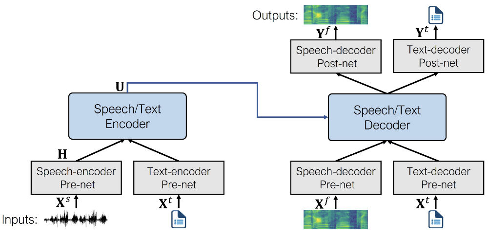
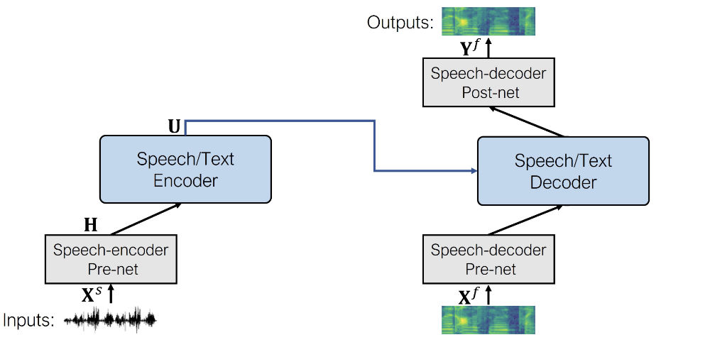
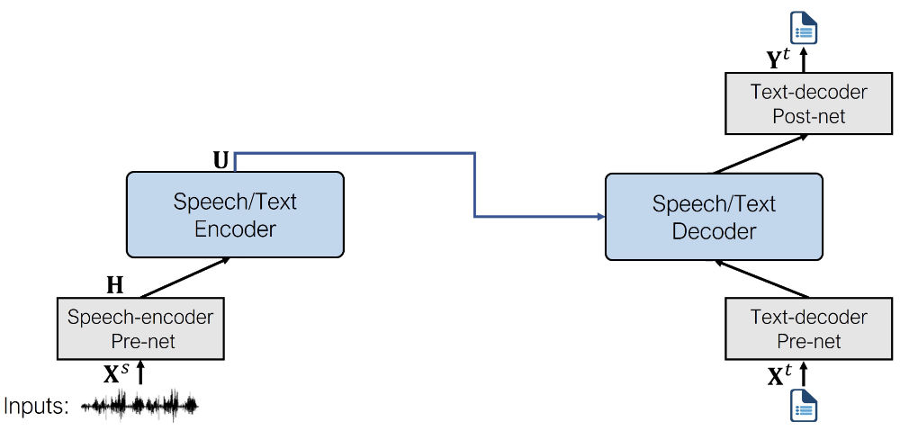

# Speech Synthesis, Recognition, and More With SpeechT5

<div class="blog-metadata">
    <small>Published TODO.</small>
    <a target="_blank" class="btn no-underline text-sm mb-5 font-sans" href="https://github.com/huggingface/blog/blob/main/speecht5.md">
        Update on GitHub
    </a>
</div>

<div class="author-card">
    <a href="https://hf.co/Matthijs">
        
        <div class="bfc">
            <code>Matthijs</code>
            <span class="fullname">Matthijs Hollemans</span>
        </div>
    </a>
</div>


We’re happy to announce that SpeechT5 is now available in 🤗 Transformers, an open-source library that offers easy-to-use implementations of state-of-the-art machine learning models.

SpeechT5 was originally described in the paper [SpeechT5: Unified-Modal Encoder-Decoder Pre-Training for Spoken Language Processing](https://arxiv.org/abs/2110.07205) by Microsoft Research Asia. Our checkpoints use the [original weights](https://github.com/microsoft/SpeechT5) published by the paper's authors.

## Introduction

SpeechT5 is not one, not two, but three different kinds of speech models in one single architecture.

It can do:

- **speech-to-text** for automatic speech recognition or speaker identification,
- **text-to-speech** to synthesize audio, and
- **speech-to-speech** for converting between different voices or performing speech enhancement.

Inspired by [T5](https://huggingface.co/docs/transformers/model_doc/t5), an NLP model that was pre-trained by treating all text processing problems as sequence-to-sequence tasks, SpeechT5 pre-trains a single model on a mixture of text-to-speech, speech-to-text, text-to-text, and speech-to-speech data.

This way, the model learns from text and speech at the same time. The result of this pre-training approach is a model that has learned a **unified space** of hidden representations that is shared by both text and speech data.

<!-- SpeechT5 extends the idea behind [T5](https://huggingface.co/docs/transformers/model_doc/t5) to speech. T5 is an NLP model that was pre-trained by treating all text processing problems as sequence-to-sequence tasks. This makes it very straightforward to fine-tune the same model for a diverse set of tasks, simply by choosing a different dataset.

SpeechT5 does something similar. It pre-trains a single model on a mixture of text-to-speech, speech-to-text, text-to-text, and speech-to-speech data. This way, the model learns from text and speech at the same time. Thanks to this approach, SpeechT5 learns a **unified space** of hidden representations that is shared by all the tasks. Combining text and speech into these unified representations is what makes this model work so well. -->

The same pre-trained model can now be used to make fine-tuned versions for many different tasks, such as automatic speech recognition, text-to-speech synthesis, voice conversion, speech translation, speech enhancement, and speaker identification. We’ll demonstrate some of these tasks in this blog post.

## The architecture

At the heart of SpeechT5 is a regular **Transformer encoder-decoder** model. Just like any other Transformer, the encoder-decoder network models a sequence-to-sequence transformation using hidden representations.

To make it possible for the same Transformer to deal with both text and speech data, so-called **pre-nets** and **post-nets** were added. It is the job of the pre-net to convert the input text or speech into the hidden representations used by the Transformer. The post-net takes the outputs from the Transformer and turns them into text or speech again.

A figure illustrating SpeechT5's architecture is depicted below (taken from the [original paper](https://arxiv.org/abs/2110.07205)).

<div align="center">
    
</div>

The pre-nets and post-nets are specific to the data, meaning the pre-net for speech is different from the pre-net for text, and likewise the post-net for speech is different from the post-net for text. You can think of them as adapters that embed a particular type of data into the unified representation space.  In addition, the pre-nets for the encoder are different from those for the decoder.

During pre-training, all of the pre-nets and post-nets are used simultaneously. Fine-tuned models, however, only use the pre-nets and post-nets that are specific to the given task. For example, to use SpeechT5 for speech synthesis, you’d swap in the text encoder pre-net, the speech decoder pre-net, and the speech decoder post-net.

After pre-training, the entire encoder-decoder backbone is fine-tuned on a single task. Even though the fine-tuned models start out using the same set of weights from the shared pre-trained model, the final versions are all quite different in the end. You can’t take a fine-tuned ASR model and swap out the pre-nets and post-nets to get a working TTS model, for example. SpeechT5 is flexible, but not *that* flexible.

## Text-to-speech for speech synthesis

SpeechT5 is the **first text-to-speech model** we’ve added to 🤗 Transformers, and we plan to add more TTS models in the near future.

For the TTS task, the model uses the following pre-nets and post-nets:

- **Text encoder pre-net.** This is a simple network that uses an embedding layer to map text tokens to the hidden representations that the encoder expects.

- **Speech decoder pre-net.** This takes as input a log mel spectrogram and uses a sequence of linear layers to compress the spectrogram into hidden representations. This design is taken from Tacotron 2.

- **Speech decoder post-net.** This predicts a residual to add to the output spectrogram and is used to refine the results, also from Tacotron 2.

The architecture of the fine-tuned model looks like the following.

<div align="center">
    
</div>

<!--
In a way, the SpeechT5 TTS model combines the [BART](https://huggingface.co/docs/transformers/model_doc/bart) encoder with a Tacotron2 decoder. However, as mentioned in the introduction, the Transformer layers were trained on all the tasks at once. When the model was fine-tuned for TTS, the other pre- and post-nets were removed from the pre-trained model, and the encoder-decoder was fine-tuned on a TTS dataset (in this case, LibriTTS).
-->

Here is a complete example of how to use the SpeechT5 text-to-speech model to synthesize new speech.

First we load the [trained model](https://huggingface.co/microsoft/speecht5_tts) from the hub, along with the processor object that is used for tokenization and feature extraction. The class we'll use is `SpeechT5ForTextToSpeech`.

```python
from transformers import SpeechT5Processor, SpeechT5ForTextToSpeech

processor = SpeechT5Processor.from_pretrained("microsoft/speecht5_tts")
model = SpeechT5ForTextToSpeech.from_pretrained("microsoft/speecht5_tts")
```

Next, tokenize the input text.

```python
inputs = processor(text="Don't count the days, make the days count.", return_tensors="pt")
```

The SpeechT5 TTS model is not limited to creating speech for a single speaker. Instead, it uses so-called **speaker embeddings** that capture the characteristics of a particular speaker’s voice. We’ll load such a speaker embedding from a file.

```python
import numpy as np
import torch
speaker_embeddings = np.load("cmu_us_slt_arctic-wav-arctic_a0508.npy")
speaker_embeddings = torch.tensor(speaker_embeddings).unsqueeze(0)
```

The speaker embedding is a tensor of shape (1, 512). If you want to follow along with this example, you can [download the speaker embedding file](TODO/cmu_us_slt_arctic-wav-arctic_a0508.npy). It describes a female voice. For a male voice, [download this embedding](TODO/cmu_us_bdl_arctic-wav-arctic_a0009.npy). These particular embeddings were obtained from the [CMU ARCTIC](http://www.festvox.org/cmu_arctic/) dataset using [this script](https://huggingface.co/mechanicalsea/speecht5-vc/blob/main/manifest/utils/prep_cmu_arctic_spkemb.py), but any X-Vector embedding should work.

Now we can tell the model to generate the speech, given the input tokens and the speaker embedding.

```python
spectrogram = model.generate_speech(inputs["input_ids"], speaker_embeddings)
```

This outputs a tensor of shape (140, 80) containing a log mel spectrogram. The first dimension is the sequence length, and it may vary between runs as the speech decoder pre-net always applies dropout to the input sequence. This adds a bit of random variability to the generated speech.

To convert the predicted log mel spectrogram into an actual speech waveform, we need a **vocoder**. In theory you can use any vocoder that works on 80-bin mel spectrograms, but for convenience we’ve provided one in Transformers that is based on HiFi-GAN. The [weights for this vocoder](https://huggingface.co/mechanicalsea/speecht5-tts), as well as the weights for the fine-tuned TTS model, were kindly provided by the original authors of SpeechT5.

Loading the vocoder is as easy as any other 🤗 Transformers model.

```python
from transformers import SpeechT5HifiGan
vocoder = SpeechT5HifiGan.from_pretrained("microsoft/speecht5_hifigan")
```

To make audio from the spectrogram, do the following:

```python
with torch.no_grad():
    speech = vocoder(spectrogram)
```

We’ve also provided a shortcut so you don’t need the intermediate step of making the spectrogram. When you pass the vocoder object into `generate_speech`, it directly outputs the speech waveform.

```python
speech = model.generate_speech(inputs["input_ids"], speaker_embeddings, vocoder=vocoder)
```

And finally, save the speech waveform to a file. The sample rate used by SpeechT5 is always 16 kHz.

```python
import soundfile as sf
sf.write("tts_example.wav", speech.numpy(), samplerate=16000)
```

The output sounds like this ([download audio](TODO/tts_example.wav)):

<audio controls>
  <source src="assets/speecht5/tts_example.wav" type="audio/wav">
Your browser does not support the audio element.
</audio>

That’s it for the TTS model! Key to making this sound good is to use the right speaker embeddings.

You can play with an [interactive demo](https://huggingface.co/spaces/Matthijs/speecht5-tts-demo) on 🤗 Spaces.

## Speech-to-speech for voice conversion

Conceptually, doing speech-to-speech modeling with SpeechT5 is the same as text-to-speech. Simply swap out the text encoder pre-net for the speech encoder pre-net. The rest of the model stays the same.

<div align="center">
    
</div>

The **speech encoder pre-net** is the same as the feature encoding module from [wav2vec 2.0](https://huggingface.co/docs/transformers/model_doc/wav2vec2). It consists of convolution layers that downsample the input waveform into a sequence of audio frame representations.

As an example of a speech-to-speech task, the authors of SpeechT5 provide a [fine-tuned checkpoint](https://huggingface.co/microsoft/speecht5_vc) for doing voice conversion. To use this, first load the model from the hub. Note that the model class now is `SpeechT5ForSpeechToSpeech`.

```python
from transformers import SpeechT5Processor, SpeechT5ForSpeechToSpeech

processor = SpeechT5Processor.from_pretrained("microsoft/speecht5_vc")
model = SpeechT5ForSpeechToSpeech.from_pretrained("microsoft/speecht5_vc")
```

We will need some speech audio to use as input. For the purpose of this example, we’ll load the audio from a small speech dataset on the 🤗 Hub. You can also load your own speech waveforms, as long as they are mono and use a sampling rate of 16 kHz. The samples from the dataset we’re using here are already in this format.

```python
from datasets import load_dataset
dataset = load_dataset("hf-internal-testing/librispeech_asr_demo", "clean", split="validation")
dataset = dataset.sort("id")
example = dataset[40]
```

Next, preprocess the audio to put it in the format that the model expects.

```python
sampling_rate = dataset.features["audio"].sampling_rate
inputs = processor(audio=example["audio"]["array"], sampling_rate=sampling_rate, return_tensors="pt")
```

As with the TTS model, we’ll need speaker embeddings. These describe what the target voice sounds like.

```python
import numpy as np
import torch
speaker_embeddings = np.load("cmu_us_slt_arctic-wav-arctic_a0508.npy")
speaker_embeddings = torch.tensor(speaker_embeddings).unsqueeze(0)
```

We also need to load the vocoder to turn the generated spectrograms into an audio waveform. We’ll use the same vocoder as with the TTS model.

```python
from transformers import SpeechT5HifiGan
vocoder = SpeechT5HifiGan.from_pretrained("microsoft/speecht5_hifigan")
```

Now we can perform the speech conversion by calling the model’s `generate_speech` method.

```python
speech = model.generate_speech(inputs["input_values"], speaker_embeddings, vocoder=vocoder)

import soundfile as sf
sf.write("speech_converted.wav", speech.numpy(), samplerate=16000)
```

Changing to a different voice is as easy as loading a new speaker embedding. You could even make an embedding from your own voice!

The original input ([download](TODO/speech_original.wav)):

<audio controls>
  <source src="assets/speecht5/speech_original.wav" type="audio/wav">
Your browser does not support the audio element.
</audio>

The converted voice ([download](TODO/speech_converted.wav)):

<audio controls>
  <source src="assets/speecht5/speech_converted.wav" type="audio/wav">
Your browser does not support the audio element.
</audio>

Note that the converted audio in this example cuts off before the end of the sentence. This might be due to the pause between the two sentences that causes SpeechT5 to (wrongly) predict that the end of the sequence has been reached. Try it with another example, you’ll find that often the conversion is correct but sometimes it stops prematurely.

You can play with an [interactive demo here](https://huggingface.co/spaces/Matthijs/speecht5-vc-demo).

## Speech-to-text for automatic speech recognition

The ASR model uses the following pre-nets and post-net:

- **Speech encoder pre-net.** This is the same pre-net as was used by the speech-to-speech model, and consists of the CNN feature encoder layers from wav2vec 2.0.

- **Text decoder pre-net.** Similar to the encoder pre-net used by the TTS model, this maps text tokens into the hidden representations using an embedding layer. (During pre-training, these embeddings are shared between the encoder and decoder pre-nets.)

- **Text decoder post-net.** This is the simplest of them all and consists of a single linear layer that projects the hidden representations to probabilities over the vocabulary.

The architecture of the fine-tuned model looks like the following.

<div align="center">
    
</div>

If you’ve tried any of the other 🤗 Transformers speech recognition models before, you’ll find SpeechT5 just as easy to use. The quickest way to get started is by using a pipeline.

```python
from transformers import pipeline
generator = pipeline(task="automatic-speech-recognition", model="microsoft/speecht5_asr")
```

As speech audio we’ll use the same input as in the previous section, but any audio file will work, as the pipeline automatically converts the audio into the correct format.

```python
from datasets import load_dataset
dataset = load_dataset("hf-internal-testing/librispeech_asr_demo", "clean", split="validation")
dataset = dataset.sort("id")
example = dataset[40]
```

Now we can ask the pipeline to process the speech and generate a text transcription.

```python
transcription = generator(example["audio"]["array"])
```

Printing the transcription gives:

```text
a man said to the universe sir i exist
```

That sounds exactly right! The tokenizer used by SpeechT5 is very basic and works on the character level. The ASR model will therefore not output any punctuation or capitalization.

Of course it’s also possible to use the model class directly. First load the [fine-tuned model](https://huggingface.co/microsoft/speecht5_asr) and the processor object. The class is now `SpeechT5ForSpeechToText`.

```python
from transformers import SpeechT5Processor, SpeechT5ForSpeechToText

processor = SpeechT5Processor.from_pretrained("microsoft/speecht5_asr")
model = SpeechT5ForSpeechToText.from_pretrained("microsoft/speecht5_asr")
```

Preprocess the speech input:

```python
sampling_rate = dataset.features["audio"].sampling_rate
inputs = processor(audio=example["audio"]["array"], sampling_rate=sampling_rate, return_tensors="pt")
```

Finally, tell the model to generate text tokens from the speech input, and then use the processor’s decoding function to turn these tokens into actual text.

```python
predicted_ids = model.generate(**inputs, max_length=100)
transcription = processor.batch_decode(predicted_ids, skip_special_tokens=True)
```

Play with an interactive demo for the [speech-to-text task](https://huggingface.co/spaces/Matthijs/speecht5-asr-demo).

## Conclusion

SpeechT5 is an interesting model because, unlike most other models, it allows you to perform multiple tasks with the same architecture. Only the pre-nets and post-nets change. By pre-training the model on these combined tasks, it becomes more capable at doing each of the individual tasks when fine-tuned.

We have only included checkpoints for the speech recognition (ASR), speech synthesis (TTS), and voice conversion tasks but the paper also mentions the model was successfully used for speech translation, speech enhancement, and speaker identification. It’s very versatile!
