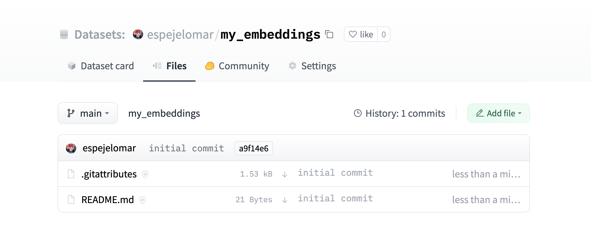

<h1>
    Embedding-as-a-Service using Sentence Transformers, the Hugging Face Inference API, and 🤗Datasets
</h1>

<div class="blog-metadata">
    <small>Published June 16, 2022.</small>
    <a target="_blank" class="btn no-underline text-sm mb-5 font-sans" href="https://github.com/huggingface/blog/blob/main/st-inference-api.md">
        Update on GitHub
    </a>
</div>

<div class="author-card">
    <a href="/espejelomar"> 
        
        <div class="bfc">
            <code>espejelomar</code>
            <span class="fullname">Omar Espejel</span>
        </div>
    </a>
</div>

## Embeddings as a nerve center for industrial applications

> "[...] once you understand this ML multitool (embedding), you'll be able to build everything from search engines to recommendation systems to chatbots and a whole lot more. You don't have to be a data scientist with ML expertise to use them, nor do you need a huge labeled dataset." - [Dale Markowitz, Google Cloud](https://cloud.google.com/blog/topics/developers-practitioners/meet-ais-multitool-vector-embeddings).

Embeddings are essential for modern machine learning. For references, see Pinecone's "[What are Vector Embeddings](https://www.pinecone.io/learn/vector-embeddings/)", our 101 on [how to use embeddings for semantic search](https://huggingface.co/spaces/sentence-transformers/Sentence_Transformers_for_semantic_search), and [Nima's thread](https://twitter.com/NimaBoscarino/status/1535331680805801984) on recent research. For generating embeddings, we will be using the open-source library called [Sentence Transformers](https://www.sbert.net/index.html) (ST). 

> "ST is a Python framework for state-of-the-art sentence, text, and image embeddings. [...] You can use ST to compute sentence/text embeddings for more than 100 languages. These embeddings can then be compared, e.g., with cosine-similarity to find sentences with similar meanings. This can be useful for semantic textual similarity, semantic search, or paraphrase mining." - [ST documentation](https://www.sbert.net/index.html#sentencetransformers-documentation).

Once a piece of information (a sentence, a document, an image) is embedded, the creativity starts; several interesting industrial applications use embeddings. E.g., Google Search uses embeddings to [match text to text and text to images](https://cloud.google.com/blog/topics/developers-practitioners/meet-ais-multitool-vector-embeddings); Snapchat uses them to "[serve the right ad to the right user at the right time](https://eng.snap.com/machine-learning-snap-ad-ranking)"; and Meta (Facebook) uses it for [their social search](https://research.facebook.com/publications/embedding-based-retrieval-in-facebook-search/).

Today we will create a small Frequently Asked Questions (FAQs) engine: receive a query from a user and identify which FAQ is the most similar. We will use the [US Social Security Medicare FAQs](https://faq.ssa.gov/en-US/topic/?id=CAT-01092).

But first, we need to embed our dataset (other texts use the terms encode and embed interchangeably). The Hugging Face Inference API allows us to embed a dataset using a quick POST call easily.

In a nutshell, we will:
1. Embed Medicare's FAQs using the Hugging Face Inference-API.
2. Upload our embedded questions to the Hugging Face Hub for free hosting.
3. Compare a customer's query to our embedded dataset to identify which is the most similar FAQ in our dataset.

This application is called Semantic Search; I recommend you review our [previous tutorial](https://huggingface.co/spaces/sentence-transformers/Sentence_Transformers_for_semantic_search) to understand the mechanism behind this task better. 

## 1. Using the Hugging Face Inference API to embed our dataset

First, select the model you will use. We can choose a model from the [Sentence Transformers library](https://huggingface.co/sentence-transformers). In this case, we use ["sentence-transformers/all-MiniLM-L6-v2"](https://huggingface.co/sentence-transformers/all-MiniLM-L6-v2). In the Python code below, we will store the model id in the `model_id` variable.

Log in to the Hugging Face Hub. You must create a write token in your [Account Settings](http://hf.co/settings/tokens). We will store our write token in `hf_token`.

```py
model_id = "sentence-transformers/all-MiniLM-L6-v2"
hf_token = "get your token in http://hf.co/settings/tokens"
```
To generate our embeddings we use the `https://api-inference.huggingface.co/pipeline/feature-extraction/{model_id}` endpoint with the headers `{"Authorization": f"Bearer {hf_token}"}`. We define a function that would receive a dictionary with our texts and return a list with our embeddings.

```py
import requests
from typing import Dict

api_url = f"https://api-inference.huggingface.co/pipeline/feature-extraction/{model_id}"
headers = {"Authorization": f"Bearer {hf_token}"}

def query(texts: Dict):
    response = requests.post(api_url, headers=headers, json=texts)
    return response.json()
```

The current API does not enforce strict rate limitations. Instead, Hugging Face balances the loads evenly between all our available resources and favors steady flows of requests. If you need to embed several texts or images, the [Hugging Face Accelerated Inference API](https://huggingface.co/docs/api-inference/index) would speed the inference and let you choose between using a CPU or GPU. 

```py
texts = ["How do I get a replacement Medicare card?",
        "What is the monthly premium for Medicare Part B?",
        "How do I terminate my Medicare Part B (medical insurance)?",
        "How do I sign up for Medicare?",
        "Can I sign up for Medicare Part B if I am working and have health insurance through an employer?",
        "How do I sign up for Medicare Part B if I already have Part A?",
        "What are Medicare late enrollment penalties?",
        "What is Medicare and who can get it?",
        "How can I get help with my Medicare Part A and Part B premiums?",
        "What are the different parts of Medicare?",
        "Will my Medicare premiums be higher because of my higher income?",
        "What is TRICARE ?",
        "Should I sign up for Medicare Part B if I have Veterans' Benefits?"]

output = query(dict(inputs = texts))
```
As of June 2022, it may take a while (approximately 20 seconds) for the API to return your embeddings. If on the first try `output = query(dict(inputs = texts))` doesn't work, wait a bit and try again.

We get back a list of lists. Each list contains the embedding of an FAQ. Our model, ["sentence-transformers/all-MiniLM-L6-v2"](https://huggingface.co/sentence-transformers/all-MiniLM-L6-v2), is encoding the input questions to 13 embeddings of size 384 each. Let's convert the list to a Pandas `DataFrame` of shape (13,384).

```py
import pandas as pd
embeddings = pd.DataFrame(output)
```
It looks similar to this matrix:

```py
[[-0.02388945  0.05525852 -0.01165488 ...  0.00577787  0.03409787  -0.0068891 ]
 [-0.0126876   0.04687412 -0.01050217 ... -0.02310316 -0.00278466   0.01047371]
 [ 0.00049438  0.11941205  0.00522949 ...  0.01687654 -0.02386115   0.00526433]
 ...
 [-0.03900796 -0.01060951 -0.00738271 ... -0.08390449  0.03768405   0.00231361]
 [-0.09598278 -0.06301168 -0.11690582 ...  0.00549841  0.1528919   0.02472013]
 [-0.01162949  0.05961934  0.01650903 ... -0.02821241 -0.00116556   0.0010672 ]]
```

## 2. Host your embedded dataset for free on the Hugging Face Hub

🤗Datasets is a library for quickly accessing and sharing datasets. We will host our embeddings dataset in the Hub using the terminal. Then we can load it with a single line of code. The Datasets documentation is practical on the steps to share and load. Let's follow the steps of the [Share doc](https://huggingface.co/docs/datasets/share). Alternatively, it is possible to load the dataset using the Hub UI. First click on your user in the top right corner, then create the dataset with "New dataset". Once the repository is created, go to the "Files" tab (screenshot below) and click "Add file". Finally, drag or upload the dataset.



We will now see how to use the terminal to host our dataset. Install the huggingface-hub library with `pip install huggingface-hub`—login into the Hub using a write token from your [Account Settings](http://hf.co/settings/tokens).

```
huggingface-cli login
```
Create a dataset repository. You can add an organization; in this example our embedded FAQ repository id will be `ITESM/embedded_faqs_medicare`. 

```
huggingface-cli repo create embedded_faqs_medicare --type dataset --organization ITESM
```
Clone your repository. Make sure you have [git-lfs installed](https://git-lfs.github.com/). 

```
git lfs install

!git clone https://huggingface.co/datasets/ITESM/embedded_faqs_medicare
```

Now let's host our embedding. See the 🤗Datasets documentation for more information on [how to prepare your files](https://huggingface.co/docs/datasets/share#prepare-your-files). First, we convert our embeddings from a Pandas `DataFrame` to a CSV. You can save your dataset in any way you prefer, e.g., zip or pickle; you don't need to use Pandas or CSV. Since our embeddings file is not large, we can store it in a CSV, which is easily inferred by the `datasets.load_dataset()` function (see the [Datasets documentation](https://huggingface.co/docs/datasets/about_dataset_load#build-and-load)), i.e., we don't need to create a loading script. We will save the embeddings inside our repository `embedded_faqs_medicare`.

```py
embeddings.to_csv("embedded_faqs_medicare/embeddings.csv", index=False)
```

Change directory to `embedded_faqs_medicare`. We track the large data files with `git lfs track`, and add `.gitattributes` and our embeddings. Git-LFS is not required now as our dataset is not large; however, it is a good practice to use it.

```
cd embedded_faqs_medicare/
git lfs track *.csv
git add .gitattributes
git add embeddings.csv
```
Commit and push. You can also upload a loading script, a metadata file, and more. Refer to the [documentation](https://huggingface.co/docs/datasets/share#upload-your-files).

```
git commit -m "First version of the my_embeddings dataset"
git push
```

Now your dataset is hosted on the Hub for free. You (or whoever you want to share the embeddings with) can quickly load them from a terminal with `embeddings = load_dataset("ITESM/embedded_faqs_medicare")`. Let's see how.

## 3. Make a query and get the most similar FAQs

Suppose a Medicare customer asks, "How can Medicare help me?". We will **find** which of our FAQs could best answer our user query. 

We will use the same query function we defined before to embed the customer's question and convert it to a NumPy array to operate over it efficiently. 

```py
question = ["How can Medicare help me?"]

output = query(dict(inputs = question))

import numpy as np
query_embeddings = np.asarray(output)
```

Install the 🤗Datasets library with `pip install datasets`. Then load our embedded dataset from the Hugging Face Hub and convert it to a NumPy array. Note that this is not the only way to operate on a `DataSet`; for example, you could use PyTorch, Tensorflow, or ScyPy (refer to the [Documentation](https://huggingface.co/docs/datasets/loading)).

```py
from datasets import load_dataset

faqs_embeddings = load_dataset('ITESM/embedded_faqs_medicare')
np_embeddings = faqs_embeddings["train"].to_pandas().to_numpy()
```

We will use the cosine similarity function to identify which of our FAQs are closest (most similar) to our customer's query. You could also use other functions that measure the distance between two points in a vector space, for example, the dot product.

```py
def cos_sim(query, embedded_dataset):
  return np.matmul(query, np.transpose(embedded_dataset)) / (np.linalg.norm(query) * np.linalg.norm(embedded_dataset))
```
The above function will return how close each of our 13 FAQs is to the customer query. We will informally call the resulting vector `hits`.

```py
hits = cos_sim(query_embeddings, np_embeddings)

print(hits)
```
```py
array([[ 0.01364607,  0.00069707,  0.02375336, -0.00041932, -0.0322302 ,
        -0.02498436,  0.11210787,  0.00566073,  0.01659688,  0.01367002,
         0.0064754 ,  0.00874691, -0.00992617]])
```

Now we define a function to get the indices of the most significant values ​​in our `hits` array; that is, the index of the FAQs in our dataset that are most similar to the customer's query.

```py
def top_faqs(hits_array):
  return np.flip(np.argpartition(hits_array, range(hits_array.size-1))).tolist()[0]

index_top_faqs = top_faqs(hits)
print(index_top_faqs)
```
```py
[6, 2, 8, 9, 0, 11, 10, 7, 1, 3, 12, 5, 4]
```

Finally, we sort our FAQs list, `texts`, that we defined in the first section by `index_top_faqs`.

```py
print([texts[i] for i in index_top_faqs])
```
```py
['How can I get help with my Medicare Part A and Part B premiums?',
 'What is Medicare and who can get it?',
 'How do I sign up for Medicare?',
 'What are the different parts of Medicare?',
 'Will my Medicare premiums be higher because of my higher income?',
 'How do I get a replacement Medicare card?',
 'How do I sign up for Medicare Part B if I already have Part A?',
 'How do I terminate my Medicare Part B (medical insurance)?',
 'Can I sign up for Medicare Part B if I am working and have health insurance through an employer?',
 'What is the monthly premium for Medicare Part B?',
 'Should I sign up for Medicare Part B if I have Veterans' Benefits?',
 'What are Medicare late enrollment penalties?',
 'What is TRICARE ?']
 ```
This list represents the FAQs that most resemble the query. Nice!

## 4. Additional resources!
If you want to know more about the Sentence Transformers library:

- The [Hugging Face Organization](https://huggingface.co/sentence-transformers) for all the new models and instructions on how to download models.
- The [Nils Reimers tweet](https://twitter.com/Nils_Reimers/status/1487014195568775173) comparing Sentence Transformer models with GPT-3 Embeddings. Spoiler alert: the Sentence Transformers are awesome!
- The [Sentence Transformers documentation](https://www.sbert.net/),
- [Nima's thread](https://twitter.com/NimaBoscarino/status/1535331680805801984) on recent research.

Thanks for reading!
