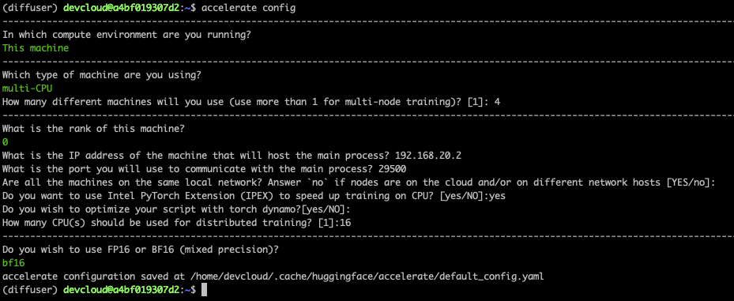
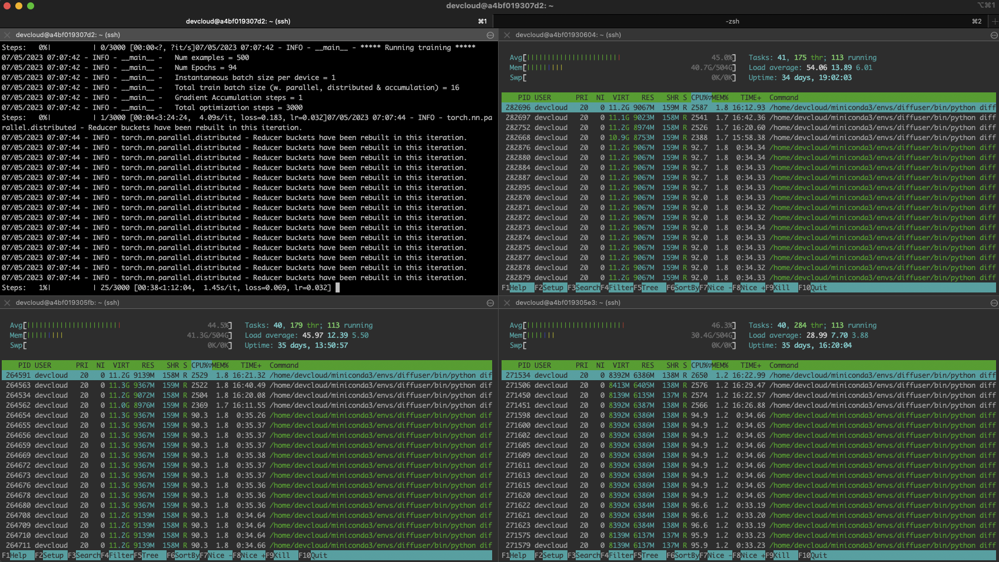

# Fine-tuning Stable Diffusion Models on Intel CPUs


Diffusion models helped popularize generative AI thanks to their uncanny ability to generate photorealistic images from text prompts. These models have now found their way into enterprise use cases like synthetic data generation or content creation. The Hugging Face hub includes over 5,000 pre-trained text-to-image [models](https://huggingface.co/models?pipeline_tag=text-to-image&sort=trending). Combining them with the [Diffusers library](https://huggingface.co/docs/diffusers/index), it's never been easier to start experimenting and building image generation workflows.

Like Transformer models, you can fine-tune Diffusion models to help them generate content that matches your business needs. Initially, fine-tuning was only possible on GPU infrastructure, but things are changing! A few months ago, Intel [launched](https://www.intel.com/content/www/us/en/newsroom/news/4th-gen-xeon-scalable-processors-max-series-cpus-gpus.html#gs.2d6cd7) the fourth generation of Xeon CPUs, code-named Sapphire Rapids. Sapphire Rapids introduces the Intel Advanced Matrix Extensions (AMX), a new hardware accelerator for deep learning workloads. We've already demonstrated the benefits of AMX in several blog posts: [fine-tuning NLP Transformers](https://huggingface.co/blog/intel-sapphire-rapids), [inference with NLP Transformers](https://huggingface.co/blog/intel-sapphire-rapids-inference), and [inference with Stable Diffusion models](https://huggingface.co/blog/stable-diffusion-inference-intel). 

This post will show you how to fine-tune a Stable Diffusion model on an Intel Sapphire Rapids CPU cluster. We will use [textual inversion](https://huggingface.co/docs/diffusers/training/text_inversion), a technique that only requires a small number of example images. We'll use only five!

Let's get started.

## Setting up the cluster

Our friends at [Intel](https://huggingface.co/intel) provided four servers hosted on the [Intel Developer Cloud](https://www.intel.com/content/www/us/en/developer/tools/devcloud/services.html) (IDC), a service platform for developing and running workloads in Intel®-optimized deployment environments with the latest Intel processors and [performance-optimized software stacks](https://www.intel.com/content/www/us/en/developer/topic-technology/artificial-intelligence/overview.html). 

Each server is powered by two Intel Sapphire Rapids CPUs with 56 physical cores and 112 threads. Here's the output of `lscpu`:

```
Architecture:            x86_64
  CPU op-mode(s):        32-bit, 64-bit
  Address sizes:         52 bits physical, 57 bits virtual
  Byte Order:            Little Endian
CPU(s):                  224
  On-line CPU(s) list:   0-223
Vendor ID:               GenuineIntel
  Model name:            Intel(R) Xeon(R) Platinum 8480+
    CPU family:          6
    Model:               143
    Thread(s) per core:  2
    Core(s) per socket:  56
    Socket(s):           2
    Stepping:            8
    CPU max MHz:         3800.0000
    CPU min MHz:         800.0000
    BogoMIPS:            4000.00
    Flags:               fpu vme de pse tsc msr pae mce cx8 apic sep mtrr pge mca cmov pat pse36 clflush dts acpi mmx fxsr sse sse2 ss ht tm pbe syscall nx pdpe1gb rdtscp lm constant_tsc art arch_per fmon pebs bts rep_good nopl xtopology nonstop_tsc cpuid aperfmperf tsc_known_freq pni pclmulqdq dtes64 monitor ds_cpl vmx smx est tm2 ssse3 sdbg fma cx16 xtpr pdcm pcid dca sse4_1 sse4_2 x2apic movbe popcnt tsc_deadline_timer aes xsave avx f16c rdrand lahf_lm abm 3dnowprefetch cpuid_fault epb cat_l3 cat_l2 cdp_l3 invpcid_single intel_ppin cdp_l2 ssbd mba ibrs ibpb stibp ibrs_enhanced tpr_shadow vnmi flexpriority ept vpid ept_ad fsgsbase tsc_adjust bmi1 avx2 smep bmi2 erms invpcid cqm rdt_a avx512f avx512dq rdseed adx smap avx512ifma clflushopt clwb intel_pt avx512cd sha_ni avx512bw avx512vl xsaveopt xsavec xgetbv1 xsaves cqm_llc cqm_occup_llc cqm_mbm_total cqm_mbm_local split_lock_detect avx_vnni avx512_bf16 wbnoinvd dtherm ida arat pln pts hwp hwp_act_window hwp_epp hwp_pkg_req avx512vbmi umip pku ospke waitpkg avx512_vbmi2 gfni vaes vpclmulqdq avx512_vnni avx512_bitalg tme avx512_vpopcntdq la57 rdpid bus_lock_detect cldemote movdiri movdir64b enqcmd fsrm md_clear serialize tsxldtrk pconfig arch_lbr amx_bf16 avx512_fp16 amx_tile amx_int8 flush_l1d arch_capabilities
```

Let's first list the IP addresses of our servers in `nodefile.` The first line refers to the primary server.

```
cat << EOF > nodefile
192.168.20.2
192.168.21.2
192.168.22.2
192.168.23.2
EOF
```

Distributed training requires password-less `ssh` between the primary and other nodes. Here's a good [article](https://www.redhat.com/sysadmin/passwordless-ssh) on how to do this if you're unfamiliar with the process.

Next, we create a new environment on each node and install the software dependencies. We notably install two Intel libraries: [oneCCL](https://github.com/oneapi-src/oneCCL), to manage distributed communication and the [Intel Extension for PyTorch](https://github.com/intel/intel-extension-for-pytorch) (IPEX) to leverage the hardware acceleration features present in Sapphire Rapids. We also add `gperftools` to install `libtcmalloc,` a high-performance memory allocation library. 

```
conda create -n diffuser python==3.9
conda activate diffuser
pip3 install torch torchvision torchaudio --index-url https://download.pytorch.org/whl/cpu
pip3 install transformers accelerate==0.19.0
pip3 install oneccl_bind_pt -f https://developer.intel.com/ipex-whl-stable-cpu
pip3 install intel_extension_for_pytorch
conda install gperftools -c conda-forge -y
```

Next, we clone the [diffusers](https://github.com/huggingface/diffusers/) repository on each node and install it from source.

```
git clone https://github.com/huggingface/diffusers.git
cd diffusers
pip install .
```

Next, we add IPEX to the fine-tuning script in `diffusers/examples/textual_inversion`. We import IPEX and optimize the U-Net and Variable Auto Encoder models. Please make sure this is applied to all nodes.

```
diff --git a/examples/textual_inversion/textual_inversion.py b/examples/textual_inversion/textual_inversion.py
index 4a193abc..91c2edd1 100644
--- a/examples/textual_inversion/textual_inversion.py
+++ b/examples/textual_inversion/textual_inversion.py
@@ -765,6 +765,10 @@ def main():
     unet.to(accelerator.device, dtype=weight_dtype)
     vae.to(accelerator.device, dtype=weight_dtype)

+    import intel_extension_for_pytorch as ipex
+    unet = ipex.optimize(unet, dtype=weight_dtype)
+    vae = ipex.optimize(vae, dtype=weight_dtype)
+
     # We need to recalculate our total training steps as the size of the training dataloader may have changed.
     num_update_steps_per_epoch = math.ceil(len(train_dataloader) / args.gradient_accumulation_steps)
     if overrode_max_train_steps:
```

The last step is downloading the [training images](https://huggingface.co/sd-concepts-library/dicoo). Ideally, we'd use a shared NFS folder, but for the sake of simplicity, we'll download the images on each node. Please ensure they're in the same directory on all nodes (`/home/devcloud/dicoo`).

```
mkdir /home/devcloud/dicoo
cd /home/devcloud/dicoo
wget https://huggingface.co/sd-concepts-library/dicoo/resolve/main/concept_images/0.jpeg
wget https://huggingface.co/sd-concepts-library/dicoo/resolve/main/concept_images/1.jpeg
wget https://huggingface.co/sd-concepts-library/dicoo/resolve/main/concept_images/2.jpeg
wget https://huggingface.co/sd-concepts-library/dicoo/resolve/main/concept_images/3.jpeg
wget https://huggingface.co/sd-concepts-library/dicoo/resolve/main/concept_images/4.jpeg
```

Here are the images:


The system setup is now complete. Let's configure the training job.

## Configuring the fine-tuning job

The [Accelerate](https://huggingface.co/docs/accelerate/index) library makes it very easy to run distributed training. We need to run it on each node and answer simple questions.

Here's a screenshot for the primary node. On the other nodes, you need to set the rank to 1, 2, and 3. All other answers are identical.

<kbd>
  
</kbd>

Finally, we need to set the environment on the primary node. It will be propagated to other nodes as the fine-tuning job starts. The first line sets the name of the network interface connected to the local network where all nodes run. You may need to adapt this using`ifconfig` to get the appropriate information.

```
export I_MPI_HYDRA_IFACE=ens786f1
oneccl_bindings_for_pytorch_path=$(python -c "from oneccl_bindings_for_pytorch import cwd; print(cwd)")
source $oneccl_bindings_for_pytorch_path/env/setvars.sh
export LD_PRELOAD=${LD_PRELOAD}:${CONDA_PREFIX}/lib/libiomp5.so
export LD_PRELOAD=${LD_PRELOAD}:${CONDA_PREFIX}/lib/libtcmalloc.so
export CCL_ATL_TRANSPORT=ofi
export CCL_WORKER_COUNT=1

export MODEL_NAME="runwayml/stable-diffusion-v1-5"
export DATA_DIR="/home/devcloud/dicoo"
```

We can now launch the fine-tuning job.

## Fine-tuning the model

We launch the fine-tuning job with `mpirun`, which sets up distributed communication across the nodes listed in `nodefile`. We'll run 16 tasks (`-n`) with four tasks per node (`-ppn`). `Accelerate` automatically sets up distributed training across all tasks.

Here, we train for 200 steps, which should take about five minutes.
```
mpirun -f nodefile -n 16 -ppn 4                                                         \
accelerate launch diffusers/examples/textual_inversion/textual_inversion.py             \
--pretrained_model_name_or_path=$MODEL_NAME --train_data_dir=$DATA_DIR                  \
--learnable_property="object"   --placeholder_token="<dicoo>" --initializer_token="toy" \
--resolution=512  --train_batch_size=1  --seed=7  --gradient_accumulation_steps=1       \
--max_train_steps=200 --learning_rate=2.0e-03 --scale_lr --lr_scheduler="constant"     \
--lr_warmup_steps=0 --output_dir=./textual_inversion_output --mixed_precision bf16      \
--save_as_full_pipeline
```

Here's a screenshot of the busy cluster:

<kbd>
  
</kbd>

## Troubleshooting

Distributed training can be tricky, especially if you're new to the discipline. A minor misconfiguration on a single node is the most likely issue: missing dependency, images stored in a different location, etc. 

You can quickly pinpoint the troublemaker by logging in to each node and training locally. First, set the same environment as on the primary node, then run:

```
python diffusers/examples/textual_inversion/textual_inversion.py                        \
--pretrained_model_name_or_path=$MODEL_NAME --train_data_dir=$DATA_DIR                  \
--learnable_property="object"   --placeholder_token="<dicoo>" --initializer_token="toy" \
--resolution=512  --train_batch_size=1  --seed=7  --gradient_accumulation_steps=1       \
--max_train_steps=200 --learning_rate=2.0e-03 --scale_lr --lr_scheduler="constant"     \
--lr_warmup_steps=0 --output_dir=./textual_inversion_output --mixed_precision bf16      \
--save_as_full_pipeline
```

If training starts successfully, stop it and move to the next node. If training starts successfully on all nodes, return to the primary node and double-check the node file, the environment, and the `mpirun` command. Don't worry; you'll find the problem :)

## Generating images with the fine-tuned model

After 5 minutes training, the model is saved locally. We could load it with a vanilla `diffusers` pipeline and predict. Instead, let's use [Optimum Intel and OpenVINO](https://huggingface.co/docs/optimum/intel/inference) to optimize the model. As discussed in a [previous post](https://huggingface.co/blog/intel-sapphire-rapids-inference), this lets you generate an image on a single CPU in less than 5 seconds!

```
pip install optimum[openvino]
```

Here, we load the model, optimize it for a static shape, and save it:

```
from optimum.intel.openvino import OVStableDiffusionPipeline

model_id = "./textual_inversion_output"

ov_pipe = OVStableDiffusionPipeline.from_pretrained(model_id, export=True)
ov_pipe.reshape(batch_size=5, height=512, width=512, num_images_per_prompt=1)
ov_pipe.save_pretrained("./textual_inversion_output_ov")
```

Then, we load the optimized model, generate five different images and save them:

```
from optimum.intel.openvino import OVStableDiffusionPipeline

model_id = "./textual_inversion_output_ov"

ov_pipe = OVStableDiffusionPipeline.from_pretrained(model_id, num_inference_steps=20)
prompt = ["a yellow <dicoo> robot at the beach, high quality"]*5
images = ov_pipe(prompt).images
print(images)
for idx,img in enumerate(images):
    img.save(f"image{idx}.png")
```

Here's a generated image. It is impressive that the model only needed five images to learn that dicoos have glasses!

<kbd>
  
</kbd>

If you'd like, you can fine-tune the model some more. Here's a lovely example generated by a 3,000-step model (about an hour of training). 

<kbd>
  
</kbd>

## Conclusion

Thanks to Hugging Face and Intel, you can now use Xeon CPU servers to generate high-quality images adapted to your business needs.  They are generally more affordable and widely available than specialized hardware such as GPUs. Xeon CPUs can also be easily repurposed for other production tasks, from web servers to databases, making them a versatile and flexible choice for your IT infrastructure.

Here are some resources to help you get started:

* Diffusers [documentation](https://huggingface.co/docs/diffusers)
* Optimum Intel [documentation](https://huggingface.co/docs/optimum/main/en/intel/inference)
* [Intel IPEX](https://github.com/intel/intel-extension-for-pytorch) on GitHub
* [Developer resources](https://www.intel.com/content/www/us/en/developer/partner/hugging-face.html) from Intel and Hugging Face.
* Sapphire Rapids servers on [Intel Developer Cloud](https://www.intel.com/content/www/us/en/developer/tools/devcloud/services.html), [AWS](https://aws.amazon.com/about-aws/whats-new/2022/11/introducing-amazon-ec2-r7iz-instances/?nc1=h_ls) and [GCP](https://cloud.google.com/blog/products/compute/c3-machine-series-on-intel-sapphire-rapids-now-ga).

If you have questions or feedback, we'd love to read them on the [Hugging Face forum](https://discuss.huggingface.co/).

Thanks for reading!


 
 
