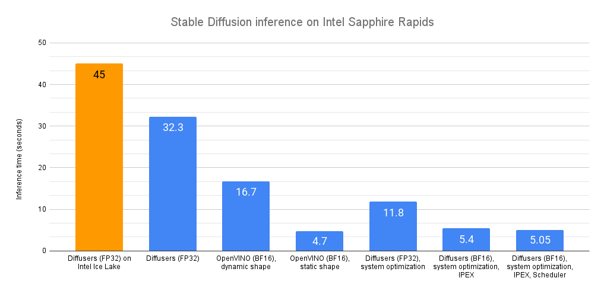

# Accelerating Stable Diffusion Inference on Intel CPUs


Recently, we introduced the latest generation of [Intel Xeon](https://www.intel.com/content/www/us/en/products/details/processors/xeon/scalable.html) CPUs (code name Sapphire Rapids), its new hardware features for deep learning acceleration, and how to use them to accelerate [distributed fine-tuning](https://huggingface.co/blog/intel-sapphire-rapids) and [inference](https://huggingface.co/blog/intel-sapphire-rapids-inference) for natural language processing Transformers.

In this post, we're going to show you different techniques to accelerate Stable Diffusion models on Sapphire Rapids CPUs. A follow-up post will do the same for distributed fine-tuning.

At the time of writing, the simplest way to get your hands on a Sapphire Rapids server is to use the Amazon EC2 [R7iz](https://aws.amazon.com/ec2/instance-types/r7iz/) instance family. As it's still in preview, you have to [sign up](https://pages.awscloud.com/R7iz-Preview.html) to get access. Like in previous posts, I'm using an `r7iz.metal-16xl` instance (64 vCPU, 512GB RAM) with an Ubuntu 20.04 AMI (`ami-07cd3e6c4915b2d18`).

Let's get started! Code samples are available on [Gitlab](https://gitlab.com/juliensimon/huggingface-demos/-/tree/main/optimum/stable_diffusion_intel).

## The Diffusers library

The [Diffusers](https://huggingface.co/docs/diffusers/index) library makes it extremely simple to generate images with Stable Diffusion models. If you're not familiar with these models, here's a great [illustrated introduction](https://jalammar.github.io/illustrated-stable-diffusion/).

First, let's create a virtual environment with the required libraries: Transformers, Diffusers, Accelerate, and PyTorch.

```
virtualenv sd_inference
source sd_inference/bin/activate
pip install pip --upgrade
pip install transformers diffusers accelerate torch==1.13.1
```

Then, we write a simple benchmarking function that repeatedly runs inference, and returns the average latency for a single-image generation.

```python
import time

def elapsed_time(pipeline, prompt, nb_pass=10, num_inference_steps=20):
	# warmup
	images = pipeline(prompt, num_inference_steps=10).images
	start = time.time()
	for _ in range(nb_pass):
		_ = pipeline(prompt, num_inference_steps=num_inference_steps, output_type="np")
	end = time.time()
	return (end - start) / nb_pass
```

Now, let's build a `StableDiffusionPipeline` with the default `float32` data type, and measure its inference latency.

```python
from diffusers import StableDiffusionPipeline

model_id = "runwayml/stable-diffusion-v1-5"
pipe = StableDiffusionPipeline.from_pretrained(model_id)
prompt = "sailing ship in storm by Rembrandt"
latency = elapsed_time(pipe, prompt)
print(latency)
```

The average latency is **32.3 seconds**. As demonstrated by this [Intel Space](https://huggingface.co/spaces/Intel/Stable-Diffusion-Side-by-Side), the same code runs on a previous generation Intel Xeon (code name Ice Lake) in about 45 seconds. 

Out of the box, we can see that Sapphire Rapids CPUs are quite faster without any code change!

Now, let's accelerate!

## Optimum Intel and OpenVINO

[Optimum Intel](https://huggingface.co/docs/optimum/intel/index) accelerates end-to-end pipelines on Intel architectures. Its API is extremely similar to the vanilla [Diffusers](https://huggingface.co/docs/diffusers/index) API, making it trivial to adapt existing code.

Optimum Intel supports [OpenVINO](https://docs.openvino.ai/latest/index.html), an Intel open-source toolkit for high-performance inference. 

Optimum Intel and OpenVINO can be installed as follows:

```
pip install optimum[openvino]
```

Starting from the code above, we only need to replace `StableDiffusionPipeline` with `OVStableDiffusionPipeline`. To load a PyTorch model and convert it to the OpenVINO format on-the-fly, you can set `export=True` when loading your model.

```python
from optimum.intel.openvino import OVStableDiffusionPipeline
...
ov_pipe = OVStableDiffusionPipeline.from_pretrained(model_id, export=True)
latency = elapsed_time(ov_pipe, prompt)
print(latency)

# Don't forget to save the exported model
ov_pipe.save_pretrained("./openvino")
```

OpenVINO automatically optimizes the model for the `bfloat16` format. Thanks to this, the average latency is now **16.7 seconds**, a sweet 2x speedup.

The pipeline above support dynamic input shapes, with no restriction on the number of images or their resolution. With Stable Diffusion, your application is usually restricted to one (or a few) different output resolutions, such as 512x512, or 256x256. Thus, it makes a lot of sense to unlock significant acceleration by reshaping the pipeline to a fixed resolution. If you need more than one output resolution, you can simply maintain a few pipeline instances, one for each resolution.

```python
ov_pipe.reshape(batch_size=1, height=512, width=512, num_images_per_prompt=1)
latency = elapsed_time(ov_pipe, prompt)
```

With a static shape, average latency is slashed to **4.7 seconds**, an additional 3.5x speedup. 

As you can see, OpenVINO is a simple and efficient way to accelerate Stable Diffusion inference. When combined with a Sapphire Rapids CPU, it delivers almost 10x speedup compared to vanilla inference on Ice Lake Xeons.

If you can't or don't want to use OpenVINO, the rest of this post will show you a series of other optimization techniques. Fasten your seatbelt!

## System-level optimization

Diffuser models are large multi-gigabyte models, and image generation is a memory-intensive operation. By installing a high-performance memory allocation library, we should be able to speed up memory operations and parallelize them across the Xeon cores.    Please note that this will change the default memory allocation library on your system. Of course, you can go back to the default library by uninstalling the new one.

[jemalloc](https://jemalloc.net/) and [tcmalloc](https://github.com/gperftools/gperftools) are equally interesting. Here, I'm installing `jemalloc` as my tests give it a slight performance edge. It can also be tweaked for a particular workload, for example to maximize CPU utilization. You can refer to the [tuning guide](https://github.com/jemalloc/jemalloc/blob/dev/TUNING.md) for details.

```
sudo apt-get install -y libjemalloc-dev
export LD_PRELOAD=$LD_PRELOAD:/usr/lib/x86_64-linux-gnu/libjemalloc.so
export MALLOC_CONF="oversize_threshold:1,background_thread:true,metadata_thp:auto,dirty_decay_ms: 60000,muzzy_decay_ms:60000"
```

Next, we install the `libiomp` library to optimize parallel processing. It's part of [Intel OpenMP* Runtime](https://www.intel.com/content/www/us/en/docs/cpp-compiler/developer-guide-reference/2021-8/openmp-run-time-library-routines.html).

```
sudo apt-get install intel-mkl
export LD_PRELOAD=$LD_PRELOAD:/usr/lib/x86_64-linux-gnu/libiomp5.so
export OMP_NUM_THREADS=32
```

Finally, we install the [numactl](https://github.com/numactl/numactl) command line tool. This lets us pin our Python process to specific cores, and avoid some of the overhead related to context switching. 

```
numactl -C 0-31 python sd_blog_1.py
```

Thanks to these optimizations, our original Diffusers code now predicts in **11.8 seconds**. That's almost 3x faster, without any code change. These tools are certainly working great on our 32-core Xeon.

We're far from done. Let's add the Intel Extension for PyTorch to the mix.

## IPEX and BF16

The [Intel Extension for Pytorch](https://intel.github.io/intel-extension-for-pytorch/) (IPEX) extends PyTorch and takes advantage of hardware acceleration features present on Intel CPUs, such as [AVX-512](https://en.wikipedia.org/wiki/AVX-512) Vector Neural Network Instructions (AVX512 VNNI) and [Advanced Matrix Extensions](https://en.wikipedia.org/wiki/Advanced_Matrix_Extensions) (AMX).

Let's install it.

```
pip install intel_extension_for_pytorch==1.13.100
```

We then update our code to optimize each pipeline element with IPEX (you can list them by printing the `pipe` object). This requires converting them to the channels-last format.

```python
import torch
import intel_extension_for_pytorch as ipex
...
pipe = StableDiffusionPipeline.from_pretrained(model_id)

# to channels last
pipe.unet = pipe.unet.to(memory_format=torch.channels_last)
pipe.vae = pipe.vae.to(memory_format=torch.channels_last)
pipe.text_encoder = pipe.text_encoder.to(memory_format=torch.channels_last)
pipe.safety_checker = pipe.safety_checker.to(memory_format=torch.channels_last)

# Create random input to enable JIT compilation
sample = torch.randn(2,4,64,64)
timestep = torch.rand(1)*999
encoder_hidden_status = torch.randn(2,77,768)
input_example = (sample, timestep, encoder_hidden_status)

# optimize with IPEX
pipe.unet = ipex.optimize(pipe.unet.eval(), dtype=torch.bfloat16, inplace=True, sample_input=input_example)
pipe.vae = ipex.optimize(pipe.vae.eval(), dtype=torch.bfloat16, inplace=True)
pipe.text_encoder = ipex.optimize(pipe.text_encoder.eval(), dtype=torch.bfloat16, inplace=True)
pipe.safety_checker = ipex.optimize(pipe.safety_checker.eval(), dtype=torch.bfloat16, inplace=True)
```

We also enable the `bloat16` data format to leverage the AMX tile matrix multiply unit (TMMU) accelerator present on Sapphire Rapids CPUs.

```python
with torch.cpu.amp.autocast(enabled=True, dtype=torch.bfloat16):
    latency = elapsed_time(pipe, prompt)
    print(latency)
```

With this updated version, inference latency is further reduced from 11.9 seconds to **5.4 seconds**. That's more than 2x acceleration thanks to IPEX and AMX.

Can we extract a bit more performance? Yes, with schedulers!

## Schedulers 

The Diffusers library lets us attach a [scheduler](https://huggingface.co/docs/diffusers/using-diffusers/schedulers) to a Stable Diffusion pipeline. Schedulers try to find the best trade-off between denoising speed and denoising quality.

According to the documentation: "*At the time of writing this doc DPMSolverMultistepScheduler gives arguably the best speed/quality trade-off and can be run with as little as 20 steps.*"

Let's try it.

```python
from diffusers import StableDiffusionPipeline, DPMSolverMultistepScheduler
...
dpm = DPMSolverMultistepScheduler.from_pretrained(model_id, subfolder="scheduler")
pipe = StableDiffusionPipeline.from_pretrained(model_id, scheduler=dpm)
```

With this final version, inference latency is now down to **5.05 seconds**. Compared to our initial Sapphire Rapids baseline (32.3 seconds), this is almost 6.5x faster!

<kbd>
  
</kbd>
*Environment: Amazon EC2 r7iz.metal-16xl, Ubuntu 20.04, Linux 5.15.0-1031-aws, libjemalloc-dev 5.2.1-1, intel-mkl 2020.0.166-1, PyTorch 1.13.1, Intel Extension for PyTorch 1.13.1, transformers 4.27.2, diffusers 0.14, accelerate 0.17.1, openvino 2023.0.0.dev20230217, optimum 1.7.1, optimum-intel 1.7*


## Conclusion

The ability to generate high-quality images in seconds should work well for a lot of use cases, such as customer apps, content generation for marketing and media, or synthetic data for dataset augmentation.

Here are some resources to help you get started:

* Diffusers [documentation](https://huggingface.co/docs/diffusers)
* Optimum Intel [documentation](https://huggingface.co/docs/optimum/main/en/intel/inference)
* [Intel IPEX](https://github.com/intel/intel-extension-for-pytorch) on GitHub
* [Developer resources](https://www.intel.com/content/www/us/en/developer/partner/hugging-face.html) from Intel and Hugging Face. 

If you have questions or feedback, we'd love to read them on the [Hugging Face forum](https://discuss.huggingface.co/).

Thanks for reading!


 
