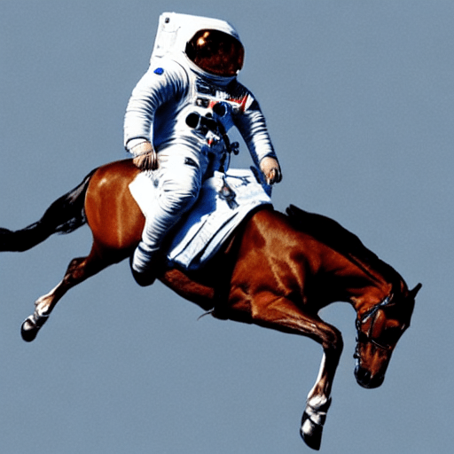
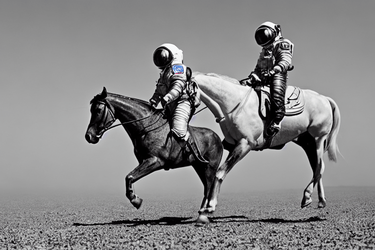

<h1>
	Stable Diffusion with 🧨 Diffusers
</h1>

<div class="blog-metadata">
    <small>Published August 22nd, 2022.</small>
    <a target="_blank" class="btn no-underline text-sm mb-5 font-sans" href="https://github.com/huggingface/blog/blob/master/stable_diffusion.md">
        Update on GitHub
    </a>
</div>

<div class="author-card">
    <a href="/valhalla">
        
        <div class="bfc">
            <code>valhalla</code>
            <span class="fullname">Suraj Patil</span>
        </div>
    </a>
	 <a href="/pcuenq">
        
        <div class="bfc">
            <code>pcuenq</code>
            <span class="fullname">Pedro Cuenca</span>
        </div>
    </a>
	 <a href="/natolambert">
        
        <div class="bfc">
            <code>natolambert</code>
            <span class="fullname">Nathan Lambert</span>
        </div>
    </a>
    <a href="/patrickvonplaten">
        
        <div class="bfc">
            <code>patrickvonplaten</code>
            <span class="fullname">Patrick von Platen</span>
        </div>
    </a>
</div>

<a target="_blank" href="https://colab.research.google.com/github/huggingface/notebooks/blob/main/diffusers/stable_diffusion.ipynb">
    
</a>

# **Stable Diffusion** 🎨 
*...using 🧨 Diffusers*

Stable Diffusion is a text-to-image latent diffusion model created by the researchers and engineers from [CompVis](https://github.com/CompVis), [Stability AI](https://stability.ai/) and [LAION](https://laion.ai/). 
It is trained on 512x512 images from a subset of the [LAION-5B](https://laion.ai/blog/laion-5b/) database.
*LAION-5B* is the largest, freely accessible multi-modal dataset that currently exists.

In this post, we want to show how to use Stable Diffusion with the [🧨 Diffusers library](https://github.com/huggingface/diffusers), explain how the model works and finally dive a bit deeper into how `diffusers` allows
one to customize the image generation pipeline.

**Note**: It is highly recommended to have a basic understanding of how diffusion models work. If diffusion 
models are completely new to you, we recommend reading one of the following blog posts:
- [The Annotated Diffusion Model](https://huggingface.co/blog/annotated-diffusion)
- [Getting started with 🧨 Diffusers](https://colab.research.google.com/github/huggingface/notebooks/blob/main/diffusers/diffusers_intro.ipynb)

Now, let's get started by generating some images 🎨.

## Running Stable Diffusion

First, you should install `diffusers==0.2.3` to run the following code snippets:

```bash
pip install diffusers==0.2.3
```

You also need to accept the model license before downloading or using the weights. In this post we'll use model version `v1-4`, so you'll need to  visit [its card](https://huggingface.co/CompVis/stable-diffusion-v1-4), read the license and tick the checkbox if you agree. You have to be a registered user in 🤗 Hugging Face Hub, and you'll also need to use an access token for the code to work. For more information on access tokens, please refer to [this section of the documentation](https://huggingface.co/docs/hub/security-tokens).
Once you have requested access, make sure to pass your user token as:

```py
YOUR_TOKEN="/your/huggingface/hub/token"
```

After that one-time setup out of the way, we can proceed with Stable Diffusion inference.

The Stable Diffusion model can be run in inference with just a couple of lines using the [`StableDiffusionPipeline`](https://github.com/huggingface/diffusers/blob/main/src/diffusers/pipelines/stable_diffusion/pipeline_stable_diffusion.py) pipeline. The pipeline sets up everything you need to generate images from text with 
a simple `from_pretrained` function call.

```python
from diffusers import StableDiffusionPipeline

# get your token at https://huggingface.co/settings/tokens
pipe = StableDiffusionPipeline.from_pretrained("CompVis/stable-diffusion-v1-4", use_auth_token=YOUR_TOKEN)
```

If a GPU is available, let's move it to one!

```python
pipe.to("cuda")
```

To run the pipeline, simply define the prompt and call `pipe`:

```python
prompt = "a photograph of an astronaut riding a horse"

image = pipe(prompt)["sample"][0]

# you can save the image with
# image.save(f"astronaut_rides_horse.png")
```

The result would look as follows


    

The previous code will give you a different image every time you run it.

If at some point you get a black image, it may be because the content filter built inside the model might have detected an NSFW result. 
If you believe this shouldn't be the case, try tweaking your prompt or using a different seed. In fact, the model predictions include information about whether NSFW was detected for a particular result. Let's see what they look like:

```python
result = pipe(prompt)
print(result)
```

```json
{
    'sample': [<PIL.Image.Image image mode=RGB size=512x512>],
    'nsfw_content_detected': [False]
}
```

If you want deterministic output you can seed a random seed and pass a generator to the pipeline. 
Every time you use a generator with the same seed you'll get the same image output.


```python
import torch

generator = torch.Generator("cuda").manual_seed(1024)
image = pipe(prompt, guidance_scale=7.5, generator=generator)["sample"][0]

# you can save the image with
# image.save(f"astronaut_rides_horse.png")
```

The result would look as follows




You can change the number of inference steps using the `num_inference_steps` argument. 

In general, results are better the more steps you use, however the more steps, the longer the generation takes.
Stable Diffusion works quite well with a relatively small number of steps, so we recommend to use the default number of inference steps of `50`. 
If you want faster results you can use a smaller number. If you want potentially higher quality results, 
you can use larger numbers.

Let's try out running the pipeline with less denoising steps.

```python
import torch

generator = torch.Generator("cuda").manual_seed(1024)
image = pipe(prompt, guidance_scale=7.5, num_inference_steps=15, generator=generator)["sample"][0]

# you can save the image with
# image.save(f"astronaut_rides_horse.png")
```


Note how the structure is the same, but there are problems in the astronauts suit and the general form of the horse.
This shows that using only 15 denoising steps has significantly degraded the quality of the generation result. As stated earlier `50` denoising steps is usually sufficient to generate high-quality images.

Besides `num_inference_steps`, we've been using another function argument, called `guidance_scale` in all 
previous examples. `guidance_scale` is a way to increase the adherence to the conditional signal that guides the generation (text, in this case) as well as overall sample quality. 
It is also known as [classifier-free guidance](https://arxiv.org/abs/2207.12598), which in simple terms forces the generation to better match the prompt potentially at the cost of image quality or diversity. 
Values between `7` and `8.5` are usually good choices for Stable Diffusion.  By default the pipeline
uses a `guidance_scale` of 7.5.

If you use a very large value the images might look good, but will be less diverse. 
You can learn about the technical details of this parameter in [this section](#how-to-write-your-own-inference-pipeline-with-diffusers) of the post.

Next, let's see how you can generate several images of the same prompt at once. 
First, we'll create an `image_grid` function to help us visualize them nicely in a grid.

```python
from PIL import Image

def image_grid(imgs, rows, cols):
    assert len(imgs) == rows*cols

    w, h = imgs[0].size
    grid = Image.new('RGB', size=(cols*w, rows*h))
    grid_w, grid_h = grid.size
    
    for i, img in enumerate(imgs):
        grid.paste(img, box=(i%cols*w, i//cols*h))
    return grid
```

We can generate multiple images for the same prompt by simply using a list with the same prompt repeated several times. We'll send the list to the pipeline instead of the string we used before.

```python
num_images = 3
prompt = ["a photograph of an astronaut riding a horse"] * num_images

images = pipe(prompt)["sample"]

grid = image_grid(images, rows=1, cols=3)

# you can save the grid with
# grid.save(f"astronaut_rides_horse.png")
```


    

By default, stable diffusion produces images of `512 × 512` pixels. It's very easy to override the default using the `height` and `width` arguments to create rectangular images in portrait or landscape ratios.

When choosing image sizes, we advise the following:
- Make sure `height` and `width` are both multiples of `8`.
- Going below 512 might result in lower quality images.
- Going over 512 in both directions will repeat image areas (global coherence is lost).
- The best way to create non-square images is to use `512` in one dimension, and a value larger than that in the other one.

Let's run an example:

```python
prompt = "a photograph of an astronaut riding a horse"
image = pipe(prompt, height=512, width=768)["sample"][0]

# you can save the image with
# image.save(f"astronaut_rides_horse.png")
```


    

## How does Stable Diffusion work?

Having seen the high-quality images that stable diffusion can produce, let's try to understand 
a bit better how the model functions.

Stable Diffusion is based on a particular type of diffusion model called **Latent Diffusion**, proposed in [High-Resolution Image Synthesis with Latent Diffusion Models](https://arxiv.org/abs/2112.10752).

Generally speaking, diffusion models are machine learning systems that are trained to *denoise* random Gaussian noise step by step, to get to a sample of interest, such as an *image*. For a more detailed overview of how they work, check [this colab](https://colab.research.google.com/github/huggingface/notebooks/blob/main/diffusers/diffusers_intro.ipynb).

Diffusion models have shown to achieve state-of-the-art results for generating image data. But one downside of diffusion models is that the reverse denoising process is slow because of its repeated, sequential nature. In addition, these models consume a lot of memory because they operate in pixel space, which becomes huge when generating high-resolution images. Therefore, it is challenging to train these models and also use them for inference.

<br>

Latent diffusion can reduce the memory and compute complexity by applying the diffusion process over a lower dimensional _latent_ space, instead of using the actual pixel space. This is the key difference between standard diffusion and latent diffusion models: **in latent diffusion the model is trained to generate latent (compressed) representations of the images.** 

There are three main components in latent diffusion.

1. An autoencoder (VAE).
2. A [U-Net](https://colab.research.google.com/github/huggingface/notebooks/blob/main/diffusers/diffusers_intro.ipynb#scrollTo=wW8o1Wp0zRkq).
3. A text-encoder, *e.g.* [CLIP's Text Encoder](https://huggingface.co/docs/transformers/model_doc/clip#transformers.CLIPTextModel).

**1. The autoencoder (VAE)**

The VAE model has two parts, an encoder and a decoder. The encoder is used to convert the image into a low dimensional latent representation, which will serve as the input to the *U-Net* model.
The decoder, conversely, transforms the latent representation back into an image.

 During latent diffusion _training_, the encoder is used to get the latent representations (_latents_) of the images for the forward diffusion process, which applies more and more noise at each step. During _inference_, the denoised latents generated by the reverse diffusion process are converted back into images using the VAE decoder. As we will see during inference we **only need the VAE decoder**.

**2. The U-Net**

The U-Net has an encoder part and a decoder part both comprised of ResNet blocks.
The encoder compresses an image representation into a lower resolution image representation and the decoder decodes the lower resolution image representation back to the original higher resolution image representation that is supposedly less noisy.
More specifically, the U-Net output predicts the noise residual which can be used to compute the predicted denoised image representation.

To prevent the U-Net from loosing important information while downsampling, short-cut connections are usually added between the downsampling ResNets of the encoder to the upsampling ResNets of the decoder.
Additionally, the stable diffusion U-Net is able to condition it's output on text-embeddings via cross-attention layers. The cross-attention layers are added to both the encodre and decoder part of the U-Net usually between ResNet blocks.

**3. The Text-encoder**

The text-encoder is responsible for transforming the input prompt, *e.g.* "An astronout riding a horse" into an embedding space that can be understood by the U-Net. It is usually a simple *transformer-based* encoder that maps a sequence of input tokens to a sequence of latent text-embeddings.

Inspired by [Imagen](https://imagen.research.google/), Stable Diffusion does **not** train the text-encoder during training and simply uses an CLIP's already trained text encoder, [CLIPTextModel](https://huggingface.co/docs/transformers/model_doc/clip#transformers.CLIPTextModel).

**Why is latent diffusion fast and efficient?**

Since latent diffusion operates on a low dimensional space, it greatly reduces the memory and compute requirements compared to pixel-space diffusion models. For example, the autoencoder used in Stable Diffusion has a reduction factor of 8. This means that an image of shape `(3, 512, 512)` becomes `(3, 64, 64)` in latent space, which requires `8 × 8 = 64` times less memory.

This is why it's possible to generate `512 × 512` images so quickly, even on 16GB Colab GPUs!

**Stable Diffusion during inference**

Putting it all together, let's now take a closer look at how the model works in inference by illustrating the logical flow.

<p align="center">

</p>

The stable diffusion model takes both a latent seed and a text prompt as an input. The latent seed is then used to generate random latent image representations of size \\( 64 \times 64 \\) where as the text prompt is transformed to text embeddings of size \\( 77 \times 768 \\) via CLIP's text encoder.

Next the U-Net iteratively *denoises* the random latent image representations while being conditioned on the text embeddings. The output of the U-Net, being the noise residual, is used to computed a denoised latent image representation via a scheduler algorithm. Many different scheduler algorithms can be used for this computation, each having its pro- and cons. For Stable Diffusion, we recommend using one of:

- [PNDM scheduler](https://github.com/huggingface/diffusers/blob/main/src/diffusers/schedulers/scheduling_pndm.py) (used by default)
- [DDIM scheduler](https://github.com/huggingface/diffusers/blob/main/src/diffusers/schedulers/scheduling_ddim.py)
- [K-LMS scheduler](https://github.com/huggingface/diffusers/blob/main/src/diffusers/schedulers/scheduling_lms_discrete.py)

Theory on how the scheduler algorithm function is out-of-scope for this notebook, but in short one should remember that they compute the predicted denoised image representation from the previous noise representation and the predicted noise residual.
For more information, we recommend looking into [Elucidating the Design Space of Diffusion-Based Generative Models](https://arxiv.org/abs/2206.00364)

The *denoising* process is repeated *ca.* 50 times to step-by-step retrieve better latent image representations.
Once complete, the latent image representation is decoded by the decoder part of the variational auto encoder.

After this brief introduction to Latent and Stable Diffusion, let's see how to make advanced use of 🤗 Hugging Face `diffusers` library!

## Writing your own inference pipeline

Finally, we show how you can create custom diffusion pipelines with `diffusers`.
Writing a custom inference pipeline is an advanced use of the `diffusers` library that can be useful to switch out certain components, such as the VAE or scheduler explained above.

For example, we'll show how to use Stable Diffusion with a different scheduler, namely [Katherine Crowson's](https://github.com/crowsonkb) K-LMS scheduler added in [this PR](https://github.com/huggingface/diffusers/pull/185).


The [pre-trained model](https://huggingface.co/CompVis/stable-diffusion-v1-4/tree/main) includes all the components required to setup a complete diffusion pipeline. They are stored in the following folders:
- `text_encoder`: Stable Diffusion uses CLIP, but other diffusion models may use other encoders such as `BERT`.
- `tokenizer`. It must match the one used by the `text_encoder` model.
- `scheduler`: The scheduling algorithm used to progressively add noise to the image during training.
- `unet`: The model used to generate the latent representation of the input.
- `vae`: Autoencoder module that we'll use to decode latent representations into real images.

We can load the components by referring to the folder they were saved, using the `subfolder` argument to `from_pretrained`.


```python
from transformers import CLIPTextModel, CLIPTokenizer
from diffusers import AutoencoderKL, UNet2DConditionModel, PNDMScheduler

# 1. Load the autoencoder model which will be used to decode the latents into image space. 
vae = AutoencoderKL.from_pretrained("CompVis/stable-diffusion-v1-4", subfolder="vae", use_auth_token=YOUR_TOKEN)

# 2. Load the tokenizer and text encoder to tokenize and encode the text. 
tokenizer = CLIPTokenizer.from_pretrained("openai/clip-vit-large-patch14")
text_encoder = CLIPTextModel.from_pretrained("openai/clip-vit-large-patch14")

# 3. The UNet model for generating the latents.
unet = UNet2DConditionModel.from_pretrained("CompVis/stable-diffusion-v1-4", subfolder="unet", use_auth_token=YOUR_TOKEN)
```

Now instead of loading the pre-defined scheduler, we load the [K-LMS scheduler](https://github.com/huggingface/diffusers/blob/71ba8aec55b52a7ba5a1ff1db1265ffdd3c65ea2/src/diffusers/schedulers/scheduling_lms_discrete.py#L26) with some fitting parameters.

```python
from diffusers import LMSDiscreteScheduler

scheduler = LMSDiscreteScheduler(beta_start=0.00085, beta_end=0.012, beta_schedule="scaled_linear", num_train_timesteps=1000)
```

Next, let's move the models to GPU.

```python
from torch import autocast

torch_device = "cuda"
vae.to(torch_device)
text_encoder.to(torch_device)
unet.to(torch_device) 
```

We now define the parameters we'll use to generate images.

Note that `guidance_scale` is defined analog to the guidance weight `w` of equation (2) in the [Imagen paper](https://arxiv.org/pdf/2205.11487.pdf). `guidance_scale == 1` corresponds to doing no classifier-free guidance. Here we set it to 7.5 as also done previously.

In contrast to the previous examples, we set `num_inference_steps` to 100 to get an even more defined image.

```python
prompt = ["a photograph of an astronaut riding a horse"]

height = 512                        # default height of Stable Diffusion
width = 512                         # default width of Stable Diffusion

num_inference_steps = 100           # Number of denoising steps

guidance_scale = 7.5                # Scale for classifier-free guidance

generator = torch.manual_seed(0)    # Seed generator to create the inital latent noise

batch_size = len(prompt)
```

First, we get the `text_embeddings` for the passed prompt. 
These embeddings will be used to condition the UNet model and guide the image generation towards something that should resemble the input prompt.

```python
text_input = tokenizer(prompt, padding="max_length", max_length=tokenizer.model_max_length, truncation=True, return_tensors="pt")

text_embeddings = text_encoder(text_input.input_ids.to(torch_device))[0]
```

We'll also get the unconditional text embeddings for classifier-free guidance, which are just the embeddings for the padding token (empty text). They need to have the same shape as the conditional `text_embeddings` (`batch_size` and `seq_length`)


```python
max_length = text_input.input_ids.shape[-1]
uncond_input = tokenizer(
    [""] * batch_size, padding="max_length", max_length=max_length, return_tensors="pt"
)
uncond_embeddings = text_encoder(uncond_input.input_ids.to(torch_device))[0]   
```

For classifier-free guidance, we need to do two forward passes: one with the conditioned input (`text_embeddings`), and another with the unconditional embeddings (`uncond_embeddings`). In practice, we can concatenate both into a single batch to avoid doing two forward passes.


```python
text_embeddings = torch.cat([uncond_embeddings, text_embeddings])
```

Next, we generate the initial random noise.


```python
latents = torch.randn(
    (batch_size, unet.in_channels, height // 8, width // 8),
    generator=generator,
)
latents = latents.to(torch_device)
```

If we examine the `latents` at this stage we'll see their shape is `torch.Size([1, 4, 64, 64])`, much smaller than the image we want to generate. The model will transform this latent representation (pure noise) into a `512 × 512` image later on.

Next, we initialize the scheduler with our chosen `num_inference_steps`.
This will compute the `sigmas` and exact time step values to be used during the denoising process.

```python
scheduler.set_timesteps(num_inference_steps)
```

The K-LMS scheduler needs to multiply the `latents` by its `sigma` values. Let's do this here:


```python
latents = latents * scheduler.sigmas[0]
```

We are ready to write the denoising loop.


```python
from tqdm.auto import tqdm
from torch import autocast

scheduler.set_timesteps(num_inference_steps)

with autocast("cuda"):
  for i, t in tqdm(enumerate(scheduler.timesteps)):
    # expand the latents if we are doing classifier-free guidance to avoid doing two forward passes.
    latent_model_input = torch.cat([latents] * 2)
    sigma = scheduler.sigmas[i]
    latent_model_input = latent_model_input / ((sigma**2 + 1) ** 0.5)

    # predict the noise residual
    with torch.no_grad():
      noise_pred = unet(latent_model_input, t, encoder_hidden_states=text_embeddings)["sample"]

    # perform guidance
    noise_pred_uncond, noise_pred_text = noise_pred.chunk(2)
    noise_pred = noise_pred_uncond + guidance_scale * (noise_pred_text - noise_pred_uncond)

    # compute the previous noisy sample x_t -> x_t-1
    latents = scheduler.step(noise_pred, i, latents)["prev_sample"]
```

We now use the `vae` to decode the generated `latents` back into the image.


```python
# scale and decode the image latents with vae
latents = 1 / 0.18215 * latents
image = vae.decode(latents)
```

And finally, let's convert the image to PIL so we can display or save it.


```python
image = (image / 2 + 0.5).clamp(0, 1)
image = image.detach().cpu().permute(0, 2, 3, 1).numpy()
images = (image * 255).round().astype("uint8")
pil_images = [Image.fromarray(image) for image in images]
pil_images[0]
```


We've gone from the basic use of Stable Diffusion using 🤗 Hugging Face Diffusers to more advanced uses of the library, and we tried to introduce all the pieces in a modern diffusion system. If you liked this topic and want to learn more, we recommend the following resources:
- Our [Colab notebook](https://colab.research.google.com/github/huggingface/notebooks/blob/main/diffusers/stable_diffusion.ipynb).
- The [Getting Started with Diffusers](https://colab.research.google.com/github/huggingface/notebooks/blob/main/diffusers/diffusers_intro.ipynb) notebook, that gives a broader overview on Diffusion systems.
- The [Annotated Diffusion Model](https://huggingface.co/blog/annotated-diffusion) blog post.
- Our [code in GitHub](https://github.com/huggingface/diffusers) where we'd be more than happy if you leave a ⭐ if `diffusers` is useful to you!
