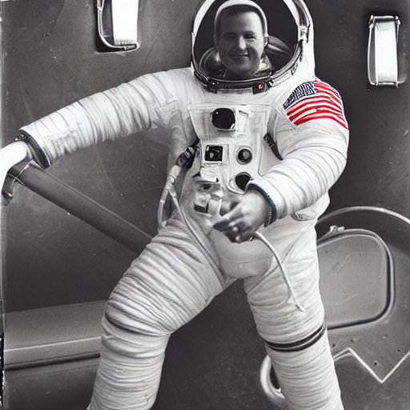
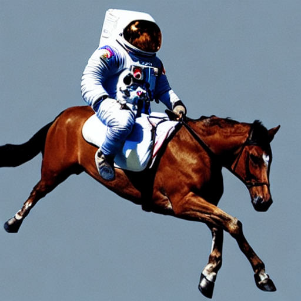
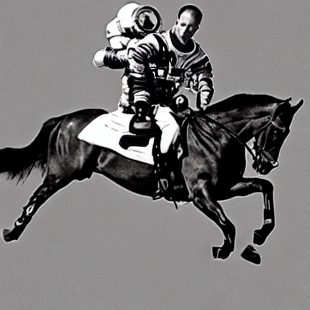
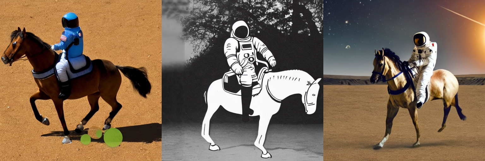
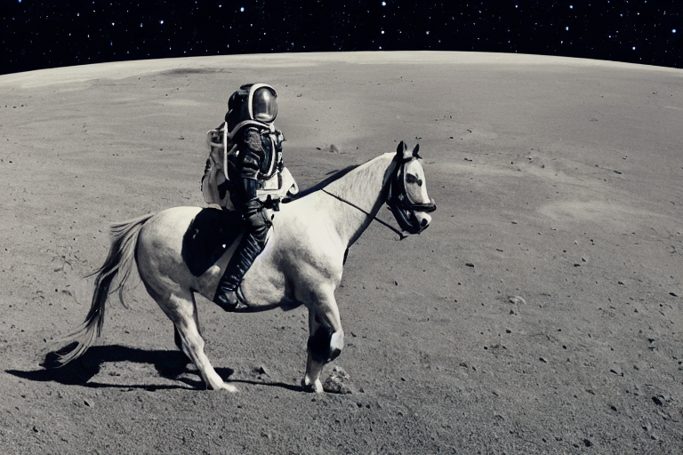

<h1>
	Stable Diffusion with D🧨iffusers
</h1>

<div class="blog-metadata">
    <small>Published August 17th, 2022.</small>
    <a target="_blank" class="btn no-underline text-sm mb-5 font-sans" href="https://github.com/huggingface/blog/blob/master/stable_diffusion_with_diffusers.md">
        Update on GitHub
    </a>
</div>

<div class="author-card">
    <a href="/valhalla">
        
        <div class="bfc">
            <code>valhalla</code>
            <span class="fullname">Suraj Patil</span>
        </div>
    </a>
	 <a href="/pcuenq">
        
        <div class="bfc">
            <code>pcuenq</code>
            <span class="fullname">Pedro Cuenca</span>
        </div>
    </a>
    <a href="/patrickvonplaten">
        
        <div class="bfc">
            <code>patrickvonplaten</code>
            <span class="fullname">Patrick von Platen</span>
        </div>
    </a>
</div>


<a target="_blank" href="https://colab.research.google.com/github/huggingface/notebooks/blob/main/diffusers/stable_diffusion.ipynb">
    
</a>


# **Stable Diffusion** 🎨 
*...using `D🧨ffusers`*

Stable Diffusion is a text-to-image latent diffusion model created by the researchers and engineers from [CompVis](https://github.com/CompVis), [Stability AI](https://stability.ai/) and [LAION](https://laion.ai/). 
It is trained on 512x512 images from a subset of the [LAION-5B](https://laion.ai/blog/laion-5b/) database. 
*LAION-5B* is the largest, freely accesible multi-model dataset that currently exist.

In this post, we want to show how to use Stable Diffusion with the [D🧨ffusers library](https://github.com/huggingface/diffusers), explain how the model works and finally dive a bit deeper into how `diffusers` allows
one to customize the image generation pipeline.

**Note**: It is highly recommended to have a basic understanding of how diffusion models work. If diffusion 
models are completely new to you, we recommend reading one of the following blog posts:
- [The Annotated Diffusion Model](https://huggingface.co/blog/annotated-diffusion)
- [Getting started with D🧨ffusers](https://colab.research.google.com/github/huggingface/notebooks/blob/main/diffusers/diffusers_intro.ipynb)

Now, let's get started by generating some images 🎨.

## Running Stable Diffusion

First, you should install `diffusers==0.2.3` to run the following code snippets:

```bash
pip install diffusers==0.2.3
```

The Stable Diffusion model can be run in inference with just a couple of lines using the [`StableDiffusionPipeline`](https://github.com/huggingface/diffusers/blob/main/src/diffusers/pipelines/stable_diffusion/pipeline_stable_diffusion.py) pipeline. The pipeline sets up everything you need to generate images from text with 
a simple `from_pretrained` function call.

```python
from diffusers import StableDiffusionPipeline

# make sure you're logged in with `huggingface-cli login`
pipe = StableDiffusionPipeline.from_pretrained("CompVis/stable-diffusion-v1-3-diffusers", use_auth_token=True)
```

If a GPU is available, let's move it to one!

```python
pipe.to("cuda")
```

To run the pipeline simply define the prompt and call `pipe`:

```python
prompt = "a photograph of an astronaut riding a horse"

image = pipe(prompt, guidance_scale=7)["sample"][0]

# you can save the image with
# image.save(f"astronaut_rides_horse.png")
```

The result would look as follows


    

The previous code will give you a different image every time you run it. If you want deterministic output you can seed a random seed and pass a generator to the pipeline. 
Every time you use a generator with the same seed you'll get the same image output.


```python
import torch

generator = torch.Generator("cuda").manual_seed(1024)
image = pipe(prompt, guidance_scale=7, generator=generator)["sample"][0]

# you can save the image with
# image.save(f"astronaut_rides_horse.png")
```

The result would look as follows


    
You can change the number of inference steps using the `num_inference_steps` argument. 
In general, results are better the more steps you use. 
Stable Diffusion works quite well with a relatively small number of steps, so we recommend to use the default number of inference steps of `50`. 
If you want faster results you can use a smaller number. If you want potentially higher quality results, 
you can use larger numbers.

Let's try out running the pipeline with less denoising steps.

```python
import torch

generator = torch.Generator("cuda").manual_seed(1024)
image = pipe(prompt, guidance_scale=7, num_inference_steps=20, generator=generator)["sample"][0]

# you can save the image with
# image.save(f"astronaut_rides_horse.png")
```



Note how the structure is the same, but there are problems in the astronaut(s) and in the horse's paw.
This shows that 20 denoising steps has significantly degraded the quality of the generation result.    

Besides `num_inference_steps`, we've been using another function argument, called `guidance_scale` in all 
previous examples. `guidance_scale` is a way to increase the adherence to the conditional signal that guides the generation (text, in this case) as well as overall sample quality. 
It is also known as [classifier-free guidance](https://arxiv.org/abs/2207.12598), which in simple terms forces the generation to better match the prompt potentially at the cost of image quality or diversity. 
Values between `7` and `8.5` are usually good choices for Stable Diffusion. 
If you use a very large value the images might look good, but will be less diverse. 

You can learn about the technical details of this parameter in [this section](#how-to-write-your-own-inference-pipeline-with-diffusers) of the post.

Next, let's see how you can generate several images of the same prompt at once. 
First, we'll create an `image_grid` function to help us visualize them nicely in a grid.


```python
from PIL import Image

def image_grid(imgs, rows, cols):
    assert len(imgs) == rows*cols

    w, h = imgs[0].size
    grid = Image.new('RGB', size=(cols*w, rows*h))
    grid_w, grid_h = grid.size
    
    for i, img in enumerate(imgs):
        grid.paste(img, box=(i%cols*w, i//cols*h))
    return grid
```

We can generate multiple images for the same prompt by simply using a list with the same prompt repeated several times. We'll send the list to the pipeline instead of the string we used before.

```python
num_images = 3
prompt = ["a photograph of an astronaut riding a horse"] * num_images

images = pipe(prompt, guidance_scale=7.5)["sample"]

grid = image_grid(images, rows=1, cols=3)

# you can save the grid with
# grid.save(f"astronaut_rides_horse.png")
```


    

By default, stable diffusion produces images of `512 × 512` pixels. It's very easy to override the default using the `height` and `width` arguments to create rectangular images in portrait or landscape ratios.

When choosing image sizes, we advise the following:
- Make sure `height` and `width` are both multiples of `8`.
- Going below 512 might result in lower quality images.
- Going over 512 in both directions will repeat image areas (global coherence is lost).
- The best way to create non-square images is to use `512` in one dimension, and a value larger than that in the other one.

Let's run an example:

```python
prompt = "a photograph of an astronaut riding a horse"
image = pipe(prompt, height=512, width=768, guidance_scale=7.5)["sample"][0]

# you can save the image with
# image.save(f"astronaut_rides_horse.png")
```


    

## How does Stable Diffusion work?

Having seen the high-quality images that stable diffusion can produce, let's try to understand 
a bit better how the model functions.

Generally speaking, diffusion models are machine learning systems that are trained to *denoise* random gaussian noise step by step, to get to a sample of interest, such as an *image*. For a more detailed overview of how they work, check [this colab](https://colab.research.google.com/github/huggingface/notebooks/blob/main/diffusers/diffusers_intro.ipynb).

Stable Diffusion is based on a particular type of diffusion model called **Latent Diffusion**, proposed in [High-Resolution Image Synthesis with Latent Diffusion Models](https://arxiv.org/abs/2112.10752). 

Standard diffusion models have shown to achieve state-of-the-art results for generating image data. But one downside of diffusion models is that the reverse denoising process is slow. In addition, these models consume a lot of memory because they operate in pixel space, which becomes huge when generating high-resolution images. Therefore, it is challenging to train these models and also use them for inference.

<br>

Latent diffusion can reduce the memory and compute complexity by applying the diffusion process over a lower dimensional _latent_ space, instead of using the actual pixel space. This is the key difference between standard diffusion and latent diffusion models: **in latent diffusion the model is trained to generate latent (compressed) representations of the images.** 

There are two main components in latent diffusion.

1. An autoencoder (VAE).
2. A [UNet network](https://colab.research.google.com/github/huggingface/notebooks/blob/main/diffusers/diffusers_intro.ipynb#scrollTo=wW8o1Wp0zRkq) that combines the encoder and decoder layers of the autoencoder. 


**The autoencoder (VAE)**

The VAE model has two parts, an encoder and a decoder. The encoder is used to convert the image into a low dimensional latent representation. The decoder, conversely, transforms the latent representation back into an image. During latent diffusion _training_, the encoder is used to get the latent representations (_latents_) of the images for the forward diffusion process, which applies more and more noise at each step. During _inference_, the latents generated by the reverse diffusion process are converted back into images using the VAE decoder.

**Why is latent diffusion fast and efficient?**

Since latent diffusion operates on a low dimensional space, it greatly reduces the memory and compute requirements compared to pixel-space diffusion models. For example, the autoencoder used in Stable Diffusion has a reduction factor of 8. This means that an image of shape `(3, 512, 512)` becomes `(3, 64, 64)` in latent space, which requires `8 × 8 = 64` times less memory.

This is why it's possible to generate `512 × 512` images so quickly, even on 16GB Colab GPUs!

**Stable Diffusion**

Stable Diffusion is a text-to-image latent diffusion model created by the researchers and engineers from [CompVis](https://github.com/CompVis), [Stability AI](https://stability.ai/) and [LAION](https://laion.ai/). It's trained on `512  × 512` images from a subset of the [LAION-5B](https://laion.ai/blog/laion-5b/) database. This model uses a frozen CLIP ViT-L/14 text encoder to condition the model on text prompts. With its 860M UNet and 123M text encoder, the model is relatively lightweight and runs on a GPU with at least 10GB VRAM.
 
See the [model card](https://huggingface.co/CompVis/stable-diffusion) for more information.

Stable Diffusion has three core components:

1. An autoencoder which maps an image to a low-dimensional latent space, and the latent representation back to an image. In Stable Diffusion, the autoencoder is implemented in the `AutoencodeKL` model.
2. A text encoder model that converts text prompts to embeddings that can be passed as conditions to the UNet. In Stable Diffustion, the [CLIP model](https://openai.com/blog/clip/) is used for this purpose.
3. A UNet model trained to generate the low-dimentional latent space. Stable Diffusion uses cross-attention the the model blocks to condition on the text.


This is how the stable (latent) diffusion inference looks like:

<p align="center">

</p>

After this brief introduction to Latent and Stable Diffusion, let's see how to make advanced use of 🤗 Hugging Face `diffusers` library!

## Writing your own inference pipeline

Finally, we show how you can create custom diffusion pipelines with `diffusers`, which can be useful to switch out certain components, such as the VAE or scheduler as explained above.

For example, we'll show how to use Stable Diffusion with a different scheduler, namely [Katherine Crowson's](https://github.com/crowsonkb) K-LMS scheduler added in [this PR](https://github.com/huggingface/diffusers/pull/185).


The [pre-trained model](https://huggingface.co/CompVis/stable-diffusion-v1-3-diffusers/tree/main) includes all the components required to setup a complete diffusion pipeline. They are stored in the following folders:
- `text_encoder`: Stable Diffusion uses CLIP, but other diffusion models may use other encoders such as `BERT`.
- `tokenizer`. It must match the one used by the `text_encoder` model.
- `scheduler`: The scheduling algorithm used to progressively add noise to the image during training.
- `unet`: The model used to generate the latent representation of the input.
- `vae`: Autoencoder module that we'll use to decode latent representations into real images.

We can load the components by referring to the folder they were saved, using the `subfolder` argument to `from_pretrained`.


```python
from transformers import CLIPTextModel, CLIPTokenizer
from diffusers import AutoencoderKL, UNet2DConditionModel, PNDMScheduler

# 1. Load the autoencoder model which will be used to decode the latents into image space. 
vae = AutoencoderKL.from_pretrained("CompVis/stable-diffusion-v1-3-diffusers", subfolder="vae", use_auth_token=True)

# 2. Load the tokenizer and text encoder to tokenize and encode the text. 
tokenizer = CLIPTokenizer.from_pretrained("openai/clip-vit-large-patch14")
text_encoder = CLIPTextModel.from_pretrained("openai/clip-vit-large-patch14")

# 3. The UNet model for generating the latents.
unet = UNet2DConditionModel.from_pretrained("CompVis/stable-diffusion-v1-3-diffusers", subfolder="unet", use_auth_token=True)
```


Now instead of loading the pre-defined scheduler, we load the [K-LMS scheduler](https://github.com/huggingface/diffusers/blob/71ba8aec55b52a7ba5a1ff1db1265ffdd3c65ea2/src/diffusers/schedulers/scheduling_lms_discrete.py#L26) with some fitting parameters.

```python
from diffusers import LMSDiscreteScheduler

scheduler = LMSDiscreteScheduler(beta_start=0.00085, beta_end=0.012, beta_schedule="scaled_linear", num_train_timesteps=1000)
```

Next, let's move the models to GPU.


```python
from torch import autocast

vae.to(torch_device)
text_encoder.to(torch_device)
unet.to(torch_device) 
```

We now define the parameters we'll use to generate images.

Note that `guidance_scale` is defined analog to the guidance weight `w` of equation(2) in the [Imagen paper](https://arxiv.org/pdf/2205.11487.pdf). `guidance_scale == 1` corresponds to doing no classifier-free guidance.


```python
prompt = ["a photograph of an astronaut riding a horse"]

height = 512                        # default height of Stable Diffusion
width = 512                         # default width of Stable Diffusion

num_inference_steps = 100            # Number of denoising steps

guidance_scale = 7.5                # Scale for classifier-free guidance

generator = torch.manual_seed(0)   # Seed generator to create the inital latent noise

batch_size = len(prompt)
```

First, we get the `text_embeddings` for the passed prompt. 
These embeddings will be used to condition the UNet model and guide the image generation 
towards something we've that should resemble the input prompt.

```python
text_input = tokenizer(prompt, padding="max_length", max_length=tokenizer.model_max_length, truncation=True, return_tensors="pt")

text_embeddings = text_encoder(text_input.input_ids.to(torch_device))[0]
```

We'll also get the unconditional text embeddings for classifier-free guidance, which are just the embeddings for the padding token (empty text). They need to have the same shape as the conditional `text_embeddings` (`batch_size` and `seq_length`)


```python
max_length = text_input.input_ids.shape[-1]
uncond_input = tokenizer(
    [""] * batch_size, padding="max_length", max_length=max_length, return_tensors="pt"
)
uncond_embeddings = text_encoder(uncond_input.input_ids.to(torch_device))[0]   
```

For classifier-free guidance, we need to do two forward passes. One with the conditioned input (`text_embeddings`), and another with the unconditional embeddings (`uncond_embeddings`). In practice, we can concatenate both into a single batch to avoid doing two forward passes.


```python
text_embeddings = torch.cat([uncond_embeddings, text_embeddings])
```

Generate the intial random noise.


```python
latents = torch.randn(
    (batch_size, unet.in_channels, height // 8, width // 8),
    generator=generator,
)
latents = latents.to(torch_device)
```


If we examine the `latents` at this stage we'll see their shape is `torch.Size([1, 4, 64, 64])`, much smaller than the image we want to generate. The model will transform this latent representation (pure noise) into a `512 × 512` image later on.

The K-LMS scheduler needs to multiple the `latents` by its `sigma` values. Let's do this here


```python
latents = latents * scheduler.sigmas[0]
```

We are ready to write the denoising loop.


```python
from tqdm.auto import tqdm
from torch import autocast

scheduler.set_timesteps(num_inference_steps)

with autocast("cuda"):
  for i, t in tqdm(enumerate(scheduler.timesteps)):
    # expand the latents if we are doing classifier-free guidance to avoid doing two forward passes.
    latent_model_input = torch.cat([latents] * 2)
    sigma = scheduler.sigmas[i]
    latent_model_input = latent_model_input / ((sigma**2 + 1) ** 0.5)

    # predict the noise residual
    with torch.no_grad():
      noise_pred = unet(latent_model_input, t, encoder_hidden_states=text_embeddings)["sample"]

    # perform guidance
    noise_pred_uncond, noise_pred_text = noise_pred.chunk(2)
    noise_pred = noise_pred_uncond + guidance_scale * (noise_pred_text - noise_pred_uncond)

    # compute the previous noisy sample x_t -> x_t-1
    latents = scheduler.step(noise_pred, i, latents)["prev_sample"]
```

We now use the `vae` to decode the generated `latents` back into the image.


```python
# scale and decode the image latents with vae
latents = 1 / 0.18215 * latents
image = vae.decode(latents)
```

And finally, let's convert the image to PIL so we can display or save it.


```python
image = (image / 2 + 0.5).clamp(0, 1)
image = image.detach().cpu().permute(0, 2, 3, 1).numpy()
images = (image * 255).round().astype("uint8")
pil_images = [Image.fromarray(image) for image in images]
pil_images[0]
```
